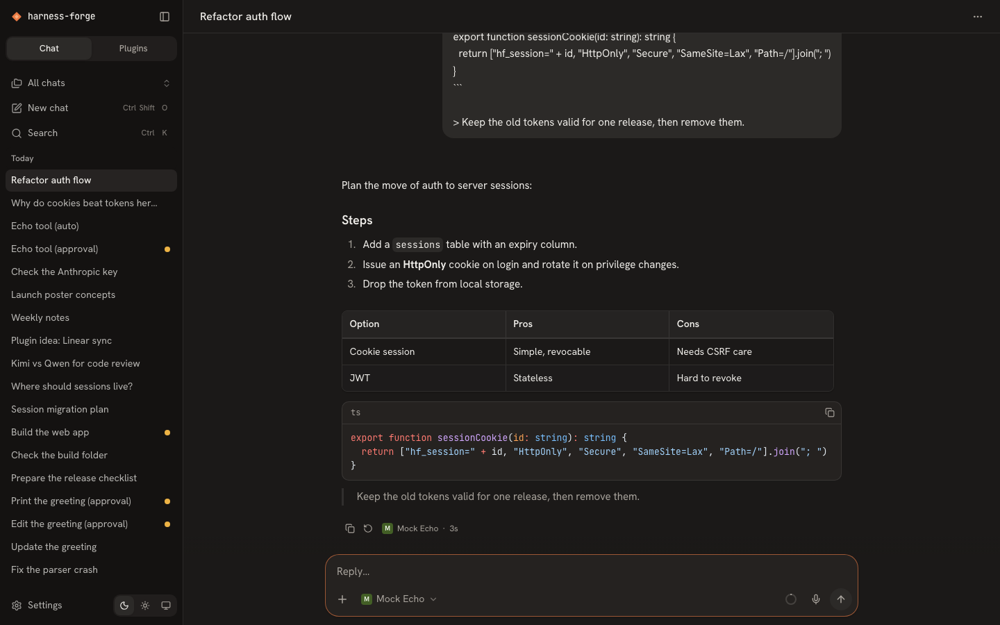
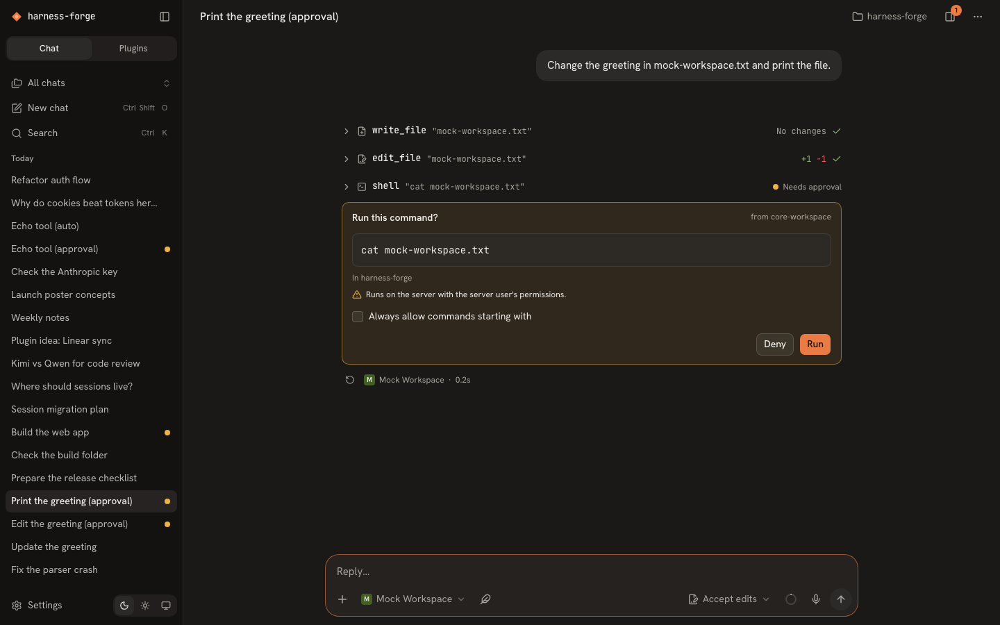
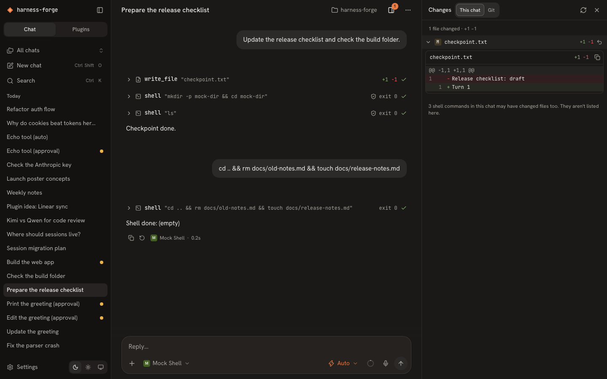
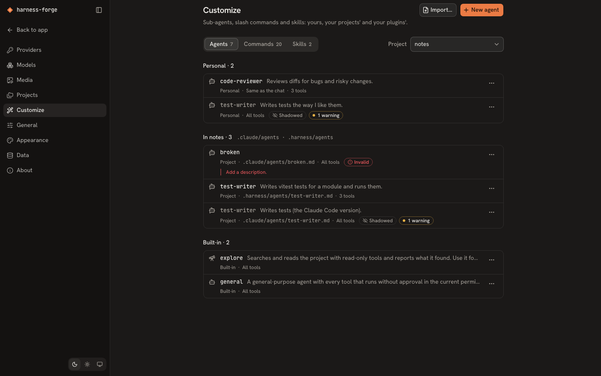
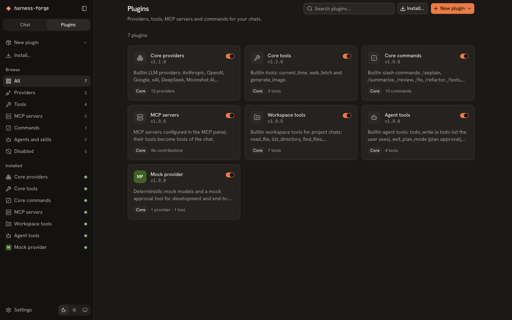
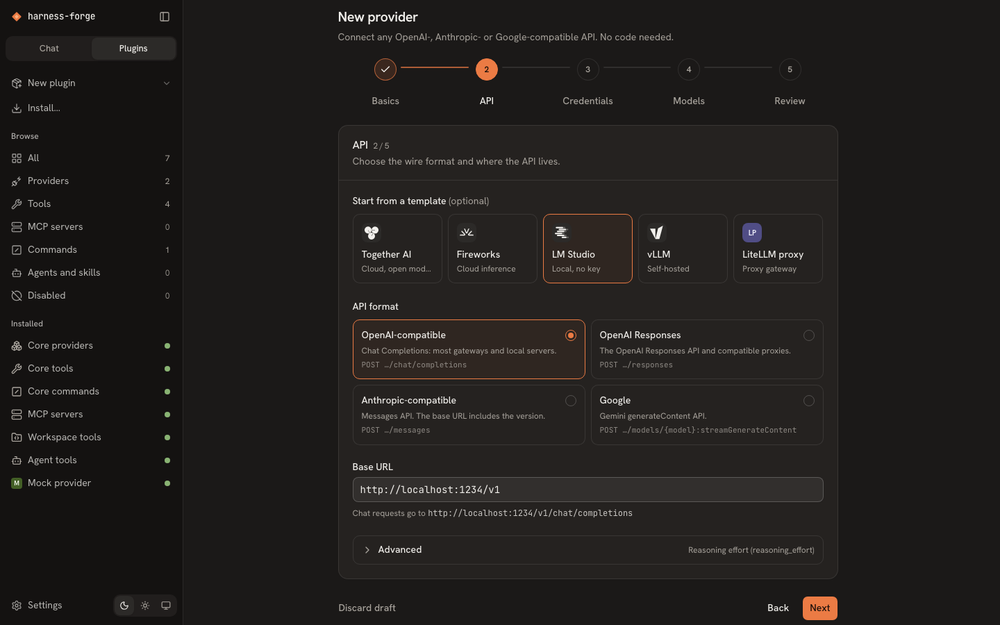
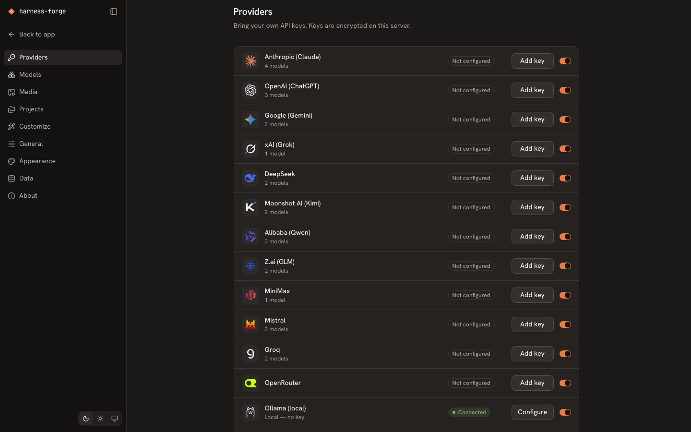
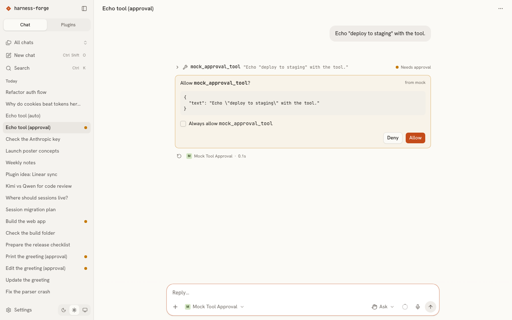

# harness-forge

harness-forge is a self-hosted, bring-your-own-key (BYOK) AI chat and agent harness. It runs as one Node process
with a web UI. Connect your own API keys for Claude, ChatGPT, Gemini, Grok, DeepSeek, Kimi, Qwen, GLM and more, or
point it at a local Ollama. Then chat, watch the models reason, and let them call tools, or let them work on the files
of a project folder on your server. By default, every tool call that can change something waits for your approval. A **Plugins** tab adds LLM providers, models, tools, MCP servers, slash commands, sub-agent types and skills, either
from a JSON manifest or from code you edit in the browser. The interface is a simplified take on the Claude Code
desktop app, and it starts in dark mode.

> **Status:** v1.6 ("Agent customization"): your own sub-agent types, slash commands and skills, as Markdown files in
> a project's `.harness/` (or `.claude/`) folder or as personal definitions on the new Settings → Customize page, plugins
> that contribute agents and skills (plugin API 1.4.0), background agents that keep working after the reply and report
> back by themselves, approved plans saved as project files, and `/remember` to keep a note for the agent (see
> [Features](#features) and the [customizing guide](docs/guides/customizing-agents.md)). v1.5 ("Agent 2.0") added context
> compaction that replaces the older part of a long chat with a summary
> (`/compact [focus]` or automatically, also between the steps of a long agent run), a plan mode in which the agent
> explores read-only and proposes a plan you approve, a todo list the agent keeps up to date, `@` file mentions in
> project chats, messages that reach the agent while it works (or start the next turn by themselves), and sub-agents
> that explore or work in parallel (see the [agent features guide](docs/guides/agent-features.md)). v1.4 added checkpoints that rewind the agent's file changes to
> any of your messages, a changes panel with per-file diffs, Git status and an undoable revert, shell rules for commands
> that may run without asking, a working folder that carries over between shell commands, and an opt-in automatic
> cleanup of unused files. v1.3 added projects and an agent workspace (file tools and a shell with approval, an "Accept
> edits" permission mode, inline diffs and terminal output in the chat), master-key rotation (in the app or with a CLI)
> and a storage cleanup with a preview. v1.2 added image generation and voice (dictation and read-aloud) through your
> own providers, message versions that remember the path shown under them, can be deleted and follow a switch in other
> open tabs, editing the attachments of a sent message, one password prompt for every sensitive action, and 40 px touch
> targets on tablets. v1.1 added conversation branching, backup / restore / delete-all, read-only share links, trusted
> reverse proxies and an opt-in live provider suite. Progress lives in [`docs/ROADMAP.md`](docs/ROADMAP.md).









| Plugins | Provider wizard |
|---|---|
|  |  |
| **Settings -> Providers** | **Light theme** |
|  |  |

## Features

- **Chat**:
  - Streaming markdown with highlighted code, "Thinking" rows for reasoning, and collapsible tool-call rows.
  - Inline approval cards for tool calls, file attachments, and edit, regenerate, copy and stop. Editing a message
    can also remove its attachments or add new ones.
  - Conversation branching: editing a message or regenerating a reply keeps the old version, and a `‹ 2/3 ›`
    switcher moves between versions. Each message remembers the version last shown under it, so switching back
    restores that whole path; an unwanted version can be deleted (with everything after it); other open tabs follow a
    switch.
  - Automatic chat titles, per-message token usage and cost, and a context-usage ring.
- **Projects and the agent workspace**:
  - A project is a folder on your server, inside the folders you allow (`HF_WORKSPACE_ROOTS`). Add one in
    Settings -> Projects with a folder browser (or create a new folder there); a chat can belong to a project (pick it
    for a new chat, or use "Move to project" later), and the project switcher at the top of the sidebar filters chats
    by project.
  - In a project chat the model reads, searches and edits files (`read_file`, `list_directory`, `find_files`,
    `search_files`, `write_file`, `edit_file`) and runs shell commands (`shell`) in the project folder. Edits show as
    diffs (`+12 −3`) and commands as terminal output with the exit code inside the tool rows; an `AGENTS.md` (or
    `CLAUDE.md`) in the folder joins the instructions, and project chats get more steps per reply (100 by default).
  - Approval cards preview the change (a diff, the file, the exact command). The "Accept edits" mode lets edits run
    without asking while shell commands still ask, and every shell command is approved on its own (no "Always allow").
  - Shell commands run in their own process group with a minimal environment, a timeout and capped output;
    `HF_WORKSPACE_SHELL=0` turns the shell off for everyone. Guide: [using projects](docs/guides/using-projects.md).
- **Workspace 2.0** (v1.4):
  - Rewind: "Rewind files to here" under one of your messages puts every file the agent changed since then back the
    way it was (across message versions), lists the shell commands whose effects it cannot undo, and can be undone;
    "Restore files and edit" continues from that message. The previous version of every agent edit is kept as a
    checkpoint on your server (no git needed; 30 days, 512 MB per project).
  - A changes panel (Alt+C; a side pane on desktop, a sheet on phones and tablets) with two views: the files this chat
    changed and the project's Git status, each with a diff and a **Revert file** that saves the current version first
    and can be undone. Git runs read-only with the repository's hooks, filters and other configured programs switched
    off.
  - Shell rules: "Always allow commands starting with `pnpm test`" on the approval card (for this project or every
    project) lets matching commands run without asking; combined commands need a rule for every part, and substitutions
    or redirections (other than to `/dev/null`) always ask. Rules are managed in Settings -> Projects.
  - The shell's working folder carries over between commands (`cd packages/web` sticks), clamped to the project.
  - Automatic cleanup of unused files (Settings -> Data, off by default, daily or weekly) and screen-reader labels for
    tool-row summaries.
- **Agent 2.0** (v1.5; guide: [agent features](docs/guides/agent-features.md)):
  - Context compaction: when a chat nears the model's context window, its older part is replaced by a model-written
    summary (also between the steps of a long agent run), instead of being dropped; `/compact [focus]` does it on
    demand. The older messages stay visible, dimmed, above a "Conversation compacted" divider that shows the summary on
    request.
  - Plan mode (project chats): a read-only permission mode in which the agent explores and then proposes a plan; approve
    it ("Approve, accept edits" or "Approve, ask before edits"), or send feedback and let it keep planning. Shift+Tab
    in the composer cycles Ask, Accept edits and Plan. Enforced on the server.
  - A todo list the agent keeps up to date, shown as a progress strip above the composer.
  - `@` mentions: type `@` in a project chat to search the project's files and attach one.
  - Send while the agent works: queued messages reach it at its next step (or become the next message), can be edited
    or cancelled, and come back into the composer when you press Stop.
  - Sub-agents: the agent can start read-only explorers or general helpers that run in parallel with their own context,
    never ask for approval (they only get tools that run without a card in the current mode) and return a report;
    their file edits can be rewound like any other.
  - Settings -> General -> Agent: automatic compaction (on by default), a separate model for summaries and for
    sub-agents, and the sub-agent step limit (30); a switch in General turns the Shift+Tab mode cycle off.
- **Agent customization** (v1.6; guide: [customizing the agent](docs/guides/customizing-agents.md)):
  - Custom agents: Markdown files with a YAML header (name, description, tools, model) become sub-agent types the agent
    can start; their body becomes the sub-agent's instructions and their tool list only narrows what a sub-agent may
    use. The transcript shows each custom sub-agent with its name and where it came from.
  - Custom slash commands with `$ARGUMENTS` / `$1` … `$9` / `{{input}}`, an argument hint shown as ghost text, an
    optional model for that turn and an optional, narrower tool set; the slash menu groups them as App, Project,
    Personal and Plugins.
  - Skills (`<name>/SKILL.md` with supporting files) that the agent lists by name and loads only when a task needs them.
  - Where they live: a project's `.harness/{agents,commands,skills}` (wins) or `.claude/{…}` (Claude Code files work
    mostly as they are), personal definitions, and plugins (plugin API 1.4.0). Project files are read-only in the UI and
    can never grant tools, approvals or a permission mode.
  - Settings -> Customize: one tab each for agents, commands and skills, with the built-in, plugin, personal and
    project entries (shadowed and invalid files shown with the reason), an editor for personal definitions, import
    and export of `.md` files, turn off, duplicate and "Copy to personal". Personal definitions are included in
    backups.
  - Background agents: a sub-agent started in the background keeps working after the reply (at most 3 per chat, 30
    minutes each). A list above the composer shows them with their own Stop and a Stop all; the composer's Stop leaves
    them running. Each reports back exactly once, at the agent's next step or in a turn it starts by itself.
  - Approved plans saved as project files (Settings -> General -> Agent, off by default; listed in the changes panel and
    rewindable), and `/remember` to add a note to the project's `AGENTS.md` (or `CLAUDE.md`), to the project's
    instructions or to your custom instructions.
- **Images** (with your own keys):
  - Pick an image model (OpenAI GPT Image, xAI Grok Imagine) in the composer and describe a picture: 1 to 4 images
    per turn, an aspect ratio (Auto, 1:1, 3:2, 2:3, 4:3, 3:4, 16:9, 9:16), and follow-ups such as "make it blue" that
    edit the previous image.
  - Chat models with image output (Gemini image models, OpenRouter models that return images) answer with text and
    pictures.
  - The builtin `generate_image` tool lets a chat model create an image with the image model chosen in
    Settings -> Media, after you approve the call.
  - Every image is stored as a file on your server and shown in a gallery with a lightbox and a download link; image
    costs are labeled as estimates.
- **Voice** (opt-in in Settings -> Media):
  - Dictation: the microphone button (or Alt+V) records, and the transcript from your speech-to-text model (OpenAI,
    Groq Whisper, Google, Mistral, xAI) is inserted at the cursor. Esc cancels. The microphone needs HTTPS or
    `localhost` (see [Security](#security)).
  - Read aloud: a button under a finished reply reads it with your text-to-speech model (OpenAI, Google, Mistral,
    xAI), in the voice and at the speed you choose; code blocks, tables and formulas are announced as omitted instead
    of being read out.
  - Recordings and the text read aloud pass through the server to the provider you picked and are never stored or
    logged.
- **Your data** (Settings -> Data): back up every chat, with every version and attachment, to one zip file; restore it
  here or on another server (existing chats are skipped or copied); or delete all chats at once. Remove the files
  nothing uses anymore (a storage cleanup with a preview: attachments and generated images of deleted chats and
  versions; v1.4: optionally on a daily or weekly schedule), and rotate the master key that encrypts your API keys (in
  the app, or with `pnpm key:rotate` when the key comes from `HF_MASTER_KEY`).
- **Share links**: publish a read-only snapshot of a chat at an unguessable link, choose whether reasoning, tool
  details and files and images are included, set an expiry date, update the snapshot or revoke the link at any time.
- **Composer**:
  - A model picker with provider icons and capability badges, and an "Image models" group.
  - A reasoning-effort menu (Auto, Off, Low, Medium, High, Max) and a permission mode for tools (Ask, Accept edits and
    Plan in project chats, Auto, Off; v1.5: Shift+Tab cycles Ask, Accept edits and Plan); image options (count, aspect
    ratio, edit the previous image) for image models.
  - v1.5: `@` file mentions in project chats, and a queue for messages sent while a reply runs.
  - Slash commands: `/explain`, `/review`, `/fix`, `/translate`, `/proofread` and more, plus commands from plugins;
    v1.5: `/compact [focus]`; v1.6: project and personal commands with argument hints, and `/remember`.
  - A microphone button for dictation.
- **Sidebar and navigation**: a Chat | Plugins switch, a project switcher, chats grouped by date with live status
  dots (running, needs approval, unread), a Mod+K command palette, keyboard shortcuts, a Light / Dark / System theme toggle, and 40 px
  touch targets in the collapsed icon rail on tablets.
- **Providers and models**:
  - 13 builtin BYOK providers. Keys are encrypted at rest, shown only as masked hints, and can fall back to
    environment variables.
  - Live model lists enriched with [models.dev](https://models.dev) metadata (limits, capabilities, prices), plus the
    image, speech-to-text and text-to-speech models of the same providers.
  - Favorites, hidden models and custom model ids (chat, image, speech-to-text or text-to-speech).
  - An opt-in live test suite (`pnpm test:live`, paid) that checks every builtin provider you have a key for against
    the real API: key test, model listing, streaming, reasoning, a tool call and a rejected bad key; `HF_LIVE_MEDIA=1`
    adds image and voice checks.
- **Plugins**:
  - Declarative provider plugins, built with a five-step wizard or written as `plugin.json`.
  - Code plugins (tools, providers, commands, hooks, MCP servers) from templates, edited and rebuilt in the browser.
    Plugin API 1.1.0 lets a code provider add image, speech-to-text and text-to-speech models, and a code tool
    generate images; plugin API 1.2.0 lets a tool work on the chat's project folder; plugin API 1.3.0 (v1.5) lets a
    tool stream its progress (an async-generator `execute`) and adds the Plan permission mode; plugin API 1.4.0 (v1.6)
    lets a plugin contribute sub-agent types and skills (`contributes.agents` / `contributes.skills`,
    `ctx.agents.register` / `ctx.skills.register`).
  - Install from a zip, npm, a URL with an integrity hash, or a local folder, with an explicit trust step for code.
- **Tools and MCP**: MCP servers over stdio, Streamable HTTP and SSE. The builtin tools are `current_time`,
  `web_fetch` (SSRF-guarded) and `generate_image`, plus the seven workspace tools of project chats and (v1.5) the agent
  tools `todo_write`, `exit_plan_mode` and `task` (v1.6: and `skill`). Every tool has an approval policy and a per-tool
  override.
- **Self-hosting**: SQLite storage, one port, an optional password, a loopback-only bind unless you secure it,
  trusted reverse proxies (`HF_TRUST_PROXY`) so rate limits and Secure cookies see the real clients, and a Docker image
  with a `/data` volume.

## Supported providers

| Provider | Id | Key environment variable | Notes |
|---|---|---|---|
| Anthropic (Claude) | `anthropic` | `ANTHROPIC_API_KEY` | |
| OpenAI (ChatGPT) | `openai` | `OPENAI_API_KEY` | Responses API; image models (GPT Image), speech to text, text to speech |
| Google (Gemini) | `google` | `GOOGLE_GENERATIVE_AI_API_KEY` (`GEMINI_API_KEY`, `GOOGLE_API_KEY`) | image output from the Gemini image models, speech to text, text to speech |
| xAI (Grok) | `xai` | `XAI_API_KEY` | image model (Grok Imagine), speech to text, text to speech |
| DeepSeek | `deepseek` | `DEEPSEEK_API_KEY` | |
| Moonshot AI (Kimi) | `moonshotai` | `MOONSHOT_API_KEY` | |
| Alibaba (Qwen) | `alibaba` | `ALIBABA_API_KEY` (`DASHSCOPE_API_KEY`) | international endpoint by default |
| Z.ai (GLM) | `zai` | `ZAI_API_KEY` (`ZHIPU_API_KEY`) | Coding Plan keys need the Coding Plan base URL |
| MiniMax | `minimax` | `MINIMAX_API_KEY` | Anthropic-compatible endpoint |
| Mistral | `mistral` | `MISTRAL_API_KEY` | speech to text and text to speech (Voxtral) |
| Groq | `groq` | `GROQ_API_KEY` | speech to text (Whisper) |
| OpenRouter | `openrouter` | `OPENROUTER_API_KEY` | hundreds of models behind one key, with provider-reported cost; image output from the models that return images |
| Ollama (local) | `ollama` | none | base URL `http://localhost:11434/v1`, remote hosts allowed |

Any OpenAI-, Anthropic- or Gemini-compatible endpoint (LM Studio, vLLM, llama.cpp, LiteLLM, Together, Fireworks, …)
can be added as a declarative provider plugin, without code. Model references have the form `providerId:modelId`, for
example `anthropic:claude-sonnet-5` or `ollama:llama3:8b`. Base URLs, reasoning mappings, seed models, image and voice
models (with their voices) and icons are in [`docs/PROVIDERS.md`](docs/PROVIDERS.md).

## Quick start

### Development

Requirements: **Node >= 22.12** and **pnpm 11**.

```sh
pnpm install
pnpm dev            # server on :8787 (tsx watch) + web on :3000 (nuxt dev, proxies /api)
```

Open http://localhost:3000. Go to **Settings** -> **Providers**, add a key, press **Test**, then start a chat.
`HF_MOCK_PROVIDER=1 pnpm dev` adds a keyless `mock` provider for trying the UI, with mock image, speech-to-text and
text-to-speech models (pick them in Settings -> Media), `mock:workspace`, which writes, edits and runs a file in a
project chat, and the agent mocks `mock:compact`, `mock:plan`, `mock:todo`, `mock:subagent` and `mock:steer`
([PROVIDERS.md](docs/PROVIDERS.md#8-mock-provider)).

### Production

```sh
pnpm install --frozen-lockfile
pnpm build          # nuxt generate (web) + tsdown (server)
pnpm start          # one process on http://127.0.0.1:8787 serving the API and the web app
```

Runtime data (SQLite database, encryption key, plugins, uploads, caches) lives in `./data` unless `HF_DATA_DIR` says
otherwise. The server reads a `.env` file from the repository root at start; variables that are already set win.
To serve other machines, bind to all interfaces and set a password:
`HF_HOST=0.0.0.0 HF_PASSWORD='a long passphrase' pnpm start`. See [Security](#security).

### Docker

The image serves the app on port **8787** and keeps all data in the **`/data`** volume. Inside the container the
server listens on all interfaces, so it refuses to start without **`HF_PASSWORD`** (unless a password is already
stored in the volume, or `HF_INSECURE=1` is set behind another authentication layer).

```sh
# Compose reads HF_PASSWORD from the .env file next to docker-compose.yml.
printf 'HF_PASSWORD=%s\n' "$(openssl rand -base64 24)" >> .env   # or write your own long password there
docker compose up -d
```

Open http://localhost:8787 and log in with that password. Chats, keys and plugins stay in the volume across restarts
and image updates. Without Compose:

```sh
docker build -t harness-forge .
docker run -d --name harness-forge -p 8787:8787 -v harness-forge-data:/data -e HF_PASSWORD='a long passphrase' harness-forge
```

The container runs as the unprivileged `node` user (uid 1000); a bind-mounted data directory must be writable by
it. Put a TLS reverse proxy in front before exposing it beyond your machine or LAN (see
[Behind a reverse proxy](#behind-a-reverse-proxy)).

### Projects (agent workspace)

Projects live in `data/workspaces` (`/data/workspaces` in Docker) unless you allow other folders with
`HF_WORKSPACE_ROOTS` (absolute paths, comma separated), for example `HF_WORKSPACE_ROOTS=/home/me/code`. In Docker,
mount the folders and name the mount point (the commented `./workspaces:/workspaces` lines in `docker-compose.yml`;
writable by uid 1000). Then add a project in Settings -> Projects and start a chat in it. The shell tool runs commands
with the server's permissions after you approve them (or when your shell rules allow them); set `HF_WORKSPACE_SHELL=0`
to turn it off. The Git view of the changes panel needs repositories owned by the container user: git refuses a
bind-mounted folder owned by another uid ("dubious ownership"), see the guide. Details, permission modes, shell rules,
rewind and security notes: [using projects](docs/guides/using-projects.md); plan mode, `@` mentions, the message queue
and sub-agents: [agent features](docs/guides/agent-features.md); a project's own agents, commands and skills
(`.harness/` or `.claude/`), background agents, plan files and `/remember`:
[customizing the agent](docs/guides/customizing-agents.md).

## Configuration

Every variable is optional. [`.env.example`](.env.example) lists them with comments.

| Name | Default | Meaning |
|---|---|---|
| `HF_PORT` | `8787` | server port (`0` = any free port) |
| `HF_HOST` | `127.0.0.1` | bind address; a non-loopback host requires `HF_PASSWORD`, a password stored in Settings, or `HF_INSECURE=1` |
| `HF_DATA_DIR` | `./data` | data directory; relative paths resolve against the repository root (Docker: `/data`) |
| `HF_PASSWORD` | unset | enables the login screen; overrides a password stored in Settings |
| `HF_MASTER_KEY` | unset | base64 of 32 bytes used to encrypt secrets; otherwise `data/secret.key` is generated (mode 0600) |
| `HF_MOCK_PROVIDER` | unset | `1` registers the dev-only `mock` provider (deterministic models for tests and demos) |
| `HF_SAFE_MODE` | unset | `1` loads builtin plugins only (recovery when a plugin breaks the start) |
| `HF_PLUGIN_WATCH` | unset | `1` hot-reloads code plugins in the data directory when their files change (linked folders always reload) |
| `HF_OFFLINE` | unset | `1` never downloads the models.dev catalog (the bundled snapshot is used) |
| `HF_INSECURE` | unset | `1` allows a non-loopback bind without a password (only behind another authentication layer); it also disables the DNS-rebinding guard that restricts a password-less server to `localhost` host names |
| `HF_WORKSPACE_ROOTS` | `<data dir>/workspaces` | folders that may hold project folders: a comma list of absolute paths; a relative path, `/`, a missing folder (or a file), the data directory or a folder inside it (other than `<data dir>/workspaces`) stops the start. See [using projects](docs/guides/using-projects.md) |
| `HF_WORKSPACE_SHELL` | `1` | `0` removes the `shell` tool from every chat (the file tools keep working); no setting in the app can turn it back on |
| `HF_TRUST_PROXY` | unset | reverse proxies whose `X-Forwarded-For` / `X-Forwarded-Proto` headers are trusted: a comma list of `loopback` (127.0.0.0/8, ::1), `private` (10.0.0.0/8, 172.16.0.0/12, 192.168.0.0/16, fc00::/7), IP addresses and CIDR ranges. `1`, `true`, `*` and other booleans, hop counts, `/0` ranges, `localhost` (write `loopback`) and unknown words stop the start with the format explained; `X-Forwarded-Host` is never used. Unset: `X-Forwarded-For` is ignored and `X-Forwarded-Proto` is honored from any peer (v1). See [Behind a reverse proxy](#behind-a-reverse-proxy) |
| `HF_WEB_DIR` | `apps/web/.output/public` | directory of the built web app served in production |
| `HF_API_TARGET` | `http://localhost:8787` | where `nuxt dev` proxies `/api` (development only) |
| `NODE_ENV` | unset | `development` forces dev mode (debug logs, `:3000` origins allowed), `production` forces production; by default dev mode means running from TypeScript sources |
| `<VENDOR>_API_KEY` | unset | provider key fallbacks, see [Supported providers](#supported-providers) |

`HF_NEW_MASTER_KEY` is read only by the offline key rotation (`pnpm key:rotate` with the server stopped, when the key
comes from `HF_MASTER_KEY`): it holds the new key, which the CLI never generates or prints (with a key file the CLI
generates the new key itself and ignores the variable). Exit codes and options: [using projects](docs/guides/using-projects.md#the-rotate-key-cli).

A key saved in Settings wins over its environment variable; the key dialog shows which source is active ("From env").
Flags accept `1` / `true` / `yes` / `on` and `0` / `false` / `no` / `off`; an empty value counts as unset, and any
other invalid value stops the start with a message naming the variable. Test-only variables (`HF_LIVE_PROVIDERS`,
`HF_LIVE_MAX_COST_USD`, `HF_LIVE_MEDIA`, `HF_TEST_REQUIRE_WEB_BUILD`, `HF_TEST_FILE_SWEEP_DELAY_MS` (only with
`HF_MOCK_PROVIDER=1`), `E2E_SCREENSHOTS`, `E2E_BASE_URL`) are described in
[`docs/PROVIDERS.md`](docs/PROVIDERS.md#12-live-provider-suite), [`e2e/README.md`](e2e/README.md) and
[`docs/DECISIONS.md`](docs/DECISIONS.md).

## Plugins

A plugin is a folder with a `plugin.json`. A **declarative** plugin needs nothing else. This one adds LM Studio as a
provider:

```json
{
  "manifestVersion": 1,
  "id": "lmstudio",
  "name": "LM Studio",
  "version": "1.0.0",
  "icon": "lobe:lmstudio",
  "engines": { "harness": "^1.0.0" },
  "contributes": {
    "providers": [
      {
        "id": "lmstudio",
        "name": "LM Studio",
        "baseURL": "http://localhost:1234/v1",
        "apiFormat": "openai-chat",
        "auth": { "type": "none" }
      }
    ]
  }
}
```

The same plugin can be built without JSON in **Plugins** -> **New plugin** -> **Provider**. **Code** plugins are a
single JavaScript or TypeScript file whose `setup(ctx)` registers tools, providers, commands, MCP servers, hooks and
(plugin API 1.4.0) sub-agent types and skills.
Start one from a template (**New plugin** -> **Code plugin**), then edit it and use **Build & reload** in the browser.
Or develop in your own editor with a linked folder that reloads on save.

- Guides: [writing a declarative provider](docs/guides/writing-a-declarative-provider.md),
  [writing a code plugin](docs/guides/writing-a-code-plugin.md) (also tools that work on a project folder),
  [adding an MCP server](docs/guides/adding-an-mcp-server.md).
- Examples that load as they are: [`examples/plugins/`](examples/plugins/) (LM Studio, Together AI, a dice-roller
  tool, a TypeScript echo provider, the MCP "everything" server; v1.6: `agent-pack`, sub-agent types and skills).
- The full contract (manifest, `PluginContext`, hooks, lifecycle, install, trust): [`docs/PLUGINS.md`](docs/PLUGINS.md).

## Security

harness-forge is built for **one user** on their own machine or server.

- **Network exposure.** The server binds to `127.0.0.1` by default and refuses a non-loopback bind without a
  password. Set `HF_PASSWORD` (or a password in Settings -> General) before exposing it, and use TLS through a
  reverse proxy for anything beyond your LAN. Share links need a password too: without one the server answers only
  on `localhost` host names.
- **Reverse proxies.** Forward the `Host` header, set `X-Forwarded-For` and `X-Forwarded-Proto`, and list the proxy in
  `HF_TRUST_PROXY`. Forwarded headers are then honored only from those proxies, so the login rate limiter (5 failures
  per client per 15 minutes, 50 overall) and the share-link rate limits see the real clients, and
  `X-Forwarded-Proto: https` makes the session cookie `Secure` and turns on HSTS. Without `HF_TRUST_PROXY`,
  `X-Forwarded-For` is ignored (any client can forge it), all clients behind the proxy share one limit, and 5 failed
  logins lock everyone out for up to 15 minutes. `X-Forwarded-Host` is never used. Examples:
  [Behind a reverse proxy](#behind-a-reverse-proxy).
- **Sessions and CSRF.** An HttpOnly, SameSite=Strict HMAC session cookie; state-changing requests must come from
  the same origin. With a password set, creating, installing, trusting, editing, building or reloading code plugins,
  adding stdio MCP servers, changing the password, creating or updating share links, adding a project, rotating the
  master key and deleting all data require a login within the last 10 minutes; when the last login is older, the app asks for the password once and then carries
  out the action.
- **Share links.** A link shows a sanitized snapshot of one conversation path: no instructions, errors, usage, costs
  or approvals; reasoning, tool details and files and images only when you include them. Its token is an HMAC that is
  never stored and never logged; revoking the link or changing the master key ends it, and every response carries
  `X-Robots-Tag: noindex, nofollow`.
- **Backups.** The Settings -> Data zip never contains API keys, the password, plugins, MCP servers, projects, shell
  rules or checkpoints (v1.6: it does contain your personal agents, commands and skills, which hold no secrets).
- **Projects, files and the shell.** The workspace tools act on real files with the server's rights, and an approved
  shell command runs as the server's user; there is no sandbox inside harness-forge, so run it in Docker (or as a
  dedicated user) when the folders matter. Projects can only be created inside `HF_WORKSPACE_ROOTS`, never around the
  data directory, and adding one asks for the password. The file tools refuse paths outside the project (also through
  symbolic links) and never write into `.git`; writing hidden or secret-looking files always asks, and reading
  secret-looking files asks in Ask and Accept edits; shell commands get a minimal environment (no `HF_*` variables, no
  provider keys), their own process group, a timeout and no "Always allow" for the whole tool; v1.4 shell rules let
  commands that start with an allowed prefix run without asking (every part of a combined command must match, and `$`,
  backticks and redirections other than to `/dev/null` always ask), so a rule for a script runner such as `pnpm test`
  runs any code the agent writes. Anyone who can log in can approve shell commands and add rules: keep `HF_PASSWORD`
  set, or turn the shell off with `HF_WORKSPACE_SHELL=0`. Git (the changes panel) runs read-only, with the
  repository's hooks, filters and configured programs switched off.
- **Agent 2.0 (v1.5).** Plan mode is enforced by the server (no file-writing or shell tool is offered,
  and the plan card cannot be auto-approved). Sub-agents never ask for approval: they get only the tools that already
  run without a card in the chat's mode, and anything else is denied inside them; they cannot start sub-agents and
  are capped in number, steps and time. `@` mentions go through the same path guard as the file tools and refuse
  `.git` content and secret-looking files. The queue of messages sent during a run is bounded and lives in memory.
  Summaries, queued messages, plans and sub-agent prompts are never logged at the `info` level, and summaries never
  appear on share pages.
- **Agent customization (v1.6).** Agent, command and skill files in a repository are treated like `AGENTS.md`: their
  text can steer the model, but they can never grant themselves anything. A `tools` / `allowed-tools` list only narrows
  the tools (it never approves a call, changes the permission mode or adds a shell rule), a `model` works only with
  your connected providers, `!` lines never run and `@file` references are never expanded. Only `.harness/` and
  `.claude/` inside the project are read (no symbolic links, at most 64 KB per file, nothing from the home folder), and
  writing to them always asks. Background agents never ask for approval, are capped (3 per chat, 10 per server, 30
  minutes each), keep their project busy (no rewind while they run) and are stopped with the chat, its project, Delete
  all data, a key rotation or the server; the chat's Stop leaves them running by design.
- **Microphone and media.** Dictation needs a secure context: browsers allow the microphone only on HTTPS or on
  `localhost`. Opened as plain `http://<lan-address>:8787` from another machine, the mic button stays disabled ("Voice
  input needs HTTPS or localhost"); use the TLS reverse proxy below. The page may use only its own microphone
  (`Permissions-Policy: microphone=(self)`, camera and location off). Recordings and the text that is read aloud go
  only to the provider you pick in Settings -> Media and are never stored or logged; generated images are stored as
  files like attachments, and a `data:` URL is never saved in a chat.
- **Secrets.** Provider keys and plugin secrets are encrypted with AES-256-GCM under a master key from
  `HF_MASTER_KEY` or `data/secret.key`. The API never returns a secret, and logs are redacted. The master key can be
  rotated (Settings -> Data -> Encryption key, or `pnpm key:rotate` for `HF_MASTER_KEY`); a rotation signs other
  browsers out, changes every share link and expires pending approvals, and v1.2 cannot read the data afterwards.
- **Plugins.** Code plugins and stdio MCP servers run **with the full rights of the server process**. They load only
  after you trust their exact files (SHA-256 pin) and become untrusted again when those files change. Declarative
  plugins run no code. `HF_SAFE_MODE=1` starts with builtin plugins only.
- **Tools.** Tool calls wait for approval in **Ask** mode, except tools marked safe; **Accept edits** also runs edits of
  ordinary project files without asking. `web_fetch` reaches only public
  addresses (loopback only when you allow it in the Core tools settings), and every redirect is re-checked. Model
  output is rendered as escaped markdown, never as raw HTML.

Details: [`docs/ARCHITECTURE.md`](docs/ARCHITECTURE.md#10-security-model).

### Behind a reverse proxy

Terminate TLS at a proxy, keep harness-forge on `127.0.0.1` (or on an internal network), and tell it which proxy to
trust with `HF_TRUST_PROXY`. The proxy must pass the original `Host` header (harness-forge never reads
`X-Forwarded-Host`, which a DNS-rebinding page could forge), set `X-Forwarded-For` and `X-Forwarded-Proto`, accept
request bodies of at least 256 MB (backup imports) and stream responses without buffering. HTTPS through the proxy is
also what enables the microphone for dictation on other machines.

`HF_TRUST_PROXY` takes `loopback`, `private`, exact IP addresses and CIDR ranges, comma separated (for example
`HF_TRUST_PROXY=10.0.0.2,192.168.1.0/24`). Only a request whose TCP peer is in that list may set `X-Forwarded-For` and
`X-Forwarded-Proto`; the client is the first address that is not a trusted proxy when `X-Forwarded-For` is read from
right to left (the `Forwarded` header is ignored). At start the server logs the trusted ranges. Ignored forwarded
headers are logged as a warning once per peer address, a hint that the setting is missing or too narrow:
"X-Forwarded-For ignored: HF_TRUST_PROXY is not set. ..." when it is unset, "Forwarded headers ignored: the peer is not
listed in HF_TRUST_PROXY." when the peer is not in the list.

**Caddy** on the same machine. Caddy forwards `Host`, `X-Forwarded-For` and `X-Forwarded-Proto` by default, streams
responses and has no body limit:

```caddyfile
chat.example.com {
    reverse_proxy 127.0.0.1:8787
}
```

```sh
HF_TRUST_PROXY=loopback HF_PASSWORD='a long passphrase' pnpm start
```

**nginx** on the same machine, with harness-forge started the same way (`HF_TRUST_PROXY=loopback`):

```nginx
server {
    listen 443 ssl;
    server_name chat.example.com;
    # ssl_certificate and ssl_certificate_key ...

    client_max_body_size 300m;          # uploads and backup imports (up to 256 MB)

    location / {
        proxy_pass http://127.0.0.1:8787;
        proxy_http_version 1.1;
        proxy_set_header Host $host;
        proxy_set_header X-Forwarded-For $proxy_add_x_forwarded_for;
        proxy_set_header X-Forwarded-Proto $scheme;
        proxy_read_timeout 300s;        # long replies stream over one request
        # Chat and event streams send X-Accel-Buffering: no, so nginx does not buffer them.
    }
}
```

**Docker Compose** with a proxy container, for example Caddy in a `docker-compose.override.yml` next to
`docker-compose.yml` (its `Caddyfile` contains `chat.example.com { reverse_proxy app:8787 }`):

```yaml
services:
  caddy:
    image: caddy:2
    restart: unless-stopped
    ports: ['80:80', '443:443']
    volumes: ['./Caddyfile:/etc/caddy/Caddyfile:ro', 'caddy-data:/data']
volumes:
  caddy-data:
```

The proxy reaches the app from the Compose network, a private address, so add this line to the `.env` next to
`docker-compose.yml`:

```sh
HF_TRUST_PROXY=private
```

Then stop publishing the app's port to the network (remove the `ports` mapping of `app` in `docker-compose.yml`, or
change it to `127.0.0.1:8787:8787`) so every request goes through the proxy. `private` trusts every private address:
when other machines on your LAN can reach port 8787 directly, list the proxy's exact address or the Compose network's
subnet instead (`docker network inspect harness-forge_default`).

Set `HF_PASSWORD` before exposing the server; share links need it.

## Documentation

| Document | Contents |
|---|---|
| [`docs/guides/`](docs/guides/) | step-by-step guides: [using projects](docs/guides/using-projects.md), [agent features](docs/guides/agent-features.md) (v1.5: compaction, plan mode, todos, mentions, steering, sub-agents), [customizing the agent](docs/guides/customizing-agents.md) (v1.6: custom agents, commands and skills, background agents, plan files, `/remember`), [declarative provider](docs/guides/writing-a-declarative-provider.md), [code plugin](docs/guides/writing-a-code-plugin.md), [MCP server](docs/guides/adding-an-mcp-server.md) |
| [`examples/plugins/`](examples/plugins/) | example plugins with READMEs and a test that loads them (v1.6 adds `agent-pack`) |
| [`docs/ARCHITECTURE.md`](docs/ARCHITECTURE.md) | components, flows, data directory, database, security model, topology |
| [`docs/API.md`](docs/API.md) | every HTTP endpoint, the error envelope, the chat stream protocol, server events |
| [`docs/PLUGINS.md`](docs/PLUGINS.md) | plugin manifest, contribution points, `PluginContext`, hooks, lifecycle, install, trust |
| [`docs/PROVIDERS.md`](docs/PROVIDERS.md) | builtin providers, base URLs, reasoning mappings, seed models, wizard templates, icons |
| [`docs/UI.md`](docs/UI.md) | layout, design tokens, components, routes, shortcuts, test ids |
| [`docs/ROADMAP.md`](docs/ROADMAP.md) | phases, tasks and progress |
| [`docs/DECISIONS.md`](docs/DECISIONS.md) | architecture decision records and the contract seed |
| [`docs/phases/`](docs/phases/) | per-phase task lists: [0 foundation](docs/phases/phase-0-foundation.md), [1 core services](docs/phases/phase-1-core-services.md), [2 chat](docs/phases/phase-2-chat.md), [3 plugins](docs/phases/phase-3-plugins.md), [4 hardening](docs/phases/phase-4-hardening.md), [5 v1.1](docs/phases/phase-5-v1-1.md), [6 v1.2](docs/phases/phase-6-v1-2.md), [7 v1.3](docs/phases/phase-7-v1-3.md), [8 v1.4](docs/phases/phase-8-v1-4.md), [9 v1.5](docs/phases/phase-9-v1-5.md), [10 v1.6](docs/phases/phase-10-v1-6.md) |
| [`AGENT.md`](AGENT.md) | rules for AI agents working on this repository |

## Development

A pnpm monorepo: `apps/web` (Nuxt 4 SPA, shadcn-vue, Tailwind 4), `apps/server` (Hono, Vercel AI SDK v7, Drizzle
on SQLite), and the TypeScript-only packages `packages/shared` (schemas, DTOs, route table, API client) and
`packages/plugin-sdk` (plugin API types and `definePlugin`).

| Command | Purpose |
|---|---|
| `pnpm dev` | server (`tsx watch`, :8787) + web (`nuxt dev`, :3000, proxies `/api`) |
| `pnpm build` | `nuxt generate` (web) + `tsdown` (server) |
| `pnpm start` | production server on :8787 serving the API and the web app |
| `pnpm start:e2e` | production server with `HF_MOCK_PROVIDER=1 HF_PORT=8899 HF_DATA_DIR=.tmp/e2e` |
| `pnpm test` | Vitest (all projects); `pnpm -F <pkg> test` for one package; `pnpm exec vitest run --project examples` for the example plugins |
| `pnpm test:live` | opt-in live provider suite: **paid** calls with the provider keys in your environment or `.env` (`ANTHROPIC_API_KEY=… pnpm test:live`); never part of `pnpm test` ([details](docs/PROVIDERS.md#12-live-provider-suite)) |
| `pnpm test:e2e` | Playwright (projects `chromium`, `mobile` and `tablet`) |
| `pnpm lint` | ESLint |
| `pnpm typecheck` | `tsc --noEmit` for packages and server + `nuxi typecheck` for web |
| `pnpm check:english` | fails on any Cyrillic character in the repository |
| `pnpm check` | check:english + lint + typecheck + test |
| `pnpm db:generate` | drizzle-kit generate (after schema changes) |
| `pnpm catalog:update` | refresh the bundled models.dev snapshot |
| `pnpm key:rotate` | offline master-key rotation (`rotate-key [--force]`; the server must be stopped; `HF_NEW_MASTER_KEY` = the new key when the key comes from `HF_MASTER_KEY`; exit codes 0 done, 1 failed, 2 refused) |

All development happens on the `main` branch. CI (`.github/workflows/ci.yml`) runs `pnpm check`, the build with the
built-page CSP test and the Playwright e2e suite, and the Docker image build on every push to `main` and on pull
requests. `.github/workflows/audit.yml` runs `pnpm audit --prod --audit-level high` on the same events and weekly;
`.github/workflows/live.yml` runs the paid live provider suite on manual dispatch only; Dependabot
(`.github/dependabot.yml`) proposes weekly GitHub Actions and npm updates.

### Repository setup (maintainers)

A few settings live in GitHub, not in the repository:

- **Dependabot alerts**: turn on Dependabot alerts (and security updates) in Settings -> Code security;
  `.github/dependabot.yml` only schedules version updates.
- **Live provider suite**: create the environment `live-providers` in Settings -> Environments, add yourself as a
  required reviewer and add the provider keys as environment secrets named like their variables (`ANTHROPIC_API_KEY`,
  `OPENAI_API_KEY`, ...; the list is in [`docs/PROVIDERS.md`](docs/PROVIDERS.md#12-live-provider-suite)). Then run
  the "Live providers" workflow by hand.
- **Dependabot on pnpm 11**: watch the first npm update run. If it fails on the pnpm 11 lockfile, drop the `npm` block
  of `.github/dependabot.yml` and use Renovate instead (the fallback noted in that file); pnpm itself is upgraded by
  hand.

Everything in the repository is written in English (`pnpm check:english` enforces it). AI coding agents read
[`AGENT.md`](AGENT.md) first.

## License

[MIT](LICENSE) © 2025-2026 maksqi
