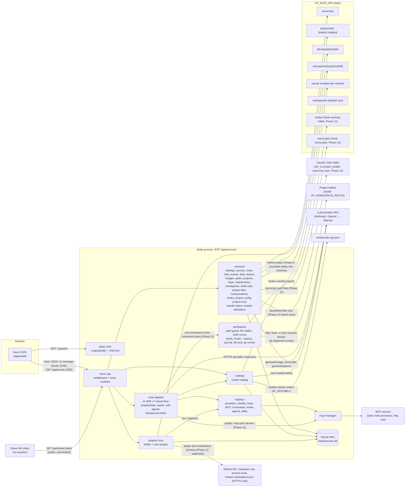
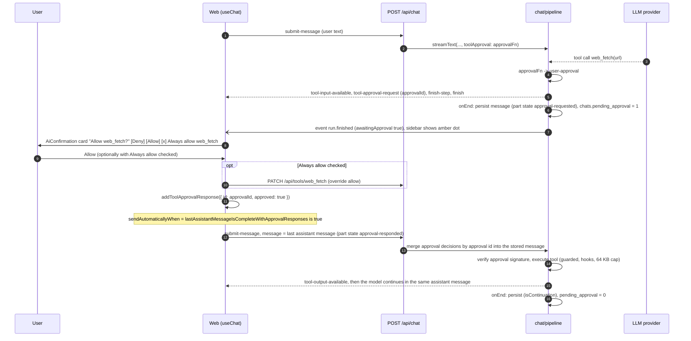
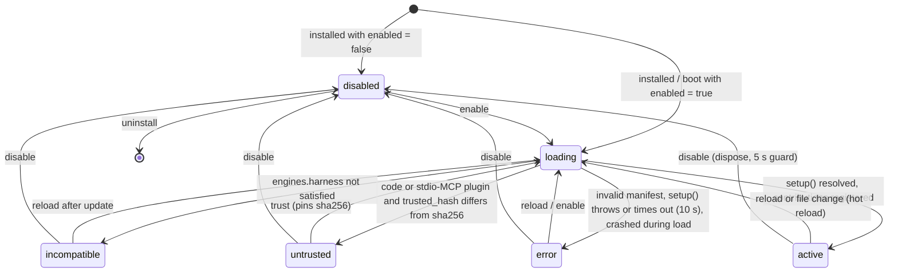
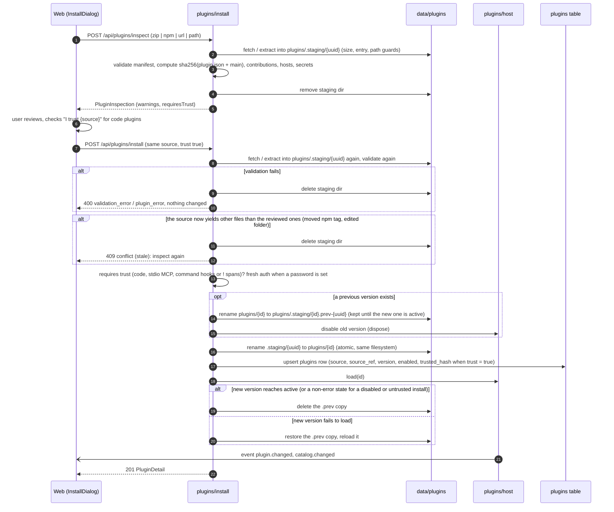
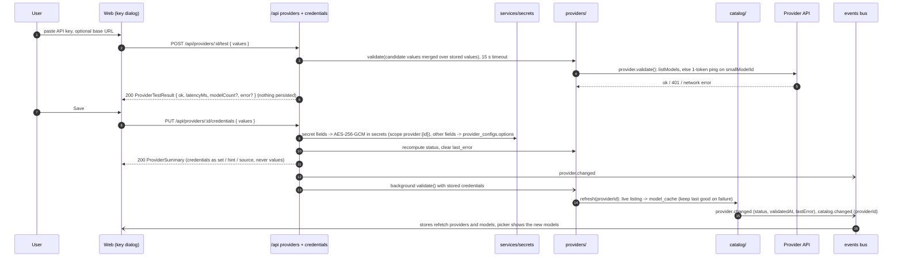
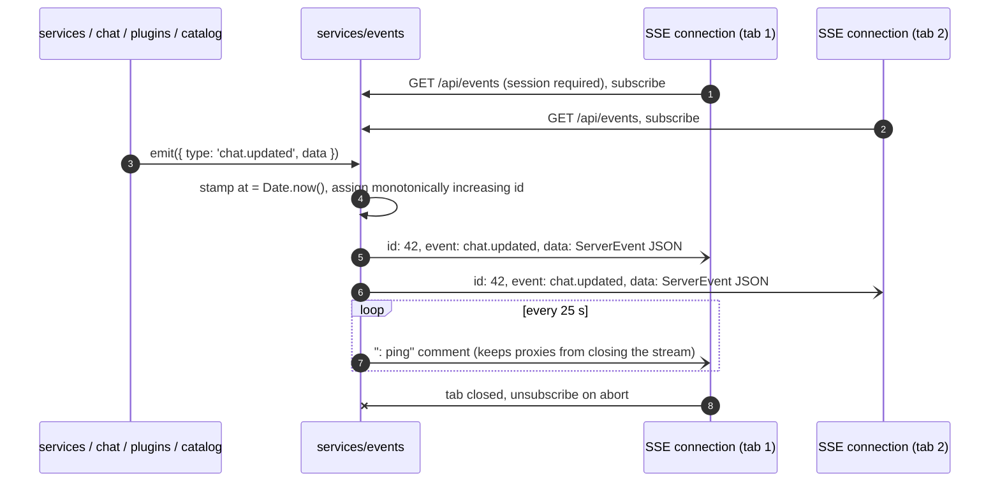
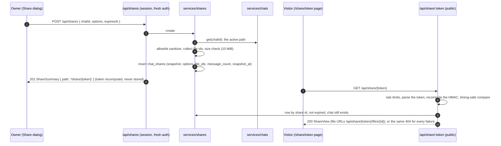
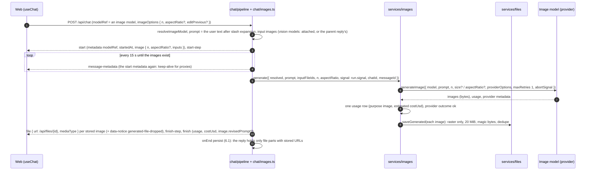
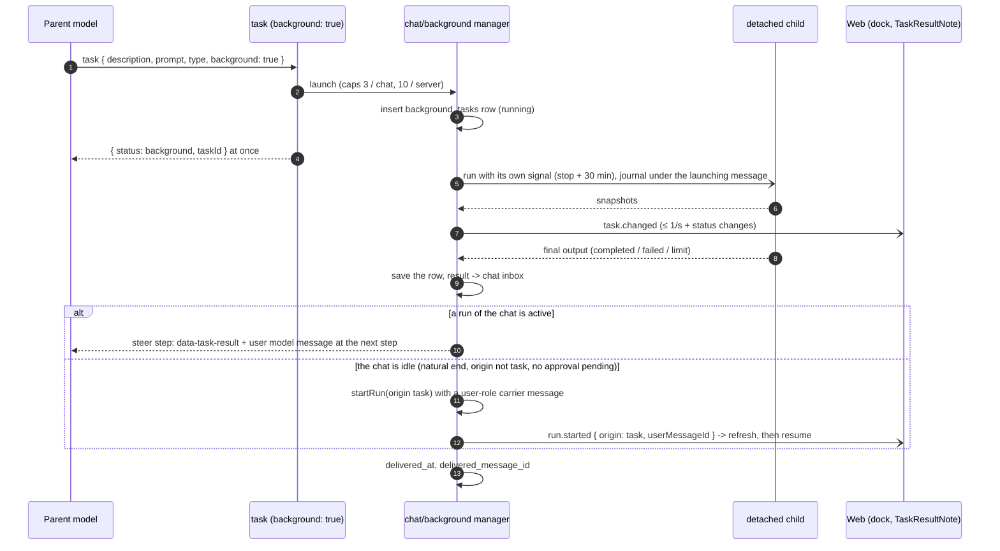

# Architecture

harness-forge is a self-hosted, single-user, BYOK AI chat + agent harness. One Node process serves a JSON/SSE API
under `/api` and the prebuilt Nuxt SPA. LLM providers, models, tools, MCP servers and slash commands are all
contributed by plugins (builtin or user-installed).

Related docs: [API.md](./API.md) (every endpoint and DTO), [PLUGINS.md](./PLUGINS.md) (plugin contract),
[PROVIDERS.md](./PROVIDERS.md) (providers and model catalog), [UI.md](./UI.md) (web UI), [DECISIONS.md](./DECISIONS.md)
(ADRs and contract seed; wins on conflict).

## 1. System overview



Key properties:

- **One process, one port** in production (`HF_PORT`, default 8787). The SPA and the API share an origin, so the
  session cookie is `SameSite=Strict` and no CORS is configured.
- **The server owns all state**: chat history, settings, secrets, plugin state. The browser keeps only UI
  preferences (theme via `@nuxtjs/color-mode` key `hf-color-mode`, sidebar state, wizard drafts).
- **Everything pluggable goes through the registry.** Builtin features (the 13 providers, `current_time`,
  `web_fetch`, MCP servers, commands) are builtin plugins that use the same public SDK as user plugins (ADR-009).
- **The chat run is decoupled from the HTTP request**: a run survives client disconnects, can be resumed
  (`GET /api/chat/:id/stream`) and is stopped only by `POST /api/chat/:id/stop`.
- **Conversations are trees** (ADR-023): edits and regenerations add versions; the server keeps the chosen path
  (section 6.8).
- **Small public surface**: without a session only health, login, icons, the SPA files and the read-only share
  routes answer (section 10.1); share links serve sanitized snapshots, never live data (section 6.10).
- **Media through the user's own providers** (Phase 6): generated images are stored as files before they are streamed
  or saved, so no `data:` URL ever reaches the `messages` table (section 6.11); dictation and read-aloud pass audio and
  text through the server to the chosen provider and store nothing (sections 6.12, 10.8).
- **Agent workspace** (Phase 7): a chat can belong to a project folder inside the allowed roots; there the builtin
  `core-workspace` tools read, search and edit files through one path guard, and a shell runs approved commands in its
  own process group (sections 6.13, 10.9). The master key can be rotated (6.14) and orphaned files cleaned up (6.15).
- **Workspace 2.0** (Phase 8): every agent write to a project file is journaled with its previous state, so a chat's
  edits can be rewound or reverted file by file and every restore can be undone (6.16); a changes panel shows the
  chat's net changes and the project's Git status through one hardened git runner (6.17); the shell remembers its
  working folder between calls and runs commands that match the user's shell rules without asking (6.13, 6.2); an
  opt-in timer runs the orphaned-file cleanup (6.15).
- **Agent 2.0** (Phase 9): long chats and long runs compact their context into a model-written summary instead of
  dropping old turns (6.18); a read-only plan mode ends with a plan the user approves, and the agent keeps a todo list
  (6.19); messages sent while the agent works wait in a server-side queue and reach the model at the next step
  boundary or as the next turn (6.20); `@` mentions attach project files (6.21); sub-agents run separate agent loops in
  parallel without ever asking for approval (6.22). All of it hangs off one step-boundary composer (`prepareStep`) and
  one model-history builder, and every new state is either derived from the stored messages or kept in bounded memory.
- **Agent customization** (Phase 10): agents, commands and skills are markdown files with YAML frontmatter, merged per
  project from the built-ins, the plugins, the user's own definitions (database, Settings → Customize) and the project's
  `.claude/` and `.harness/` folders (6.23); custom agents become sub-agent types, commands expand into prompts with an
  optional per-turn model and a narrower tool set, and skills are loaded on demand by the agent (6.24, 6.25); a
  sub-agent can run in the background, outlive its tool call and report back exactly once (6.26); approved plans can be
  saved as project files and `/remember` appends notes to `AGENTS.md` or to the instructions (6.27). Project
  definitions are untrusted input: read through the workspace path guard, never written by the harness, and they can
  only restrict (10.11).
- **Hooks, project trust and project MCP** (Phase 11): shell commands in Claude Code's `hooks` format run at eight
  points of the agent's work (before and after a tool call, when a prompt is submitted, when a reply stops, …) from
  three additive sources: the user's personal hooks, a project's `.harness` / `.claude` settings files and plugins
  (6.28); they can add context, block a tool call, rewrite its input or make the agent continue. Every executable item
  a repository brings (a project hook, a `.mcp.json` server, a command file with `` !`cmd` `` spans) runs only after
  the user approved its sha256, which covers the scripts it names and is checked again right before every spawn
  (6.29); approved `.mcp.json` servers connect lazily for that project's chats only, with variables the user stores
  encrypted per project (6.30). Output styles (a fourth catalog kind) shape how the agent writes, per chat, project or
  globally (6.31), and command files gain `!` spans and `@path` inlining while skills become slash commands (6.32).
  Kill switches (`hooksEnabled`, `HF_WORKSPACE_SHELL=0`, `HF_SAFE_MODE`) and the security model are in 10.12.
- **Claude Code ecosystem** (Phase 12): what users already have in Claude Code works here. Claude Code plugins install
  in their own format, kept byte for byte and read in place, with qualified names, `userConfig` settings and a trust pin
  over their whole file tree (6.33); marketplaces and GitHub repositories are read as HTTPS archives of a resolved
  commit, never with git (6.34); a Claude Code home folder (uploaded from the browser or scanned on the server) is
  imported once into personal definitions, hooks, MCP servers, shell rules and instructions through a server-side plan
  (6.35); a project's definition files, hooks and `.mcp.json` are edited from the UI without ever approving what they
  run (6.36); hooks gain prompt handlers answered by a small model, five more events, Claude Code's handler fields and a
  `transcript_path` file (6.37); and definitions accept Claude Code's newer frontmatter, 0-based arguments and model
  aliases (6.38). The security model is in 10.13.

## 2. Packages

| Package | Path | Responsibility | Depends on |
|---|---|---|---|
| `@harness-forge/shared` | `packages/shared` | zod DTO schemas + inferred types (including the plugin data shapes the API embeds: `PluginManifest`, `ModelInfo`, `CredentialField`, `SettingsSchema`, ...), enums, `HarnessError` class and error envelope, `apiRoutes` route table, `createApiClient`, chat message metadata and `data-*` part types, id helpers. Isomorphic (browser + Node), no Node built-ins. | `zod`, `ai` (types only) |
| `@harness-forge/plugin-sdk` | `packages/plugin-sdk` | The public plugin contract: runtime types (`PluginContext`, `ProviderDefinition`, `ToolDefinition`, `CommandDefinition`, `HookMap`, `PluginModule`, ...), `definePlugin`, `PLUGIN_API_VERSION`, `settingsValuesSchema()`, plus re-exports of the plugin data shapes and enums from `shared`. Type-only for plugin authors; runtime libraries reach plugins through `ctx`. | `shared`, `zod`, `ai`, `@ai-sdk/provider` |
| `@harness-forge/server` | `apps/server` | Hono app, security, SQLite via Drizzle, services, plugin host, registry, catalog, chat pipeline, MCP manager, builtin plugins, SPA static serving. | `shared`, `plugin-sdk`, AI SDK + providers, Hono, Drizzle |
| `@harness-forge/web` | `apps/web` | Nuxt 4 SPA (`ssr: false`): chat UI, Plugins tab, Settings, login. Talks to the server only through `createApiClient`, `useChat` (`DefaultChatTransport`) and `EventSource`. | `shared`, `plugin-sdk` (`settingsValuesSchema` for plugin settings forms), `ai`, `@ai-sdk/vue`, shadcn-vue, Pinia |

Rules: internal packages export TypeScript source (no build step); cross-package imports only by package name;
`plugin-sdk` depends on `shared`, never the reverse (no cycle): `shared` owns every JSON shape that crosses the HTTP
boundary and `plugin-sdk` re-exports the plugin data shapes (API.md 3.2).

## 3. Server layer map (`apps/server/src`)

| Path | Responsibility |
|---|---|
| `main.ts` | Process entry: dispatches the `rotate-key` CLI (Phase 7, 6.14) before anything boots; otherwise installs the signal handlers for graceful shutdown (before the boot starts, Phase 6 hotfix), then runs the boot sequence (section 5) with the key recovery and the `server.lock` hooks (Phase 7). |
| `env.ts` | Loads `<repo root>/.env`, parses and validates `HF_*` environment variables (zod) into a frozen `Env` object; resolves `HF_DATA_DIR` and `HF_WEB_DIR`; bind-safety check; Phase 7: the syntax of `HF_WORKSPACE_ROOTS` (`Env.workspaceRoots`, `workspaceRootsDefault`) and `HF_WORKSPACE_SHELL` (`Env.workspaceShell`), `DataPaths.workspaces`; Phase 8: `DataPaths.checkpoints` and the test-only `Env.testFileSweepDelayMs` (`HF_TEST_FILE_SWEEP_DELAY_MS`, honored only with `HF_MOCK_PROVIDER=1`, else null; `envBootWarnings(env)` then returns the warning "the test-only automatic file sweep delay is ignored: it is honored only with HF_MOCK_PROVIDER=1", which `startDeps` logs first; the text names the variable in words because the log redactor masks `HF_` followed by 16 or more word characters). Phase 12: `HF_CLAUDE_HOME` (`Env.claudeHome`: unset = `os.homedir()/.claude`, `0` = the scan is off, else an absolute path, rejected at boot otherwise; the Docker image sets `0`) and the test-only `HF_TEST_REMOTE_URL` (`Env.testRemoteUrl`: honored only with `HF_MOCK_PROVIDER=1` and only as `http://127.0.0.1:<port>`, any other value fails the boot), `DataPaths.transcripts`. |
| `deps.ts` | Composition root: `createDeps()` builds every service (eagerly, so a failing factory fails the boot), `startDeps()` / `stopDeps()` run the boot and shutdown steps (section 5; Phase 8: `checkpoints.start()` right after `projects.start()`, before the staging recovery and the plugins, and `data.start()` last; `data.stop()` first, `checkpoints.stop()` right after the runs stopped; Phase 10: `runs.boot()` right after `checkpoints.start()` (the boot sweep of `background_tasks`; `runs.start()` is `POST /chat`), and `runs.stopAll()` stops the queues, then the background tasks, then the runs; `customizations.stop()` right after the runs; the frozen orders are `BOOT_STEPS` and `SHUTDOWN_STEPS`). Phase 11 (frozen from P11-0b): the services `hooks`, `projectConfig`, `projectTrust` and `projectMcp` (`AppDeps`); no new boot step (hook snapshots, the project config reader and the project MCP runtimes are lazy); shutdown runs data → runs (queues → background tasks → runs) → **hooks** → **projectMcp** → customizations → **projectConfig** → projectFiles → checkpoints → plugins → mcp → catalog → events (`projectTrust` keeps no state to stop). Phase 12 (frozen from P12-0b): the services `marketplaces`, `claudeImport` and `projectDefinitions` (`AppDeps`); no new boot step (marketplaces are read from the database on use, import plans live in memory, project files are read on request); shutdown adds `claudeImport.stop()` (drops every plan) before the runs and `marketplaces.stop()` (aborts the fetches in flight) right before the plugins, and `hooks.stop()` also stops the prompt-hook calls, the detached `async` and `SessionEnd` hooks and the transcript writer (`projectDefinitions` keeps no state to stop). |
| `app.ts` | `createApp(deps)` app factory: mounts middleware and every route module under `/api`; used by `main.ts` and `createTestApp()`. |
| `paths.ts`, `logger.ts` | Package-relative locations (server package root, migrations, bundled assets, the SPA build, installed package versions); JSON-lines logger with redaction. |
| `http/middleware/` | Request id, structured access log (share tokens masked; it also runs the untrusted-proxy hint of `proxy-warning.ts`), secure headers + CSP, Origin check on non-GET, session auth, fresh auth (ADR-017), login rate limiter, body-size and content-type gate, the global error handler that renders `HarnessErrorEnvelope`; `request-info.ts` resolves the client address and scheme, trusting forwarded headers only from `HF_TRUST_PROXY` peers (section 10.6). |
| `http/routes/` | One Hono module per API area (`health`, `auth`, `settings`, `events`, `providers`, `credentials`, `models`, `icons`, `chats`, `chat`, `files`, `tools`, `mcp`, `commands`, `plugins`, `plugin-install`, `plugin-drafts`, `plugin-files`, `data`, `audio`, `shares`; Phase 7: `projects`, `keys`; Phase 8: `changes` (7 chat-scoped routes: changes, diff, git, revert, undo, rewind preview and apply; 6.16, 6.17) and `shell-rules` (3; 6.13); Phase 9: `chat-queue` (module `chatQueue`, 3 routes under `/chat/:id/queue`; 6.20) and `project-files` (module `projectFiles`, 2 routes under `/projects/:id/files`; 6.21); Phase 10: `customizations` (6 routes; 6.23), `memory` (1 route, `POST /memory`; 6.27) and `chat-tasks` (module `chatTasks`, 2 routes under `/chat/:id/tasks`; 6.26), and `commands` gains `?projectId=`; Phase 11: `hooks` (5 routes: list, runs, create, update, remove; 6.28), `project-trust` (module `projectTrust`, 3 routes under `/projects/:id/trust`; 6.29) and `project-mcp` (module `projectMcp`, 3 routes under `/projects/:id/mcp`; 6.30); Phase 12: `marketplaces` (5 routes: list, add, get, refresh, remove; 6.34), `claude-import` (module `claudeImport`, 4 routes: home, scan, upload, apply; 6.35) and `project-definitions` (module `projectDefinitions`, 3 routes under `/projects/:id/definitions/file`; 6.36), and the `pluginInstall` inspect / install bodies gain the `github` and `marketplace` sources and `format`: 132 routes in 36 modules, 14 of them fresh); thin: validate (`http/validate.ts` maps zod issues to `validation_error`), call services, map DTOs. `shares.ts` also serves the public `/share/:token` routes; `audio.ts` (Phase 6) parses the multipart recording of `POST /audio/transcriptions` itself and answers `POST /audio/speech` with audio bytes (section 6.12). |
| `http/static.ts` | Production SPA serving from `HF_WEB_DIR` (default `apps/web/.output/public`) with `200.html` fallback for client routes. |
| `security/` | `keyring.ts` (master key + HKDF subkeys; Phase 7: one frozen keyring whose key and `keyVersion` swap in place during a rotation, with the module-private controls `swapMasterKey`, `beginKeyChange`, `whenKeyStable`, 6.14), `password.ts` (scrypt), `session.ts` (HMAC session tokens + cookie), `headers.ts` (CSP/secure headers; Phase 6: `microphone=(self)` and the SPA's `media-src`, section 10.2), `ssrf.ts` (outbound URL guard), `redact.ts` (secret redactor for logs and errors; also masks share tokens), `proxy-trust.ts` (the `HF_TRUST_PROXY` matcher, section 10.6). Phase 8: `process-spawn.test.ts` fails when a non-test file other than `workspace/shell.ts`, `workspace/git.ts` and `mcp/stdio-transport.ts` imports `node:child_process`. Phase 11: the list stays at these three modules: command hooks and command `!` spans run through `workspace/shell.ts`, project stdio MCP servers through `mcp/stdio-transport.ts`. Phase 12: still three modules (no git, no download shell, prompt hooks call a model, not a process); `ssrf.ts` honors the test-only `HF_TEST_REMOTE_URL`: every plugin-source and marketplace fetch goes to `<base>/<host>/<path>`, and only that loopback base is allowed (6.34). |
| `db/` | Drizzle schema (`schema.ts`), libsql client, `migrate()` at boot, pragmas (WAL, foreign keys, busy timeout), transaction helper. |
| `services/settings/` | Typed global settings (defaults, validation, cache) over the `settings` table. |
| `services/secrets/` | Encrypted secret store (AES-256-GCM) over the `secrets` table: `get/set/delete/list(scope)`, masked hints, env fallback lookup. Phase 11 (ADR-050, frozen `types.ts` edit): the scope `project:<projectId>` holds the project MCP variables (names `mcp.var.<NAME>`; 6.30); it is deleted with its project, and a key rotation re-encrypts it with every other row. |
| `services/chats/` | Chat + message persistence, the message tree (`tree.ts`: active path, versions, latest leaf, the remembered leaf under a message; section 6.8), version switching, deleting a version (Phase 6), search, cursor pagination (`list.ts`: a row-value keyset cursor), export (md / json v2) and import (v1 / v2), usage rows and totals, title updates, `allIds` / `importChat` / `removeAll` for bulk data; Phase 7: `projectId` in records, summaries, search results and events, the project filter, the move of `update` (6.13), `approvals.ts` (`denyOpenApprovals`, used by the key rotation). |
| `services/data/` | Bulk data (ADR-024, section 6.9): summary, streamed zip export, import of a backup or a single chat, delete-all; Phase 7: the orphaned file cleanup (`cleanup.ts`: `cleanupPreview`, `cleanup`, `_files`; the reference scan in `references.ts`, 6.15). Imports, delete-all, cleanup and key rotation are serialized by `services/maintenance/`. Phase 8 (ADR-039): `start()` / `stop()` of the automatic sweep (`auto-sweep.ts`: `createAutoSweep`, the pure `nextSweepAt`, `attemptAutoSweep`; `createDataService` returns a `DataServiceWithSweep` whose `autoSweep` the tests drive), the loose plugin-data scan (`plugin-data-scan.ts`), `FileSweepStatus` in the summary and the preview, `pluginData` in the preview and the result, `DataSummary.checkpoints` (omitted when the store cannot be read); `references.ts` classifies every column of the new tables (its scan now takes an abort signal); delete-all also purges the checkpoint store. |
| `services/maintenance/` | `MaintenanceService` (Phase 7): `exclusive(kind, op, { blockRuns? })` runs one maintenance operation at a time (`import`, `delete-all`, `key-rotation`, `file-cleanup`; another one gets 409 `busy`), `current()`; while an operation with `blockRuns` (the key rotation) holds it, `POST /chat` answers 409 `busy`. |
| `services/keys/` | `KeyService` (Phase 7, ADR-034, section 6.14): `index.ts` (`status()` for `GET /keys`, read-only; `rotate()`, the online rotation), `rotate.ts` (the shared core `rotateSecretsTx` and the write-ahead `rotateWithKeyFile`), `check.ts` (the key check and `_keys`), `recover.ts` (the boot recovery `recoverKeyState`), `server-lock.ts` (`server.lock`) and `cli.ts` (the `rotate-key` CLI). |
| `services/checkpoints/` | `CheckpointService` (Phase 8, ADR-036 / ADR-037, sections 6.16, 6.17; `index.ts` composes the modules, each of which receives a `CheckpointContext { deps, blobs, rows, now }`): `store.ts` (the content-addressed blob store `<dataDir>/checkpoints/`), `disk.ts` (`sha256Hex`, `readCheckpointBefore`, `diskSha` / `diskShas`, `writeWithoutRecording`), `journal-service.ts` (`journal({ chatId, messageId, projectId })` for a run: the `edit` rows of journaled writes, the `shell` / `untracked` rows, the coalesced `workspace.changed` events; the row writer `createChangeRowWriter`), `prune.ts` (age and budget eviction, orphan blobs and temp files; the 6-hour timer and the `chat.deleted` trigger live in `index.ts`), `plan.ts` (the pure rewind / revert / undo planner), `restore.ts` (the restore primitive: per file under the file lock), `restore-scope.ts` (the chat's project, the 409 `run-active` check, the batch event and log line), `rewind.ts`, `revert.ts`, `undo.ts`, `changes.ts` (`ChatChanges`, the chat diff), `git-changes.ts` (`GitStatus` and the HEAD diff over `workspace/git.ts`), `changes-common.ts` (the shared disk reads and diff sides), `purge()` for delete-all and `summary()` for `GET /data`. |
| `services/shell-rules/` | `ShellRuleService` (Phase 8, ADR-038, 6.13): rule CRUD over `shell_rules` (validation through the shared `parseShellRule`, 200 rules per scope, duplicates 409 `exists`; creates serialized in-process because the table has no unique index) and `forRun(projectId)`, the global plus project rules a run matches against (one query; `forRun(null)` runs none). |
| `services/project-files/` | The project files service (Phase 9, ADR-042, section 6.21; `types.ts` frozen, `AppDeps.projectFiles`): the per-project in-memory file index for `@` mentions (built with `workspace/walk.ts`, secret-looking paths left out, single-flight, 30 s TTL, at most 8 projects, dropped on `workspace.changed`, `project.changed` and `run.finished` of a chat of the project), `search(projectId, q, limit)` ranked by the shared `rankPaths`, and `attach(projectId, path)` (path guard, `.git` / secret refusal, 5 MiB cap, then `files.upload`). |
| `services/projects/` | `ProjectService` (Phase 7, ADR-031, section 6.13): `roots.ts` (the allowed roots, checked first in `startDeps` by `start()`, and the folder checks), `index.ts` (project CRUD, the folder browser, `openWorkspace()`, `chatCount`, `project.changed`), `project-file.ts` (`AGENTS.md` / `CLAUDE.md` with its `@file.md` lines). Phase 10: project deletion is refused (409 `run-active`) while a background task of one of its chats runs. Phase 11: `ProjectSummary.outputStyle` (the column `projects.output_style`, set through the project update; 6.31); deleting a project cascades its approvals (`project_trust`), deletes its secret scope `project:<projectId>` and stops its MCP runtimes (6.30). |
| `services/customizations/` | The customization catalog (Phase 10, ADR-044 / ADR-045, sections 6.23 – 6.25; `types.ts` frozen from P10-0b, `AppDeps.customizations`): `discover.ts` (the guarded scan of a project's `.harness/` and `.claude/` folders: frontmatter only), the user store over the `customizations` table (`cus_` ids, raw markdown), `catalog.ts` (the merge of built-in, plugin, user and project entries with the shared `resolvePrecedence`, diagnostics, the per-project cache with a 10 s TTL and single-flight builds, the invalidation subscriptions), `load(entry)` (re-reads and re-validates one body for a run), `memory.ts` (`/remember`, 6.27); `customization.changed` events. Phase 11 (ADR-051, ADR-052): the fourth kind `style` (folders `.harness/output-styles` and `.claude/output-styles`, 8 project folders; the builtin styles; plugin styles from `registry.styles`), `styles()` / `style(name)`, and the skill keys `user-invocable` / `disable-model-invocation` (6.31, 6.32). Phase 12 (ADR-053, ADR-055, ADR-058): the new frontmatter keys (6.38), the qualified names of Claude Code plugin entries and their bare alias (6.33), `importDefinitions(items)` (one batch through the write queue: create, overwrite or rename, `!` commands turned off unless enabled, one `customization.changed`; 6.35) and `CustomizationRestoreResult.turnedOff`. |
| `services/hooks/` | The hook service (Phase 11, ADR-048, section 6.28; `types.ts` frozen from P11-0b, `AppDeps.hooks`): `HookService { snapshot(scope), list, create, update, remove, runs, invalidate, stop }`; the merge of the personal rows (table `hooks`, `hok_` ids), the approved project items of `projectConfig.snapshot` and the plugin hooks (`registry.hookCommands`, code events through `registry.hooks`), the matcher, the runner (stdin payload, caps, parallel handlers, the server-wide semaphore of 16 processes, timeouts, process-group kills), the kill switches, the combination of outcomes (the shared `util/hooks.ts`), the in-memory run log (200 entries, `GET /hooks/runs`) and `hooks.changed` events. Phase 12 (ADR-057, 6.37): `prompt-hooks.ts` (the prompt-hook runner inside the snapshot), `exec-form.ts` (`args`), `transcripts.ts` (`transcript_path` files), `session-end.ts` (the detached `SessionEnd` runs of a chat delete), personal rows with `type`, `prompt`, `model` and `options`, `importPersonal(items)` (one `hooks.changed`) and the hooks of untrusted plugins listed as `pending` rows. |
| `services/project-config/` | The project config reader (Phase 11, ADR-049, section 6.29; `types.ts` frozen, `AppDeps.projectConfig`): `snapshot(projectId, { signal, refresh })` reads the `hooks` key of `.harness/settings{,.local}.json` and `.claude/settings{,.local}.json` and the project's `.mcp.json` through the workspace path guard (no links, regular files, ≤ 256 KiB before `JSON.parse`), parses them with the shared helpers, hashes the script files each item names, and caches the result per project for 10 s (at most 50 projects; dropped on a `workspace.changed` that touches a config, `.claude/` / `.harness/` or referenced file, `project.changed` and `run.finished` of the project, then rebuilt after 1 s); `verify(projectId, item)` (verify-before-run, opens nothing); a rebuild whose hashes changed emits `project-trust.changed` (and `hooks.changed` when hook items changed); it never opens the workspace (0 folder opens per run). |
| `services/project-trust/` | Project trust (Phase 11, ADR-049, section 6.29; `types.ts` frozen, `AppDeps.projectTrust`): the `project_trust` table (one row per project and approved sha256), `approved(projectId)` (memoized), `list` (hooks, MCP servers and project commands with `!` spans, with their hashes and states), `approve` (a batch, fresh auth, 409 `stale`), `revoke` (idempotent, answers the list, also removes orphaned hashes), `pending(projectId)` and `project-trust.changed` events; approve and revoke also emit `hooks.changed`; the trust service only emits, and the project MCP manager reacts by stopping the runtimes whose hash was revoked or replaced. Phase 12: prompt hooks and hooks with the new handler fields are trust items too (layout v2 only when such fields exist, so every v1.7 approval keeps its hash; 6.37). |
| `services/claude-import/` | The home-folder import (Phase 12, ADR-055, section 6.35; `types.ts` frozen from P12-0b, `AppDeps.claudeImport`): `collect-disk.ts` (the scan of `HF_CLAUDE_HOME`: the allowlist only, links followed to regular files outside the data directory, caps, a 10 s deadline), `collect-upload.ts` (the multipart folder files or one zip through `openZip` + `EntryCollector`), `baseline.ts` (the current personal rows, hooks, MCP servers, shell rules, tool overrides and settings), `plans.ts` (the in-memory plans: `cip_` ids, 10 minutes, at most 4, dropped on apply, expiry, key rotation and shutdown) and `apply.ts` (one pass through `customizations.importDefinitions`, `hooks.importPersonal`, the MCP servers, the shell rules, the tool overrides and the settings); the planner is the shared `planClaudeImport`. |
| `services/project-definitions/` | Project definition files (Phase 12, ADR-056, section 6.36; `types.ts` frozen, `AppDeps.projectDefinitions`): `paths.ts` (the editable paths: the definition folders of `.claude/` and `.harness/`, the four settings files, `.mcp.json`; `resolveWorkspacePath` with `allowMissing` must give the same relative path), `settings-file.ts` (splices the `hooks` or `mcpServers` key and keeps every other key and its order) and `index.ts` (read, write, remove through `writeWithoutRecording` under the file lock, with the `expectedSha256` check; `workspace.changed { source: 'user' }`; the answer's `trust.pending`). |
| `workspace/` | The agent workspace (Phase 7, section 6.13): `paths.ts` (`resolveWorkspacePath` and the safe read / write helpers; frozen), `sensitive.ts` (secret-looking and hidden paths), `walk.ts` (the folder walker; `.gitignore` through `ignore`), `pattern-worker.ts` (globs through `picomatch` and regular expressions, matched in a killable Worker), `diff.ts` (diffs through `diff`), `trim.ts` (output caps), `text.ts`, `shell.ts` (the only shell runner: process groups, capped output; Phase 8: the working folder reported on fd 3 with `reportCwd`, `parseCwdReport`, `killProcessGroup` exported) and `shell-env.ts` (the environment allowlist; Phase 8: empty and relative `PATH` entries dropped, `CDPATH`, `ENV` and `BASH_ENV` never passed). Phase 8 (6.13, 6.16, 6.17): `run-scope.ts` (`bindRunScope` / `runScopeOf`: the server-only run scope bound to a tool call context), `file-lock.ts` (`withFileLock`: one promise chain per resolved path), `journal.ts` (`journaledWrite`: snapshot, write, journal row), `remove.ts` (the guarded unlink of a restore), `shell-cwd.ts` (`initialShellCwd(history)`, `checkShellFolder`, `clampEndCwd`, `cdTargetsInside`, the folder notes) and `git.ts` (the hardened git runner; the only git spawn). Phase 11 (frozen from P11-0b): `runShellCommand` gains `input` (written to the process's stdin, a closed pipe swallowed; before Phase 11 stdin was `ignore`) and `env` (extra variables on top of `shellEnvironment`; an attempt to override an allowlisted or fixed key is refused); it stays the only shell-string spawn and also runs command hooks (6.28) and command `!` spans (6.32). |
| `services/shares/` | Share links (ADR-025, section 6.10): HMAC tokens, the allowlist sanitizer, snapshots, owner CRUD, the public view and file access, expiry, rate limits. |
| `services/files/` | Content-addressed upload store (`data/files/<aa>/<sha256>`), MIME/size validation, `files` rows, read streams; for bulk data `importFile` (deduplicated by sha256, keeps the preferred id when it is free) and `purge` (every row and blob); Phase 7: `sweep()` for the cleanup (`sweep.ts`), in-memory pins of fresh ids (`pins.ts`) and a shared / exclusive gate (`gate.ts`; 6.15); `saveGenerated` (Phase 6, rules in `generated.ts`) stores a generated raster image (PNG, JPEG, WebP or GIF whose magic bytes match its type, at most 20 MiB; a row with the same content and type is reused, and concurrent saves of the same bytes are serialized, section 6.11). Phase 8: `FileSweepInput.signal` (the automatic sweep aborts between batches); the store gate (`gate.ts`) is reused by the checkpoint store (6.16). |
| `services/images/` | `ImageService` (Phase 6, ADR-028, section 6.11): `generate()` runs `generateImage` with the provider's `imageParams`, writes the one usage row of a generation (`purpose: 'image'`), records the provider outcome and stores every image through `files.saveGenerated`; `generation.ts` holds the pure helpers (the checked `imageParams` result, token usage, estimated cost, revised prompt). Used by image turns and by `ctx.images` (the `generate_image` tool). |
| `services/audio/` | `AudioService` (Phase 6, ADR-029, section 6.12): `transcribe()` (type allowlist + magic-byte sniffing in `sniff.ts`, `transcribe()` of the AI SDK) and `speak()` (`generateSpeech()`); a usage row (`transcription` / `speech`) and the provider outcome only for a call that answers; one info log line per call; stores nothing. |
| `services/events/` | In-process event bus + SSE fan-out for `/api/events` (section 6.7); Phase 7: `disconnectAll()` (flushes queued events, then closes every stream; after a key rotation and a password change). |
| `registry/` | Typed registries for providers, models, tools, MCP server declarations, commands and hooks; every registration returns a `Disposable` and is tagged with its owner plugin id. Phase 10 (plugin API 1.4.0): the kinds `agent` and `skill` (`registry.agents`, `registry.skills`; name pattern, reserved names, 64 KiB bodies, tool names and model refs checked at registration, a duplicate name across plugins is a `conflict`), and the contributions `agents` / `skills` of a plugin summary. Phase 11 (plugin API 1.5.0, frozen `types.ts` edit): `registry.styles` (plugin output styles, `contributes.outputStyles` and `ctx.outputStyles.register`) and `registry.hookCommands` (the command hooks of `contributes.hooks`, only while their plugin is active and trusted), the new code hook events of `HookMap` (`prompt.submit`, `session.start`, `run.stop`, `subagent.stop`, `compact.before`, `notification`; `tool.after` may set `context`), and the contributions `commandHooks` (a count; `hooks` keeps listing the code hook names) / `outputStyles` (names). Phase 12 (plugin API 1.6.0, frozen `types.ts` edit): qualified names (`<pluginId>:<name>`, accepted only when the first segment is the owner's id; 6.33), markdown command syntax (`syntax: 'markdown'`), skill `baseDir`, prompt handlers and the five new events in `contributes.hooks`, `HookCommandsRegistration.env` (`CLAUDE_PLUGIN_DATA`, `CLAUDE_PLUGIN_OPTION_<KEY>`), and `McpServerRegistry.register(…, { claudeName })` (the `mcp__plugin_<name>_<server>` alias hooks and tool lists can use). |
| `plugins/host.ts` | Plugin host: discovery, load order, lifecycle state machine, enable/disable/reload, boot sentinel, safe mode. Phase 12: dispatches by `plugins.format` through `formats.ts` (`readPluginDirectoryFor(format, dir, opts)`): a Claude Code plugin's trust requirement and hash come from its reader (the whole-tree hash), its contributions from the Claude registration, a hand-placed folder's format is detected, saving its settings reloads it, and it is never editable (6.33). |
| `plugins/claude/` | Claude Code plugins (Phase 12, ADR-053, section 6.33): `detect.ts` (layout and root prefix), `reader.ts` (`readClaudePluginDirectory` → `PluginDirectoryRead` + `ClaudePluginRead`), `layout.ts` (component path rules: replace / add / merge, `./` paths inside the root), `files.ts` (definition files through `readDefinitionFile` with the plugin root), `tree-hash.ts` (`hf-claude-plugin/v1`), `variables.ts`, `user-config.ts`, `mcp.ts`, `hooks.ts`, `register.ts` (`registerClaudeContributions(ctx, read, runtime)`), `skill-files.ts` (the `skill` tool's `file` reads) and `info.ts` (the inspection's `claude` block); `plugin.json` and `marketplace.json` are parsed only by the shared `util/claude-plugins.ts`. |
| `plugins/marketplaces/` | Marketplaces (Phase 12, ADR-054, section 6.34; `types.ts` frozen, `AppDeps.marketplaces`): `MarketplaceService { list, add, get, refresh, remove, stop }` over the `marketplaces` table (`store.ts`), `github.ts` (ref → commit, `marketplace.json` of that commit), `catalog.ts` (the validated, normalized catalog), `sources.ts` (an entry → a staged source or an unsupported reason), `updates.ts` (update availability) and `testing.ts`; `marketplace.changed` events. |
| `plugins/loader.ts` | Reads + validates `plugin.json`, checks id/dir/engines/trust, imports the entry module (cache-busted URL). |
| `plugins/context.ts` | Builds the per-plugin `PluginContext` (`ctx`): scoped logger, settings, secrets, storage, registries, hooks, `ai`, `fetch`, `signal`, and `images` (plugin API 1.1.0: `images.generate` through `ImageService`). |
| `plugins/guard.ts` | `guard(pluginId, fn, timeoutMs)`: timeouts, error capture into `plugin_error`, per-plugin log ring buffer, hook failure counters. |
| `plugins/declarative.ts` | Adapter that turns declarative `contributes.providers` into `ProviderDefinition`s (OpenAI-chat, OpenAI-responses, Anthropic, Google formats). |
| `plugins/compile.ts` | esbuild compile of `.ts` entries into one ESM file in `data/cache/plugins/<id>/` (SDK aliased to a shim), returns diagnostics. |
| `plugins/watch.ts` | `fs.watch` for linked folders or `HF_PLUGIN_WATCH=1`, 300 ms debounce, triggers reloads. |
| `plugins/state.ts` | Persistence of plugin rows (`plugins`, `plugin_settings`, `plugin_kv`), trust hashes, `loading_since`. |
| `plugins/install/` | Inspect + install from zip / npm / URL / folder into `plugins/.staging/<uuid>`, validation, review check (what was inspected is what gets installed), atomic swap, crash recovery of staging, export. `zip.ts` also provides `openZip()`, the lazy reader of data imports with the same guards (section 6.9). Phase 12 (ADR-054, 6.34): `github.ts` (GitHub and marketplace staging: the commit's zip from codeload, the top folder and the archive comment checked), entry modes in the zip and tar readers (`ArchiveEntry.executable`, kept as 0755 for the claude format only), `select(path)` (only one subtree of an archive is extracted and counted), the detection-aware root prefix (a harness `plugin.json` or a Claude Code layout at the root or in one top folder), the review keys of the new sources and `format?`. |
| `plugins/drafts/` | Declarative plugins created and edited in the browser (provider wizard): draft validation, SVG icon sanitizing, credentials saved as provider credentials, temporary-provider draft test. |
| `plugins/scaffold/` | Code plugins created from a template (`POST /plugins/scaffold`) and the traversal-safe files API: tree, read, atomic write, delete, build + reload, trust re-pinning of `created` plugins. |
| `plugins/templates/` | Template sources (tool, provider, MCP bridge, command pack): a JSDoc-typed `index.mjs` or a TypeScript `index.ts`, the vendored API types `harness-forge.d.ts` and a README. |
| `catalog/` | Model catalog: live listings with 24 h cache (`model_cache`), models.dev snapshot + weekly refresh, seeds, plugin models, custom ids, prefs, `classify()` (model kinds incl. `image`, `transcription`, `speech`; `imageOutput`), cost lookup (section 9). |
| `providers/` | Model resolution: `modelRef` -> provider -> credentials (stored or env) -> `LanguageModel` (`resolveModel`), and since Phase 6 image, transcription and speech models (`resolveImageModel`, `resolveTranscriptionModel`, `resolveSpeechModel`); provider test; provider status; error mapping to `HarnessError`; the LobeHub icon service (`/api/icons/lobe`). |
| `chat/` | Chat pipeline: runs registry (one active run per chat, stop, resume buffer), history assembly, approvals, slash commands, tool assembly, context trimming, titles, usage/cost, persistence; Phase 6: image turns (`images.ts`), generated-file storage for every run (`generated-files.ts`), the history carry-forward of generated images (`files.ts`), the run notices incl. `generated-file-dropped` (`notices.ts`); Phase 7: the project of a new chat, `openWorkspace` + the `workspace-unavailable` notice, the workspace tool filter and `ToolCallContext.workspace`, the `edits` approval mode, the instruction order with the workspace block and the project file, `projectMaxSteps` (6.13). Phase 8: `scope.ts` (`createRunScope`: chat, assistant message id, journal, shell rules, sticky folder, built once per run) bound to every tool call context and to policy contexts (`AssembledTools.scope`), `shell` / `untracked` journal rows after each settled workspace call (`settledCallRecord` in `tools.ts`), `effectiveOverride` in `approval.ts` (a stored `allow` override on an `execute` tool is ignored), and the workspace block says that `cd` persists (6.2, 6.13, 6.16). Phase 9 (ADR-040 … ADR-043, sections 6.18 – 6.22): `steps.ts` (`createPrepareStep`: the one step-boundary composer: context guard → steer → sub-agent finalize nudge), `model-history.ts` (`buildModelHistory`: compaction → steer split → task output reduction → command expansions → summary merge), `markers.ts` (the instruction markers of the summarizer and of sub-agents), `agent-scope.ts` (`agentScopeOf(c)`: the private side channel of `core-agent`, a WeakMap bound to the tool call context like the run scope), `compaction/` (`history.ts`, `guard.ts`, `stream.ts`, `summarize.ts`, `prompt.ts`), `queue.ts` (the in-memory steer queue), `steer.ts` (`createSteerStep`, `stepInjector`), `modes.ts` (the plan-mode tool set and `activeTools`), `subagent/` (`index.ts` `createSubagentRunner`, `tools.ts` the child tool set and its approval, `history.ts`), plus `RunSession.inject` / `addExtraCost` / `writeTransient` and `RunContext.onReleased` in `pipeline.ts`, the `/compact` branch of `commands.ts`, the streaming tool wrapper of `tools.ts`, `case 'plan'` and the `exit_plan_mode` rule of `approval.ts`. Phase 10 (ADR-045 … ADR-047, sections 6.23 – 6.27): `PreparedRun.catalog` (one catalog per run), `requestModelRef` (a command's model never becomes the chat's model) and `turnRestriction` (a command's `allowed-tools`); `commands.ts` resolves file commands (`resolveCommand(…, { catalog })`, `isServerCommandFor`) and `prepare.ts` resolves the request's model first, then the command's `model` override (`resolveTurnModel`); `tools.ts` applies `allowedTools` after the mode and drops `skill` without skills; `params.ts` adds the agent-types and skills blocks; `subagent/` runs custom agent types (`host.ts`: the structural `ChildSession` shared with detached children); `background/` (the per-chat manager of background tasks: launch, caps, persistence in `background_tasks`, `task.changed`, the result inbox, idle delivery, guards, the boot sweep; 6.26); `steer.ts` also takes finished background results; `model-history.ts` gains the `splitTaskResults` stage; `skills.ts` (`loadSkill`) and `plan-file.ts` (`savePlan`), both reached through `agent-scope.ts`. Phase 11 (ADR-048 … ADR-052, sections 6.28 – 6.32; the seams complete and frozen from P11-0b): `hooks.ts` (`RunHooks`, the per-run hook runtime over a `HookSnapshot`: `record(data)` injects a `data-hook` part, queued contexts for the next step, the answered / replayed PreToolUse decisions of a continuation, the record of a plugin's `tool.after` `context`, `forChild(prefix)` for sub-agents and `detachedHooks` for background children, and the `hookGate` transform that holds `finish` for the `Stop` hooks), `hooks-prompt.ts` (`SessionStart` and `UserPromptSubmit` at submit; `UserPromptSubmit` also at enqueue), `prepare.ts` (`TurnWorkspace`: the project folder opened at most once per turn, shared by the command expansion and `openRunWorkspace`), `output-style.ts` (`resolveRunOutputStyle` → `PreparedRun.outputStyle` → `RunParamsInput.outputStyle`; `agentBlocks(…, { codingHints })`), `inline/` (the `!` span runner and the `@path` reader behind `CommandContext.expansion`); `approval.ts` runs `PreToolUse` after the unknown-tool and `exit_plan_mode` rules (skipped for answered tool call ids and replayed from the stored part); `tools.ts` applies a hook's `updatedInput` in `prepareInput` (before `tool.before`, re-validated), runs `PostToolUse` after `tool.after`, and `assembleTools({ extraTools, shadowedMcpServers })` adds the project MCP tools; the step composer runs context guard → **hooks** → steer → finalize; `model-history.ts` gains the `splitHooks` stage after `splitTaskResults`; `RunContext.origin` gains `hook`, `onReleased(ending, awaitingApproval, followUp)` and `startHookTurn` start a hook continuation, and `carrierParts` accepts `data-hook` carriers; `pipeline.ts` fires `Notification` when a run is released waiting for an approval; `modelStream` asks `projectMcp.toolsFor` for project chats (tools on, a tool-capable model). Phase 12 (ADR-053, ADR-057, ADR-058, sections 6.33 – 6.38; the seams complete and frozen from P12-0b): `hooks.ts` gains `ToolHooks.permissionRequest`, `ToolHooks.postToolUseFailure`, `settle(callId, { harnessAsked })`, `RunHooks.postCompact` and `ChildHooks.subagentStart`; `approval.ts` runs the `PermissionRequest` step after the combination and settles the PreToolUse record; `tools.ts` runs `PostToolUseFailure` in the catch paths of `runToolCall` and `streamToolCall`; `subagent/host.ts` runs `SubagentStart` before the child's step 0 and applies `maxTurns`, `disallowedTools` and the skills preload; `compaction/{guard,stream}.ts` run `PostCompact` after the marker; `model-aliases.ts` (`resolveClaudeModel`); `commands.ts` and `skills.ts` resolve qualified names and the bare alias, run markdown plugin commands through the command-file path and serve the `skill` tool's `file` and fork skills; `inline/shell.ts` gives a plugin's `!` spans `CLAUDE_PLUGIN_ROOT` / `CLAUDE_PLUGIN_DATA`; `DELETE /chats/:id` starts the detached `SessionEnd` hooks. |
| `mcp/` | MCP manager: one client per enabled server (`@ai-sdk/mcp`), status, reconnect with backoff, tool naming `mcp__<serverId>__<tool>`, hint -> policy mapping, close on disable; `{{settings.*}}` templating of plugin-declared servers; its own stdio transport (minimal environment, stderr lines in the owning plugin's log); the user-configured servers of the MCP panel (`mcp_servers`). Phase 8: `tools.ts` (`ToolService.update`) refuses `override: 'allow'` for tools with workspace access `execute` (400 on `['override']`, "Shell commands can't be always allowed. Add a shell rule instead."), and `GET /tools` shows `policy: null` for a tool whose policy is a function (the shell's `shellPolicy`). Phase 11 (ADR-050, section 6.30): `project*.ts` (the `ProjectMcpManager` of `.mcp.json` servers, interface in the frozen `mcp/types.ts`: lazy runtimes per project and server id, the variables, `toolsFor`, shadowing, idle and revoke stops, `project-mcp.changed`); the stdio transport gains `processGroup` (the child starts detached and is killed with its whole process group on close), used for **every** stdio server, global and project. |
| `builtin-plugins/index.ts` | Static list of builtin plugin modules, loaded first and trusted. |
| `builtin-plugins/core-providers/` | The 13 builtin providers (see PROVIDERS.md): definitions, seeds, reasoning mapping, error mapping; Phase 6 (version 1.1.0, `engines ^1.1.0`): the image, transcription and speech factories of OpenAI, xAI, Google, Mistral and Groq, `imageParams`, `transcriptionOptions` and the media seeds (`lib/media.ts`; PROVIDERS.md 13). |
| `builtin-plugins/core-tools/` | Builtin tools (version 1.2.0 since Phase 7, `engines ^1.2.0`): `current_time` (policy `safe`), `web_fetch` (policy `ask`, SSRF guard; setting "Allow localhost in web_fetch") and `generate_image` (Phase 6, `generate-image.ts`, policy `ask`, the `imageModelRef` setting; Phase 7: its output names the model with `modelName`; section 6.11). |
| `builtin-plugins/core-workspace/` | Phase 7 (ADR-032, version 1.0.0, `engines ^1.2.0`, permission `process`): the workspace tools `read_file`, `list_directory`, `find_files`, `search_files`, `write_file`, `edit_file` (one module each) and `shell` (`shell-tool.ts`; not on Windows, removed by `HF_WORKSPACE_SHELL=0`); `policies.ts` (the policy functions of the file tools), `common.ts` (guard timeouts, the model text helper); every tool declares its workspace access (section 6.13). Phase 8: `write_file` and `edit_file` write through `journaledWrite` (snapshot first; parallel edits of one file serialize), and `shell` gets the sticky working folder, the `shellPolicy` of the shell rules and the output fields `endCwd`, `cwdNote`, `allowedBy`. |
| `builtin-plugins/core-agent/` | Phase 9 (ADR-041, ADR-043; version 1.0.0, `engines ^1.3.0`): the agent tools `todo_write` (`todo-write.ts`, policy `safe`), `exit_plan_mode` (`exit-plan-mode.ts`, policy `always`) and `task` (`task.ts`, policy `safe`, an async-generator `execute`); `common.ts` (the model texts). They reach server internals (the run's tool mode, the sub-agent runner) only through `chat/agent-scope.ts`; server code recognizes them by `pluginId === 'core-agent'` (sections 6.19, 6.22). Phase 10 (`engines ^1.4.0`): `task` takes any catalog agent type and `background`, the fourth tool `skill` (`skill.ts`, policy `safe`, offered only when the catalog has skills, never in a sub-agent; 6.25), `exit_plan_mode` saves the approved plan through `savePlan` when `planFiles` is on (6.27), and the module declares the built-in agent definitions (`explore`, `general`). Phase 11: `skill` refuses a skill with `disable-model-invocation` (it is not listed to the model either; 6.32), and the built-in output styles `default`, `explanatory` and `learning` (texts from the shared `BUILTIN_OUTPUT_STYLES`) are listed by the catalog as `builtin` entries, like the built-in agent types (6.31). Phase 12 (6.33, 6.38): `skill` gains the input `file?` (a supporting file of a plugin or project skill, read inside its folder) and runs a `context: fork` skill as a sub-agent of its `agent` type; `task.type` and `skill.name` accept qualified plugin names. |
| `builtin-plugins/core-commands/` | Builtin server-side slash commands (prompt templates such as `/explain`, `/review`, `/commit`; list in PLUGINS.md). |
| `builtin-plugins/core-mcp/` | Owns the user-configured MCP servers (`mcp_servers` table): they are declared as its contributions, so disabling `core-mcp` closes them. Its settings (reconnect automatically, connect timeout) apply to every MCP server. |
| `builtin-plugins/mock/` | Dev-only `mock` provider (`HF_MOCK_PROVIDER=1`): `mock:echo`, `mock:reasoning`, `mock:tool-approval`, `mock:error` on `MockLanguageModelV4`, the Phase 6 media models `mock:image`, `mock:image-chat`, `mock:image-tool`, `mock:transcribe`, `mock:speech` (a PNG encoder and a silent WAV), plus the tool `mock_approval_tool`; Phase 7: `mock:workspace`, which walks through the workspace tools; Phase 8: `mock:checkpoint` (an edit per turn plus shell steps for rewind and the sticky folder) and `mock:shell` (runs the user text as one shell command); Phase 9: `mock:compact`, `mock:plan`, `mock:todo`, `mock:subagent` and `mock:steer` (scripts for compaction, plan mode, todos, sub-agents and the steer queue; `MockPlan` gains parallel `toolCalls` and `stepDelayMs`); Phase 10: `mock:agents` (custom agent types, the agent-types and skills blocks, `skill` calls, command expansions) and `mock:background` (background tasks: idle and in-run delivery); Phase 11: `mock:hooks` (scripted tool calls, hook context and continuation reports, output style and MCP tool reports); Phase 12: `mock:prompt-hook` (answers prompt hooks from `[[ph:…]]` markers) (behavior in PROVIDERS.md section 8). |
| `testing/` | In-process test harness: `createTestApp()` (real composition over an in-memory database) and fakes (Phase 6: `fake-media.ts` with fake image and audio services; the fake media resolvers live in `providers/testing.ts`, and `chat/testing.ts` has `createMediaTestApp()`; Phase 7: `fake-keyring.ts`, a deterministic, rotatable keyring; Phase 8: `fake-checkpoints.ts` (an in-memory `CheckpointBlobStore`, a test row writer and journal-row helpers) and `fake-shell-rules.ts`; Phase 10: `fake-customizations.ts` and `createTestApp({ customizations, backgroundTasks })`; Phase 11: `fake-hooks.ts`, `createTestApp({ hooks, projectTrust, projectMcp })`, `hook-scripts.ts` (POSIX `sh` hook scripts written into a temp project: `deny`, `ask`, `allow`, `rewrite`, `context`, `exit2`, `error`, `sleep`, `record`, `env`, `stop-once`, `prompt-block`) and the MCP fixtures in `mcp/__fixtures__/` (the echo server with `pid` / `env` tools, a dependency-free stdio server and a grandchild fixture for the process-group checks); Phase 12: `fake-remote.ts` (a loopback server for `api.github.com`, `raw.githubusercontent.com`, `codeload.github.com` and archive hosts under host prefixes, every request logged; used with `HF_TEST_REMOTE_URL` or `createFakeSafeFetch`), `claude-fixtures.ts` (builders of Claude Code plugins, a marketplace and a fake home in `realpath(mkdtemp())` folders; nothing is committed), `createTestApp({ marketplaces, claudeImport, projectDefinitions })` and `githubZipOf` in `plugins/install/testing.ts`). |
| `live/` | Opt-in live provider suite (`*.live.test.ts`, `pnpm test:live`, ADR-027): real provider calls with the keys in the environment; the image and voice checks only with `HF_LIVE_MEDIA=1`; excluded from `pnpm test` (PROVIDERS.md section 12). |
| `assets/catalog/models-dev.json` (package root) | Bundled models.dev snapshot (updated by `pnpm catalog:update`); read at runtime, so it ships next to `dist/` (section 11). |
| `drizzle/` (package root) | Generated SQL migrations, applied by `migrate()` at boot; ship next to `dist/`. |

Dependency direction (no cycles): `http/routes` -> `services`, `chat`, `catalog`, `providers`, `plugins`, `mcp` ->
`registry`, `db`, `security`. Plugin code never imports server modules; it only sees `ctx`.

## 4. Web app map (`apps/web/app`)

| Path | Responsibility |
|---|---|
| `app.vue`, `spa-loading-template.html` | Root component; dark-styled inline loading template (no light flash). |
| `assets/css/main.css` | Tailwind 4 entry + oklch design tokens (dark default, light) + fonts. |
| `layouts/` | App shell layout (sidebar + inset, settings variant; also mounts the Share dialog), the login layout and the public `share` layout (no sidebar); names and structure in UI.md. |
| `middleware/` | Route middleware: auth guard (redirect to `/login` when `AuthStatus.authenticated` is false); `/share/*` is exempt and never loads the auth status. |
| `plugins/` | `$api` plugin (`createApiClient` with a `fetch` wrapper: `unauthorized` -> `/login`), `events.client.ts` (`EventSource('/api/events')` -> store updates), `shortcuts.client.ts` (the single `keydown` listener of the shortcuts registry). |
| `pages/index.vue` | Empty state: greeting + composer; first send navigates to `/chat/:id`. |
| `pages/chat/[id].vue` | Chat transcript + composer for one chat (Phase 8: wrapped in `ChatWorkspace`, which adds the changes pane or sheet). |
| `pages/plugins.vue`, `pages/plugins/{index,new,[id]}.vue` | Parent route (hosts the single `InstallDialog`); plugin list (`?filter=`), new plugin (provider wizard / code template), plugin detail tabs. Phase 12: `pages/plugins/marketplaces.vue` (the Marketplaces page, `MarketplacesView`; `new` and `marketplaces` are reserved plugin ids). |
| `pages/settings/{providers,models,media,projects,customize,general,appearance,data,about}.vue` | Settings pages (`/settings` redirects to providers); `media` = image model and voice (Phase 6); `projects` = the project list and the Add project dialog (Phase 7); `customize` = the agents, commands and skills by source with the editor, the viewer, import and export (Phase 10, UI.md 9.12); `data` = backup, import, storage cleanup (Phase 7), shared links, the encryption key (Phase 7), delete-all. |
| `pages/share/[token].vue` | Public read-only share page (`share` layout): a store-free transcript of a share snapshot. |
| `pages/login.vue` | Password login. |
| `components/ui/` | shadcn-vue primitives (generated, frozen, no prefix). |
| `components/ai-elements/` | AI Elements Vue subset (copied, frozen, used with `Ai` prefix). |
| `components/app-shell/` | `AppSidebar`, `ChatNav` (Phase 7: the project switcher first), `PluginsNav`, `SettingsNav`, `ThemeToggle`, `CommandPalette` (Phase 7: a Projects section), `ShortcutsDialog` (Phase 6: a 56 px icon rail with 40 px targets on touch screens, UI.md 14.5). |
| `components/projects/`, `components/settings/projects/` | Phase 7 (UI.md 7.20, 9.10): `ProjectSwitcher`, `ProjectMenuItems`, `NewChatProjectPicker`, `ChatProjectChip`, `AddProjectDialog`, `FolderBrowser`, `ProjectInstructionsDialog`, `ProjectsSettings`, `ProjectMovedToast` (the "Moved to {name}" toast with Undo), `move-chat.ts` (`useMoveChat`), `folder-path.ts` (breadcrumbs of the folder browser), `projects-load.ts` (one quiet load of the projects for the chat UI). |
| `components/workspace/` | Phase 8 (UI.md 7.21 – 7.23): `ChatWorkspace` (always the resizable group next to the chat; the right sheet below 1024 px; Alt+C), `changes/` (`ChangesToggle`, `ChangesPanel`, `ChangesFileRow`, `ChangesFileDiff`, `ChangesEmpty`, `RevertFileDialog`, `RevertedToast` + `revert-toasts.ts` (the toast with Undo), `changes-rows.ts`, `changes-context.ts`), `rewind/` (`RewindDialog`; the result toast `RewindResultToast` + `rewind-toast.ts`, shown by `ChatView`; `rewind.ts` with the injection key `REWIND_DIALOG_HOST`, through which the dialog hands a 404 / 409 to `ChatView`), `allowlist/` (`AllowRuleOption` on the shell approval card, `AllowlistEditor`, `AllowlistDialog`, `GlobalAllowlistSection`, `allow-rule.ts`, `allowlist.ts`), `nuxt-imports.ts`. |
| `components/chat/parts/tools/` | Phase 7 (UI.md 7.19): the store-free registry `workspace-tools.ts` and the renderers `WorkspaceToolBody`, `DiffView`, `TerminalOutput`, `FileContent`, `FileList`, `ToolApprovalPreview`, `ToolRowSummary` (the `+12 −3` / `exit 1` summary of a row; all also used by the share page); `parts/tool-approval-context.ts` (the optional chat context of approval cards: tool mode, project name; Phase 8: project id, sticky shell folder). Phase 8: `ToolRuleBadge`, the spoken labels of row summaries, the sticky folder in `TerminalOutput`, the `DiffView` props `stats` / `lineNumbers`. |
| `components/chat/`, `components/chat/parts/`, `components/chat/composer/` | Transcript, message and part renderers (with the `BranchSwitcher` of message versions and the Delete-version action; Phase 6: `ImageGallery`, `GeneratingImages`, `ReadAloudButton`, the attachment chips of `MessageEditor`), composer (ModelPicker, EffortMenu, PermissionMenu, SlashMenu; Phase 6: `ImageOptionsMenu`, `MicButton`, `RecordingIndicator`). Pure Phase 6 helpers next to them: `chat-format.ts` (gallery blocks, the image-turn meta line), `attachment-toasts.ts` (the rejection toasts shared by the composer and the message editor), `parts/image-gallery.ts` (tiles, download links, placeholders), `parts/tool-row.ts` (the first argument of a tool row: the `generate_image` prompt), `composer/dictation.ts` (caret insertion, recorder type, clip name), `composer/image-options.ts` (the image options menu). |
| `components/chat/{agent,compaction,steer,queue}/`, `components/settings/agent/` | Phase 9 (UI.md 7.24 – 7.27, 9.11): `PlanApprovalCard`, `PlanBody`, `TodoList`, `TodoStrip`, `TaskBlock`, `TaskBody`, `TaskStepRow` and `todos.ts` (the todo state over the shared `latestTodos`); `CompactionDivider` and `compaction.ts` (the dimming layout over the shared `compactionMarkers`); `SteerNote`; `QueuedMessages`; `AgentSettingsSection`; in `composer/`: `MentionMenu` and `mode-cycle.ts` (Shift+Tab). |
| `components/settings/customize/`, `components/chat/background/`, `components/common/MarkdownEditor.vue` | Phase 10 (UI.md 7.28 – 7.30, 9.12): `CustomizeSettings`, `CustomizationSection`, `CustomizationRow`, `CustomizationEditor`, `CustomizationViewer`, `ToolMultiSelect`, `customize.ts`; `BackgroundAgents`, `BackgroundAgentRow`, `background-agents.ts`; in `chat/agent/`: `TaskResultNote`, `SkillToolBody`, `PlanFileChip`; in `composer/`: `SlashArgumentHint`, `RememberDialog`, `remember.ts`; `plugins/detail/PluginCustomizationList`; `utils/download.ts`. Definitions are parsed and formatted in the browser only with the shared `parseDefinition` / `formatDefinition` (import and export need no route). |
| `components/settings/customize/` (Phase 11), `components/projects/{trust,mcp}/`, `components/chat/hooks/` | Phase 11 (UI.md 7.31 – 7.33, 9.13): the Customize tabs Output styles and Hooks (`HooksPanel`, `HookSection`, `HookRow`, `HookEditor`, `HookImportDialog`, `StyleScopeBar`, pure `hooks.ts`: event copy, the matcher preview over the shared matcher, the Claude JSON import over the shared reader); `trust/` (`ProjectTrustDialog`, `ProjectTrustItem`, `ProjectTrustChip`, pure `project-trust.ts`) and `mcp/` (`ProjectMcpDialog`, `ProjectMcpServerRow`); `chat/hooks/HookNote` with the pure `hook-notes.ts` (`toolHooksOf`, `isHookCarrierMessage`, the outcome texts), `chat/parts/tools/ToolHookBadge`, `chat/composer/OutputStyleMenu` and `ComposerRefusal` with the pure `output-style.ts` (`styleOptions`, `automaticStyle`, `refusalOf`), `plugins/detail/PluginHookList`. Hook configurations are parsed in the browser only with the shared `util/hooks.ts` (the import needs no route). |
| `components/plugins/marketplaces/`, `components/settings/claude-import/`, `components/settings/customize/ProjectFileEditor.vue` | Phase 12 (UI.md 7.34, 8.13, 9.14): `MarketplacesView`, `MarketplaceSuggestion`, `MarketplaceStrip`, `MarketplaceAddDialog`, `MarketplaceEntryRow`, `MarketplaceInstallDialog` and the pure `marketplaces.ts`; `plugins/install/InstallReview` (the preview, trust and install steps shared by the install dialog and the marketplace dialog, so the fresh-auth flow exists once) and the GitHub tab; `plugins/detail/PluginUpdateBanner`; the import wizard (`ClaudeImportDialog`, `ClaudeImportSource`, `ClaudeImportPreview`, `ClaudeImportGroup`, `ClaudeImportItem`, `ClaudeImportResult`, pure `claude-import.ts`: the allowlist filter of a picked folder over the shared `isClaudeHomeImportPath`, selections and result lines; the browser never opens a zip and never sees a file's content or an env value of the plan); `ProjectFileEditor` (the raw editor of a project's definition files and `.mcp.json`), the hook editor's Prompt type and project mode, the agent colors in `TaskBlock` and the mixed select-all of the trust dialog. |
| `components/plugins/*` | `list`, `detail`, `forms`, `install`, `wizard`, `code`, `mcp` component groups. |
| `components/share/` | `ShareDialog`, `SharesSettingsSection`, `SharedChatView`, `ShareToolRow`; the share page renders generated images as a gallery (Phase 6). |
| `components/settings/`, `components/settings/{data,media,images,voice}/`, `components/providers/`, `components/common/` | Settings forms (incl. the Data and Media pages; Phase 7: `data/EncryptionKeySection`, `RotateKeyDialog`, `StorageCleanupSection` and `data/data-context.ts`, which lets the sections reload the summary and Shared links after a cleanup or a rotation; `voice/voice-settings.ts`: the dictation languages, speeds, voice field rules and the Test voice text), `ProviderIcon`, shared pieces (`Markdown.vue`, empty states). |
| `composables/` | `useChatSession` (detached `useChat` registry), `useComposer*`, `useShortcuts`, `useGlobalShortcuts`, helpers; Phase 6: `useImageOptions`, `useVoiceInput` (dictation), `useSpeechPlayer` (the one read-aloud player), `useFreshAuth` (every password prompt; it replaced the three `fresh-auth.ts` helpers of `plugins/code`, `plugins/detail` and `share`, and the duplicate helpers of the data, install and MCP forms); Phase 8: `useChangesPanel` (the panel's open state, view and width in `localStorage`), `useChatSession` gains `cwd` and the shell rules of an approval; Phase 9: `useProjectFiles` (mention search and attach), `useFileMentions` (the `@` menu state), and `useChatSession` gains `submit` (send or queue), `queue`, `cancelQueued`, `stop()` returning the dropped queue items, `todos`, `activity` and the plan decision of an approval; Phase 11: `useChatSession` gains `outputStyle` (the chat's own choice, never pinned), `hookActivity`, the `activity` value `hooks`, follows `run.started` with origin `hook` like `task`, and sends `outputStyle` with a new chat's first request; Phase 12: `useClaudeImport` (the home status, the scan, the upload of a picked folder or a zip, the apply by plan id; no store). |
| `stores/` | Pinia stores `auth`, `chats` (Phase 7: the project filter), `providers`, `models`, `plugins`, `projects` (Phase 7), `settings`, `ui`, `workspace` and `shell-rules` (Phase 8: the changes panel data and the shell rules), `chat-queue` (Phase 9: the queued messages per chat, kept in sync by `queue.changed`), `customizations` and `background-tasks` (Phase 10: the catalogs and command lists per project scope, refreshed by `customization.changed` / `plugin.changed`; the background tasks per chat, kept in sync by `task.changed`), `hooks`, `project-trust` and `project-mcp` (Phase 11: the hook lists per project scope, refreshed by `hooks.changed`; each project's trust list and pending count, refreshed by `project-trust.changed`; each project's `.mcp.json` servers and variables, refreshed by `project-mcp.changed`; pending counts are fetched lazily, `ProjectSummary` carries none), `marketplaces` (Phase 12: the marketplace list, the loaded catalogs and the plugin updates, refreshed by `marketplace.changed` and `plugin.changed`) (each `use<Name>Store`), implemented over the typed client and refreshed by `/api/events`. |
| `utils/` | Pure helpers (date grouping, formatting, `data-testid` constants, `speech-text.ts`: what read-aloud speaks; Phase 7: `line-diff.ts` for approval previews, `ansi.ts` for terminal output), test helpers (`utils/testing/`, incl. `fake-media.ts`). |

## 5. Boot sequence

```mermaid
sequenceDiagram
  autonumber
  participant Main as main.ts
  participant Env as env.ts
  participant DB as db/
  participant Deps as deps.ts
  participant Host as plugins/host
  participant Cat as catalog/
  participant MCP as mcp/
  participant HTTP as Hono + node-server
  Main->>Main: argv[2] = rotate-key -> run the offline rotation CLI instead of the server (6.14), then exit
  Main->>Env: load <repo root>/.env (variables already set win), parse HF_* (zod), fail fast on invalid values
  Env-->>Main: Env
  Main->>Main: bind check: non-loopback HF_HOST without HF_PASSWORD or HF_INSECURE=1 and no database yet -> exit 1
  Main->>Main: create the data dir (0700) and plugins/, plugins/.staging/, plugins/.data/, files/, cache/plugins/
  Main->>Main: write server.lock { pid, hostname, port, startedAt } atomically (0600), replacing a lock left by another process (Phase 7)
  Main->>DB: open data/harness.db (WAL, foreign_keys=ON, busy_timeout=5000), migrate()
  Main->>Main: recoverKeyState(): finish or drop an interrupted rotation (secret.key.next), load the master key (HF_MASTER_KEY or data/secret.key, generated 0600 on first boot), write _keys on the first v1.3 boot, keyVersion (Phase 7)
  Main->>Deps: createDeps(): keyring (at keyVersion) and every service
  Main->>Main: bind check again: a password stored in the database also allows a non-loopback bind (else exit 1)
  Main->>Deps: startDeps()
  Deps->>Deps: log envBootWarnings (Phase 8: an ignored HF_TEST_FILE_SWEEP_DELAY_MS)
  Deps->>Deps: projects.start(): realpath and check HF_WORKSPACE_ROOTS, create the default root (0700) (Phase 7)
  Deps->>Deps: checkpoints.start(): create checkpoints/ (0700), one prune (age, budget, orphan blobs, temp files); with background on, then every 6 h and 60 s after a chat.deleted burst (Phase 8)
  Deps->>Deps: runs.boot(): background_tasks rows still running -> aborted ("The server restarted before the task finished."); undelivered rows -> the in-memory inboxes (delivered at each chat's next run; no turn is started at boot) (Phase 10)
  Deps->>Deps: installer.recover(): restore an interrupted swap, clean plugins/.staging
  Deps->>Host: start(): builtins (static imports, trusted), then unless HF_SAFE_MODE=1 data/plugins/* + linked folders, sorted by id, each guarded
  Host-->>Deps: registry populated (providers, models, tools, MCP decls, commands, hooks)
  Deps->>Cat: start(): models.dev snapshot (bundled or data/cache refresh), model_cache
  Cat-)Cat: background: refresh stale listings (>24 h) and weekly models.dev (unless HF_OFFLINE=1)
  Deps->>MCP: start(): connect declared MCP servers in the background (never blocks boot)
  Deps->>Deps: data.start(): the automatic file sweep timer, first check 24 h after boot (Phase 8, ADR-039)
  Main->>HTTP: createApp(deps): /api/*, plus the SPA with 200.html fallback when the web build exists
  HTTP-->>Main: listening on HF_HOST:HF_PORT
```

Notes:

- Boot fails (exit code 1, clear log line) on: invalid env (Phase 7: also an invalid `HF_WORKSPACE_ROOTS` syntax),
  non-loopback bind without a password (env or stored) or `HF_INSECURE=1`, unreadable/invalid master key (or a
  group/world readable `secret.key`), failed migration, a `secret.key.next` when neither it nor `secret.key` matches the
  stored key check (6.14), a workspace root that is missing, not a folder, not accessible, a filesystem root, the data
  dir or inside it (outside `<dataDir>/workspaces`; 6.13), a `server.lock` that cannot be written, a failing service
  factory. An existing `server.lock` never stops the boot: a stale one is replaced silently (debug log), one naming
  another live process on this host or a process on another host is replaced with a warning (two servers must not
  share a data directory). A broken **plugin** never fails boot: it ends in `error` or `incompatible` state and is
  reported in the Plugins tab. `unhandledRejection` and `uncaughtException` (typically from plugin code) are logged,
  never fatal.
- Boot sentinel: before loading a user plugin the host writes `plugins.loading_since = now`; after the load
  finishes it clears it. A row that still has `loading_since` at the next boot (the process crashed while loading
  it) is skipped and put into `error` with a "crashed during load" message until the user re-enables it.
- Staging recovery: a `plugins/.staging/<id>.prev-<uuid>` copy whose `plugins/<id>` directory is missing (crash in the
  middle of an atomic swap) is moved back; every other staging entry is deleted.
- MCP clients connect lazily in the background after their owning plugin is `active`; a failing MCP server never
  blocks boot.
- `HF_TRUST_PROXY` is parsed with the other variables: a boolean-like word, a hop count, a `/0` range, an unknown token
  or a list that names no proxy fails the boot like any invalid variable (`EnvError` on stderr with the format
  explained, exit code 1); when it is set, the boot log lists the trusted ranges (section 10.6).
- The first boot of v1.1 on a v1 data directory applies migration `0001`, which backfills a linear message tree for
  every existing chat (section 8, Migrations). The first boot of v1.2 on a v1.1 data directory applies `0002`, which
  records the active path of every chat as its remembered versions (`messages.selected_child_id`), and `0003`, which
  ages every successful cached model listing by one listing TTL (`fetched_at - 24 h`) so the v1.2 listing rules
  (media models, image output) apply at once: the first background cycle of the catalog (about 2 s after the start)
  lists every enabled provider with complete credentials again. Meanwhile, and after a failed refresh, the catalog keeps
  serving the cached listing as the last good one (section 9). The first boot of v1.3 on a v1.2 data directory applies
  `0004_projects` (table `projects`, `chats.project_id`, no backfill: every chat starts without a project) and writes
  `_keys = { version: 1, check, rotatedAt: null }` when the secrets table is empty or a row decrypts (6.14). The first
  boot of v1.4 on a v1.3 data directory applies `0005_workspace_checkpoints` (the tables `workspace_changes` and
  `shell_rules`, no change to an existing table): earlier agent edits have no checkpoints (a rewind to a message from
  before the upgrade has nothing to restore), no shell rule exists and `fileSweep` is `off`. The first boot of v1.5 on a
  v1.4 data directory applies `0006_shell_rule_unique` (duplicate shell rules deleted, the oldest of each scope and
  prefix kept; two partial unique indexes; a stored `allow` override on `shell` cleared; section 8, Migrations): the
  five new settings take their defaults (`autoCompact` on, `shiftTabModes` on, the two model refs null, 30 sub-agent
  steps), old chats keep their permission mode, the queue starts empty, and a long chat compacts on its first run that
  passes 80 % of the model's context window (6.18). The first boot of v1.6 on a v1.5 data directory applies
  `0007_customizations` (the tables `customizations` and `background_tasks`, CREATE TABLE and indexes only; section 8):
  no personal definition and no background task exists, `planFiles` is off, the `.claude/` and `.harness/` folders of
  existing projects are discovered read-only on first use (6.23), and the `task` parts of v1.5 chats parse unchanged (their
  `type` is a built-in name). The first boot of v1.7 on a v1.6 data directory applies `0008_hooks_trust` (the tables
  `hooks` and `project_trust`, `ALTER TABLE projects ADD output_style`; section 8): no personal hook exists, no project
  item is approved, so **nothing a repository brings runs** (its settings-file hooks, `.mcp.json` servers and command
  `!` spans all show as pending until the user approves them, 6.29), every project's `output_style` is null, the two
  new settings take their defaults (`outputStyle` `default`, `hooksEnabled` true), and a command expansion stored by
  v1.6 (whose `!` lines were plain text then) is reused as it is by regenerate and continuation, never run. The first
  boot of v1.8 on a v1.7 data directory applies `0009_claude_ecosystem` (the table `marketplaces` with its unique
  index, `plugins.format` / `origin`, `hooks.type` / `prompt` / `model` / `options`; section 8): every plugin row reads
  `format = 'harness'` and every personal hook `type = 'command'`, no marketplace exists, the two new settings take their
  defaults (`hookModelRef` null, `modelAliases` all null), and **every v1.7 approval still matches** (a trust item
  without the new hook fields keeps its v1 hash bytes, 6.37); project files with v1.8-only keys (a prompt hook, a
  `SessionEnd` hook, an agent with `disallowedTools`) are now parsed and show as pending until approved, so nothing new
  runs before a review.
- A failed boot prune of the checkpoint store is logged (`checkpoint prune failed`) and never fails the boot; the store
  folder itself must be creatable (a failing `mkdir` fails the boot like any other step).
- Phase 10: the boot sweep of background tasks is `runs.boot()` (`ChatRunner.boot()` → `BackgroundTasks.start()`; not
  `runs.start()`, which is `POST /chat`), the third of `BOOT_STEPS` (projects, checkpoints, runs, installer, plugins,
  catalog, mcp, data); it logs `background tasks after the restart` (`aborted`, `undelivered`) when it changed
  something. The customization catalog has no boot step: it is built on first use (6.23).
- Phase 11 adds no boot step either: hook snapshots are taken per run (6.28), the project config reader and the trust
  list scan on first use (6.29), project MCP servers connect lazily for the first run of a project chat (6.30), and
  `<dataDir>/hooks` (0700) is created the first time a hook runs outside a project. Nothing a project brings runs at
  boot.
- Phase 12 adds no boot step: marketplaces are rows read on use (nothing is fetched at boot or on a timer; 6.34),
  Claude Code plugins load with the other user plugins (their whole-tree hash is computed then and cached; 6.33), the
  import keeps its plans in memory (6.35), and `<dataDir>/transcripts` (0700) is created the first time a hook needs a
  transcript; its orphan sweep runs on that first use (6.37).
- Graceful shutdown (`SIGINT`/`SIGTERM`, `stopDeps()`): stop accepting connections, stop the automatic file sweep
  first (Phase 8, `data.stop()`: clears its timer and aborts a sweep in flight between batches), then `runs.stopAll()`:
  (Phase 9) clear every chat's steer queue (items removed with reason `stopped`, so no run ends by starting a queued
  next turn), then (Phase 10, `BackgroundTasks.stopAll`) stop every background task (abort its signal, wait at most
  5 s, save its row as `aborted` with "The background task was stopped."; no result starts a turn any more, the
  in-memory inboxes are cleared, and the undelivered rows are loaded again by the next boot's `runs.boot()`; a crash
  instead leaves the rows `running`, which that sweep ends with "The server restarted before the task finished."),
  then abort active runs (persisted as `aborted`, waiting at most 5 s each; aborting a run kills its shell
  process groups and its git commands and, through the run signal, its running sub-agents, whose `task` calls end as
  stopped; Phase 11: the hook processes of a run, `Stop` hooks included, are killed with their process groups and a
  pending hook continuation is cancelled; `Notification` and enqueue hooks are aborted by the chat runner's lifecycle
  signal), then (Phase 11, `hooks.stop()`) kill every hook process still running with its process group (awaited) and
  drop the personal-row cache and the event subscriptions (Phase 12: also abort the prompt-hook model calls, the
  detached `async` and `SessionEnd` hooks and the transcript writes), then (Phase 11,
  `projectMcp.stop()`) close every project MCP runtime, killing each stdio server's process group, then (Phase 10,
  `customizations.stop()`) drop the catalog caches and abort the scans in flight, then (Phase 11,
  `projectConfig.stop()`) drop the project config caches, roots, recheck timers and the event subscription (a read
  in flight finishes; nothing is cached after the stop), then (Phase
  9, `projectFiles.stop()`) abort the file index walks in flight and drop the mention file
  index, then (Phase 8, `checkpoints.stop()`, after the runs and the background tasks so no journal write is cut off)
  clear the prune timers,
  drop the pending `workspace.changed` tool events and abort a running prune between its steps, waiting for it;
  dispose plugins (5 s guard each), close MCP clients (terminates stdio children, since Phase 11 with their process
  groups), stop catalog timers, close SSE
  streams (the order of `SHUTDOWN_STEPS` in `deps.ts`: data, runs (queues → background tasks → runs), hooks, projectMcp,
  customizations, projectConfig, projectFiles, checkpoints, plugins, mcp, catalog, events; Phase 12 adds claudeImport
  (drop every import plan, so no secret of a scan outlives the process) before the runs and marketplaces (abort the
  catalog and archive fetches in flight) right before the plugins), close the DB, then remove
  `server.lock` while it still
  names this process (Phase 7; a lock a newer server took over stays). A process-exit handler SIGKILLs
  any shell process group still alive, also when the server crashes (6.13). Every step runs even when an earlier one
  fails; a shutdown longer than 10 s exits with code 1, and a second signal exits immediately.
- The signal handlers are installed right after the logger, before the data directory, the database or any plugin
  (Phase 6 hotfix, `a5fd107`): `main.ts` keeps a boot state (database, deps, started, server, the current step,
  stopping). A signal during the boot waits for the running step (open, migrate, `startDeps`, listen), skips the rest,
  closes whatever was opened and exits 0; the log says `shutting down` with `phase: 'booting'` or `'listening'`, then
  `stopped`. `listening` is logged only once the handlers exist and the server is bound.

## 6. Flows

### 6.1 Chat send -> stream -> persist

The client keeps one `useChat` instance per open chat (`useChatSession(id)`), configured with
`transport: new DefaultChatTransport({ api: '/api/chat', prepareSendMessagesRequest })`,
`generateId: createMessageId` (from `shared`) and
`sendAutomaticallyWhen: lastAssistantMessageIsCompleteWithApprovalResponses`. `@ai-sdk/vue` 4 has no `resume` option
(React only), so `useChatSession` calls `resumeStream()` itself on mount when the chat has an active run
(`ChatSummary.running`, or a `run.started` event).
`prepareSendMessagesRequest` sends only the last message plus the composer state (`ChatRequestBody`, see API.md);
the server owns history. A new user message also carries `parentId` (the message before it on the path the user
sees, `null` for a first message); a regenerate carries `messageId` (section 6.8, ADR-023).

```mermaid
sequenceDiagram
  autonumber
  participant W as Web (useChat)
  participant R as POST /api/chat
  participant Runs as chat/runs
  participant P as chat/pipeline
  participant Prov as providers/
  participant DB as services/chats
  participant M as LLM provider
  participant Ev as events bus
  W->>R: ChatRequestBody (chatId, message, trigger, parentId?, messageId?, modelRef, reasoningEffort, toolMode, imageOptions?, projectId?)
  R->>R: zod validate (400 validation_error)
  alt a maintenance operation that blocks runs holds the lock (a key rotation, Phase 7)
    R-->>W: 409 conflict (reason busy)
  end
  R->>Runs: acquire(chatId)
  alt a run is active for chatId
    Runs-->>W: 409 conflict (reason run-active)
  end
  R->>DB: upsert chat (client uuidv7; projectId only when the request creates it, an unknown project is 404 before the row exists), save toolMode / reasoningEffort / modelRef
  R->>Prov: resolve(modelRef): provider, credentials (stored, then env), ModelInfo
  alt provider missing or required credentials absent
    Prov-->>W: 400 provider_not_configured (action configure-provider), run released
  end
  Note over R,Prov: an image model (kind image) goes to resolveImageModel and runs as an image turn (6.11)
  P->>DB: plan (kind new / regenerate / continuation): history = listPath(parent or target), supersede approvals on it, resolve the command, validate the message
  P->>P: openWorkspace for a chat-model run of a project chat that calls the model (6.13)
  P->>DB: commit in one transaction: superseded approvals, merged decisions or the new user message, the active leaf
  P-)Ev: run.started (chatId, messageId, modelRef, origin request; Phase 9: origin queue + userMessageId for a turn the server starts from the queue, 6.20)
  opt the chat has no title yet (title_source is null)
    P-)M: in parallel with the reply: generateText title (titleModelRef, else smallModelId, else chat model), 10 s timeout
    P->>DB: save title (fallback: first 60 chars), never overwrite a user title
    P-)Ev: chat.updated (id, title)
  end
  P->>P: file parts -> bytes, tools (registry + MCP, filtered; workspace tools only with an open folder), params + hooks
  P->>P: buildModelHistory(history) (Phase 9: compaction, steer split, task outputs, expansions), await convertToModelMessages (Phase 9: with historyToolSet, every registered tool's toModelOutput), hook chat.messages
  Note over P: Phase 9: trimming moved into the context guard of prepareStep (automatic compaction first, 6.18)
  P->>M: streamText(model, instructions, messages, tools, activeTools?, toolApproval, prepareStep (Phase 9), stopWhen isStepCount(maxSteps or projectMaxSteps), abortSignal run.signal)
  P->>P: result.consumeStream() so the run survives a client disconnect
  P->>P: createUIMessageStream: writer.merge(toUIMessageStream(result.stream) piped through stepInjector (Phase 9) and storeGeneratedFiles)
  R-->>W: 200 createUIMessageStreamResponse(that stream) as SSE
  Note over R,Runs: consumeSseStream tees the SSE bytes into the run buffer for GET /api/chat/:id/stream
  M-->>W: start (metadata modelRef, startedAt), start-step, text / reasoning / tool chunks, finish-step ...
  Note over P,W: a generated file chunk (data: URL) is stored first and re-sent as /api/files/{id} (6.11)
  M-->>W: finish (metadata finishedAt, durationMs, reasoningMs, usage, costUsd, finishReason) then [DONE]
  P->>DB: onEnd persist: one transaction (upsert reply under its parent + CAS of the active leaf), usage row, updated_at, pending_approval
  P->>Prov: provider status update (connected / error)
  P->>Runs: release(chatId), drop the resume buffer
  P-)Ev: run.finished (chatId, messageId, outcome, awaitingApproval)
  P-)P: hook message.completed (guarded, background)
```

Notes:

- The assistant message id is generated by the server (`generateMessageId` = `createMessageId`, `msg_` + 16 chars).
  User message ids are generated by the client with the same `createMessageId` helper and validated by the server
  (format + uniqueness), so edits and regenerations can address them.
- History operations (the plan and commit steps of `chat/prepare.ts`; the message tree is described in 6.8). Every
  request is one of three kinds (`RequestKind`), and nothing is ever deleted:
  - **new** (`submit-message` with a new user message): the parent is `parentId`, or the chat's active leaf when the
    field is omitted (`null` = a new first message). An unknown parent -> `404 not_found`, an id already used ->
    `409 conflict` (`details.reason: 'exists'`). The history is the path from the root to that parent plus the new
    message. Pending approvals on that path (`approval-requested`, or `approval-responded` but never processed) are
    resolved as denied with reason `superseded`; approvals on other versions stay pending. The commit appends the user
    message and makes it the active leaf. An **edit** is a new request whose parent is the edited message's parent, so
    the edited message gets a sibling version.
  - **regenerate** (`regenerate-message`): the target is `messageId` or the active leaf. A user target is answered
    itself; an assistant target answers the previous message on its path, which must be a user message (else `400`,
    issue path `messageId`). Pending approvals on the path up to the answered message are superseded the same way; a
    `reply` command of the answered message runs again (a `prompt` command keeps its stored expansion). The active leaf
    becomes the answered message and the new reply becomes a sibling of the old one.
  - **continuation** (`submit-message` whose `message` is the active leaf, an assistant message with approval
    responses, see 6.2): only the approval decisions (`approval.id` -> `approved`, `reason`) are merged into the stored
    message; every other client-side change is ignored. Any other assistant message -> `404`; a continuation that
    answers no pending tool call -> `400`.
  - `messageId` on a user submit, or `parentId` on a regenerate or a continuation -> `400 validation_error` (the
    in-place edit of v1 was removed, ADR-023).
  - The commit writes the superseded approvals, the merged decisions or the new user message, and the active leaf in
    one transaction (a regenerate with nothing to supersede only moves the leaf). It sets the leaf unconditionally:
    version switches are refused while the run exists (6.3). Every failure before the commit is a normal JSON error
    response that leaves the history untouched (only the chat row may have been created).
- Persisting the reply (`onEnd`): one transaction upserts the assistant message under its reply parent (the new user
  message, the answered message, or the continued message's parent) and moves the active leaf to it with a
  compare-and-set that succeeds only while the leaf is still the reply parent or the reply itself, so nothing
  overwrites a leaf moved by someone else (the reply is then stored as a hidden version, a warning is logged and
  `pending_approval` is left alone). On a file database the transaction waits up to 5 s for a busy connection (section
  8). The usage row, `touch` and the provider outcome follow; `run.finished` is emitted only after all of that, so a
  client that refetches on it finds the reply on the active path. A run released by force (6.3) stores nothing and
  leaves the active leaf where the commit put it (the user message, or the continued message). Title generation,
  context trimming and notices work on the path.
- Slash commands (`/name args` at the start of a user text part, name registered in the commands registry): the
  user message keeps the original text and gets `metadata.command`; `prompt` commands replace the text sent to the
  model with the expansion; `reply` commands write the assistant reply with `createUIMessageStream` without a model
  call. Client-only commands (`/new`, `/model`, `/effort`, `/mode`, `/help`) never reach the server. Phase 9: the
  harness command `/compact [focus]` (`HARNESS_COMMANDS` in `shared/ids.ts`) is resolved before the registry lookup
  and runs the compaction stream instead of a model reply (6.18); no plugin can register that name.
- Tool assembly: registry tools + connected MCP tools, filtered by `toolMode` (`off` = no tools), tool prefs
  (`enabled: false` removes the tool; an `override` only changes approval, see 6.2), and model capability
  `capabilities.tools` (no tools for models without it, with a `tools-unsupported` notice). Phase 7: tools that declare
  workspace access are offered only in chats whose project folder opened, `execute` tools only while
  `HF_WORKSPACE_SHELL` is on, and every tool of such a run gets `ToolCallContext.workspace` (6.13). Every tool is wrapped:
  owner-plugin-active check, `tool.before` / `tool.after` hooks, `guard()` timeout (default 60 s), output capped at
  64 KB (truncated with a marker). Phase 9: `chat/modes.ts` reduces the set for the permission mode (`plan` drops the
  workspace `write` / `execute` tools; `exit_plan_mode` is offered only in `plan`; 6.19) and may return `activeTools`;
  an async-generator `execute` is wrapped as a streaming tool (preliminary outputs; 6.22); every run with tools binds
  the agent scope (`agent-scope.ts`: the tool mode, the sub-agent runner, the todos) next to the run scope. The history
  is converted with `historyToolSet` (`pipeline.ts`: the run's tools plus a conversion-only entry for every other
  registered tool with a `toModelOutput`), so earlier outputs of a tool the mode drops (a write in `plan`, an executed
  `exit_plan_mode`, a tool switched off since) still reach the model as their model text, not as raw JSON;
  `streamText` gets only the mode-filtered set and `activeTools`.
- When a request sends no tools (tool mode `off`, a model without tool support, or no usable tool), earlier tool
  calls and results in the history are sent to the model as compact text (`[tool name(input) → ok: output]`,
  input ≤ 500 chars, output ≤ 2000) so providers that reject tool parts without tool definitions still work; the
  stored transcript is unchanged. The `tools-unsupported` notice appears at most once per chat and model.
- Errors after the stream started are sent as an `error` chunk whose `errorText` is the JSON envelope
  `{"error":{...HarnessErrorInit}}` and are persisted in `metadata.error` (see API.md, "Chat stream protocol").
- **What is saved equals what is streamed** (Phase 6, ADR-028). `toUIMessageStream`'s own `onEnd` builds the saved
  message from the chunks it produced itself, so a transform placed after it would change what the browser receives
  but not what is saved. Every chat-model run is therefore wrapped:
  `const ui = toUIMessageStream({ …, no onEnd })` and the response stream is `createUIMessageStream({ originalMessages:
  prepared.history, generateId: () => session.assistantId, onError, onEnd: session.onEnd, execute: ({ writer }) =>
  writer.merge(ui.pipeThrough(storeGeneratedFiles(session))) })`. The persistence of this section (`onEnd`) is
  unchanged; it now sees the transformed chunks. `storeGeneratedFiles` (`chat/generated-files.ts`) stores generated
  files, appends the images of the `generate_image` tool and rewrites the `finish` metadata when a tool cost was added
  (6.11). A model wrapper cannot do the swap: `streamText` turns every model-side file into a `data:` URL (and downloads
  `url` files). Image turns (6.11), reply commands and failures before the model call build their streams with
  `createUIMessageStream` and the same `session.onEnd` too, and the run's notices are injected right after the `start`
  chunk of every stream.
- Chat models with `capabilities.imageOutput` (Gemini `gemini-*-image` and `nano-banana*`, OpenRouter models whose
  listing reports image output) get the provider options of `definition.imageParams({ n: 1, aspectRatio, inputs: 0 },
  model)` as the base of the call's provider options (the aspect ratio of `imageOptions`; the reasoning options are
  deep-merged over them, then the `chat.params` hooks run; a throwing or invalid `imageParams` adds nothing); their
  image parts are stored like any generated file. `imageOptions` is refused (`400` on `['imageOptions']`) for a model
  that is neither an image model nor has `imageOutput`, and `n` / `editPrevious` for anything but an image model; an
  approval continuation sent with an image model is refused with `400` on `['modelRef']` (an image model cannot continue
  a tool call).
- History and generated images (`chat/files.ts` `prepareModelFiles`): most provider converters (Anthropic, OpenAI
  Responses, OpenRouter) drop images in assistant messages, so every `file` part of an assistant message becomes the
  text `[Generated image: <name>]` in place (`[Generated file: <name>]` for another type; the name falls back to
  `image` / `file`), so an assistant message never reaches a provider empty. For vision models the images of the most
  recent assistant message that has any (its latest 4) are also carried into the first user message after it, as data
  URLs placed before that message's own parts and introduced by the text part "(Images generated earlier in this
  chat:)"; nothing is carried when no user message follows. `reasoning-file` parts never go back to a model.

### 6.2 Tool approval round-trip

Approval is decided per tool call by the approval function passed to `streamText({ toolApproval })`. Approvals are
bound to the exact tool call by `experimental_toolApprovalSecret` (the HKDF `approval` subkey), so a modified
client cannot forge an approval for a different input.

Resolution order (first match wins), returning an AI SDK approval status:

| Step | Rule | Result |
|---|---|---|
| 1 | `tool_prefs.override` = `deny` / `allow` / `ask` (Phase 8: a stored `allow` on a tool with workspace access `execute` is ignored) | `denied` / `approved` / `user-approval` |
| 2 | `tool.approve` hook sets `decision` | `deny` -> `denied`, `allow` -> `approved`, `ask` -> `user-approval` |
| 3 | tool policy (static or function) returns `deny` (Phase 8: the `shell` policy is `shellPolicy`, below) | `denied` |
| 4 | chat `toolMode` = `ask`: policy `safe` | `not-applicable` (runs without a card) |
| 5 | chat `toolMode` = `ask`: policy `ask` or `always` | `user-approval` |
| 6 | chat `toolMode` = `edits` (Phase 7): policy `safe`, or policy `ask` with workspace access `write` | `not-applicable` |
| 7 | chat `toolMode` = `edits`: everything else (policy `ask` without workspace `write`, policy `always`) | `user-approval` |
| 8 | chat `toolMode` = `auto`: policy `always` | `user-approval` |
| 9 | chat `toolMode` = `auto`: policy `safe` or `ask` | `not-applicable` |

The approval function receives `ApprovalInput.workspace` (the tool's `ToolDefinition.workspace`, or null; any value
other than `read` or `write` counts as `execute`, `toolWorkspaceAccess`). A policy function gets the run's
`ToolCallContext.workspace` in its call context; the `tool.approve` hook input carries no project fields. A call to a
tool the run does not offer (a workspace tool without a workspace, a disabled tool) is denied as unavailable before
step 1. Without the `edits` rows the function's default branch would deny every call as "tools off". Accept edits is meant for project
chats: `write_file` and `edit_file` on ordinary paths run, while their policy function returns `always` for hidden or
secret paths, and `shell` (`ask`, access `execute`) always asks; in a chat without a project no workspace tool is
offered, so `edits` behaves like `ask`.

MCP tools derive their policy from annotations: `readOnlyHint` -> `safe`, `destructiveHint` -> `always`, otherwise
the server's configured `policy` (default `ask`). MCP tools never have workspace access, so they ask in `edits` mode
exactly as in `ask` mode.

**Plan mode and sub-agents** (Phase 9, ADR-041 / ADR-043; 6.19, 6.22). `toolMode = plan` resolves like `ask` (steps 4
and 5); what makes it read-only is the tool set (`chat/modes.ts` offers no workspace `write` / `execute` tool). Before
step 1, `createToolApproval` answers `user-approval` for the `core-agent` tool `exit_plan_mode` whatever the override,
the hooks or the mode say, so the plan card always shows (on the continuation that result is not `denied`, so the
SDK keeps the user's decision); `PATCH /tools/exit_plan_mode { override: 'allow' }` is refused with 400 on
`['override']` ("Plans always ask for your approval, so exit_plan_mode can't be always allowed.", `mcp/tools.ts`), and
`GET /tools` and the PATCH answer report the **effective** override (`effectiveToolOverride`: a stored `allow` on
`exit_plan_mode` or on an `execute` tool shows as null; a PATCH without `override` stores that effective value, so a
stale `allow` row is cleared by the next change of the tool). A sub-agent uses the same function built for the child's
effective mode (`ask` for an `explore` child or under a `plan` parent, else the parent's), with every `user-approval`
result mapped to `denied` ("Sub-agents cannot ask the user: this call needs approval."), so a child never creates an
approval request.

**`PreToolUse` hooks** (Phase 11, ADR-048; 6.28). After the unknown-tool denial and the `exit_plan_mode` rule (so a hook
can never approve a plan) and before step 1, `createToolApproval` runs the run's `PreToolUse` command hooks once per
tool call and combines their decision with the result of steps 1 – 9: a harness `denied` always wins; a hook `deny` →
`denied` ("Blocked by hook: <reason>"); `ask` → `user-approval` (a denial inside a sub-agent); `allow` → `approved`
**only** when the harness result was `user-approval`, the tool's access is not `execute` and its policy is not
`always` (narrower than Claude Code). On an approved continuation the SDK runs the approval function again; a tool call
id that already has an approval response is skipped and its stored hook decision replayed, so a hook runs exactly once
per call. A hook's `updatedInput` is applied after approval (6.28); the signed input never changes.

**Shell rules** (Phase 8, ADR-038). The builtin `shell` tool has the policy function `shellPolicy`
(`core-workspace/shell-tool.ts`). `createToolApproval` passes the run scope (`AssembledTools.scope`, 6.13) to
`evaluatePolicy(tool, input, context, plugins, signal, scope?)`, which binds it with the call's `toolCallId` to the
context object the policy function receives; `shellPolicy` reads it through `runScopeOf(c)` (the global rules plus the
project's, loaded once per run by `shellRules.forRun(projectId)`) and uses the rules only when the scope's `projectId`
equals the call's `ToolCallContext.workspace.projectId`. It resolves the call's start folder like `execute` does (the
explicit `cwd`, else the remembered folder, 6.13) and calls `evaluateShellRules`: the shared `matchShellRules(command,
rules)` (`packages/shared/src/util/shell-command.ts`) must find every segment (split on `&&`, `||`, `;`, `|` and
unquoted newlines) matching a rule (the rule's words equal the segment's first words; the longest match is reported)
or being a `cd <literal>` (`cd`, `cd -`, `pushd` and `popd` never match), and then `cdTargetsInside` must accept the
`cdTargets`: each is resolved relative to the previous one, starting at the start folder, lexically like `cd` does
(`link/..` is the folder holding `link`; the shell environment never sets `CDPATH`), and must be an existing folder
inside the project through the path guard that the server user may enter. Then the policy is `safe`, otherwise `ask`,
including every command the parser refuses (it fails closed): `$`, backticks, redirections other than `N>&M` / `>&M`
with M = 0 – 2 and to `/dev/null` (`&>` asks: dash would background the command), `( ) { }` (braces ask as globs),
`&`, `|&`, here-docs and process substitution, unquoted globs, `~` / `#` words, keywords, env-assignment prefixes, an
empty segment or a dangling operator (also a trailing `;`), a backslash inside double quotes, a line continuation or a
trailing backslash, control characters (bidi controls included) and more than 32 segments. Without a run scope, a
workspace or a valid input, and on any error, `shellPolicy` answers `ask`. So in `ask` and `edits` a fully matching
command runs without a card (steps 4 and 6), `auto` is unchanged, `off` sends no tools, and an override `deny` / `ask`
or a `tool.approve` hook still decides first (steps 1 and 2). `execute` evaluates the rules again (whatever the mode)
and stores the matched prefixes as `allowedBy` when the whole command matched at least one rule, so the UI can show
why no card appeared; a command that is only `cd` matches no rule and has no `allowedBy`. An `allow` override cannot be
set on an `execute` tool (`PATCH /tools/:name` answers 400 on `['override']`: "Shell commands can't be always
allowed. Add a shell rule instead."; `ToolService.update`), and one stored before v1.4 is ignored by the approval
function (`effectiveOverride` in `chat/approval.ts` treats it as no override, so the hook, the policy and the mode
decide; `GET /tools` still shows it): the only way to skip the card for shell commands, short of Auto, is a rule.
`GET /tools` shows `policy: null` for the shell (a policy function). Rules apply only to the core `shell` tool; a
third-party `execute` tool always asks outside Auto.



Deny path: `addToolApprovalResponse({ id, approved: false, reason })` -> continuation -> the SDK emits
`tool-output-denied`; the model is told the call was not approved. A new user message sent while approvals are
pending resolves the ones on its path as denied (`superseded`). Approvals pending on another version stay pending:
switching back to that version sets `chats.pending_approval` again, and the card works because the continuation
targets the active leaf (6.8). Only `user-approval` results show a card; `approved` and
`not-applicable` calls run directly, and automatic denials render as `output-denied` with
`approval.isAutomatic = true`. Phase 7: the web hides "Always allow" for tools with workspace access `execute`, and
for `write` tools it offers "Accept all edits in this chat", which switches the chat to `edits` before the
continuation (UI.md 7.3). A master-key rotation denies every open approval with "Expired after a key rotation." (the
approval signatures depend on the old `approval` subkey, 6.14). Phase 8: the shell card offers "Always allow commands
starting with …" instead; Run with it checked first creates the rules (`POST /api/shell-rules`, one per suggested
prefix, one after the other; a 409 `exists` counts as saved), then sends the unchanged approval, so the continuation
(a new run, which loads the rules again) already matches them; when a rule cannot be saved the approval is still sent
and the chat shows "Could not save the rule" (UI.md 7.23). The web never sends `override: 'allow'` for an `execute`
tool.

### 6.3 Stop and resume

A run lives in the runs registry (`chat/`), keyed by chat id: `{ runId, chatId, messageId, abortController,
buffer, startedAt }`. At most one run per chat. The run's `AbortSignal` (not the request signal) is passed to
`streamText`, so closing the tab or reloading only drops the HTTP connection. The SSE bytes of the response are
teed into the run buffer by `consumeSseStream`; `GET /api/chat/:id/stream` replays the buffer from the start and
then follows live chunks. Phase 10: `POST /api/chat/:id/stop` aborts the run and its foreground sub-agents only; the
chat's background tasks keep running (6.26, ADR-046) and are stopped one by one through
`POST /api/chat/:id/tasks/:taskId/stop`. A turn the server starts from finished background tasks (`origin: 'task'`) is
an ordinary run for stop and resume.

Resume consistency rules (replayed chunks are applied on top of the client's last message, so they must never
overlap with persisted content):

- The in-flight assistant message is persisted only when the run ends (`onEnd`, including abort). While a run is
  active, `GET /api/chats/:id` returns the active path as the commit left it: it ends at the new user message, at the
  answered message of a regenerate, or at the continued message (whose merged approval decisions were persisted
  before streaming); the reply in flight is absent. Replaying the run from its first chunk on top of that path
  rebuilds the message exactly once.
- Version switches and version deletes (`POST /api/chats/:id/branch`, `DELETE /api/chats/:id/messages/:messageId`) are
  refused with `409 conflict` (`details.reason: 'run-active'`) while the runs registry holds the chat in any phase
  (`ChatRunner.hasRun`, including `preparing`), so neither races a commit or a persist.
- The resume endpoint returns `204` as soon as the run persists its reply (phase `finishing`), and the buffer is
  dropped when the run is released, so a replay never overlaps the persisted message. The web refetches a chat on
  `run.finished` unless its own `useChat` instance is streaming it, which covers a run that ends between loading the
  chat and resuming.

```mermaid
sequenceDiagram
  autonumber
  participant W as Web (useChat)
  participant C as /api/chat routes
  participant Runs as chat/runs
  participant P as chat/pipeline
  Note over W,P: Resume after reload or remount (useChatSession calls resumeStream when the chat has an active run)
  W->>C: GET /api/chat/:id/stream
  C->>Runs: get(chatId)
  alt no active run
    C-->>W: 204 No Content (useChat keeps persisted messages)
  else run active
    C-->>W: 200 SSE: replay the run from its first chunk, then live chunks until [DONE]
  end
  Note over W,P: Stop
  W->>C: POST /api/chat/:id/stop
  C->>Runs: abort(chatId)
  Runs->>P: abortController.abort()
  P-->>W: abort chunk, stream closes
  P->>P: onEnd (isAborted): persist partial message with metadata.aborted = true, usage so far
  P->>Runs: release(chatId)
  P-)W: event run.finished (outcome aborted)
  C-->>W: 200 { stopped: true, dropped? }  (false when no run was active; Phase 9: dropped = the queued messages removed first)
  W->>W: useChat stop() closes the local reader
```

Rules: the web calls `POST /api/chat/:id/stop` first and then `stop()` of `useChat` (a client-side abort alone is
only a disconnect). Stopping a chat without a run is a no-op (`{ stopped: false }`). `DELETE /api/chats/:id` stops
the run first. Server shutdown aborts every run through the same path. `stop` waits up to 15 s (5 s at shutdown) for
the run to persist; a run that does not settle is released by force: its late end callback stores nothing and, when
it was streaming, `run.finished` reports `aborted`. A run stopped while still `preparing` ends its request with
`409 conflict` (`details.reason: 'stale'`) before its history is committed (delete-all relies on this, 6.9).

**Stop order** (Phase 9, ADR-042 / ADR-043): the `chat.stop` route first calls `clearQueue(id, 'stopped')` (every item
removed with reason `stopped`, one `queue.changed`; also for a chat without a run, e.g. one waiting for an approval),
so the ending run cannot start a queued next turn, then `ChatRunner.stop(id)` (which empties the queue again, a no-op
by then, and aborts the run); the abort reaches its sub-agents through the run signal (each running `task` call ends as
an `output-error` with the stopped text, 6.22). The answer is `{ stopped, dropped? }` (`dropped`: the removed
`QueueItem`s, oldest first; absent when nothing was queued): the web of the tab that stopped puts the dropped messages
back into its composer. Server shutdown follows the same order for every chat (`stopAll`: every queue cleared, then
every run aborted with its sub-agents, section 5). A key rotation stops each chat that holds a run through `stop` (queue
first) and its `key.rotated` event then empties every remaining queue (the chats waiting for an approval, which the
rotation does not stop); deleting a chat drops its queue too (`chat.deleted`, reason `stopped`).

### 6.4 Plugin lifecycle

States (`PluginState`): `disabled | untrusted | incompatible | loading | active | error`. The state is computed by
the host and reported in `PluginSummary.state`; `plugins.enabled` stores the user intent.



Runtime failures of an `active` plugin (a tool throws or times out, a hook fails) do not change its state: they are
returned as `plugin_error`, written to the plugin log ring buffer, and a hook handler that fails 5 times in a row is
disabled until the next reload.

Validation order in `loading` (PLUGINS.md 11): `plugin.json` readable (<= 256 KB, JSON) -> lenient pre-parse:
`engines.harness` satisfies `PLUGIN_API_VERSION` (else `incompatible`) -> strict manifest zod -> directory name
equals `id` and id not reserved -> realpath of `main` (and of a file `icon`) inside the plugin dir -> code plugins
and stdio MCP declarations require `trusted_hash == sha256(plugin.json + main)` (else `untrusted`) -> build or import
scan, import (cache-busted URL) or declarative adapter -> guarded `setup(ctx)` -> `active`.

Disable / reload / uninstall: guarded `dispose()` (5 s) -> the plugin's `DisposableStore` unregisters every
contribution (providers, models, tools, MCP servers, commands, hooks) -> MCP clients closed -> `ctx.signal`
aborted -> `plugin.changed` + `catalog.changed` events. In-flight calls to a disposed tool resolve as
"tool unavailable". Builtins cannot be uninstalled; `core-providers` can disable individual providers
(`PATCH /api/providers/:id`). Details: [PLUGINS.md](./PLUGINS.md).

### 6.5 Plugin install (staging + atomic swap)



Guards (all sources): zip <= 20 MB compressed, <= 100 MB expanded, <= 2000 entries; reject absolute paths, `..`,
drive letters, backslashes, symlinks; realpath of every extracted file inside the staging dir. npm: registry
metadata -> tarball -> verify `dist.integrity` (sha512) -> same guards, lifecycle scripts never run. URL: an
`integrity` value (`sha256-...` or `sha512-...`, SRI format) is required. Folder: `link` (used in place, watched,
trust pinned to the realpath) or `copy` (copied into staging, then the normal path). When a password is set,
installing a plugin that requires trust (code or stdio MCP, ADR-017) and trust changes require a login within the
last 10 minutes (fresh auth, section 10.1). Phase 12 (ADR-053, ADR-054): every source also accepts a Claude Code
plugin (detected at the root or in one top folder; files kept byte for byte with the owner exec bit, 6.33), and two
sources join: `github` (an archive of a resolved commit, ≤ 50 MB compressed, only the chosen subtree extracted and
counted) and `marketplace` (an entry of a stored catalog); both go through `safeFetch` and never through git (6.34).

### 6.6 Provider credentials: test -> save -> validate -> model refresh



Credential resolution for a request: stored value (`secrets` / `provider_configs.options`) -> environment variable
named by `CredentialField.envVar` (for example `ANTHROPIC_API_KEY`) -> `CredentialField.default`. A provider whose
required fields resolve only from env reports status `env`. `DELETE /api/providers/:id/credentials` removes stored
values only; env fallbacks keep working.

### 6.7 `/api/events` SSE fan-out



- The bus is in-process (`EventEmitter`-like, typed by `ServerEvent`). Producers never block on slow consumers:
  each connection has a bounded queue (256 events); on overflow the connection is closed and the browser
  `EventSource` reconnects, then the web refetches its stores (it cannot know what it missed).
- Events are notifications, not the source of truth: every handler in the web refetches or patches the relevant
  store from the payload. No replay of missed events (`Last-Event-ID` is ignored).
- Event names and payloads: API.md, "Server events". Phase 7 adds `project.changed` (`{ id, project }`, `project` null
  = deleted; 6.13) and `key.rotated` (`{ keyVersion, rotatedAt, chatIds }`; 6.14); Phase 8 adds `workspace.changed`
  (`{ projectId, chatId, batchId, source, paths }`, 6.16: after every revert, rewind or undo batch that wrote
  something, and for agent edits at most once a second per chat); Phase 9 adds `queue.changed` (`{ chatId, items,
  removed? }` after every change of a chat's steer queue, 6.20) and `run.started` gains `origin?` (`request` | `queue`)
  and `userMessageId?` (a turn the server started from the queue); Phase 10 adds `task.changed` (`{ chatId, task }`,
  6.26: at most one per second per background task plus every status change) and `customization.changed` (`{ kind?,
  id?, projectId? }`, 6.23), and `run.started.origin` gains `task` (a turn the server started from finished background
  tasks; 15 event types in all). `disconnectAll()` flushes the queued
  events and then closes every connection: after a key rotation (`key.rotated` is the last event a stream sees) and
  after a password change, so a revoked session stops listening at once; the browsers reconnect with backoff, and a
  revoked one gets 401 and the login page.

### 6.8 Message tree and version switching (ADR-023)

The messages of a chat form a tree. `messages.parent_id` points at the previous message of the path (`null` for a
first message) and siblings share a parent: they are the **versions** of a message. `seq` stays unique per chat and is
the creation order, so a parent always has a lower `seq` than its children and the most recent leaf under a message is
the message with the highest `seq` in its subtree. `chats.active_leaf_id` is the last message of the path the user
sees (`null` for an empty chat).


Here A and A2 are siblings (both first messages). The active path is A2 -> reply, so `GET /api/chats/:id` returns
those two messages with `branches = { <A2>: { siblings: [<A>, <A2>], index: 1 } }`. Switching to A makes the path last
shown under A active again (Phase 6, remembered versions; here it ends at the reply at seq 3, which is also the latest
leaf under A), which brings back A -> reply -> B -> reply.

- **Reading**: `listPath(chatId, leafId)` walks up `parent_id` with a recursive query (guard `m.seq < path.seq`, so bad
  data cannot loop). `branches` comes from the pure helpers of `services/chats/tree.ts` (`pathTo`, `branchesOf`,
  `latestLeafUnder`, `resolveLeaf`, and since Phase 6 `rememberedLeafUnder`) over a light `(id, parent_id, seq, role,
  selected_child_id)` query: every path message with at least
  two versions maps to its siblings (`seq` order) and the index of the shown one. A stored leaf that is not a message
  of the chat falls back to its most recent message. `ChatDetail` has no `activeLeafId`: it always equals the id of the
  last message of `messages`, also during a run.
- **Writing**: `appendMessage(chatId, message, parentId)` (404 for a parent outside the chat, 409 for a used id),
  `upsertMessage(chatId, message, parentId)` (the parent is used on insert only) and `setActiveLeaf(chatId, leafId,
  onlyFrom?)` (compare-and-set). Only the commit and persist transactions of the pipeline (6.1), the switch route and
  the delete route move the active leaf.
- **Remembered versions** (Phase 6, ADR-030): `messages.selected_child_id` is the child last shown under a message, a
  hint without a foreign key. `rememberPathSql(chatId, leafId, when?)` (`services/chats/store.ts`) is the backfill of
  migration `0002` anchored on one leaf: one `UPDATE … FROM` over the recursive path of that leaf (the walk guarded by
  `parent.seq < child.seq` and the chat, and `messages.seq < path.seq` in the update, so only effective parents are
  written) that points each parent at its child on the path, skips rows that already do (`selected_child_id IS NOT
  path.id`) and writes nothing unless `when` holds (default: `leafId` is the chat's active leaf). Every write that moves
  the leaf records the path in the same atomic step and under the same condition: `setActiveLeaf` runs it with its
  compare-and-set condition before the move (one batch on the database, in order inside the pipeline's transactions),
  so both are written or neither and every commit and persist records the path it shows; `switchBranch`,
  `deleteMessage` and the import batch do the same. `rememberedLeafUnder(tree, messageId)` walks down from a message:
  the remembered child when it is still one of the node's children, else the only child, else `latestLeafUnder(node)`
  (a message without children is its own leaf; an unknown id → `null`). The pointer is not exported (chat export v2 and
  backups are unchanged; an import re-derives it from the active path) and share snapshots do not use it.
- **Switching** (`POST /api/chats/:id/branch { messageId }`, any message of the chat): 404 for an unknown chat or
  message; `409 conflict` (`details.reason: 'run-active'`) while a run holds the chat (6.3); otherwise the active leaf
  becomes `rememberedLeafUnder(messageId)` (Phase 6: the path last shown under that version; v1.1 took the latest
  leaf). The switch is one batch: the new path is remembered and the leaf moved under a compare-and-set against the
  leaf it read that also requires the new leaf to still exist (a version delete may have taken it). When that write
  misses, the reason is derived again: 404 when the chat or the message is gone, else `409 run-active` "The chat changed
  while switching versions. Wait until the reply finishes, then try again.". `pending_approval` is recomputed from the
  new path, `chat.updated` is emitted, `updated_at` stays (a switch is not activity), and the response is the new
  `ChatDetail`.
- **Deleting a version** (Phase 6, `DELETE /api/chats/:id/messages/:messageId` → `ChatDetail`): deletes one version and
  every message after it (its subtree). Answers: `404` "Chat <id> not found." / "Message <messageId> not found in chat
  <id>."; `409 conflict` "This is the only version of the message. Delete the chat instead." (`details.reason:
  'only-version'`) when the message has no sibling; `409 run-active` "A reply is already being generated for this chat.
  Stop it or wait until it finishes." while the runs registry holds the chat (checked by the route), and "The chat
  changed while deleting the version. Wait until the reply finishes, then try again." when a concurrent change made the
  guarded write miss (nothing is deleted then; the reason is derived again, so a vanished chat or message still answers
  404 and a message whose other versions were deleted meanwhile answers `only-version`). When the active path goes
  through the message, the new target is its previous sibling by `seq`, else the next one, and the new leaf is
  `rememberedLeafUnder(target)`; `pending_approval` is recomputed like a switch. One `db.batch` then holds
  `rememberPathSql` and the compare-and-set `UPDATE chats … WHERE active_leaf_id IS <old leaf>` (both also requiring
  that the message, another of its versions and the new leaf exist) and the recursive-CTE `DELETE` of the subtree
  (`deleteSubtreeSql`), which runs only when the leaf is the new one by then, the new leaf exists and another version
  exists. A version that is not on the active path is deleted by one guarded `DELETE` (the leaf is still the one read,
  another version exists) and the leaf does not move. The subtree walk carries planner hints (`CROSS JOIN` and `+c.seq`)
  so each step looks the children up in `messages_chat_parent_idx` (a 3,000-message subtree took 4.9 s without them and
  6 ms with them); a test asserts that query plan (`store.test.ts`). `chat.updated` follows every delete (also an
  off-path one, with the unchanged leaf). `updated_at`, usage rows (totals keep paying for deleted versions), share
  snapshots and files stay; `search_text` goes with the rows.
- **Other tabs**: `chat.updated` carries the chat summary plus `activeLeafId` (ADR-030) for every update, touch, title,
  switch and deletion. It is the stored `chats.active_leaf_id`, so it can be `null` or name a missing message while
  `GET /api/chats/:id` falls back to the newest message. An idle web session whose last stored message is not that leaf
  reloads the path (`followActiveLeaf()`, coalesced: at most one reload in flight, one more when another leaf arrives
  meanwhile); a leaf that the reloaded path still does not end at (null or dangling) is not followed again until a
  different leaf is announced (UI.md 11.1).
- **Clients**: the web sends `parentId` explicitly (the message before the new one on the path it shows), so a stale
  tab or a failed request cannot attach a message to a path the user did not see; an unknown parent answers 404 and
  the web reloads the chat, puts the unsent text back into the composer and says so in a toast (UI.md 11.1, 15). A
  user message whose request failed with an HTTP error was never stored, so the web never names it as a parent.
- **Search** covers every version, so a snippet may come from a hidden version. **Totals** (`ChatDetail.totals`) sum
  the chat's usage rows of purpose `chat`, (Phase 6) `image` and (Phase 9) `compact` and `subagent` (`TOTALS_PURPOSES`
  in `services/chats/index.ts`), every version included, deleted ones too: the cost actually paid for replies, images,
  summaries and sub-agents (title rows are not counted; transcription and speech rows belong to no chat).
  The composer's chat cost sums the visible path only (UI.md 7.12).
- **Export and import**: JSON export v2 carries every version in `seq` order, `parentIds` aligned by index and
  `activeLeafId`; Markdown exports the active path. `POST /api/chats` and the data import (6.9) accept v1 (linear) and
  v2: each parent must be an earlier message and the ids unique (else 400 with the field path, e.g. `parentIds.1`), and
  the active leaf is the latest leaf under `activeLeafId` (or under the last message). Message ids are kept when they
  are valid and unused, else replaced; an import as a copy gets new ids throughout. Imported messages are
  deep-validated, streaming parts are finalized and pending approvals are resolved as denied (reason `imported`).
- Deleting a chat deletes every version; a single version is deleted with the route above.

### 6.9 Backup, import and delete-all (ADR-024)

Settings -> Data uses the four routes of `http/routes/data.ts` (API.md): `GET /api/data` (summary),
`GET /api/data/export?files&settings` (the backup), `POST /api/data/import` (multipart) and `POST /api/data/delete`
(fresh auth); Phase 7 adds the cleanup routes `GET` / `POST /api/data/cleanup` (6.15). `services/data/` implements them on top of `ChatsService` (`allIds`, `importChat`, `removeAll`),
`FilesService` (`importFile`, `purge`) and the settings service. There are no new event types: imports emit
`chat.created` and deletions `chat.deleted`, one per chat.

Zip layout, in write order (every entry mode 0644, mtime = `exportedAt`; JSON entries deflated):

```
settings.json          the public Settings (only when includes.settings)
chats/<chatId>.json    exactly GET /api/chats/:id/export?format=json (chat export v2), one per chat in id order,
                       archived chats included
files/<sha256>         each referenced blob once: stored for images and PDF, deflated for text/* (only when
                       includes.files)
files/index.json       BackupFileIndex { items: [{ id, sha256, name, mime, size, createdAt }] }: one item per file row
                       whose blob was written and still matched its sha256 (only when includes.files)
customizations.json    Phase 10 (ADR-024 amendment, ADR-044): BackupCustomizations { items: [{ kind, name, content,
                       enabled }] }, the personal agents, commands and skills as raw markdown, ordered by kind and
                       name (only when the query `customizations` is on (default true), the definitions could be
                       read and at least one exists; no ids, no timestamps, no secrets)
manifest.json          BackupManifest { format: 'harness-forge.backup', version: 1, exportedAt, appVersion,
                       chatExportVersion: 2, includes: { files, settings, customizations? }, counts: { chats, messages,
                       files, fileBytes, customizations? } } (written last; Phase 10 writes includes.customizations =
                       the definitions were read (true also with none), counts.customizations always)
```

A backup never contains secrets, credentials, the password, plugins, MCP servers, model or tool preferences, share
links or usage rows (the per-message `metadata.usage` survives, so `ChatDetail.totals` restarts at 0 after an import).

- **Export** is streamed: an fflate `Zip` with `ZipPassThrough` / `ZipDeflate` entries inside a pull-based
  `ReadableStream` (high-water mark 0, so nothing is read before the first pull); each pull pushes 64 KB pieces of a
  chat or chunks of a file until the zip emits bytes, so memory stays flat. `manifest.json` is written last so its
  counts are exact. fflate cannot write zip64, so a pre-check (database queries only, before anything is streamed)
  refuses a backup with more than 50,000 entries (`LIMITS.backupEntriesMax`, the import's cap; the referenced file rows
  count too) or an estimated size above 3.5 GiB with `413 payload_too_large`; the message suggests `files=false` only
  when the backup without attachments would fit. A zip that still outgrows the format while it is written (65,535
  entries or 4 GiB, because chats grew meanwhile) fails the stream instead of producing a broken archive. A chat
  deleted during the export is left out; a blob that is missing on disk or no longer matches its sha256 is left out of
  the index (the import reports it missing). A HEAD request gets the headers only: the stream is cancelled before
  anything is read.
- **Import**:
  1. the body limit is 256 MiB + 64 KiB (the upload itself at most 256 MiB, `LIMITS.backupImportBytes`); the route
     parses the multipart body itself (the part `file` plus the `DataImportForm` fields; unknown fields are refused),
     so the upload is not buffered twice; the first bytes decide: `PK` = a backup, `{` (after an optional BOM and
     whitespace) = a single chat JSON (v1 or v2, at most 64 MiB); anything else -> `400`;
  2. a zip is read lazily by `openZip()` in `plugins/install/zip.ts`, which reuses the plugin installer's guards:
     path traversal, symlinks, duplicate names, entry count (50,000), declared vs actual size, exact inflation, CRC,
     encryption, compression methods and overlapping entries; the declared sizes may add up to at most 8 GiB; a single
     top-level folder is accepted; unknown entries become warnings;
  3. the whole upload is refused (nothing is imported) for a structural guard failure, a missing, invalid or newer
     `manifest.json` or an invalid `files/index.json` (`400 validation_error`, `413` for the size caps), and, for a
     single chat JSON, for an invalid chat;
  4. then chats are imported one at a time in entry name order, each atomically through `chats.importChat`. A chat
     entry that is damaged (CRC or inflation mismatch), larger than 64 MiB (checked before inflating), not valid JSON
     or not a valid export (its tree included) fails only that chat. With `skip` a chat whose id exists is left alone
     (so running an import twice is idempotent), with `copy` it is imported with new ids and " (imported)" appended to
     its title; pinned, archived, dates and titles are restored;
  5. the files a chat references are imported first: each blob is re-hashed against the index and its type checked
     again (at most 20 MiB each); `files.importFile` dedupes by sha256 and keeps the original id when it is free;
     `/api/files/<id>` URLs in `file` and `reasoning-file` parts are rewritten to the resulting ids. A blob that is
     absent or unusable (hash mismatch, too large, a type that is not allowed) is replaced by a file already stored
     here under the same id (with the same sha256 when the index names it) when there is one; otherwise it counts in
     `filesMissing` with a warning, and its part keeps its URL;
  6. with `restoreSettings` (backup zips only), only known settings keys are applied, each validated on its own;
     unknown or invalid keys become warnings; Phase 10: the personal definitions of `customizations.json` are restored
     only with `restoreCustomizations=true` (backup zips only; the web sends it together with "Restore settings from
     the backup"): at most 600 items are read, each is checked against `backupCustomizationSchema` and re-parsed with
     the shared `parseDefinition` like a create (`content` ≤ 64 KiB, a valid name, not reserved); an existing entry with
     the same kind and name is kept (`skipped`), an invalid item and items beyond 200 per kind are `failed` with a
     warning that names the kind and the name (never the content); the result's `customizations { imported, skipped,
     failed }` is absent when the restore did not run (not asked, the file missing, or the read failed: a warning).
     When the export could not read the definitions the backup goes on without them (`includes.customizations: false`,
     a warning in the log). Nothing in the file can grant a tool, a mode or a shell rule (a definition only narrows,
     6.23);
  7. the answer (`DataImportResult`) lists every chat with its status (`imported`, `copied`, `skipped` or `failed` with
     a message), the counts and at most 100 warnings; one failing chat never stops the others.
- **Delete-all** (`{ confirm: 'DELETE', files?, usage? }`): take the mutex -> `chats.allIds()` -> `runs.stop` for
  every id (this also covers runs that are still `preparing`) -> `chats.removeAll({ usage })` in one batch (share links
  cascade; usage rows are deleted or kept detached) -> optionally `files.purge()` (rows and blobs) -> stop any run whose
  chat appeared meanwhile. Settings, keys, plugins and (Phase 7) projects stay; the chats' project folders are never
  touched. Phase 8: the journal rows of the deleted chats go with them (foreign-key cascade) and, after the late runs
  are stopped, `checkpoints.purge()` empties the checkpoint store inside the same maintenance operation (a failed purge
  is logged and the delete-all still succeeds; `data deleted` logs `checkpointBlobs` / `checkpointBytes`); shell rules
  stay (project and global rules are configuration, like projects). Phase 10: every chat's background tasks are stopped
  first (with the runs), their rows go with the chats (foreign-key cascade), and the personal agents, commands and
  skills stay (configuration, like settings).
- **Mutex**: one import or delete-all at a time per process; another one gets `409 conflict` with
  `details.reason: 'busy'`. Exports do not take it. Phase 7: the mutex moved into `services/maintenance/`
  (`exclusive('import' | 'delete-all', …)`), which also serializes the key rotation (6.14) and the file cleanup (6.15).
- **Projects**: backups and chat exports never carry `projectId` (projects are host-specific); imported chats have no
  project. Phase 8: checkpoints (`workspace_changes` and the blobs) and shell rules are never exported or imported
  either (host-specific; a crafted backup must not grant shell rights); the setting `fileSweep` is a public setting and
  is restored with `restoreSettings`. Phase 10: background tasks are never exported (the `data-task-result` parts of
  the chats are: chat exports keep them, so an imported chat shows its delivered results); `planFiles` and
  `planDirectory` are public settings; project definition files stay in the project folders (not in backups).
- **Phase 11** (ADR-048 … ADR-052): the settings `outputStyle` and `hooksEnabled` are public settings (restored with
  `restoreSettings`); personal output styles travel inside `customizations.json` like the other personal definitions
  (kind `style`); personal hooks (`hooks`), project approvals (`project_trust`) and project MCP variables (secret scope
  `project:<projectId>`) are **never** exported or imported (the shell-rules precedent: a crafted backup must not make
  anything run), and a restored personal command whose body holds `` !`cmd` `` spans comes back turned off
  (`enabled: false`), so a backup cannot plant a shell line that runs on the next `/name`. `data-hook` parts are chat
  content: chat exports and backups keep them, the Markdown export renders them, the search text includes their
  context and reasons, and share snapshots drop them (the allowlist, 6.10). Delete-all keeps personal hooks, approvals
  and variables (configuration, like projects); `projects.output_style` is not exported (projects never are).
- **Phase 12** (ADR-053 … ADR-058): marketplaces (`marketplaces`), Claude Code plugins (like every plugin), hook
  transcripts (`<dataDir>/transcripts/`) and import plans (memory) are **never** exported or imported; personal prompt
  hooks are personal hooks, so never either; the settings `hookModelRef` and `modelAliases` are public settings
  (restored with `restoreSettings`); the import result gains `customizations.turnedOff` (the number of restored personal
  commands turned off because of their `!` spans: `CustomizationRestoreResult.turnedOff` → `restore.ts` →
  `DataImportResult.customizations.turnedOff`, shown by the Data page). Delete-all keeps marketplaces and Claude Code
  plugins (configuration) and removes the transcripts with their chats (`chat.deleted`); a delete-all never runs
  `SessionEnd` hooks (6.37).
- The zip is a portable backup of conversations. Moving a whole server (keys, plugins, settings) still means copying
  the data directory (section 7).

### 6.10 Share links (ADR-025)

A share is a `chat_shares` row holding a sanitized **snapshot** of a chat's active path, taken when the link is created
and again only when the owner asks ("Update snapshot", `PATCH /api/shares/:id { refresh: true }`). The public routes
never read live messages.



- **Token** = the 16-char suffix of the share id (`shr_` + 16 chars) + the first 22 base64url chars of
  `HMAC-SHA256(keyring subkey 'share', 'harness-forge/share/v1:' + shareId)`, i.e. `^[0-9A-Za-z]{16}[\w-]{22}$`.
  Nothing token-like is stored: the owner's list recomputes it (the link can be copied again), revoking deletes the
  row, and a new master key invalidates every link. Verification recomputes the token from its id suffix and compares
  the whole string in constant time. Phase 7: the token signer caches the `share` subkey together with the keyring's
  `keyVersion`, so a master-key rotation changes every link at once (owners copy the new links; the old URLs answer
  404, 6.14).
- **Sanitizer (allowlist)**, applied when the snapshot is taken (`services/shares/snapshot.ts`): only the fields of the
  share DTOs are copied, so anything unknown (a new AI SDK part type, a new metadata field) is dropped rather than
  published. Kept are `user` and `assistant` messages with their text parts, `file` parts (app files `/api/files/<id>`,
  whose ids join `file_ids`, or data URLs of raster images: PNG, JPEG, GIF, WebP, AVIF, never SVG), http(s)
  `source-url` and `source-document` parts, reasoning text, tool parts (name, status `done` / `error` / `denied` /
  `stopped`, the input, the output and the error text), the model ref of a reply, the command name of a user message
  and a `stopped` / `failed` status. A tool input or output longer than 16,384 characters
  (`LIMITS.shareToolValueChars`; a value that is not a string is measured as its JSON text) becomes a string: the
  first characters of that text plus `\n[truncated]`, 16,384 characters in total; an error text is cut at 4096
  characters. Dropped: system messages, chat and global instructions, `metadata.error` (only the `failed` status
  remains), usage and cost, `command.expansion`, provider metadata, approvals, `data-*`, `step-start`,
  `reasoning-file` and `custom` parts, other URLs and anything unknown. A snapshot above 10 MiB (serialized) ->
  `413 payload_too_large`. `file_ids` stores the only files the share may serve. Phase 9 (no `sharePartSchema`
  change): an assistant message is split at each `data-steer` part (the shared `splitSteers`), and the steer becomes a
  user share message (its text and file parts, sanitized like any user message; the reply's status stays on its last
  piece); `data-compaction` and `data-activity` stay dropped (a summary is never shared), and a `/compact` exchange
  (the command and its marker-only reply) is left out entirely; a `task` tool part keeps its input and output like any
  tool when tool details are shared (the share page renders them with the chat's components).
- **Options** (`{ reasoning: false, toolDetails: false, attachments: true }` by default) are applied when the view is
  served: without `reasoning` the reasoning parts are left out, without `toolDetails` tool parts keep only their name
  and status, without `attachments` the file parts are left out and `shares.file` serves nothing. A changed option
  therefore applies to the share page at once, without a new snapshot (API.md, `shares.ts`); `refresh: true` takes a
  new snapshot of the current active path.
- **Freshness**: `ShareSummary.outdated` = the chat changed after the snapshot: `chats.updated_at > snapshot_at`, or
  the active path now holds another number of `user` and `assistant` messages than `message_count` (a version switch
  keeps `updated_at`, the count catches it). `snapshot_at` is taken before the chat is read, so a change that races the
  snapshot marks the share outdated instead of leaving it silently stale. `expired` = `expires_at <= now` (the link
  answers 404 until a `PATCH` moves or removes `expiresAt`). At most 20 links per chat (`400 validation_error` on
  `chatId`, checked under a lock); `expiresAt` must be in the future and at most 365 days ahead.
- **Owner routes** (`shares.list`, `shares.create`, `shares.update`, `shares.remove`) need a session; create and update
  also need fresh auth, because publishing a link turns brief session access into lasting remote access (ADR-017).
  There are no share events; the owner UI refetches.
- **Public routes** (`shares.view`, `shares.file`) are listed in 10.1 and protected as described in 10.7.
- Deleting a chat, or delete-all, removes its shares (`ON DELETE CASCADE`).

### 6.11 Image generation (ADR-028)

Three ways lead to an image, all through the user's own providers; each ends as `file` parts with `/api/files/<id>`
URLs, so the transcript, share links (6.10), backups (6.9) and history treat generated images like attachments. There
is no image route and no image table.

| Way | Model | What runs |
|---|---|---|
| Image turn | a dedicated image model (`kind: 'image'`, e.g. `openai:gpt-image-1`, `xai:grok-imagine-image`) picked in the composer | `chat/images.ts` `imageStream()` → `ImageService.generate()` → `generateImage()` |
| Image output of a chat model | a chat model with `capabilities.imageOutput` (Gemini `gemini-*-image` and `nano-banana*`, OpenRouter models whose listing reports image output) | the normal chat run (6.1) with `imageParams` provider options; `storeGeneratedFiles` stores the image parts |
| `generate_image` tool | the model of the `imageModelRef` setting (Settings → Media) | `core-tools` tool → `ctx.images.generate()` → `ImageService.generate()`; the pipeline appends the images after the tool call |



- **Image turns** (`chat/prepare.ts`): the catalog entry of the model decides: kind `image` →
  `providers.resolveImageModel(ref)`, anything else → `resolveModel`, which refuses image models (`validation_error` on
  `modelRef`: "The model "<ref>" is an image model: it answers image turns only."); an unknown provider is
  `provider_not_configured` for both. `PreparedRun.resolved` is a `ResolvedModelBase` plus `target: { kind: 'chat',
  model, aspectRatio? } | { kind: 'image', model, options }`. The prompt is the text of the answered user message after
  slash-command expansion (text parts joined and trimmed; `400` on `['message', 'parts']` when empty or longer than
  32,000 characters, `LIMITS.imagePromptMaxChars`, unless a reply command writes the reply). Input images need an image
  model with `vision`: the raster images (PNG, JPEG, WebP, GIF) attached to the message, at most 4
  (`LIMITS.imageInputsMax`); else, when none are attached and `editPrevious !== false`, the generated images of the
  parent assistant reply that are still stored (its latest 4). Attachments that are not sent (other types, images
  beyond 4, any image for a model without `vision`) produce the `attachments-unsupported` notice when the message is
  new. `n` defaults to 1. An image turn sends no history; a regenerate takes its input images from the same parent reply
  (the message before the answered user message); an approval continuation never runs on an image model (`400` on
  `['modelRef']`). The chat title of an image
  turn comes from `titleModelRef`, else the provider's `smallModelId`, else the default title stays (the image model
  is never asked).
- **The stream** (`imageStream(session)`) is built with `createUIMessageStream({ originalMessages, generateId: () =>
  assistantId, execute, onError, onEnd: session.onEnd })`, so persistence, `run.finished`, resume and Stop work as for
  chat runs: `start` (metadata with `image: { n, aspectRatio?, inputs }`), `start-step`, a `message-metadata`
  keep-alive with the same metadata every 15 s (`ChatRunnerOptions.imageKeepAliveMs`), one `file` chunk per stored
  image, a `data-notice` (`generated-file-dropped`) when images were refused, `finish-step`, `finish` (`finishReason:
  'stop'`; metadata `usage`, `costUsd?`, `image.revisedPrompt?`). A failure is `recordFatal` + an `error` chunk
  (persisted in `metadata.error`); Stop is an `abort` chunk and the reply is saved with `aborted: true`; a failed or
  stopped turn keeps `metadata.image` and `finishedAt` but holds no file (the web stops its placeholders on
  `finishedAt`, an error or `aborted`). A resume replays the buffer, which holds URLs only, and the `start` metadata
  tells the web how many placeholders to draw. Regenerate adds a version like any reply (6.8). The pipeline writes no
  usage row and records no provider outcome for an image turn: the service does both.
- **`ImageService.generate(input)`** (`services/images/`) → `{ modelRef, modelName, images: { file, url }[], usage,
  costUsd | null, revisedPrompt?, dropped }` (`modelName` since Phase 7: the catalog display name, where the user's
  alias wins, else the model id; trimmed, at most 200 characters):
  1. checks the input (a prompt of 1–32,000 characters after trimming, `n` 1–4, a known aspect ratio, at most 4 input
     files; `validation_error`);
  2. takes the model from `input.resolved` (image turns), else `resolveImageModel(input.modelRef ??
     settings.imageModelRef)`; neither → `validation_error` "Choose an image model in Settings → Media.";
  3. reads the input images from `files` (`not_found`; a file that is not a raster image → `validation_error`);
  4. maps the request with `definition.imageParams({ n, aspectRatio, inputs }, model)` (OpenAI `size`: 1:1 →
     1024x1024, portrait → 1024x1536, landscape → 1536x1024, Auto → none; details in PROVIDERS.md 13), whose result is
     checked like plugin data (`size` as `WxH`, `aspectRatio` as `W:H`, provider options as an object of objects; a
     throw adds nothing); a provider without `imageParams` gets the aspect ratio as is;
  5. runs `generateImage()` with the caller's signal and `maxRetries: 1` (each try may be billed): an abort rejects with
     the signal's reason and records no provider outcome; a result without an image is `provider_error` "<Provider>
     returned no image." (action `retry`); other failures go through `providers.mapError`, and provider failures are
     recorded as the provider's outcome;
  6. once the provider answered, writes exactly one usage row (`purpose: 'image'`, `chats.addUsage`, the input's
     `chatId` / `messageId`), even when the caller stopped meanwhile (the call was billed; the caller then gets the
     abort and nothing is stored), records the provider as working and stores every image, in the provider's order,
     through `files.saveGenerated` (named `image-<n>.<ext>`): an image that is refused (type, size, bytes) or cannot be
     decoded counts in `dropped`, any other storage error fails the call (`internal_error`), and `images` may be empty.

  `costUsd` = (input tokens × `cost.input` + output tokens × `cost.output`) / 1,000,000, rounded to 1e-10: `null`
  without a catalog price, when the provider reports no input or output token count (xAI; a total alone does not
  count) or when a used token kind has no price; the web labels it "estimated". `revisedPrompt` is the first
  `revisedPrompt` of the per-image provider metadata (trimmed, at most 32,000 characters).
- **`files.saveGenerated({ data, mediaType, name })`** (`services/files/generated.ts`): the canonical type (parameters
  dropped, `image/jpg` read as `image/jpeg`) must be one of `GENERATED_IMAGE_MIME_TYPES` (PNG, JPEG, WebP, GIF; else
  `validation_error` on `mediaType`), the bytes at most `LIMITS.generatedImageBytes` (20 MiB, the upload cap, so a
  backup restores every generated image; else `payload_too_large` with `details.limitBytes`) and their magic bytes must
  match the type (else `validation_error` on `data`). The name is sanitized like an upload name (the extension of the
  type added when it has none). A row with the same sha256 and type is returned as it is (its id and name are reused,
  for example an earlier upload's; its blob is written again when missing), else a new row is inserted; saves of the
  same bytes are serialized, so concurrent saves give one row.
- **Generated files of chat runs** (`storeGeneratedFiles`, 6.1): a `file` or `reasoning-file` chunk with a base64
  `data:` URL is stored through `saveGenerated` (named `image-<n>.<ext>`, numbered after the files a continued message
  already holds) and re-sent with the stored URL, keeping `providerMetadata` (Gemini thought signatures); anything that
  is not an allowed raster image, is too large or refused, or has no `data:` URL (another URL is never followed) is
  dropped and replaced by an inline `data-notice` with code `generated-file-dropped`. `finalMessage()` adds the file
  name to the saved part (a UI `file` chunk cannot carry it: the name of the stored row, which is an earlier file's
  when the same bytes were stored before) and drops any leftover `data:` part. **No base64 ever reaches the `messages`
  table.**
- **`ctx.images.generate({ prompt, modelRef?, n?, aspectRatio?, chatId?, signal? })`** (plugin API 1.1.0,
  `plugins/context.ts`): the options are checked (`validation_error`), `n` defaults to 1, and the call goes to
  `ImageService.generate` with `messageId: null` and a signal that both `ctx.signal` and `signal` abort; the result
  lists `{ fileId, url, mediaType, name, size }` per image (`costUsd` omitted when unknown) and, since plugin API 1.2.0,
  `modelName`. When every image was
  dropped it fails with `provider_error` "The image model returned no image that could be stored: only PNG, JPEG, WebP
  and GIF images of at most 20 MB are kept." `ctx.ai` has no `generateImage` (plugins could not store images or record
  usage with it).
- **The `generate_image` tool** (`core-tools/generate-image.ts`, policy `ask`, timeout 300 s, always registered): input
  `{ prompt, n?, aspectRatio? }`, execute = `ctx.images.generate({ ...input, chatId, signal })`, output `{ modelRef,
  images: [{ fileId, url, mediaType, name }], costUsd?, revisedPrompt? }` (file references; `revisedPrompt` is capped at
  16 KB of JSON, so the output stays far below the 64 KB tool output cap, whose truncation would make it unparsable);
  `toModelOutput` is text only: "Generated 2 images with <model ref>; they are shown to the user below this call." (one
  image: "Generated 1 image with <model ref>; it is shown to the user below this call."; the output carries the model
  ref; Phase 7: the output also carries `modelName`, the catalog display name, else the model id, and the text names
  `modelName ?? modelRef`, so outputs saved before v1.3 keep their text). When the final `tool-output-available` of
  `generate_image` comes from `core-tools` and
  parses with `generateImageToolOutputSchema`, `storeGeneratedFiles` appends one `file` chunk per image whose URL is
  `/api/files/<fileId>` of a stored raster image, and adds the tool's `costUsd` to the message cost (a `toolCallId →
  toolName` map, seeded from the continued message, covers approval continuations). A tool of the same name from
  another plugin never injects files. Without `imageModelRef` the tool fails with "Choose an image model in Settings →
  Media.".
- **Usage and totals**: every generation writes one usage row (with the chat id for image turns and the tool); image
  rows count in `ChatDetail.totals` (the `chat` and `image` purposes; Phase 9 adds `compact` and `subagent`); message
  metadata carries the turn's `usage` and `costUsd`, and a tool's cost is added to the cost of its reply.
- **Visibility**: an image model is listed only when its provider defines `createImageModel` (OpenAI, xAI and the mock
  provider; section 9), and it is then visible in the composer's "Image models" group; Gemini images come from chat
  models with image output (Google defines no image factory); declarative providers cannot generate images (backlog).
- **Disk**: generated images live in `data/files/` like uploads; they are removed by delete-all with files, or by the
  manual storage cleanup once nothing references them (Phase 7, 6.15), not when a chat or a version is deleted.
- **Unknown provider** (Phase 7, ADR-028 consequence): a model ref whose provider does not exist (an uninstalled
  plugin) is `400 provider_not_configured` with action `configure-provider` on the media routes, in `ctx.images` and
  `generate_image`, and in `ctx.ai` / `ctx.models.resolve`, as on chat (v1.2 answered `404 not_found` there): every
  resolver says 'The provider "<id>" is not available. Pick another model or install the provider.'. Routes that name a
  provider directly rather than resolving a model ref keep `404 not_found`: `GET /models?providerId=<unknown>` and
  `POST /providers/<unknown>/models/refresh`.

### 6.12 Voice: dictation and read-aloud (ADR-029)

Both features are opt-in: dictation needs `transcriptionModelRef`, read-aloud `speechModelRef` (Settings → Media). The
browser never transcribes or synthesizes speech itself (browser recognition would send audio to a third party and break
bring-your-own-key).

```mermaid
sequenceDiagram
  autonumber
  participant B as Browser (MediaRecorder / HTMLAudioElement)
  participant A as /api/audio (session + Origin check)
  participant S as services/audio
  participant M as Provider model
  B->>A: POST /api/audio/transcriptions (multipart: file = the recording, modelRef?, language?)
  A->>S: transcribe({ file, form, signal: request signal })
  S->>S: size, type allowlist + magic bytes, model = form.modelRef ?? transcriptionModelRef, language hints
  S->>M: transcribe({ model, audio, providerOptions, maxRetries 1, abortSignal }) within 120 s
  M-->>S: { text, language, durationInSeconds }
  S-->>B: 200 AudioTranscription { text, language, durationSec, modelRef } (text trimmed, '' = no speech; no-store)
  B->>A: POST /api/audio/speech { text up to 4096, modelRef?, voice? } (one sentence chunk)
  A->>S: speak({ text, modelRef?, voice?, signal: request signal })
  S->>M: generateSpeech({ model, text, voice, maxRetries 1, abortSignal }) within 60 s
  M-->>B: 200 audio bytes (allowlisted Content-Type, Content-Length, Cache-Control no-store, nosniff)
```

- **Routes** (`http/routes/audio.ts`, module `audio`): `audio.transcribe` and `audio.speech` need a session and pass the
  Origin check; neither needs fresh auth (they run no code and create nothing lasting). Provider errors go through
  `providers.mapError` and `recordOutcome` (the provider status in Settings → Providers).
- **Transcription input**: the route reads the multipart body itself (like the data import): a body that is not
  `multipart/form-data` → `400`; exactly one `file` part ("Send exactly one recording.", "Attach the recording in the
  part named "file".", a text part named `file` or a file in another field → `400`) plus the `AudioTranscribeForm`
  fields (`modelRef`, `language`; an unknown field → "Unknown field "x".", a repeated one → "The field "x" is sent more
  than once."). The service then checks, in order: more than 25 MiB (`LIMITS.audioUploadBytes`) → `413` "Recordings
  are limited to 25 MB." (`details.limitBytes`; above 25 MiB + 64 KiB the body limit answers first); fewer than 64
  bytes → `400` "The recording is empty."; the type. Accepted declared types, parameters stripped and lowercased:
  `audio/webm` (+ `video/webm`), `audio/ogg`, `audio/mp4` (+ `audio/x-m4a`, `video/mp4`), `audio/mpeg` (+ `audio/mp3`),
  `audio/wav` (+ `audio/x-wav`, `audio/wave`), `audio/flac` (+ `audio/x-flac`); `application/octet-stream` or a part
  without a type (an untyped `Blob`) lets the bytes decide; a multipart file part without a `Content-Type` header is
  parsed as `text/plain` and refused. Any other type → `400` "The type X is not accepted: send a WebM, Ogg, MP4, MP3,
  WAV or FLAC recording."; a declared type the bytes do not match → "The recording does not match its type (X)."; bytes
  of no accepted format (octet-stream) → "The recording is not in a supported format: …". The magic bytes
  (`services/audio/sniff.ts`):

  | Type | Recognized by |
  |---|---|
  | WebM | an EBML header (`1A 45 DF A3`) whose DocType element, read within the first 1 KiB, is `webm` (Matroska files say `matroska` and are refused) |
  | Ogg | `OggS` |
  | MP4 | an `ftyp` box none of whose brands (major and compatible) is an image brand (AVIF, HEIF / HEIC, MIAF, Canon raw share the container) |
  | MP3 | an ID3v2 tag (unless FLAC or an AAC ADTS frame follows it), or an MPEG audio frame header (frame sync, layer I–III, a usable bitrate and sample rate); AAC ADTS frames are refused |
  | WAV | `RIFF` … `WAVE` |
  | FLAC | `fLaC`, also after an ID3v2 tag |

  This checking applies to this route only: chat uploads keep their own rules. The server does not parse durations;
  the web stops at 10 minutes.
- **Transcription**: model = `form.modelRef ?? settings.transcriptionModelRef` (neither → `400` "Choose a
  speech-to-text model in Settings → Media."; an empty field is a `400`, an omitted one falls back to the settings).
  Language = `form.language ?? settings.transcriptionLanguage`; `auto` sends nothing, a code goes through the provider's
  `transcriptionOptions` hook (`openai.language`, `google.languageCodes`, `xai.language`, `mistral.language`,
  `groq.language`; a throwing hook or an invalid result sends no hint). The call runs in `withTimeout(120 s, …,
  c.req.raw.signal)` with `maxRetries: 1` (a timeout is `provider_unreachable`). The text is trimmed;
  `NoTranscriptGeneratedError` → `200` with `text: ''`. The response carries `Cache-Control: no-store`.
- **Speech**: `AudioSpeechBody` (`text` 1–4,096 characters, trimmed; `modelRef?`, `voice?`); the model and the voice
  come from the settings unless the body names them (no model → `400` "Choose a read-aloud model in Settings →
  Media."; voice = `voice ?? speechVoice`, so a client cannot ask for the provider default while `speechVoice` is set;
  both null = the provider default). Nothing but the text and the voice reaches the provider: `outputFormat`, `speed`,
  `instructions` and `language` are never passed (unsupported options make the SDK print warnings); the playback speed
  is applied by the browser. 60 s timeout, `maxRetries: 1`. The reported audio type is normalized (`audio/mp3` →
  `audio/mpeg`, `audio/x-wav` / `audio/wave` → `audio/wav`, `audio/x-flac` → `audio/flac`, `audio/x-m4a` →
  `audio/mp4`) and must be one of `SPEECH_AUDIO_MIME_TYPES` (`audio/mpeg`, `wav`, `ogg`, `webm`, `mp4`, `aac`, `flac`),
  else `502 provider_error` "<Provider> returned audio in a format that cannot be played (type)."; no audio → `502`
  "<Provider> returned no audio.". The response is the audio as the provider returned it, with that `Content-Type`,
  `Content-Length`, `Cache-Control: no-store` and `X-Content-Type-Options: nosniff`.
- **A client that goes away**: both calls get the request signal, so a disconnect aborts the provider call; the
  request then fails with `400 validation_error` "The request was canceled." that nobody reads (only the logs see it):
  no provider outcome and no usage row.
- **Resolvers** (`providers/`): `resolveTranscriptionModel(ref)` / `resolveSpeechModel(ref)` →
  `ResolvedAudioModel<M> { modelRef, providerId, modelId, info, entry, provider, model }`, with the checks of
  `resolveModel`; a model of another kind → `validation_error` on `modelRef` ("The model "<ref>" is not a speech-to-text
  model." / "… a text-to-speech model."), a provider without the factory → `validation_error` ("The provider "<name>"
  cannot transcribe speech, so the model "<ref>" cannot be used." / "… cannot read text aloud, …"), a factory that
  throws, times out (5 s guard) or returns no model instance → `plugin_error`. xAI's transcription and speech
  instances carry an empty `modelId` (the package takes none), so usage rows and logs use the resolved model ref.
- **Usage and outcome**: only a call that answers `200` writes a usage row (`purpose` `transcription` or `speech`,
  `chat_id` null, 0 tokens, `cost_usd` null) and records the provider as working; a failed provider call records the
  failure; a canceled call records neither.
- **Nothing is stored**: no audio, transcript or speech text is written to the database or the data directory. Each
  call logs one info line, `audio transcription` (provider, model, bytes, type, `durationSec` when reported, ms,
  `outcome` `ok` / `empty` / `canceled` / `failed`, `code` on failure) or `audio speech` (provider, model, characters,
  the audio type and bytes on success, ms, `outcome`, `code`); never the recording, the transcript, the speech text or
  an error object (AI SDK errors carry the request). A provider error whose message or upstream detail repeats any
  24-character run of the speech text (the whole text when it is shorter; texts under 4 characters are not checked) is
  replaced by "<Provider> returned an error." (details dropped), so the text cannot reach a log through the error
  handler (10.8, 12).
- **Web**: dictation records with `MediaRecorder` (`audio/webm;codecs=opus`, `audio/webm`, `audio/ogg;codecs=opus`,
  `audio/mp4`, else the browser default; 32 kbps), discards clips under 0.5 s, stops at 10 minutes and uploads the clip
  as `dictation.<ext>` without a model or a language (the server's settings decide); read-aloud splits a reply into
  sentence chunks (first ≤ 300 characters, then ≤ 1,500) and fetches the next chunk while one plays (UI.md 7.17, 7.18).
  The microphone needs a secure context (HTTPS or localhost) and the page's `Permissions-Policy` allows it for the
  app's own origin only (10.2).

### 6.13 Agent workspace: projects, workspace tools and the shell (ADR-031, ADR-032, ADR-033)

A **project** is a named folder on the server host; a chat optionally belongs to one (`chats.project_id`). In a chat
whose project folder opens, the builtin plugin `core-workspace` offers file tools and a shell that work inside that
folder. Everything below runs in the server process (the shell in child processes); there is no OS sandbox, and Docker
is the recommended boundary (section 10.9).

**Allowed roots.** `HF_WORKSPACE_ROOTS` (default `<dataDir>/workspaces`) is a comma list of absolute folders that may
hold project folders. `env.ts` checks only the syntax (split on `,`, trimmed, empty items dropped, deduplicated; each
item absolute and normalized; refused: relative paths, NUL, a filesystem root, a list that names no folder).
`projects.start()`, the first step of `startDeps()`, does the filesystem checks (`services/projects/roots.ts`): the
default root is created with mode 0700 when it is one of the roots; each root is `realpath`ed and must exist, be
accessible, be a directory and not resolve to a filesystem root; a root equal to the data dir, or inside it but outside
`<dataDir>/workspaces`, is refused; each refusal is an `EnvError` naming the root (`HF_WORKSPACE_ROOTS: <root> does not
exist. …`, exit 1). A root that **contains** the data dir is allowed (normal in development, where the repository holds
`data/`).

**Project lifecycle** (`services/projects/`, routes `projects.ts`; API.md, projects):

| Operation | Rules |
|---|---|
| `POST /projects` (fresh auth, 201) `{ name, path, newFolder? }` | `path` must be absolute (else 400 "Use an absolute folder path."); `realpath(path)`: a missing folder or a dangling link → 404 "The folder <path> does not exist."; not a directory → 400 "This path is not a folder." (permission denied, a link loop and a too long path are 400 too, all on `['path']`); outside every root → 400 "Choose a folder inside the workspace folders."; a folder that equals, contains or sits inside the data dir is refused (400 "This folder contains the harness-forge data directory." / "This folder is inside the harness-forge data directory."; the default root's subtree excepted; with `newFolder` the parent may contain the data dir; to run harness-forge on its own repository, set `HF_DATA_DIR` outside it); at most 200 projects (`LIMITS.projectsMax`, 400 "A server can have up to 200 projects.", checked before any folder is created); with `newFolder`, `path` is the parent: `mkdir` without `recursive` (EEXIST → 409 `exists` "A folder with this name already exists."), then `realpath` and the root and data-dir checks again; insert (a duplicate path → 409 `exists` "A project for this folder already exists.", and a folder this call created is removed again while still empty); info log `project created`; `project.changed` |
| `PATCH /projects/:id` `{ name?, instructions? }` | the path never changes; `instructions: ''` is stored as null; `project.changed` |
| `DELETE /projects/:id` (204) | 409 `run-active` ("A chat of this project is running. Stop it first, then try again.", `details.chatId`) while a chat of the project runs; one batch sets `chats.project_id = NULL` for its chats and deletes the row; the folder is **never touched**; info log `project deleted` with the number of detached chats; one `project.changed` with `project: null` (no `chat.updated` per chat: the web clears `projectId` locally) |
| `GET /projects/browse?path` | without `path`: the roots (`{ path, available }`), `path: null`, `parent: null`, no entries; with a path: the folder rules of `POST` (absolute, 404 when missing, 400 when not a folder or outside the roots; a folder inside the data dir → 400, one that contains it may be browsed); its subfolders (`Dirent.isDirectory()`, so links are not listed) without dot folders, `node_modules`, the data dir and names a path cannot carry (control characters, too long), in natural case-insensitive order (`app2` before `app10`), at most 500 (`truncated`), each with the `projectId` that uses it; `parent` null at a root |
| `GET /projects` | `ProjectSummary` per project, sorted by name (natural order): `available` / `issue` (the `openWorkspace` folder checks below; `issue` is one of "The folder does not exist.", "The folder was moved or replaced by a symbolic link.", "The path is not a folder.", "The folder cannot be accessed (permission denied).", "The folder is outside the workspace folders (HF_WORKSPACE_ROOTS).", "The folder overlaps the harness-forge data directory."), `instructionsFile` (`AGENTS.md` / `CLAUDE.md` / null; probed only for an available folder), `chatCount` (one grouped query over `chats_project_idx`, archived chats included) |

A chat joins a project when it is created (`ChatRequestBody.projectId`, honored only when that request creates the
chat; an unknown project is a 404 before the chat row exists, and the id is stored through a subquery on `projects`, so
a project deleted in between leaves no dangling id; an existing chat keeps its project whatever the request says) or
later through `PATCH /chats/:id { projectId }` (`null` = out of the project; 409 `run-active` whenever `projectId` is in
the patch while the chat runs, even for the same project; an unknown project is 404, checked in the same `UPDATE …
WHERE EXISTS`, so none of the patch's other fields is applied either; a move keeps `updated_at`, so the chat keeps its
place in the list, and emits `chat.updated`). `GET /chats?projectId=<id>|none` lists the chats of one project or those
without one (an unknown id lists nothing) through the index `chats_project_idx` with the same row-value keyset cursor as
the plain list: `(updated_at, id) < (?, ?)`, which SQLite runs as one range of the index (the equivalent `updated_at < ?
OR (updated_at = ? AND id < ?)` would become a multi-index OR plus a sort). `chats.project_id` has no foreign key (like
`active_leaf_id`): the project service owns the two cross-table queries (the detach and `chatCount`). Projects are configuration: they are not in backups or chat exports (export v1 /
v2 omit `projectId`, imports never set it), and delete-all keeps them (6.9).

```mermaid
sequenceDiagram
  autonumber
  participant W as Web (useChat)
  participant P as chat/prepare + pipeline
  participant Pr as services/projects
  participant M as LLM provider
  participant T as core-workspace tool
  participant FS as project folder
  W->>P: POST /api/chat (projectId only when the request creates the chat)
  P->>Pr: openWorkspace(chat.projectId)
  alt the folder is not available
    Pr-->>P: { ok: false, name, message }
    P-->>W: data-notice workspace-unavailable (warning, every run); the run continues without workspace tools, still with projectMaxSteps
  end
  Pr-->>P: { projectId, name, root (verified realpath), instructions, projectFile }
  P->>P: assembleTools (workspace tools only with a workspace; execute tools only with HF_WORKSPACE_SHELL on)
  P->>P: buildRunParams: instructions with the workspace block + project file; maxSteps = projectMaxSteps
  P->>M: streamText(tools, toolApproval (mode edits), stopWhen isStepCount(projectMaxSteps))
  M-->>P: tool call edit_file { path, old_string, new_string }
  P->>P: approval (6.2); wrapToolExecute adds ToolCallContext.workspace = { projectId, name, root }
  P->>T: execute(input, c)
  T->>FS: journaledWrite (Phase 8): resolve, lock, snapshot the before-state, replace, temp file + rename, journal row
  T-->>W: tool-output-available { path, replacements, diff } (the model gets "Edited src/a.ts: 1 replacement (+3 -1 lines).")
```

**`openWorkspace(id)`** runs (in `prepareRun`, before the history commit) on every chat-model run of a chat with a
project that calls the model: image turns (no tools) and reply or failed slash commands (no model call) skip it, prompt
commands open it. The stored path must still equal its realpath, be a directory, sit inside a current root and not
overlap the data dir. Otherwise the run continues without workspace tools and starts with the warning notice
`workspace-unavailable`, on every run for as long as the folder stays unavailable: "The project folder <path> is not
available: <issue>" (the `issue` texts of `GET /projects`), or "The project of this chat no longer exists." for a
deleted project; the server logs `the project folder of the chat is not available` (info, the project id). The result
carries the project file (`project-file.ts`), read again on every run: `AGENTS.md`, else `CLAUDE.md`, from the project
root only, opened through the path guard; a candidate that is missing, not a regular file, a link out of the root or
binary (a NUL byte in its first 8 KiB) is skipped and the next name is tried. A line made only of `@relative.md` is
replaced by that file (one level: the imported text is not scanned again; the target must be a relative path ending in
`.md`, resolved inside the root through the guard; at most 64 such lines per file; a refused, missing or binary target
leaves the line as written; this repository's `CLAUDE.md` is just `@AGENT.md`). The whole text is at most 32 KiB of
UTF-8 (`LIMITS.projectFileBytes`, cut at a character boundary), then the marker `[The project file was cut at 32 KiB.]`
after a blank line.

**Tool assembly** (`chat/tools.ts`): a tool that declares `ToolDefinition.workspace` (plugin API 1.2.0) is offered only
when the run has a workspace; a tool with access `execute` only while `HF_WORKSPACE_SHELL` is on. `wrapToolExecute`
puts the frozen `{ projectId, name, root }` into the call context of **every** tool of such a run
(`ToolCallContext.workspace`), and the policy function receives it too (6.2). Hook inputs (`tool.approve`,
`tool.before`, `tool.after`, `chat.params`) carry no project fields; the `chat.params` draft holds the assembled
instructions. Deleting or moving the chat's project during a run is refused (409), and a folder renamed on disk fails
the next tool call through the root re-check.

**Instructions** (`chat/params.ts`, before the `chat.params` hook), in this order, each part trimmed, empty parts
skipped, joined with a blank line: the global instructions → the workspace block → the project file, as `Instructions
from AGENTS.md in the project folder:` (or `CLAUDE.md`), a blank line and the content → the project's own
instructions → the chat instructions. The workspace block is its first line, then one `- ` rule per line, each only
when the tools it names are offered in this run (without workspace tools only the first line):

```text
Project "<name as a JSON string>", folder <root> (<OS: macOS, Linux, ...>).
- Use paths relative to the project folder.                                       (any workspace tool)
- Read a file with read_file before you change it.                                (read_file + edit_file or write_file)
- edit_file: old_string must match the file exactly, including whitespace and indentation, and must be unique in it;
  add surrounding lines to make it unique, or set replace_all.                    (edit_file)
- Prefer edit_file for changes to an existing file; use write_file to create a file or to replace all of its content.
                                                                                  (edit_file + write_file)
- Each shell call runs in a new process: the working folder carries over (cd persists inside the project folder),
  environment variables do not; there is no stdin (interactive commands cannot work), and background processes are
  stopped when the command ends.                                                  (shell)
```

(Each rule is one line in the real text; the parentheses name its condition and are not sent. v1.3 said "cd does not
persist between calls (use cwd, or cd dir && command)"; Phase 8 changed the shell line with the sticky folder.)

**Steps**: every run of a chat with a project uses the setting `projectMaxSteps` (default 100) instead of `maxSteps`
(default 20), also when its folder could not be opened; both accept 1–200, and the clamp after the `chat.params` hooks
moved from 100 to 200 (`LIMITS.stepsMax`).

**Path resolution** (`workspace/paths.ts`, frozen after P7-0b): `resolveWorkspacePath(root, input, { allowMissing })`
→ `{ absolute, rel, exists }`:

1. The input has 1–4096 characters and no control characters; `realpath(root)` must equal `root`, else "The project
   folder moved or was replaced by a link." ("The project folder no longer exists." when it is gone).
2. `lexical = resolve(root, input)` (absolute inputs are accepted) must be inside `root` (`isWithin`), else "Path is
   outside the project folder."
3. Walk up from `lexical` until `realpath` succeeds: on ENOENT / ENOTDIR the path is `lstat`ed; if it exists it is a
   dangling link and is refused, otherwise its name joins the missing tail and the walk continues with the parent.
4. The realpath of the deepest existing entry must be inside `root`, else "… resolves outside the project folder
   (symbolic link)."
5. A missing tail is allowed only with `allowMissing` (writes), and its existing base must be a directory. `rel` is
   POSIX, `.` for the root.

Writes refuse any `.git` segment and directories, `mkdir -p` the missing tail and re-check the realpath of the parent,
then write a temp file in the same folder (`open('wx')`, `.hf-write-<random>`), give it the old file's mode and
`rename` it over the target. Reads open with `O_RDONLY | O_NOFOLLOW | O_NONBLOCK` and refuse anything that is not a
regular file after `fstat` (without `O_NONBLOCK` a FIFO would hang the read). TOCTOU: only the last path component is
protected (`O_NOFOLLOW` / `O_EXCL`); Node has no `openat2` / `RESOLVE_BENEATH`, so a parent folder swapped for a link
between the check and the open is not caught, and hard links are not detected. These guards protect against model
mistakes and injected paths, not against code already running in the workspace; the shell has the server's rights
anyway (10.9).

**The tools** (`builtin-plugins/core-workspace/`, version 1.0.0, `engines ^1.2.0`, permission `process`, no settings;
schemas in `@harness-forge/shared`, `WORKSPACE_LIMITS`):

| Tool | Input | Policy / access / timeout | Output (stored) and the model's text |
|---|---|---|---|
| `read_file` | `path`, `offset?` (1-based), `limit?` (1–2000) | secret-looking path → `ask`, else `safe` / `read` / 30 s | `{ path, content, startLine, endLine, totalLines, truncated }`; text files only (the first 8 KiB must look like text), read as a stream: lines cut at 2000 characters, at most 48 KiB per call, a trailing `\r` and a leading BOM dropped; after the window the rest is counted while that costs at most 8 MiB, else `totalLines` is null; the model sees `cat -n` lines (the line number right-aligned in 6 columns, a tab, the line), then "[truncated; continue with offset=N]" when the file goes on, or "[lines longer than 2000 characters were cut]"; "(x is empty)", "(x has N lines; offset M is past the end)" |
| `list_directory` | `path?` (`.`) | `safe` / `read` / 30 s | `{ path, entries: { name, type }[], truncated }`, sorted, at most 1000, links not followed, `.hf-write-*` temp files hidden; one name per line, `name/` for a folder, `name@` for a link, "(x is an empty folder)", "[truncated: only the first N entries are listed]" |
| `find_files` | `pattern` (glob; dot files included; without `/` it matches the name at any depth, else the path relative to the searched folder), `path?`, `include_ignored?`, `max_results?` (≤ 1000, 200) | `safe` / `read` / 60 s | `{ pattern, paths, truncated }`, files only, sorted; one path per line, "No files match.", "[truncated: showing N paths; narrow the pattern or the path]" |
| `search_files` | `pattern` (JS regex), `literal?`, `case_sensitive?` (true), `glob?`, `path?` (a folder, or a single file that is not secret-looking), `include_ignored?`, `max_results?` (≤ 500, 100) | `safe` / `read` / 60 s | `{ pattern, matches: { path, line, text }[], filesSearched, truncated }`; `path:line: text` lines, "No matches (N files searched).", "[truncated: showing N matches; narrow the pattern, the glob or the path]" |
| `write_file` | `path`, `content` (≤ 256 KiB) | hidden or secret path → `always`, else `ask` / `write` / 30 s | `{ path, created, bytes, lines, diff }`; "Created x (1 line)." / "Updated x (+a -r lines)." / "Updated x (N lines)." (no diff: an old file over 1 MiB or a diff that timed out) |
| `edit_file` | `path`, `old_string` (1 – 64 KiB), `new_string` (≤ 64 KiB), `replace_all?` | as `write_file` | `{ path, replacements, diff }`; "Edited x: 1 replacement (+a -r lines)." / "Edited x: N replacements." (no diff) |
| `shell` | `command` (≤ 16 KiB), `cwd?` (a project folder; a refused one is `validation_error` on `['cwd']`), `timeout_ms?` (1000–590,000, 120,000), `description?` (≤ 200, shown on the approval card) | `ask` (Phase 8: `shellPolicy`, `safe` when shell rules match, 6.2) / `execute` / 600 s | `{ command, cwd, exitCode, signal, timedOut, durationMs, stdout, stderr, stdoutBytes, stderrBytes }`, Phase 8 `endCwd?`, `cwdNote?`, `allowedBy?`; the text below |

- Paths in every input and output are project-relative POSIX paths. Every output is trimmed to about 60 KiB of JSON
  before the 64 KB host cap (a diff to about 24 KiB with lines cut at 500 characters and `truncated: true`), and
  `toModelOutput` builds the model's text only from the stored output, so a replayed history gives the same text.
- `edit_file`: the match must be unique unless `replace_all` ("not found" tells the model to read the file again and
  match whitespace exactly; "occurs N times" to add context or set `replace_all`; `old_string === new_string` is an
  error; the replacement is literal); files up to 1 MiB (the result too); a file that is CRLF throughout is matched on
  its LF text and written back as CRLF (mixed endings are matched raw); a BOM is kept. Diffs come from
  `diff.structuredPatch(…, { context: 3, timeout: 2000 })` (`diff: null` when it times out); an empty side of a hunk
  starts at the line before it (0 for an empty file), and a trailing `\r` is dropped from displayed lines.
- Secret-looking paths (`workspace/sensitive.ts`): `.env`, `.env.*` (not `.env.example` / `.sample` / `.template`),
  `*.pem`, `*.key`, `id_rsa*`, `id_ed25519*`, `.npmrc`, `.pypirc`, `.netrc`, `*.p12`, `*.pfx`, `credentials*.json`,
  `secrets.*`. Hidden paths: any segment that starts with `.` (git hooks, `.husky`, `.vscode`, `.github` workflows).
  Reading a secret-looking file asks (in Ask and Accept edits); writing a hidden or secret path always asks. The
  policy functions (`core-workspace/policies.ts`) check the path as written and, with the call's workspace, the path it
  resolves to through the guard, so a link named `notes.txt` that points at `.env` asks too (a path the guard refuses
  is judged by its spelling; the call fails anyway). A user override `allow` on the tool still wins (6.2). Phase 8:
  both file tools write through `journaledWrite` (below), so every write is restorable.
- Walking (`find_files`, `search_files`; `workspace/walk.ts`): an async depth-first walker; `.git` (a folder or a
  worktree file) and the `.hf-write-*` temp files are always skipped; `node_modules` and gitignored paths are skipped
  unless `include_ignored` (every folder's `.gitignore` gets its own `ignore` instance, the deepest verdict wins, an
  ignored folder is never entered; the files between the root and the start folder apply unless they ignore the start
  folder itself); folder links are not entered, a file link is kept only when its realpath is a regular file inside
  the root; FIFOs, sockets and devices are skipped; every folder is re-checked against its realpath before it is read;
  caps 100,000 entries, depth 64, 10 s and the abort signal (a cap ends the walk with `truncated: true`). The
  `.gitignore` rules run on the main thread, so a hostile repository must not stall the server: a `.gitignore` over
  256 KiB is skipped, and a line longer than 512 characters or with more than 3 runs of `*` is dropped (a heuristic
  guard against backtracking patterns).
- Pattern matching (`workspace/pattern-worker.ts`): the regular expression of `search_files` (JavaScript syntax, `u`
  when the pattern allows it, `i` unless `case_sensitive`, escaped with `literal`) and every glob (`picomatch`, dot
  files included; the `find_files` pattern and the `search_files` `glob`) are compiled on the main thread only to check
  their syntax; the matching runs in an eval `Worker` (`resourceLimits` 256 MB) that the server terminates when the call
  ends, when the run is aborted or after 20 s ("The search timed out — use a simpler pattern or a narrower path."; out
  of memory: "The search ran out of memory — …"), so a pattern like `(a+)+$` on a long line, or a glob like `*a*a*a…b`
  on a long name, cannot freeze the single-process server. The Worker never touches the filesystem: the main thread
  walks and reads through the path guard. `search_files` skips files over 1 MiB, files whose first 8 KiB do not look
  like text and secret-looking files (a link to one too), even with `include_ignored`.

**The shell runner** (`workspace/shell.ts`; the only place that starts a shell):

- `spawn(sh, ['-c', command], { cwd, env, stdio: ['ignore', 'pipe', 'pipe'], detached: true, shell: false })` with
  `sh` = `/bin/bash` when it is executable, else `/bin/sh` (checked once); `cwd` = the project-relative `cwd` through
  the resolver (default the root, since Phase 8 the remembered working folder, below; a refused one fails the call with
  `validation_error` on `['cwd']`). The `shell` tool runs with `reportCwd` (Phase 8, below: a fourth pipe on fd 3 and
  the EXIT trap prefix). Not registered on Windows.
- Environment (`workspace/shell-env.ts`): the allowlist `HOME LOGNAME USER PATH LANG LC_ALL LC_CTYPE TZ TMPDIR` (when
  set and not empty; values starting with `()`, exported shell functions, are skipped; `PATH` falls back to
  `/usr/local/sbin:/usr/local/bin:/usr/sbin:/usr/bin:/sbin:/bin`), plus `SHELL=<sh>`, `TERM=dumb`, `NO_COLOR=1`,
  `PAGER=cat`, `GIT_PAGER=cat`, `GIT_TERMINAL_PROMPT=0`. Never passed: `HF_*`, provider keys, `NODE_ENV`. Phase 8:
  empty and relative `PATH` entries (`::`, a leading or trailing `:`, `.`, `bin`, `~/bin`) are dropped (no absolute
  entry left: the default `PATH` above), so `pnpm` can never resolve to a file inside the project; `CDPATH`, `ENV` and
  `BASH_ENV` are never passed (with `CDPATH`, `cd sub` could enter a folder other than `<current>/sub`, which the rule
  check of `cd` targets assumes it does not; a test keeps it so).
- The process gets its own process group (`detached`). The kill = `process.kill(-pid, 'SIGTERM')`, then `SIGKILL`
  after 2 s, repeated every 200 ms (at most 25 times) until ESRCH (which also catches fork loops). It fires on the
  timeout (the result says `timedOut: true`; a normal result, not an error), on the run's abort signal (Stop, the guard
  timeout, a disabled plugin: an AbortError once the group is gone), when the shell exits while its pipes stay open for
  500 ms or its group still has members (background processes are stopped even when they closed their pipes; the tool
  description says so), and from a process-exit handler that SIGKILLs every live group, because detached groups
  outlive a crashed server. A process that called `setsid` escapes the group; its pipes are closed by force so the call
  still ends.
- Output: each stream keeps its first 4 KiB and last 16 KiB; when bytes were dropped, the marker `[… N bytes omitted …]`
  stands on its own line between them. ANSI escape sequences and every other control character (tab and newline
  aside) are stripped, `\r\n` becomes `\n`, and a `\r` progress line keeps only its last segment; `stdoutBytes` /
  `stderrBytes` count the raw streams. The stored output stays under 60 KiB of JSON: both streams lose bytes from their
  middle in proportion to their size (their markers grow), and the command is cut only when both streams are empty.
- The model's text (`shellModelText`, built from the stored output): a status line `Exit code: N`, `Stopped after <s> s
  (timeout)` or `Terminated by signal SIG…`, then (Phase 8) the `cwdNote` and the folder line (below), then `stdout:`
  and the text (trailing newlines trimmed) or `(empty)`, then `stderr:` and its text only when stderr is not empty. An
  output that does not parse goes to the model as JSON.
- Logs (the `core-workspace` plugin logger, so also in its Plugins tab log): `shell command finished` (info: chat id,
  tool call id, exit code, signal, timed out, duration, byte counts; Phase 8: `allowedByRule: true` when the shell
  rules matched the whole command), `shell command stopped` (info, aborted),
  `shell command failed to start` (warn, the error message); the command only at `debug`, cut at 1,000 characters and
  redacted; never the output.
- `HF_WORKSPACE_SHELL=0` removes every `execute` tool from every run: a kill switch that no session can change.

**Run scope and journaled writes** (Phase 8, ADR-036; `chat/scope.ts`, `workspace/run-scope.ts`, `file-lock.ts`,
`journal.ts`). For a run with an open project folder the pipeline (`chat/pipeline.ts`, before `assembleTools`) builds
one run scope with `createRunScope(deps, { chatId, messageId: session.assistantId, workspace, history, logger })`
(also in tool mode `off`, which costs one rules query; a run without a workspace gets none): `{ chatId, messageId,
projectId, journal, shellRules, shellCwd: { current } }` with `journal = checkpoints.journal({ chatId, messageId,
projectId })` (synchronous, nothing is read yet), `shellRules = await shellRules.forRun(projectId)` and
`shellCwd.current = initialShellCwd(history)` (one object shared by every call of the run). Failures never stop the
run, each with a warning: a journal that cannot be opened is null ("cannot open the checkpoint journal; the run writes
without recording"), rules that cannot be read are an empty set ("cannot read the shell rules; every shell command
asks"), a folder that cannot be derived is `.` ("cannot derive the shell working folder; the run starts in the project
folder"). `assembleTools` returns it as `AssembledTools.scope`. `wrapToolExecute` binds it (with the call's
`toolCallId`) to the `ToolCallContext` object right before `definition.execute`, and `evaluatePolicy` binds it to the
context object of a policy function (6.2); `runScopeOf(c)` reads it from a module-private `WeakMap`, so only server
code (the builtin `core-workspace` tools) can reach it: the plugin API stays 1.2.0 and third-party plugins see nothing
new. A continuation after an approval is a new run with the same assistant message id (and a new scope).

`journaledWrite(c, root, { tool, path }, produce(before, resolved))`: resolve the path (`allowMissing`; a `.git`
segment of the input or of the resolved path is refused early), then hand the write to the run's journal
(`CheckpointJournal.write`): take the per-file lock (`withFileLock`: one promise chain per resolved absolute path,
process-wide; parallel edits of one file run in lock order and both land) → read the before-state
(`readCheckpointBefore` of `services/checkpoints/disk.ts`, through `openWorkspaceFile`: `present` with the bytes, the
sha256, the size and the mode up to 8 MiB, else `too-large` with size and mode; `missing` when there is no file) →
`data = await produce(before)` (`edit_file` applies its replacement here; when it throws nothing is stored, written or
journaled) → `signal.throwIfAborted()` → holding the store gate shared: store the before blob, the frozen
`writeWorkspaceFile`, insert the `edit` row with the after sha → release the lock → add the path to the chat's
coalesced `workspace.changed` (6.16). The write is recorded only when the run scope, the journal's scope and
`c.workspace` name the same project; a call without a run scope (a plugin's own context object, a test) or with
another project writes the same way without recording (`writeWithoutRecording`). Recording never fails the tool: a
before blob that cannot be stored keeps the write and journals the row with `before_state = 'evicted'` (the edit is
listed, its base cannot be restored), a row that cannot be inserted keeps the write; both log the warning `checkpoint
not recorded` and answer `recorded: false`. A failed write stores no row (a blob it left is an orphan for the next
prune). `write_file` and `edit_file` compute their diff from the same before bytes (`readPreviousText` is gone), so two
parallel `edit_file` calls on one file in one step now serialize and the second sees the first's result (v1.3 could
lose one). Rewind, revert and undo take the same lock, and so do the writes of other chats to that file.

After every **started** call settles (success, failure, abort or timeout) `wrapToolExecute` records, before the
`tool.after` hooks run, a `shell` row for the core `shell` (its command, cut at 1,000 characters) and an `untracked` row
(the tool name only) for any other tool with workspace access `write` or `execute` (`settledCallRecord`; the core
tools are recognized by the plugin id `CORE_WORKSPACE_PLUGIN_ID`, so a third-party tool named `write_file` or `shell`
is recorded by its access level as `untracked`; the core `write_file` / `edit_file` journal themselves). A call that
never started records nothing: an inactive owner plugin, a `tool.before` hook that blocked it, an input that does not
validate. The rewind dialog lists these rows and they are never restored (6.16). A row that cannot be inserted logs
the journal's warning `checkpoint not recorded` (`recordShell` / `recordUntracked` never reject); the wrapper guards
the call anyway and would log `the tool call was not journaled` (tool name, message id). MCP tools declare no
workspace access and are invisible to the journal.

**Sticky working folder** (Phase 8, ADR-038; `workspace/shell.ts`, `shell-cwd.ts`). Each call is still a new process
(same isolation, environment, timeouts and group kill), but the folder it ends in is where the chat's next call starts:

- `runShellCommand({ …, reportCwd: true })` runs `sh -c "trap 'pwd -P 2>/dev/null >&3' EXIT; <command>"`
  (`SHELL_CWD_TRAP`, `withCwdReport`; one line, so bash's line numbers stay) with stdio `['ignore', 'pipe', 'pipe',
  'pipe']`; the last 4 KiB written to fd 3 are kept and `parseCwdReport` takes their last non-empty line, which becomes
  `ShellRunResult.endCwd` only when it is an absolute path without a NUL (only the last line counts: the trap writes
  last, and a folder name with a newline must not turn into its first part). `exit N`, a `set -e` failure and a normal
  end report it (EXIT traps run under bash and dash; the exit status is kept); `exec`, any signal (timeout, Stop, a
  kill; whether or not the trap ran), the command's own `trap … EXIT`, a syntax error and a command that closes fd 3
  report nothing, so the folder stays as it was; text the command wrote to fd 3 without a final newline joins the
  trap's line, so that report is unusable too. Subshells (`(cd x)`, `cd x | cat`) correctly leave the folder
  unchanged. fd 3 is inherited by the command; a program that writes to it can only pick a folder inside the project
  (the clamp below).
- The state is derived, not stored: `initialShellCwd(history)` walks the run's active path backwards and takes the
  `endCwd` of the last finished `shell` part (`tool-shell`, or a dynamic tool part named `shell`) that has one; a
  finished output without `endCwd` (the end folder was not reported) left the folder as it was, so the search goes on
  before it; outputs saved before v1.4 lack the field too, so a path with none gives `.`. It follows versions and
  survives restarts. Inside a run `scope.shellCwd.current` follows the finished calls (for parallel calls in one step
  the call that finishes last wins, while `initialShellCwd` takes the last part).
- Start folder (`shellStartFolder`): an explicit `cwd` input (relative to the project folder) wins for that call, and
  its end folder is remembered; else the remembered folder is checked again through the path guard
  (`checkShellFolder`): one that no longer exists or can no longer be used (outside the project, a link out of it, a
  file, unreadable) means the call runs in the project folder with the note "The working folder <folder> no longer
  exists, so the command ran in the project folder." (or "… can no longer be used, …"); when such a call reports no
  end folder, the remembered folder becomes `.`.
- Clamp (`clampEndCwd`): the reported folder must resolve inside the root and be a folder (`resolveWorkspacePath`;
  `pwd -P` has already resolved links), else the output has `endCwd: '.'` and the `cwdNote` "The command ended outside
  the project folder; the next call starts in the project folder." Both notes of a call are joined (at most 500
  characters).
- Output: `{ command, cwd, …, endCwd?, cwdNote?, allowedBy? }` (`cwd` = the folder the call started in; `endCwd`
  absent when nothing was reported). The model's text gains, after the status line, the `cwdNote` and then "The working
  folder is now packages/web (the next call starts there)." ("the project folder" for `.`) when the next call starts
  somewhere else than this one did (the end folder differs from the start folder, the call had an explicit `cwd`, or
  the remembered folder was unusable); no folder line when nothing was reported or the outside note already says it.
  Environment variables still never carry over (`export X=1` is gone at the next call); the tool description says
  so.

**Shell rules** (Phase 8, ADR-038; `services/shell-rules/`, route module `shell-rules.ts`; their effect on approvals
is in 6.2). Table `shell_rules` (`srl_` ids; `project_id` null = a global rule, else the project, deleted with it); a
rule is a canonical prefix (`parseShellRule` of the shared parser: the words after unquoting, joined by single spaces,
a word that needs it single-quoted, at most 200 characters); at most 200 rules per scope; a duplicate is 409 `exists`
("This rule already exists."). Refused prefixes (400 on `['prefix']` with the parser's message): an empty or too long
one, one with shell syntax (more than one segment, a redirection), `cd` / `pushd` / `popd` (`cd` needs no rule), a
first word that runs its arguments as a command (at least `sh bash zsh dash ksh fish eval exec source . command
builtin env sudo doas su xargs nohup nice timeout time watch stdbuf chroot setsid ssh parallel`, plus more shells and
wrappers such as `busybox`, `flock`, `script`, `nsenter`), a shell builtin that changes the shell or evaluates its
arguments (`shell-builtin`: `export`, `declare`, `printf`, `read`, `test`, `[`, `set`, `trap`, …; bash evaluates array
subscripts in variable names), and an interpreter, package runner or downloader followed only by options (at least
`node python python3 ruby perl php deno bun npx pnpx bunx`; `node --test` and `python3 -m` are refused, a rule must name
the script, module or package). Command names are compared as lower-case base names without a version suffix
(`/bin/sh`, `BASH`, `python3.12`). Checks in order: the parser, the project (404), the duplicate (409), the cap (400
"This project already has 200 shell rules. Remove one first." / "The global list already has 200 shell rules. Remove
one first."); the table has no unique index, so creates run one at a time in the process. Routes: `GET /shell-rules`
→ `{ items: ShellRule[] }` (global rules first, then by project id, each scope by prefix), `POST /shell-rules {
projectId | null, prefix }` → 201 (an unknown project is 404), `DELETE /shell-rules/:id` → 204 (unknown: 404); none
needs fresh auth (a session can already approve its own shell calls, 10.9), and none emits an event. Rules are not
settings (public settings travel in backups, and a crafted backup must not grant shell rights) and are never exported
or imported. `forRun(projectId)` loads the global and the project's rules in one query once per run (global first,
deduplicated); a rule added during a run applies from the next run (the web adds the rules of an approval card before
it sends the approval, whose continuation is a new run).

The dev-only model `mock:workspace` walks through `write_file`, `edit_file` and `shell` deterministically for tests and
e2e; Phase 8 adds `mock:checkpoint` (one edit per turn, then shell steps that create and enter a folder) and
`mock:shell` (runs the user's text as one command) (PROVIDERS.md 8).

### 6.14 Master-key rotation (ADR-034)

Rotation re-encrypts every secret with a new master key. It runs online (Settings → Data → Rotate key…, `POST
/api/keys/rotate`) when the key comes from `data/secret.key`, and offline through the `rotate-key` CLI when the key
comes from `HF_MASTER_KEY` (the server cannot change its own environment).

**Key state.** The internal setting `_keys = { version, check, rotatedAt }`, where `check` = base64url of
`HMAC-SHA256(encryption subkey, 'harness-forge/key-check/v1')` (`services/keys/check.ts`). The keyring's version is
`_keys.version` (1 when absent), and a rotation writes every secret row with `key_version` = V+1. At the first v1.3
boot `_keys = { version: 1, check, rotatedAt: null }` is written when the secrets table is empty or at least one row
decrypts; otherwise nothing is recorded (a wrong key must not become the recorded one) and a warning is logged. A
stored `_keys` that does not parse is never overwritten (warning; the version is then the highest `key_version` of the
rows). `GET /keys` → `KeyStatus { source, keyVersion, rotatedAt, keyCheck: 'ok' | 'mismatch' | 'unknown', secrets,
unreadableSecrets, shares, pendingApprovals, canRotate }` is **read-only**: it waits for `whenKeyStable()`, never writes
`_keys` (when the row is missing, e.g. every secret was unreadable at boot, it computes in memory what the recovery
would record, else `unknown`), counts in `pendingApprovals` the **messages** with an open approval, and `canRotate` is
true only for source `file`, key check `ok` and a rotatable keyring.

**A live swap without breaking the frozen deps.** `createMasterKeyring` returns one frozen object whose `keyVersion`
is a getter and whose `subkey()` reads closure state; module-private controls (`swapMasterKey`, `beginKeyChange`,
`whenKeyStable`) change it in place, so `deps.keyring` keeps returning the same object. Every cache of a subkey keeps
`{ version, value }` and derives again when `keyring.keyVersion` changes (the session signer, the share token signer);
`SecretStore.get` / `set` / `delete` / `deleteScope` first `await whenKeyStable()`, so nothing is read or written with
the old key while a rotation runs, and an operation that a rotation overtook anyway (it began while the statement was
in flight) is done again under the new key; the session middleware signs a rolling cookie before the handler runs and
drops it when `keyring.keyVersion` changed during the request (the rotation route issues the caller's cookie itself).

**Online rotation** (`KeyService.rotate`, `services/keys/index.ts` + `rotate.ts`):

1. The route runs the fresh-auth middleware (10.1); the service calls `requireFreshAuth()` again and checks `{ confirm:
   'ROTATE' }` (else `400 validation_error` "Type ROTATE to confirm.").
2. Refused with 409 `env-key` when the key comes from `HF_MASTER_KEY` ("The master key comes from HF_MASTER_KEY and
   cannot be rotated online. Stop the server and run "rotate-key" with HF_NEW_MASTER_KEY set (pnpm key:rotate).").
3. `maintenance.exclusive('key-rotation', …, { blockRuns: true })`: another maintenance operation (an import,
   delete-all, a cleanup) gets 409 `busy` ("Another data task is running. Try again when it finishes."), and every
   `POST /chat` while it runs gets 409 `busy` ("The server is rotating its encryption key. Try again in a moment.").
4. Inside the lock: 409 `key-mismatch` unless the live key matches the stored check ("The master key in use does not
   match the key the secrets were written with; a rotation would lose them. Restore the original key first.").
5. Every running chat is stopped (`runs.stop(id)`; preparing runs are refused).
6. `beginKeyChange()` (secret reads and writes wait); the new key (`randomBytes(32)`) is generated and its text added
   to the redactor before it is written anywhere.
7. A `secret.key.next` left by an earlier rotation is settled: when it holds the key in use (a committed rotation whose
   rename failed) the rename is finished, anything else is removed (warnings). Then the new key is written to
   `secret.key.next` (mode 0600, exclusive create, fsync of the file and the folder) **before** anything commits, so a
   crash can never lose it.
8. One `db.transaction` (`rotateSecretsTx`, shared with the CLI): every row of version V that decrypts with the old
   encryption subkey is encrypted with the new one (`key_version` V+1; `hint` and `updated_at` kept; rows of another
   version or failing GCM stay as they are and count as `skippedSecrets`); every message with an open approval goes
   through `denyOpenApprovals(parts, 'Expired after a key rotation.')` (`approvalsExpired` counts the denied **tool
   parts**); every `chats.pending_approval` flag is cleared (`chats` counts them); `_keys = { version: V+1, check,
   rotatedAt }`. A failed transaction deletes `.next`, ends the key change and rethrows (nothing changed).
9. `rename(secret.key.next, secret.key)` + fsync of the folder; a failed rename is logged (error) and finished by the
   next boot's recovery (or the next rotation, step 7).
10. `swapMasterKey()`, then `end()` (waiting secret operations resume under the new key); the key buffer is zeroed when
    the rotation returns.
11. One info log line `master key rotated` with the counts (never the key), then `key.rotated { keyVersion, rotatedAt,
    chatIds }` (the chats whose run was stopped, whose approvals expired or whose flag was cleared; sorted, at most
    1000), then `events.disconnectAll()`: queued events are flushed, then every event stream closes (revoked sessions
    must not keep listening; `PUT /auth/password` calls it too).
12. The route sets exactly one new session cookie for the caller (`authAt` kept, so the session stays fresh); with auth
    disabled there is no cookie. The answer is `KeyRotationResult { keyVersion, rotatedAt, secrets, skippedSecrets,
    shares, approvalsExpired, chats, runsStopped }`.

Effects: every other session is invalid (signed with the old `session` subkey), every share URL changes (tokens are
HMACs of the `share` subkey; owners copy the new links), every pending approval is denied, running replies stop, event
streams reconnect. **There is no downgrade to v1.2 after a rotation**: v1.2 always reads secrets as version 1.

**Boot recovery** (`recoverKeyState`, `services/keys/recover.ts`, after the migrations and before `createDeps`; the CLI
runs it too). A `secret.key.next` is decided **before** the key file is loaded, so a missing `secret.key` is never
generated while `.next` may hold the key in use:

| State at boot (file mode) | Action |
|---|---|
| no `secret.key.next` | nothing |
| `_keys` absent | nothing committed (a commit writes `_keys`): delete `.next`, log a warning |
| `_keys` present but invalid | cannot decide: `.next` is left in place, log a warning |
| the check of `.next` equals the stored check | the rotation committed: rename `.next` over `secret.key`, fsync the folder (info log) |
| the check of `secret.key` equals the stored check | the rotation did not commit: delete `.next`, log a warning |
| neither matches | `KeyRecoveryError` naming both files ("Keep both files, restore the key file that belongs to this database …"): the boot fails with exit code 1 |

In env mode (`HF_MASTER_KEY` set) a `.next` is ignored with a warning (only the file mode writes it), and a key that
does not match the check logs a warning; `GET /keys` then reports `keyCheck: 'mismatch'`.

**`server.lock`** (`services/keys/server-lock.ts`): right after the data directory exists the server writes
`<dataDir>/server.lock` (`{ pid, hostname, port, startedAt }`, a temporary file renamed into place, mode 0600, folder
fsynced). An existing lock never stops the boot: a stale one (dead pid) is replaced silently, one naming another live
process on this host or a process on another host is replaced with a warning. The lock is removed at shutdown (after
the database is closed) and when the boot fails, but only while it still names this process (pid and `startedAt`), so
a lock a newer server took over is never removed. It keeps the CLI away from a running server.

**Offline CLI** (`node apps/server/dist/main.mjs rotate-key [--force]`, root script `pnpm key:rotate`; `main.ts`
dispatches on `argv[2]` before it boots anything; `services/keys/cli.ts`):

1. It loads `.env` and the environment like the server; an unknown argument fails with the usage `rotate-key [--force]
   (env mode: set HF_NEW_MASTER_KEY to the new base64 key)`; the database must exist ("there is no database at …").
2. It refuses (exit 2) while a server may use the data directory: `GET /api/health` on the configured host and port
   answers within 1 s (`0.0.0.0` is probed as `127.0.0.1`, `::` as `::1`; no probe with `HF_PORT=0`): "refused: a
   server answers at <url>. Stop the server first, then run rotate-key again."; or `server.lock` names a live process
   on this host: "refused: <path> names a running process (pid N). …" (never overridable). A lock written on another
   host ("refused: <path> was written on another host (<host>, pid N). Make sure that server is stopped, then run again
   with --force.") or one that cannot be read needs `--force`; a stale local lock only warns.
3. It migrates the database, settles an interrupted online rotation (`secret.key.next`, file mode) and records the key
   check like the boot (`recoverKeyState`).
4. The old key: `HF_MASTER_KEY`, else `secret.key` (it never creates a key file); it must match the stored key check,
   and the check must be recorded (else exit 1, "Nothing was changed."). In env mode an existing `secret.key` only
   warns ("… exists but is not used while HF_MASTER_KEY is set; it is left unchanged.").
5. The new key in env mode: `HF_NEW_MASTER_KEY` is **required** (base64 of 32 bytes, different from the old key; "failed:
   HF_NEW_MASTER_KEY is not set. …"); the CLI never generates or prints a key. In file mode a set `HF_NEW_MASTER_KEY`
   is ignored with a warning and the CLI generates the key and runs the same `.next` + transaction + rename flow as
   the online rotation.
6. One transaction (`rotateSecretsTx`), then the summary "rotated the master key to version N: S secrets re-encrypted,
   U unreadable left unchanged, L share links changed, A pending approvals expired." and the next step (env mode: "now
   replace HF_MASTER_KEY with the value of HF_NEW_MASTER_KEY (then unset HF_NEW_MASTER_KEY) and start the server.";
   file mode: "<path> holds the new key; start the server.").

Every line goes to stderr, prefixed `harness-forge rotate-key:` (refusals `refused: …`, failures `failed: …`, warnings
`warning: …`), through a redactor that knows `HF_MASTER_KEY`, `HF_NEW_MASTER_KEY`, `HF_PASSWORD` and both keys. Exit
codes: 0 done, 1 failed, 2 refused. Docker: stop the server container, then run the CLI in a one-off container on the
same volume (the command is in `docs/guides/using-projects.md`).

### 6.15 Orphaned file cleanup (ADR-035)

Generated images and the attachments of deleted chats and versions stay in `data/files/` (deleting a chat or a version
keeps its files, 6.8, 6.11). Settings → Data → Storage cleanup removes them by hand, after a preview. Phase 7 had no
automatic sweep (deletion cannot be undone, and a plugin may keep file ids outside the database); Phase 8 (ADR-039)
adds an opt-in timer that runs the same cleanup and scans plugin data too (below).

- **Routes** (`data.ts`): `GET /data/cleanup` → `DataCleanupPreview { files, fileBytes, blobs, diskBytes, tempFiles,
  recentFiles, graceMs, lastRunAt, fileSweep, pluginData }` (a dry run; Phase 8: `fileSweep` = `FileSweepStatus`,
  `pluginData` = `complete` | `partial`); `POST /data/cleanup` → `DataCleanupResult { files, fileBytes, blobs,
  diskBytes, tempFiles, ranAt, pluginData }`. Neither needs fresh auth; both run under the maintenance lock and answer
  409 `busy` ("Another data task is running. Try again when it finishes.") while another maintenance operation runs.
  `GET /data` stays cheap (the scan reads every message, so it has its own route). No event.
- **Referenced ids** (`services/data/references.ts`, collected without any lock before the sweep): batches of 500 rows
  (keyset by `rowid`), pre-filtered with `instr(col, 'file_') > 0`, then every `file_` followed by 16 letters or digits
  counts as a reference, matched with a lookahead (`/file_(?=([\dA-Za-z]{16}))/g`) so overlapping candidates are all
  found (a loose scan: it may keep an extra file, never miss one), over `messages.parts` and `metadata`,
  `chat_shares.snapshot` and `file_ids`, `plugin_kv.key` and `value`, `plugin_settings.values`, `settings.value`,
  `chats.settings` and `projects.name`, `path` and `instructions`. A schema-coverage test fails when a JSON, text or
  blob column is neither scanned nor explicitly excluded with a reason (`secrets`, `usage`, `model_cache`, …), so a new
  column cannot silently lose files. Phase 8: every text column of `workspace_changes` and `shell_rules` is in
  `UNSCANNED_COLUMNS` (ids, project paths, commands, hashes; never a `data/files` id).
- **Plugin data** (Phase 8, ADR-039; `services/data/plugin-data-scan.ts`, the manual and the automatic run): the same
  loose `file_` scan over the files under `paths.pluginData` (`plugins/.data/**`, disabled plugins and `keepData`
  leftovers included): folders read with `opendir` (entries with their types, read lazily) and every entry `lstat`ed,
  links never followed (to a folder or a file), FIFOs, sockets and devices skipped, regular files opened `O_RDONLY |
  O_NOFOLLOW | O_NONBLOCK` and checked with `fstat`, read in 1 MiB chunks with a 20-byte carry over (an id split
  across two chunks is found) and the same lookahead regex on latin1. Budget: 256 MiB read, 50,000 **entries** visited
  (files, folders, links and others, not only files), 32 folder levels (the root's own entries are level 1), plus the
  abort signal. Over budget, or when an entry cannot be read (permissions), the scan is `partial`: an automatic run
  stops the scan at the first limit and is skipped (nothing is deleted, `skipped` / `plugin-data-limit`), while a
  manual run proceeds with what was found (a file larger than the bytes left is skipped, the walk goes on until the
  entry limit) and reports `pluginData: 'partial'` in the preview and the result (v1.3 scanned no plugin data at all).
  Only counts leave the scan. Installed plugin folders, `cache/`, `workspaces/` and `checkpoints/` are not scanned.
  Accepted race: a folder swapped for a link between its `lstat` and its `opendir` is followed once.
- **Candidates**: file rows created before the cutoff (`now - 24 h`, `graceMs`, taken before the scan), not referenced
  and not **pinned**: the files service pins in memory, for the grace period, every id that `upload`, `importFile` or
  `saveGenerated` returned (a run may reuse an old row before its message is saved; pins are lost on restart, like the
  runs that held them). Unreferenced rows that are younger or pinned are counted as `recentFiles` (preview only).
- **Sweep** (`FilesService.sweep`, `services/files/sweep.ts`, under the files service's exclusive gate, which `purge`
  takes too; `upload`, `importFile` and `saveGenerated` hold the gate shared around their blob write + insert + pin, and
  waiters are served in arrival order, so uploads cannot starve a sweep): candidates are read in keyset batches by id;
  `DELETE … WHERE id IN (…) AND id NOT IN (referencedFileIdsQuery())` (the statement re-checks message references, so a
  message committed after the scan keeps its file); a blob is unlinked only when no row is left with its sha256; then
  `files/<aa>/` is walked: a 64-hex blob in its own shard without a row and with an mtime before the cutoff is deleted,
  `.<sha256>.<uuid>.tmp` files older than 1 hour are deleted, anything else is skipped (`lstat`, regular files only).
  `dryRun` (the preview) deletes nothing and skips the DELETE re-check, so a preview may count a file that the real run
  then keeps.
- **Counts** (`FileSweepResult`, the cleanup DTOs): `files` / `fileBytes` = the rows removed and their sizes; `blobs` =
  only the leftover blobs that no row has at all (the walk), not the blobs of the removed rows; `tempFiles` = the stale
  temp files; `diskBytes` = every byte freed on disk (the unshared blobs of the removed rows, the leftover blobs and the
  temp files). Only counts are logged, never ids, names or paths; paths come only from validated sha256 names.
- **Exclusivity**: `maintenance.exclusive('file-cleanup', …)` without blocking runs (the pins and the grace period cover
  them); imports, delete-all and key rotation are serialized against it. A real run stores its time in the internal
  setting `_files` (`{ lastCleanup }`, the preview's `lastRunAt`) and logs `orphaned files cleaned up` (info:
  `trigger: 'manual'`, the counts, `recentFiles`; Phase 8: `pluginData`, `pluginDataFiles`, `pluginDataBytes`,
  `durationMs`); a file that cannot be removed logs a warning with the error code only.
- **Plugins** that keep file ids should keep them in `ctx.storage` or their settings (scanned exactly); since Phase 8
  the files under `ctx.plugin.dataDir` are scanned loosely within the budget above (PLUGINS.md 9).
- **Checkpoints** (6.16) are a separate store: the sweep walks only `paths.files` (64-hex names in their own shard), so
  a `checkpoints/aa/<sha256>` blob is never touched (a test proves it), and checkpoint retention follows ADR-036.

**Automatic sweep** (Phase 8, ADR-039; `services/data/auto-sweep.ts`: `createAutoSweep` and the pure `nextSweepAt(state,
mode, bootAt)`):

- The setting `fileSweep` = `off` (default) | `daily` | `weekly` (a public setting, no fresh auth, restored by a backup
  like any setting). `DataService.start()` (the last step of `startDeps`) starts a timer like the catalog's
  `scheduleCycle`: a chained `setTimeout(…).unref()` plus a `stopped` flag; the first check comes at `bootAt + 24 h`
  (`FILE_CLEANUP_GRACE_MS`, so the in-memory pins lost at a restart never matter), then one check per hour. Each check
  reads the setting and `_files` again, so a change applies within an hour without a subscription; a check that cannot
  read them logs the warning `automatic file sweep check failed` and the next check follows as usual.
  `DataServiceOptions.background` is off under Vitest (`start()` then only records the boot time); `stop()` (the first
  step of `stopDeps`) clears the timer, aborts a sweep in flight (`FileSweepInput.signal`, checked between batches) and
  waits until it settled.
- Due time: `nextSweepAt = max(bootAt + 24 h, (lastCleanup ?? 0) + interval, lastAutoSweep failed or skipped ?
  lastAutoSweep.at + interval : 0)` with interval 24 h (`daily`) or 7 days (`weekly`); `null` while `off`. A manual
  cleanup sets `lastCleanup`, so it resets the clock. `FileSweepStatus.nextRunAt` is, while the timer runs, the first
  scheduled check at or after that due time (checks are hourly), else the due time itself.
- Run (`attemptAutoSweep`): `maintenance.exclusive('file-cleanup', () => runAutoCleanup(context, signal))`, the same
  lock as the manual run (no `blockRuns`). A 409 `busy` (an import, delete-all, a rotation or a manual cleanup is
  running) stores nothing and retries after `min(10 min, check interval)` (debug `automatic file sweep postponed:
  another data task is running`); an abort by `stop()` stores nothing (debug `automatic file sweep stopped`). A
  failure is stored (`failed`, reason `error`) with the warning `automatic file sweep failed` (`trigger`, the error's
  `code` and `errorName` only, never its message) and is retried only after a full interval, so it cannot loop. A
  finished run sets both `lastCleanup` and `lastAutoSweep`, so the existing "Last cleanup" line covers both kinds.
- State: the internal setting `_files = { lastCleanup?, lastAutoSweep?: { at, status: 'done' | 'skipped' | 'failed',
  reason: 'plugin-data-limit' | 'error' | null, files, diskBytes } }`. DTO `FileSweepStatus { mode, lastAttempt,
  nextRunAt }` in `GET /data` (`DataSummary.fileSweep`: the setting and `_files`, no scan, so the section renders
  without a scan) and in `GET /data/cleanup`. No new route and no new event: the Data page loads `GET /data` when it
  opens.
- Logs: info `automatic file sweep finished` (`trigger: 'auto'`, the counts, `recentFiles`, `pluginData`,
  `pluginDataFiles`, `pluginDataBytes`, `durationMs`) or `automatic file sweep skipped` (info: `trigger`, `reason`,
  `pluginDataFiles`, `pluginDataBytes`); manual runs log `orphaned files cleaned up` with `trigger: 'manual'` and the
  same fields; a partial plugin data scan adds the debug line `plugin data scan stopped early`; never ids, names or
  paths.
- Test hook: `HF_TEST_FILE_SWEEP_DELAY_MS` (1000 – 86,400,000) replaces the boot delay and the hourly check, honored
  only with `HF_MOCK_PROVIDER=1` (then `data.start()` logs `automatic file sweep checks use the test delay` with
  `delayMs`; otherwise it is ignored with a boot warning, section 3 `env.ts`); the 24 h `created_at` grace stays, so
  probes age rows with SQL.

### 6.16 Checkpoints and rewind (ADR-036)

Before every agent `write_file` / `edit_file` and before every server-side revert, rewind or undo, the previous state of
the file is stored content-addressed and journaled, so a chat's file changes can be rewound to any of its user
messages, reverted file by file (6.17), and every restore can itself be undone. No git is needed. Shell commands and
third-party tools are journaled but not restorable. Services: `services/checkpoints/` (`CheckpointService`), the
capture path in 6.13 (run scope, `journaledWrite`).

- **Journal** (`workspace_changes`, section 8): one row per change, in global order (`id`, inserted under the file
  lock, so per path it follows the write order): `chat_id`, `project_id`, `message_seq` (`coalesce(max(seq), 0)` of
  the chat's messages at insert time: the rewind watermark; the user message is committed before its run starts),
  `message_id` / `tool_call_id` (null for user operations), `batch_id` (`wcb_` + 16: one revert, rewind or undo),
  `kind` (`edit` | `revert` | `rewind` | `undo` | `shell` | `untracked`), `tool`, `path` (project-relative POSIX),
  `command` (shell rows, cut at 1,000 characters), the before-state (`before_state` `missing` | `stored` | `too-large`
  | `evicted`, `before_sha`, `before_size`, `before_mode`) and the after-state (`after_sha`, null = removed;
  `after_size`; only hashes, never content).
- **Blob store** (`store.ts`, `checkpoints/<aa>/<sha256>` in the data directory, `DataPaths.checkpoints`): the raw
  before-bytes, deduplicated by sha256 (an existing blob is kept and its mtime refreshed), folders 0700, files 0600,
  written to a temp file in the shard folder (`.<sha256>.<16 hex>.tmp`, created with `O_EXCL`), fsynced, then renamed,
  so a crash leaves only a temp file, never a partial blob; names are validated as 64 lowercase hex characters and
  opened without following a final link. Binary files are stored like text. It is a separate tree from `files/`: the
  file sweep deletes blobs that have no `files` row (6.15), and project content must never be reachable through
  `/api/files/:id`. No route serves it, and it is never in a backup, export or import.
- **Internals**: every module gets a `CheckpointContext { deps, blobs, rows, now }`. `blobs` is a `CheckpointBlobStore
  { put → sha, read → Buffer | null, has, remove, withSharedGate }` (`withSharedGate(op)` runs `op` holding the store
  gate shared; prune and purge take it exclusively), `rows` the row writer (`createChangeRowWriter`: `message_seq` and
  `created_at` set at insert, a command cut at 1,000 characters; the restore writes its rows through it too, with
  `beforeRowFields` for the snapshot). The read members take `CheckpointReadOptions { signal }` (the request's signal:
  a client that went away stops the disk and git reads). `disk.ts` holds the shared disk access, all through the path
  guard with streamed hashes: `sha256Hex`, `readCheckpointBefore` (the before-state under the file lock), `diskSha` /
  `diskShas` (the current state: a sha256, null = missing, or `unreadable` for a path the guard refuses) and
  `writeWithoutRecording` (a journaled write minus the journal). Tests use the in-memory blob store and the row helpers
  of `testing/fake-checkpoints.ts`.
- **Limits** (`LIMITS`, no settings key): `checkpointFileMaxBytes` 8 MiB (a bigger before-state is recorded as
  `too-large`: the edit still runs, the file just cannot be restored), `checkpointProjectMaxBytes` 512 MiB per project
  and `checkpointMaxAgeMs` 30 days.
- **Prune** (`prune.ts`, scheduled by `index.ts`): at boot (`checkpoints.start()`; this one runs even when
  `background` is off, as under Vitest), every 6 hours (a chained `setTimeout(…).unref()` like the catalog cycle) and
  60 s after the last `chat.deleted` of a burst (debounced: the cascade removed rows, so blobs may have become
  orphans); `stop()` clears the timers, aborts a running prune between its steps and waits for it. Holding the store
  gate exclusively, in order: (1) age: every `stored` row whose `created_at` (the time its before-state was captured)
  is older than 30 days becomes `before_state = 'evicted'`; (2) budget: per project, the distinct blobs its `stored`
  rows reference are summed by `before_size`, and above 512 MiB the least recently used ones (the newest row
  referencing the blob in that project, oldest first) are evicted from that project's rows until the rest fits; after
  (1) and (2) a blob that no `stored` row of any project references any more is unlinked (blobs are shared by content,
  so one project's eviction never removes another project's base); (3) orphans: blobs that no `stored` row references
  and whose mtime is older than 1 hour (a failed write or insert, a crash) are unlinked, younger ones wait; (4) temp
  files older than 1 hour are removed. `PruneResult { evictedByAge, evictedByBudget, rowsEvicted, orphanBlobs,
  tempFiles, bytesFreed }`: `evictedByAge` / `evictedByBudget` count the blobs unlinked by steps 1 / 2, `rowsEvicted`
  the rows of both. A row stays listed after an eviction (its base can no longer be restored). A failed scheduled prune
  logs `checkpoint prune failed` (warn: `trigger`, the error code) and never fails the boot. Concurrency: the store gate
  of `services/files/gate.ts` (`createStoreGate()`): writers hold it shared from the blob write to the row insert,
  prune and purge hold it exclusively.
- **Lifecycle**: deleting a chat or a project deletes its rows (foreign keys with `ON DELETE CASCADE`; foreign keys are
  on); delete-all also calls `checkpoints.purge()` inside its maintenance operation, after every run stopped (6.9; a
  failed purge is logged as `checkpoint store purge failed` and the delete-all still succeeds, the next prune removes
  the orphans); deleting a message version keeps the rows (the disk history is time-based, not branch-based); a chat
  moved to another project keeps its old rows, but every query filters on the chat's current project, so they are
  ignored. `DataSummary.checkpoints { bytes, blobs }` reports the store (`summary()`; omitted, with the warning
  `checkpoint store summary failed`, when it cannot be read).

**Rewind** ("Rewind files to here", UI.md 7.22) is time-based: "the files as they were when user message M was sent".

1. Scope: every file row (`edit`, `revert`, `rewind`, `undo`) of the chat in its current project with `message_seq >=
   M.seq`, on any branch (abandoned versions, an older message continued after M, earlier reverts and rewinds). Only
   user messages of the chat are targets (400 on `['messageId']` "Files can be rewound only to a user message."; an
   unknown message is 404). Edits of other chats are never undone; when they touched the same files they show as
   conflicts. Errors in order: unknown chat (404), unknown message (404), not a user message (400), no project or a
   folder that cannot be opened (400), a run (409, apply only).
2. Plan (`plan.ts`, pure), per path: **target** = the before-state of the earliest row in the range, **expected** = the
   after-state of the latest row, **current** = the disk (`diskShas`: a sha256 streamed through `openWorkspaceFile`, or
   missing). Actions: `unchanged` (current = target), `restore`, `delete` (the target is missing), `unavailable` (the
   target is `too-large` or `evicted`). **Conflict** = current ≠ expected (the file changed after the chat's last
   recorded change; never set for an `unchanged` file, where nothing is written). Files are ordered newest-edited first
   (by the id of their latest row, which includes the rows of earlier restores). The plan is idempotent: a second
   rewind sees its own rows and every file comes out `unchanged`.
3. Preview: `GET /chats/:id/rewind?messageId=` → `RewindPreview { messageId, files: { path, action, conflict, edits
   }[] (≤ 500; only those are read from disk), untracked: { shellCount (every `shell` row of the range), shell: {
   command, at, messageId }[] (the last 50, newest first), tools: { tool, at, messageId }[] (the last 50 `untracked`
   rows, newest first) }, truncated }`.
4. Apply: `POST /chats/:id/rewind { messageId, conflicts: 'skip' | 'force' }`. Refused with 409 `run-active`
   (`details.chatId`, "A chat of this project is running. Stop it first, then try again.") while **any** chat of the
   project runs (`runs.hasRun`, the check of project deletion). One `rewind` batch through the restore primitive
   (`applyRestore`, `restore.ts`) over every file of the range (not only the listed ones), newest-edited first. Per
   file: an `unavailable` target is skipped as `unavailable`; the path resolves through the guard again (a `.git`
   segment, a path that now goes through a symbolic link and any refusal of the guard are skipped as `refused`); then,
   under its file lock, the current state is read again (`readCheckpointBefore`) and decided again (already at the
   target → `unchanged`; a disk other than expected → skipped as `conflict` unless `force`; a stored target is read
   from the blob store and verified, a missing or damaged blob → `unavailable`); holding the store gate shared, the
   current state is snapshotted (its blob through `blobs.put`), the target is written through `writeWorkspaceFile`
   (plus the before mode when the file is re-created) or removed through `workspace/remove.ts` (resolve, refuse `.git`,
   `lstat` a regular file, unlink; a link is never followed), and a row of the batch kind with the batch id is inserted
   (before = the snapshot, after = the target). A write error skips the file as `failed` (the message names the error
   code only; warn `restore write failed`) and the batch continues; a row that cannot be inserted after a successful
   write logs `restore not recorded` (the file stays written and listed). Folders the agent created stay. There is no
   multi-file transaction: every write is atomic and journaled right after it, so running the rewind again resumes it
   and undoing a partial batch works. Answer: `RestoreResult { batchId | null, restored[], deleted[], unchanged[],
   skipped: { path, reason: 'conflict' | 'unavailable' | 'refused' | 'failed', message }[] }` (`batchId` null =
   nothing was written).
5. The server never moves the conversation: "Restore files and edit" is a rewind followed by the existing edit flow of
   the web (a new version, ADR-023).

**Undo** (`POST /chats/:id/changes/undo { batchId, conflicts }`) restores the before-states of a batch's rows
(expected = their after-states, `planUndo`) as a new batch of kind `undo`, with the same lock, conflict and 409 rules;
so a revert, a rewind and an undo can all be reversed (undoing the undo batch redoes the original). A batch with no
row of this chat in its current project (another chat's, an unknown one, or one recorded while the chat belonged to
another project) is 404 "Change batch <batchId> not found.". Errors in order: unknown chat (404), no project or a
folder that cannot be opened (400), unknown batch (404), a run (409).

**Events**: `workspace.changed { projectId, chatId | null, batchId | null, source: 'tool' | 'rewind' | 'revert' |
'undo', paths (≤ 200) }` after every batch that wrote something (none when nothing was written), and for agent edits
(`source: 'tool'`, `batchId: null`; the first edit of a chat starts a 1 s timer, every edit until it fires adds its
path, so a chat gets at most one event per second; `checkpoints.stop()` drops the pending ones), so the changes panel
follows a run live. Each batch also logs one info line (`files rewound` / `file reverted` / `restore undone`: chat
id, project id, batch id and the counts of restored, deleted, unchanged and skipped files; the paths only at `debug`
as `<message>: paths`).

**Errors**: every `changes` route answers 404 for an unknown chat first. A chat without a project answers 400
`validation_error` "This chat has no project."; a deleted project or a folder that cannot be opened answers 400 with
the `openWorkspace` message ("The project of this chat no longer exists.", "The project folder … is not available:
…"); this holds for the writes, the diff and the rewind preview, while `GET …/changes` and `GET …/git` answer 200
with `available: false` and a reason instead (`no-project` with `projectId: null` also for a deleted project,
`folder-unavailable` keeping `projectId`). 404 for an unknown message, batch or a path the chat never changed, 409
`run-active` as above, 409 `stale` for a revert (6.17). No new conflict reason or error code.

### 6.17 Changes panel data and the git runner (ADR-037)

The changes panel (UI.md 7.21) reads the module `changes` (`http/routes/changes.ts`; none of its routes needs fresh
auth). Its "This chat" view comes from the journal (6.16) and needs no git; its "Git" view runs git through one
hardened runner.

| Route | Answer |
|---|---|
| `GET /chats/:id/changes` | `ChatChanges { available, reason: no-project \| folder-unavailable \| null, projectId, files: { path, status: added \| modified \| deleted \| unchanged, edits, changedOutside, revertible, added, removed, lastEditAt }[] (≤ 500, most recently changed first), truncated, untracked: { shellCommands, toolCalls } }`: per path (file rows only), base = the earliest before-state, expected = the latest after-state, current = the disk; `status` = base against current (`unchanged` entries are listed too; the web filters them); `edits` = the file rows of the path (edits, reverts, rewinds, undos); `changedOutside` = current ≠ expected; `revertible` = the base is stored or missing (a created file); a path the guard now refuses counts as changed outside, with null line counts; `added` / `removed` only for the first 200 entries of the list (by position) whose sides are text of at most 256 KiB, computed within a 5 s budget shared by the list's diffs (identical sides 0 / 0; else null); `untracked` counts the `shell` and `untracked` rows. Without a project (or with a deleted one): `available: false`, `no-project`, `projectId: null`; an unavailable folder: `folder-unavailable` with the `projectId`. Nothing is logged |
| `GET /chats/:id/changes/diff?source=chat\|git&path=` | `FileDiff { source, path, origPath, status, binary, tooLarge, diff, currentSha, baseAvailable }` (`diff` null when binary, too large or the base is not available): `computeWorkspaceDiff` with its caps on sides of at most 1 MiB; binary = a NUL byte in the first 8 KiB or a failed `decodeText`; `currentSha` = the sha256 on disk (null when missing), which the web sends back as `expectedSha`; `baseAvailable` = the base is missing (a new file) or its blob is still stored. `chat`: 404 for a path the chat never changed; `git`: 404 for a path the Git view does not list, the HEAD blob of `origPath` for a rename, nothing for untracked and added files and with an unborn HEAD, a HEAD symbolic link diffed as its link-target text, `status` `conflicted` / `typechange` reported as `modified`, a git failure 400 on `['source']` ("The Git view is not available: …"). A path the guard refuses is 400 on `['path']` |
| `GET /chats/:id/git` | `GitStatus { available, reason: no-project \| folder-unavailable \| git-missing \| not-a-repo \| refused \| timeout \| failed \| null, branch, head, prefix, files: { path, origPath, status: modified \| added \| deleted \| renamed \| untracked \| conflicted \| typechange, staged, unstaged }[] (≤ 2000, sorted by path), truncated }`; `branch` null for a detached HEAD, `head` null for an unborn one, `prefix` without a trailing slash; the runner's reasons 1:1, its detail only in the debug log `git status not available` |
| `POST /chats/:id/changes/revert` `{ source, path, expectedSha? }` | `RestoreResult` (one batch, undoable, 6.16); 409 `stale` ("The file changed since it was shown. Refresh and try again.") when the disk is not `expectedSha` (`null` = the file was missing; omitted = no check), 409 `run-active` while any chat of the project runs; a `chat` revert whose base is `too-large` or `evicted` answers 200 with the file in `skipped` (`unavailable`) and `batchId: null` |
| `POST /chats/:id/changes/undo` `{ batchId, conflicts }` | `RestoreResult` (6.16) |

**Status mapping** (`mapGitStatus` in `git-changes.ts`, from the porcelain v2 entries): untracked `?` → `untracked`
(neither staged nor unstaged; an untracked nested repository keeps its trailing `/`); unmerged `u` → `conflicted`; a
rename `2 R…` whose HEAD path lies inside the project → `renamed` with `origPath`, while a copy `2 C…` or a rename from
outside the project folder → `added`; an ordinary `1` entry with `A` in X or Y (Y `A` is `git add -N`) → `added`, else
`D` → `deleted`, else `T` → `typechange`, else `modified`. `staged` = X is not `.`, `unstaged` = Y is not `.` (both for
a conflict). A path listed twice (`git rm --cached` leaves a `D.` entry and an untracked one) keeps the tracked entry,
marked `unstaged`. Paths outside the project's prefix and paths that are not valid UTF-8 are dropped.

**Revert** (`revert.ts`): `chat` → the base state (the file before this chat first changed it; 404 for a path the chat
never changed; a base that is `too-large` or `evicted` is not written: 200 with `skipped` `unavailable`); `git` → the
raw HEAD blob (only the executable bits of the tree mode are applied, like a checkout, so a mode-only difference is
reverted too); an untracked or added file is deleted after a snapshot; a rename restores `origPath` and deletes `path`,
a copy (`C`) only deletes `path`. Refused with 400 on `['path']`: conflicted files, symbolic links (mode 120000 at
HEAD, in the index or on disk), submodules, paths whose `check-attr filter` is set (Git LFS and other filters), an
untracked nested repository (a folder), a rename from outside the project folder, a path git ignores (neither at HEAD
nor listed: deleting it is never a revert; "not in the git view" when the listing was cut), a `.git` segment and any
path the guard refuses. A Git view that is not available is 400 on `['source']` ("The Git view is not available: …",
the runner's detail only at debug, `git revert unavailable`). The git index is never touched (only `status`,
`ls-tree`, `cat-file` and `check-attr` run, with `GIT_OPTIONAL_LOCKS=0`). Every path resolves through
`resolveWorkspacePath`; every write goes through the restore primitive of 6.16 (lock, snapshot, journal row,
`workspace.changed`). Errors in order: unknown chat (404), no project / folder (400), the path and git checks (400 /
404), a run (409 `run-active`), `expectedSha` (409 `stale`). There is no `force`: a revert whose `expectedSha` no
longer matches is refused (the restore re-checks it under the lock, so a change in between is skipped as `conflict`),
and the web shows the newer diff first.

**The git runner** (`workspace/git.ts`; complete and frozen since P8-0b; the only module that spawns git):

- `runGit(args, { cwd, allowedRoot, signal?, okExitCodes?, timeoutMs?, maxOutputBytes?, parentEnv?, killGraceMs? })` →
  `GitOutput | GitFailure` (`{ ok: false, reason, message, detail? }`; an abort rejects with an `AbortError`):
  `args[0]` must be one of `GIT_ALLOWED_COMMANDS` (`rev-parse`, `symbolic-ref`, `status`, `ls-tree`, `ls-files`,
  `cat-file`, `check-attr`: read-only plumbing; anything else, `diff` and every write included, throws). `spawn('git',
  [...fixed args, ...driver overrides, ...args], { cwd, env, shell: false, detached: true, stdio: ['ignore', 'pipe',
  'pipe'] })` with an argument array (never a shell string); git leads its own process group, which `killProcessGroup`
  (exported from `workspace/shell.ts`) stops on the abort signal, after 15 s (`timeout`; SIGKILL 1 s after SIGTERM) and
  when stdout passes 8 MiB (`failed`); stderr keeps its first 16 KiB; a group still alive after git exited is stopped
  too, and a process-exit handler SIGKILLs every live git group (`liveGitGroups`, kept in `git.ts` itself). The
  helpers `gitRepoInfo`, `gitStatus`, `gitHeadBlob`, `gitFilterAttr` and `gitPathOf` take `{ workspaceRoots, signal?,
  … }` and pick the outermost allowed root that holds the project as `allowedRoot` (a project outside every root is
  `refused`).
- Environment (`gitEnvironment`): the shell's allowlist (`shell-env.ts`) plus `GIT_OPTIONAL_LOCKS=0` (`status` never
  writes the index), `GIT_CONFIG_NOSYSTEM=1`, `GIT_TERMINAL_PROMPT=0`, `GIT_PAGER=cat`, `LC_ALL=C` (stable messages),
  `GIT_LITERAL_PATHSPECS=1` (a path is never a glob or a `:(magic)` pathspec), `GIT_NO_LAZY_FETCH=1` (a partial clone
  never fetches) and `GIT_CEILING_DIRECTORIES` = the parent of that outermost root, so git never discovers a
  repository above the allowed root (in development never the harness-forge repository that holds `data/workspaces`;
  a parent path containing `:` cannot be expressed and is `refused`); every inherited `GIT_*` variable (`GIT_DIR`,
  `GIT_WORK_TREE`, `GIT_CONFIG_*`, `GIT_EXEC_PATH`, `GIT_TRACE*`, …) stays out.
- Every call starts with `--no-pager -c core.fsmonitor=false -c core.hooksPath=/dev/null -c diff.external= -c
  core.pager=cat -c color.ui=false -c core.quotepath=false -c protocol.allow=never -c safe.bareRepository=explicit`
  (the last one: a folder that merely looks like a bare repository is refused instead of trusted). Before each command
  one more git command, `git config -z --name-only --get-regexp '^(filter|diff)\.'`, lists the filter and diff drivers
  of every configuration scope git reads (global, repository, worktree, `include.path` chains), and each one is
  neutralized on the command line (which wins over every file): `-c filter.<name>.clean= -c filter.<name>.smudge= -c
  filter.<name>.process= -c filter.<name>.required=false` (an empty program runs nothing; `required=false` keeps
  `status` from dying on a required driver without a program) and `-c diff.<name>.textconv= -c diff.<name>.command=`
  (git then fails with "cannot run" instead of running anything). A driver name that `-c` cannot express (it contains
  `=`), more than 64 drivers or a configuration that cannot be read answer `refused`: git is not run when the
  neutralization cannot be guaranteed. A sentinel test suite (with a control run that fires every program without the
  overrides) proves that no configured program runs (fsmonitor, `diff.external`, textconv, filter clean / smudge /
  process, `core.hooksPath`, `core.pager`, an `include.path` chain, inherited `GIT_DIR` / `GIT_CONFIG_*`). The global
  configuration (`~/.gitconfig` of the server user) is read on purpose (no `GIT_CONFIG_GLOBAL=/dev/null`): the
  documented Docker `safe.directory` fix lives there and its `core.excludesFile` keeps the Git view equal to the user's
  own `git status`; whatever in it could run a program is neutralized like the repository's configuration. Accepted
  risk: a configuration rewritten between the driver listing and the command (such a process already runs code as the
  server user).
- Commands: `rev-parse --is-inside-work-tree --show-prefix --verify -q HEAD^{commit}` (the prefix, without a trailing
  slash, maps repository paths to project paths: a project may be a subfolder of a repository; exit 1 = an unborn
  HEAD) and `symbolic-ref -q --short HEAD` (the branch; null when detached); `status --porcelain=v2 -z
  --untracked-files=all --ignore-submodules=all --find-renames -- .` from the project root (entries `1`, `2` (a rename
  or copy with `origPath`), `u` (conflicted) and `?`; paths outside the prefix are dropped; sorted, at most 2,000);
  `ls-tree -z -l HEAD -- <path>` (mode, blob id and size) and `cat-file blob <oid>` (content, when the size is within
  the cap); `check-attr -z filter -- <paths>` (256 paths per command). Paths from the model or the user go through
  `gitPathOf` (the folder holding the entry resolves through `resolveWorkspacePath`; the last component is not
  followed, git reads a link as a link) and always follow `--`. `git diff` is never run: a diff is the HEAD blob against
  the disk through `computeWorkspaceDiff` (untracked or added: empty against the file; deleted: HEAD against empty;
  renamed: HEAD of `origPath` against `path`; an unborn HEAD: everything added).
- Reasons: `git-missing` (`ENOENT` when spawning in an existing folder, cached for 60 s per `PATH`), `not-a-repo`,
  `refused` (git's "dubious ownership" check: `safe.directory` is **not** overridden, so a repository owned by another
  user, typically a Docker bind mount with another uid, stays refused; `docs/guides/using-projects.md` explains the
  fix; also a project inside a bare repository, a project outside the roots and the driver cases above), `timeout`,
  `failed`, plus `no-project` / `folder-unavailable` from the project checks. `git.ts` itself logs nothing: its callers
  log a failure at `debug` with the reason, the message and git's first stderr line (which may name paths).
- Spawn guard: `security/process-spawn.test.ts` fails when a non-test file other than `workspace/shell.ts`,
  `workspace/git.ts` and `mcp/stdio-transport.ts` imports `node:child_process`. Tests create repositories with `git
  init` inside `realpath(mkdtemp())` (author through `-c user.name` / `-c user.email`, `HOME` and `GIT_CONFIG_GLOBAL`
  pointed at the temp folder) and skip without git.

### 6.18 Context compaction (ADR-040)

Phase 9 replaces the silent trimming of old turns with a model-written summary. Three pieces share one rule: the
manual `/compact [focus]`, automatic compaction before the first model call of a run, and automatic compaction between
two steps of a long run. All three store the same `data-compaction` part and never rewrite a stored message.

**Stored form** (`compactionDataSchema`, `shared/chat.ts`): `{ trigger: 'manual' | 'auto', keep: 'none' |
'last-user', summary (≤ 60,000 characters), focus? (≤ 1,000), todos? (the `latestTodos` snapshot before the marker),
modelRef (the summarizer), messagesCompacted, tokensBefore, tokensAfter, createdAt }`. There is no state field and no
message id in it: the marker is **positional**, so it survives the id remapping of a chat import. Progress is the
transient `data-activity { kind: 'compacting' | 'idle' }` (sent through `RunSession.writeTransient`, reaching only the
client's `onData`); an automatic failure is the notice `compaction-failed` (warning) plus the old trimming, a manual
one an error reply.

**The history rule** (`compaction/history.ts` `applyCompaction`, over `findCompaction(path)` of
`shared/util/agent-state.ts`): the latest `data-compaction` part C on the path, in message M_k at part index p,
replaces everything before it. Model history = `[summary user message]` ++ (`keep: 'last-user'` ? the last user message
before M_k : `[]`) ++ M_k's parts after p (when there are any) ++ M_{k+1 …}. The summary text (`compactionSummaryText`)
is a fixed preface, the summary, the todo snapshot under "Current todo list:" when present and, for `auto`, "Continue
the latest request without asking the user to repeat anything." The rule depends only on the path, so it is
branch-aware for free (ADR-023): a branch edited above C ignores it, a regenerate does not see the old reply's C, a
continuation sees the markers inside its own message, and deleting the marker's message falls back to the previous
marker (or the full history).

**`buildModelHistory(history)`** (`chat/model-history.ts`, complete and frozen since P9-0b) is the only place that
turns a stored path into the model's view, in this order:

1. `applyCompaction` (above);
2. `splitSteers` (shared): each assistant message is split at its `data-steer` parts into assistant / user / assistant
   (empty halves dropped; a split always falls on a step boundary, 6.20);
3. `reduceAgentOutputs` (`subagent/history.ts`): a stored `tool-task` output becomes `{ status, report, error? }` (the
   progress trace never reaches a model, also when `task` is not offered in a later run, 6.22);
4. `applyCommandExpansions` (`context.ts`): `prompt` commands send their stored expansion;
5. the summary text is merged into the following user message as its **first** part (after step 4, because an
   expansion replaces the first text part), so the history never holds two user messages in a row.

`prepareModelFiles` (`pipeline.ts`) then runs on the result, so messages before the marker never load their files.

**Manual** `/compact [focus]`: `resolveCommand` (`commands.ts`) checks `compact` before the registry and answers `{
kind: 'compact', focus }` (the input trimmed, null when empty; a focus longer than 1,000 characters,
`compactFocusMaxChars`, is a 400 on `['message']`; `commandInvocationSchema.type` gains `compact`; the user message
keeps `metadata.command`). An image model as the chat model is a 400 on `['modelRef']` ("An image model cannot compact
the conversation. Pick a chat model to run /compact.") before the history changes, for a new turn and for a regenerate
(`prepare.ts`); no project folder is opened. `launchRun` dispatches it to `compactStream` (`compaction/stream.ts`):
`start` → transient `compacting` → summarize `buildModelHistory` of the history without the `/compact` message
(converted with `conversionTools`, so tool outputs read as their model text, 6.1) → one `data-compaction` (`trigger:
'manual'`, `keep: 'none'`, `focus`, the `latestTodos` snapshot, `messagesCompacted` = the messages the model still saw,
`tokensBefore` = max(the estimate, the `contextTokens` the chat showed last); the chunk carries no `id`) → `idle` →
`finish` with `metadata.usage` = the summarizer's tokens and `contextTokens = tokensAfter` (the context ring drops at
once). The reply has no `start-step` and no text. Nothing to summarize (no content after the latest marker other than
earlier `/compact` exchanges) → the reply text "There is nothing to compact yet." (`replyStream`). A summarizer failure
ends the reply as failed (an `error` chunk, the error in `metadata.error`; no marker and no trimming); a Stop ends it
with an `abort` chunk. A regenerate of the reply compacts again; while a run is active a queued `/compact` waits for the
next turn (`turnOnly`, 6.20). Log: `conversation compacted` `{ trigger, messagesCompacted, tokensBefore, tokensAfter }`.

**Automatic, before and inside runs** (one code path): `createContextGuard()` (`compaction/guard.ts`) is the first
piece of the step composer (`steps.ts`, below), which runs before **every** model call, step 0 included.

- Estimate = max(`estimateTokens(messages, instructions)` (4 characters per token, about 1,600 per image), the last
  finished step's input + output tokens). Compact when the estimate is above 0.8 × the model's `contextWindow`
  (`COMPACT_TRIGGER_RATIO`), `autoCompact` is on, the step holds more than a single user message and the run has made
  fewer than 10 attempts (`compactionsPerRunMax`). A model with an unknown window is neither compacted nor trimmed.
- New messages = `[merge(summary, keptUser)]` with `keep: 'last-user'`, where `keptUser` is the run's turn user message
  after expansions and files (converted lazily from the UI messages captured at run start); when that would still
  exceed 0.85 × the window the user message is dropped (`keep: 'none'`). The returned `messages` are carried into the
  later steps by the SDK, so step N+1 starts from the summary too. The todo snapshot is the latest valid `todo_write`
  output of this run's finished steps, else `latestTodos(history)`; `messagesCompacted` counts the messages the model
  saw verbatim before the marker (the reply itself once it has content).
- The guard queues the `data-compaction` part for its step through `RunSession.inject(chunk, stepNumber)`; the step
  injector places it right before that step's `start-step` (6.20), so the stored reply holds the marker exactly where
  the model's context changed. An equivalence test asserts that the in-run model messages equal `buildModelHistory` of
  the saved message.
- Failure (any error but an abort): on step 0 the old `trimToContext` (`context.ts`) trims the oldest turns down to
  0.8 × the window and the notice `compaction-failed` is always injected (also when nothing had to go); on a later step
  nothing is trimmed and no notice is shown. Either way the guard stops compacting for the rest of the run (a failing
  summarizer is not called on every step). It also stops for the run when the provider reports the call right after a
  compaction above the trigger again (tool definitions or instructions fill the window, which no summary can shrink).
- `autoCompact` off: on step 0 only, `trimToContext` at 0.85 × the window, with `context-trimmed` when it left messages
  out; later steps go on untouched. The pre-stream trim of v1.4 moved into the guard. An abort during summarizing is
  re-thrown (the run ends `aborted`). Sub-agents run the guard in silent mode (no marker, no notice, no activity, no
  todo snapshot; a usage row only).
- Logs: `context compacted` `{ stepNumber, silent, keep, tokensBefore, tokensAfter }` (info); `automatic compaction
  failed; the conversation is trimmed instead` and `the compacted context is still above the compaction trigger; no
  more compactions in this run` (warn, `{ stepNumber, silent }`).

**Summarizer** (`compaction/summarize.ts`, `prompt.ts`): the model messages are rendered as one text transcript (a
`User:` / `Assistant:` / `Tool results:` block per message, tool calls as `[tool name(args ≤ 500 characters)]`, results
as `[result of name: …]` cut at 2,000 characters, files and images as `[file …]`, reasoning and approval bookkeeping
dropped), so no provider sees tool content without tool definitions. The transcript budget is min(0.85 × the
summarizer's window, window − the output tokens − the instruction tokens) at 4 characters per token (an unknown window
counts as 32,000 tokens); above it the long blocks between the first and the last one are shortened first (each keeps
its start and end, down to 300 characters), then the oldest middle blocks are left out with a "[… N earlier messages
left out …]" note: the head (the first block, which holds an earlier summary) and the newest block stay. `generateText`
with instructions that contain `COMPACT_INSTRUCTIONS_MARKER` (`chat/markers.ts`) and Claude Code-style sections
(request and intent, key concepts, files and code, errors and fixes, every user message, pending tasks, current work,
next step) plus a `Focus: …` line when a focus is set, the transcript as the prompt, reasoning off, `maxOutputTokens =
clamp(0.2 × window, 256, 8192)`, the run signal, a 120 s timeout, `maxRetries: 2`. The summary is trimmed and capped at
60,000 characters; an empty one is a failure (`provider_error`). Model: `compactModelRef ?? the run model` (an
unresolvable setting falls back to the run model with a warning). One usage row with purpose `compact` (`messageId` =
the reply), its cost added to the reply through `RunSession.addExtraCost`. The summary is never logged (debug:
`compaction summary written` `{ modelRef, transcriptChars, summaryChars }`).

**Surfaces**: the Markdown export renders "_Conversation compacted (N messages summarized)_" ("1 message" for one) and
the summary as a quote (`services/chats/export.ts`); search text is unchanged (summaries are not indexed,
`services/chats/text.ts`); chat import validates the part through `harnessDataSchemas` and keeps it (positional, so
the new message ids do not matter) while it drops any `data-activity` part; share snapshots drop it and leave out a
whole `/compact` exchange (6.10); rewind and checkpoints are unaffected (time-based, 6.16).

```mermaid
sequenceDiagram
  autonumber
  participant P as chat/pipeline (streamText)
  participant S as steps.ts prepareStep
  participant G as compaction/guard
  participant Z as summarizer (generateText)
  participant I as stepInjector
  participant W as Web (useChat)
  P->>S: before model call N (step 0 included)
  S->>G: estimate(messages)
  alt estimate > 0.8 x contextWindow, autoCompact on, < 10 this run
    G-)W: transient data-activity compacting (onData only)
    G->>Z: transcript text + COMPACT_INSTRUCTIONS_MARKER (compactModelRef or run model)
    Z-->>G: summary (usage row purpose compact, cost via addExtraCost)
    G->>I: inject data-compaction for step N
    G-->>S: messages = [summary merged into the kept user message]
  else failure or autoCompact off (step 0 only; after a failure no more compactions in this run)
    G->>I: inject notice compaction-failed (always) or context-trimmed (when messages were left out)
    G-->>S: messages = trimToContext(messages) (to 0.8 after a failure, 0.85 with autoCompact off)
  end
  S-->>P: { messages } (carried into later steps)
  I-->>W: data-compaction right before start-step N
```

### 6.19 Plan mode and todos (ADR-041)

**Mode**: `toolModeSchema` = `off | ask | edits | plan | auto` (plugin API 1.3.0). The web offers `plan` in project
chats only; the server accepts it anywhere.

- **Tool set** (`chat/modes.ts` `applyToolMode`, called by `assembleTools`): `off` offers no tool; in `plan` the
  tools with workspace access `write` or `execute` are not offered (an unknown access value counts as `execute`; MCP
  and other tools without an access level stay and resolve like `ask`) and `exit_plan_mode` stays; in `ask`, `edits`
  and `auto` `exit_plan_mode` is not offered, with one exception: a continuation whose message holds an **approved**
  `exit_plan_mode` part (`approval-responded`, `approved: true`) keeps the tool in `tools` (so the SDK can execute the
  approved call) but leaves it out of `activeTools` (so the model never calls it again). `todo_write` and `task` stay
  in every mode with tools. `AssembledTools.activeTools` is set only in that continuation case and passed to
  `streamText`. The history is still converted with every registered tool (`historyToolSet`, 6.1), so outputs of the
  tools a mode drops keep their model text.
- **Approval** (`chat/approval.ts`): `case 'plan'` resolves like `ask`; `exit_plan_mode` (recognized by
  `isPlanExitTool`: owner `core-agent` and the name) always returns `user-approval` first (6.2). The continuation
  check of `prepare.ts` (`checkPlanApprovalMode`, `modes.ts`) refuses to **approve** an `exit_plan_mode` call unless the
  continuation's `toolMode` is `edits` or `ask` (every other mode, `auto` included, since the approved output names
  the mode the user picked on the plan card: 400 `validation_error` on `['toolMode']`, "A plan can only be approved
  with toolMode "edits" or "ask": switch the chat's permission mode first."): the web sets the new mode first. The
  check runs after `ensureChat`, so a refused approval has already stored the requested mode on the chat. Approval
  reasons (the plan feedback) may be 2,000 characters long (`LIMITS.approvalReasonMaxChars`; longer reasons are cut).
- **`exit_plan_mode`** (`core-agent/exit-plan-mode.ts`): input `{ plan }` (markdown, ≤ 50,000 characters), policy
  `always`, timeout 60 s. `execute` reads the mode from the agent scope and returns `{ approved: true, mode }` (a call
  without an agent scope or in a mode other than `edits` / `ask` fails with a tool error); the model reads "The user
  approved the plan. Mode is now <label>. Implement it now; track progress with todo_write." (label "Accept edits" or
  "Ask"). A rejection is the SDK's `execution-denied` with the user's `reason`, and the model keeps planning
  (`toolMode` stays `plan`).

```mermaid
sequenceDiagram
  autonumber
  participant M as Model
  participant P as chat/pipeline
  participant W as Web (PlanApprovalCard)
  M->>P: exit_plan_mode { plan } (toolMode plan)
  P->>P: createToolApproval: core-agent exit_plan_mode -> user-approval (before overrides and hooks)
  P-->>W: approval-requested, run ends awaitingApproval
  alt Approve, accept edits (or ask before edits)
    W->>W: session.toolMode = edits (or ask), saved on the chat
    W->>P: continuation (toolMode edits), approval { approved: true, reason? }
    P->>P: checkPlanApprovalMode: toolMode edits or ask (else 400); tools for edits + exit_plan_mode kept out of activeTools
    P->>P: execute exit_plan_mode -> { approved: true, mode: edits }
    M->>P: write_file ... (runs without a card in edits)
  else Keep planning (feedback)
    W->>P: continuation (toolMode plan), approval { approved: false, reason }
    P-->>M: execution-denied with the reason; the model revises and calls exit_plan_mode again
  end
```

**Todos** (`core-agent/todo-write.ts`): input `{ todos: { id (1–64 characters, unique), content (1–500), status:
pending | in_progress | completed, activeForm? (≤ 200) }[] (≤ 50) }`, policy `safe`, no workspace access, so it is
offered in every chat with tools (plan mode included), timeout 60 s. `execute` validates the input again with the
shared schema (unknown keys dropped) and returns `{ todos, counts }` (`countTodos`); an invalid list (duplicate ids,
more than 50 items, a bad status) is a `validation_error` "Invalid todo list: <path>: <issue>", which becomes the
tool's error result while the run goes on. The model gets one line: "Todo list updated: 1 in progress, 2 pending, 0
completed." ("Todo list cleared." for an empty list). Nothing is stored elsewhere and nothing is logged. There is no
table: the state is `latestTodos(path)` (shared), the last `output-available` `tool-todo_write` part of an assistant
message on the path, so it follows versions and survives reloads; sub-agents get no `core-agent` tool (6.22). A
compaction stores the snapshot in its marker and sends it with the summary.

**Instructions** (`chat/params.ts` `runInstructions`): global → workspace block → the agent blocks (`agentBlocks`, in
this order: the plan block when the run is in `plan`, the todo hint when `todo_write` is offered, the `task` hint when
`task` is offered) → the project file → project instructions → chat instructions. "Offered" is
`offeredAgentTools(assembled)`: the tools owned by `core-agent` that the model may call (`activeTools` respected, so the
kept approved `exit_plan_mode` of a continuation does not count). The plan block says to investigate read-only, to
answer plain questions directly and, when `exit_plan_mode` is offered, to call it with the whole plan as Markdown;
when it is not offered (switched off in the Tools tab) the block asks instead: "When the plan is complete, present the
whole plan as Markdown (the steps, the files to create or change, how to verify the result) and wait for the user to
approve it before anything changes." Sub-agents pass their lowered mode and no agent tools (no agent block, 6.22).

**Agent scope** (`chat/agent-scope.ts`, complete and frozen since P9-0b): a WeakMap side channel bound to the tool call
context of every run with tools, like the run scope (`workspace/run-scope.ts`): `toolMode`, `runSubagent`, `todos`.
Only server code reaches it (`agentScopeOf(c)`); third-party plugins cannot, and nothing private reaches
`ToolCallContext`. Server code recognizes the agent tools by `pluginId === 'core-agent'`.

### 6.20 Steer queue (ADR-042)

**Queue** (`chat/queue.ts`, one instance in the chat runner): in memory, per chat, at most 10 items of at most 256 KiB
each (`queueItemsMax`, `queueItemBytes`); lost on a server restart (documented; a restart kills the runs anyway). An
item is `{ id (the client's msg_ id), message (a user UI message: text and uploaded file parts, normalized by
normalizeUserParts), modelRef, reasoningEffort, toolMode, createdAt (epoch ms), turnOnly }`; `turnOnly` is set when
the first text is a server command (a registered plugin command or `/compact`): such an item is never steered, only
started as a next turn. The checks that depend on the queue run synchronously right before the item is appended
(after every await), so a run that ends meanwhile either sees the item at its release or the add answers `run-idle`.
Every change emits `queue.changed { chatId, items, removed?: { id, reason: delivered | started | cancelled | stopped |
failed, error? }[] }` (`items` = the whole queue after the change).

| Route (module `chatQueue`) | Answer |
|---|---|
| `GET /chat/:id/queue` | `{ items }`, oldest first (404 for an unknown chat) |
| `POST /chat/:id/queue` `{ message, modelRef, reasoningEffort, toolMode }` (strict) | 201 the item; 409 `run-idle` when the chat has neither a run (in any phase, `preparing` included) nor a pending approval, 409 `queue-full`, 409 `exists` (the message id is used or queued), 404, 400 (validation, a `message` above 256 KiB of serialized JSON) |
| `DELETE /chat/:id/queue/:itemId` | 204 (the removal is synchronous, before any await); 404 once the item was delivered or started (or never existed): "Message <id> is not queued: it was already sent to the agent." |

**The step composer** (`chat/steps.ts` `createPrepareStep({ contextGuard, steer, finalize?, logger })`, complete and
frozen since P9-0b) is the `prepareStep` of every chat run. In fixed order: (1) the context guard (6.18), which may
replace `messages`; (2) the steer step, which appends user messages; (3) the finalize nudge (sub-agents only, 6.22).
It returns `{ messages }` (and, for the nudge, `activeTools` / `instructions`) only when something changed, and never
throws except to propagate an abort (any other error of a piece is logged as a warning and the piece counts as
unchanged). The SDK calls it before every model call, step 0 included, and never after a step without tool calls or
with an open approval.

**Steer** (`createSteerStep`, `chat/steer.ts`): synchronously takes every steerable item of the chat (in order; the
take is synchronous, so it cannot race a `DELETE`), turns each into a user model message (a one-message UI history
through `prepareModelFiles` and `convertToModelMessages`; a conversion that fails falls back to the item's text),
appends them to `messages` (carried into later steps) and queues a `data-steer { id, parts, queuedAt, deliveredAt }`
per item through `RunSession.inject(chunk, stepNumber)` before converting (so the transcript holds every taken item);
`queue.changed` reports them `delivered`. `turnOnly` items stay queued. An aborted run takes nothing. Step 0 counts:
the first call of a new turn or of an approval continuation delivers what waited. The SDK calls no `prepareStep`
after the last step (one without tool calls), so a message queued during it waits for the run end.

**Placement** (`stepInjector(session)`, piped as `ui.pipeThrough(injector).pipeThrough(storeGeneratedFiles)`): counts
`finish-step` chunks, emits the injected chunks of step N right before the next `start-step` once N steps finished, and
emits the rest before the `finish` chunk (or when the stream closes without one: a step whose model call failed, an
abort), so a slow consumer never misplaces them. `RunSession.finalMessage` appends any injected steer missing from the
response message (a safety net). Because a steer always lands between two steps,
`splitSteers` rebuilds the same history from the stored reply (assistant / user / assistant) after a reload.

**Run end** (`RunContext.onReleased(ending, awaitingApproval)`, called right after `registry.release`):

- **completed**, no approval pending: the first item is removed (`started`) and becomes the next turn, started by the
  server: `runner.start({ chatId, message, trigger: 'submit-message', modelRef, reasoningEffort, toolMode }, { requestId:
  'queue_…' })`, whose response body is cancelled at once (the tee keeps the replay buffer, so tabs resume it);
  `run.started` carries `origin: 'queue'` and `userMessageId`. The take reports the item `started` before the start is
  tried: when that start loses the race to a user's `POST /chat` (409 `run-active`), the item goes back to the head of
  the queue and is steered into the user's run (a `failed` removal, "The queue is full.", when items queued meanwhile
  filled the queue); any other error reports it `failed` (with the error message). The remaining steerable items are
  steered into that next turn at its step 0 and later boundaries (a `turnOnly` item waits for the next run end). The
  turn logs with `reqId: queue_…`, `queuedBy` (the request id that queued the item) and the chat id (`next turn
  started from the queue`, `{ itemId }`).
- **awaiting approval**: the items wait for the next run (the continuation or a new message) and are delivered at its
  step 0.
- **aborted** (Stop, shutdown, key rotation) or **failed**: every item is removed (`stopped` / `failed`); Stop returns
  them as `dropped` (6.3).
- **released before the stream started** (the request failed while it was prepared): items queued for it meanwhile
  become the next turn once the chat is idle and waits for no approval.

The queue subscribes to the event bus with its first item: `chat.deleted` empties that chat's queue (reason `stopped`;
an add still waiting for the database fails with 404) and `key.rotated` empties every queue (also the chats waiting for
an approval, which the rotation does not stop). Message contents are never logged (ids and counts at debug).

Surfaces: share snapshots split replies at steers into user messages (6.10); the Markdown export renders a steer as
"## User (during the run)"; `messagePlainText` indexes steer text for search; chat import keeps `data-steer` parts;
steer file URLs are covered by the cleanup's reference scan, and queued file ids by the upload pins (6.15).

```mermaid
sequenceDiagram
  autonumber
  participant W as Web (tab)
  participant Q as POST /chat/:id/queue
  participant R as chat/queue
  participant S as steps.ts (steer)
  participant P as run (streamText)
  participant Ev as events bus
  W->>Q: { message, modelRef, reasoningEffort, toolMode } while a run streams
  Q->>R: add (bounds, turnOnly)
  R-)Ev: queue.changed (items)
  P->>S: prepareStep before model call N
  S->>R: take steerable items (synchronous)
  S-->>P: messages + user message(s); inject data-steer for step N
  R-)Ev: queue.changed (removed delivered)
  P-->>W: data-steer before start-step N (SteerNote)
  Note over P,R: the run completes with items left
  P->>R: onReleased(completed, no approval)
  R->>P: runner.start(first item) as the next turn (origin queue)
  R-)Ev: queue.changed (removed started), run.started (origin queue, userMessageId)
  W->>W: path not shown -> refresh, then resumeStream
```

Phase 11 (ADR-048, 6.28): `POST /chat/:id/queue` runs the `UserPromptSubmit` hooks synchronously when a message is
queued (a block answers 409 `hook-blocked` and nothing is queued; added context stays with the item and reaches the
model with the steer or as a `data-hook` part on the queued turn's user message), and when a run ends, a queued item
starts before a `Stop` hook continuation (origin `hook`), which starts before a background delivery.

### 6.21 File mentions (ADR-042)

Mentions are attachments: the web inserts `@path` into the text (so the model sees the path) and uploads a snapshot of
the file; `POST /chat` is unchanged.

- **Index** (`services/project-files/`: `file-index.ts`, `cache.ts`): per project, in memory, built with `walkWorkspace`
  (`workspace/walk.ts`: it honors `.gitignore`, skips `.git`, `node_modules` and the temp files of atomic writes, never
  enters folder links, and stops at its entry, depth and 10 s limits); at most 50,000 files (`mentionIndexFilesMax`);
  secret-looking paths (`workspace/sensitive.ts`), paths with a `.git` segment and file links whose target is
  secret-looking or inside `.git` are left out; folders are derived from the kept file paths (a folder without a listed
  file is never a candidate). `indexedAt` is when the build started. Builds are single-flight per project (concurrent
  searches share one build; a project never has more than one walk); an index lives 30 s from its build start
  (`mentionIndexTtlMs`) and at most 8 indexes are kept (`MENTION_INDEX_PROJECTS_MAX`; the least recently searched one
  goes first). The first search subscribes to the event bus; an index is dropped at once on `workspace.changed` of its
  project (agent writes, rewind, revert, undo), on `project.changed` (edit or deletion), when a run of a chat of the
  project finishes (`run.finished`: shell commands write without a `workspace.changed`, and the tool event is coalesced
  for up to a second, so the search after a run sees what it wrote), when the folder cannot be opened, and at shutdown
  (`stop()` aborts the walks in flight). A build already walking when its index is dropped is discarded: the searches
  waiting for it still get its answer, but it is not kept, and the next search queues a fresh build. No new
  `.gitignore` parser and no new regex path: the ReDoS heuristic of the walker stays (a backlog item).
- **Search** (`GET /projects/:id/files?q&limit`): every call opens the project through `projects.openWorkspace` (404
  "Project <id> not found." for an unknown project, 400 with the `openWorkspace` message when the folder cannot be
  opened); `q` ≤ 256 characters (`mentionQueryMaxChars`), `limit` 1–50 (default 50, `mentionResultsMax`); ranked by the
  shared `rankPaths(q, entries, limit)` (`shared/util/mentions.ts`): the tier first (basename prefix > basename
  substring > full-path substring > subsequence, case-insensitive), then the quality inside the tier (matches at
  segment and word starts, consecutive characters, characters in the basename; so `chk` ranks `src/check.ts` above
  `checkpoint.txt`), then the shorter path, then the path; the empty query lists shallower paths first. Answer
  `{ items: { path, kind: 'file' | 'dir' }[], truncated, indexedAt }`; `truncated` is set when more entries matched
  than `limit` OR the index was cut (at 50,000 files or by the walk limits).
- **Attach** (`POST /projects/:id/files/attach { path }`, `attach.ts`): the path is checked three times with the same
  rule (a `.git` segment or a secret-looking path is a 400 on `['path']`): lexically on the typed path, then on the path
  `resolveWorkspacePath` resolved (realpath containment: `../x`, an absolute path outside the project and a link out of
  it are refused; 404 for a missing file; a link inside the project to `.env` is refused), then on the path
  `readWorkspaceFile` read (`O_NOFOLLOW`, a regular file only; more than 5 MiB, `mentionFileMaxBytes`, is 413
  `payload_too_large` with the message `"x" is larger than 5120 KiB.` and `details.limitBytes`) →
  `files.upload(new File([bytes], basename))`, which sniffs the type (text, image or PDF; anything else is the upload
  route's 400) and pins the new file id → 201 `FileRef`. The upload name is the base name of the path as typed (a link
  keeps its own name). The bytes are a snapshot: a later edit of the file does not change the attachment.
- **Logs**: counts and durations at debug only (`project files searched` `{ projectId, queryChars, items, files,
  entries, truncated, cached, buildMs }`, `project file attached` `{ projectId, fileId, size, mime }`); never a query, a
  path or file content.

### 6.22 Sub-agents (ADR-043)

**`task`** (`core-agent/task.ts`): input `{ description (3–80 characters), prompt (1–20,000), type: 'explore' |
'general' }`, policy `safe`, `timeoutMs` 600,000; `execute` is an `async function*` that delegates to
`agentScopeOf(c).runSubagent(input, { toolCallId, signal })` and yields `TaskOutput` snapshots (without an agent scope,
inside a child or outside a chat run, it yields one `failed` output: "Sub-agents can only be started from a chat (a
sub-agent cannot start another one)."). `toModelOutput` reads only `{ status, report, error? }` and gives the model the
report for `completed` ("The sub-agent finished without a report." when empty) and for a `limit` with a report, else
"Sub-agent failed: <error>; partial report: <report or (none)>". Output: `{ status: queued | running | completed |
failed | aborted | limit, type, description, modelRef, steps: { toolCallId, toolName, summary (≤ 200, the first string
of `path`, `pattern`, `query`, `command`, `url`, … else the input as JSON), state: running | done | error | denied,
resultPreview? (≤ 300) }[] (the last 50), stepsOmitted, report (≤ 32,000: the text of the latest step that wrote
text), usage?, costUsd?, startedAt, finishedAt?, error? (≤ 2,000) }` (epoch ms timestamps). Every snapshot is fitted to
60,000 bytes of serialized JSON (`TASK_OUTPUT_BYTES_MAX`, `subagent/progress.ts`: the oldest steps go first, then the
end of the report), so it stays under the 64 KB output cap and is never replaced by the truncation marker.

**Streaming tools** (`chat/tools.ts` `wrapToolExecute`, plugin API 1.3.0): when `definition.execute` is an async
generator function, the wrapper returns an async generator: the plugin's iteration runs inside `plugins.guard` (the
timeout and the abort cover the whole iteration) and pushes values into a channel; preliminary values are merged to at
most one per 250 ms (the latest wins), each passes `capToolOutput`, at most 2,000 are sent, and the final value always
passes (the first value goes out at once; a value still waiting when the iteration ends is dropped, the final value
supersedes it); `tool.after` hooks run on the final value only, and the journal records the call once it settled. A
non-generator `execute` that resolves to an `AsyncIterable` is drained (the last value counts, no preliminary output).
The SDK re-emits the last yielded value as the final output; `convertToModelMessages` drops a part that is still
preliminary.

**Child run** (`chat/subagent/index.ts` `createSubagentRunner`, created per run in `modelStream` and bound into the
agent scope):

- model `subagentModelRef ?? the run model` (a setting that cannot be resolved falls back to the run model with the
  warning `the sub-agent model cannot be resolved; the chat model runs the sub-agent` `{ modelRef, code? }`);
  `buildRunParams` with the child's effective mode (`ask` for `explore` and below a `plan` parent), the child's tool
  list, no agent tools (no plan block, todo or `task` hint) and global instructions = a sub-agent preamble that contains
  `SUBAGENT_INSTRUCTIONS_MARKER` (plus a read-only line for `explore`) before the user's global instructions; messages
  `[user: prompt]`; `stopWhen: isStepCount(subagentMaxSteps)` (setting, 1–200, default 30); `maxRetries: 2`; the step
  composer with the context guard in silent mode, no steer step and the **finalize nudge**: from the last allowed step
  (`maxSteps − 1`) on, `activeTools: []` and "You have reached your step limit and cannot call tools any more. Write
  the final report now, from what you found so far." (whenever the nudge ran, the output status is `limit`);
- the child's signal is `AbortSignal.any([the call's signal, the run signal, a deadline])`; the deadline is 570 s
  (`subagentTimeoutMs`, below the tool's 600 s guard, so a partial report can still return) counted from the call, the
  time queued for a slot included; a child the deadline ends reports `limit` ("The sub-agent reached its time limit
  (570 s).");
- a per-run semaphore: at most 3 children run at once (`subagentParallelMax`; a call without a free slot yields
  `queued` and waits, first come first served) and 20 per run (`subagentsPerRunMax`; later calls yield one `failed`
  output, "A reply can start at most 20 sub-agents.");
- the runner iterates the child's `result.stream` and yields a snapshot at the start (`running`), on every tool call
  start and end and on every step end; the final one is `completed`, `limit`, `aborted` (Stop: "The sub-agent was
  stopped.") or `failed` (the model call failed; the error mapped and redacted like a run error); a tool call still
  open when the child ends is marked "The sub-agent ended before the tool finished.".

**Child tools** (`chat/subagent/tools.ts`): `assembleTools` with the parent's mode (so `applyToolMode` applies), the
parent's workspace and a child copy of its run scope, no agent scope and the call id prefix `<parent call id>/`; then
minus the `core-agent` tools (no `task`: depth 1; a test proves it is absent) and `generate_image`. The effective mode
is `ask` for type `explore` and below a `plan` parent, else the parent's; in `ask` the workspace `write` / `execute`
tools are dropped. Then every tool whose static outcome in the effective mode can only ask or is always denied is
dropped (`staticApprovalOutcome`, `approval.ts`: the stored override, so `ask` / `deny` overrides drop the tool, then a
static policy); a tool with a policy **function** stays, because that function decides per call. The real gate is the
child's approval function: `createToolApproval(effective mode, child tools)` with `user-approval` mapped to `denied`
("Sub-agents cannot ask the user: this call needs approval."); the hooks see the prefixed call id. Result: in `ask` the
safe tools and the read tools run; in `edits` a `general` child also gets the workspace writes and `shell` (its policy
is the function `shellPolicy`): commands that match a shell rule run, every other command is denied; in `auto`
everything except `always` tools. A child never creates an approval request, so `pending_approval` is never set by one.

**Journal, folder, usage**: child calls bind the parent's run scope with `toolCallId = <parent call id>/<child call
id>` (`callIdPrefix` of `wrapToolExecute`: the hooks, the call context, the run scope and the journal see the prefixed
id, while the steps of the `TaskOutput` keep the child's own ids), so their writes are journaled under the parent
assistant message (rewind and the changes panel cover them, 6.16); a child gets a **copy** of the sticky shell folder
(its `cd` never moves the parent's); no agent scope is bound in a child (depth 1). Each child that used tokens writes
one usage row (purpose `subagent`, the child's provider and model, the reply's `message_id`), its cost added to the
reply through `RunSession.addExtraCost` and shown in the output (`usage`, `costUsd`); `ChatDetail.totals` include
`compact` and `subagent` rows. After a Stop a child's usage row may be written after the reply was saved, so its cost
can be missing from that reply's `costUsd` (the totals still count it). The prompt, the steps and the report are never
logged (warnings carry model refs and error codes only: `a sub-agent failed` `{ modelRef, code? }`).

**Finalize** (`chat/history.ts`): a part still `output-available` with `preliminary: true` when the run ends becomes an
`output-error` with the stopped text ("The run was stopped before the tool finished.") or the failed text. The nested
trace of a stopped child is therefore lost after a reload (accepted). Stop aborts every child through the run signal
(6.3). In the model history a stored `task` output is reduced to `{ status, report, error? }` (`reduceAgentOutputs`,
6.18 step 3).

```mermaid
sequenceDiagram
  autonumber
  participant M as Parent model
  participant T as task (core-agent, async generator)
  participant R as subagent runner (semaphore 3)
  participant C as child streamText
  participant W as Web (TaskBlock)
  M->>T: task { description, prompt, type } x2 (parallel)
  T->>R: agentScopeOf(c).runSubagent(input, { toolCallId, signal })
  R->>C: tools = parent mode minus ask-only, core-agent, generate_image; approval user-approval -> denied
  loop each child step
    C-->>R: tool start / finish, step end
    R-->>T: TaskOutput snapshot (status running)
    T-->>W: preliminary output (throttled 250 ms)
  end
  C-->>R: final text = report (or the finalize nudge at the step limit)
  R-->>T: final TaskOutput (completed / limit / failed / aborted), usage row subagent
  T-->>M: toModelOutput: the report only
```

Phase 11 (ADR-048, ADR-051; 6.28, 6.31): a child runs the `PreToolUse` hooks (an `ask` becomes a denial), the
`PostToolUse` hooks (their context goes into the child's own next step, nothing is stored) and the `SubagentStop`
hooks (a block gives the child at most 2 more rounds); it never runs `UserPromptSubmit`, `SessionStart` or `Stop`
hooks and never gets an output style. Phase 11 (ADR-050, W11.17; 6.30): in a project chat, foreground and background
children use the parent run's project MCP result: the global MCP servers a project server shadows are not offered,
and the project server tools join the candidates under the same ceiling as every other tool.

### 6.23 Customization catalog (ADR-044)

**Definition files.** An agent, a command or a skill is a markdown file whose YAML frontmatter starts at byte 0 (a BOM is
allowed) between two `---` lines; the body after the frontmatter is the agent's instructions, the command's prompt or
the skill's content. One parser serves the server and the web: `parseDefinition(kind, text, { fileName, folderName })`
in `packages/shared/src/util/definitions.ts` (dependency `yaml` 2, imported nowhere else: `schema: 'core'`,
`maxAliasCount: 0`, unique keys; the byte caps apply **before** parsing: the whole text ≤ 64 KiB
(`customizationContentBytes`), the frontmatter ≤ 8 KiB (`customizationFrontmatterBytes`)). It never throws: every
problem is a diagnostic `{ level: error | warning | info, code, message, line?, path?, kind?, name? }` (the `message` is
one English sentence that already starts with "Line N: " when the line is known, so the UI shows it as is), and an
`error` makes the definition unusable (catalog state `invalid`). A frontmatter that uses a YAML alias or anchor (`&x` /
`*x`) is read with a plain line reader instead (a warning; the value stays raw text, an alias is never expanded), and a
top-level `argument-hint` such as `[file] [focus]` is read as raw text before YAML parsing (YAML would read it as a
list). `formatDefinition(definition)` writes the markdown back (the
web editor saves through it; the two round-trip).

| Kind | Frontmatter | Name |
|---|---|---|
| agent | `name`, `description` (required); `tools` (a comma string or a list; Claude Code names map: Read → `read_file`, Write → `write_file`, Edit / MultiEdit → `edit_file`, Grep → `search_files`, Glob → `find_files`, LS → `list_directory`, Bash → `shell`, WebFetch → `web_fetch`; `mcp__*` names are kept; aliases in `util/tool-names.ts`); `model` (`provider:model` or `inherit`) | the frontmatter `name`, else the file stem |
| command | `description`, `argument-hint` (≤ 100), `model` (`provider:model`), `allowed-tools` (as `tools`) | the frontmatter `name`, else the file stem (`review.md` → `/review`); `COMMAND_NAME_PATTERN` |
| skill | `name`, `description` | the frontmatter `name`, else the folder name (`release-notes/SKILL.md`) |

Agent and skill names match `^[a-z][a-z0-9-]{0,63}$` (`AGENT_NAME_PATTERN`); a description longer than 1,024 characters
is cut (warning). Claude Code keys the harness does not use (`color`, `permissionMode`, `hooks`, …) are ignored (`info`
`ignored-key`); the model aliases `sonnet`, `opus` and `haiku` fall back to the default model (`info` `model-alias`); a
`provider:model` whose provider is not configured (unknown, disabled or without credentials) is a warning
(`invalid-model`; the catalog checks only the providers its entries reference, and a run resolves the model again and
falls back); a tool pattern such as `Bash(git:*)` keeps the tool and adds `tool-pattern` (the pattern itself is not
enforced); a tool name the live tool registry does not know is a warning (`unknown-tool`, at most 10 named per entry)
and matches nothing (`mcp__*` names are not checked: MCP servers come and go); a `tools` / `allowed-tools` value that
is neither text nor a list gives **no** tools (`[]`, a warning `invalid-field`): a broken list fails closed. A
frontmatter that is not valid YAML but that the line reader can still read keeps the entry **active** with an
`invalid-frontmatter` warning (the seed's `broken.md` case); only a parse without a usable definition is `invalid`.

**Sources and precedence**, lowest first: **builtin** (the agents `explore` and `general` of
`builtin-plugins/core-agent/agents.ts`, read by `services/customizations/builtins.ts`; they are not registry entries,
and the agent registry refuses their names) <
**plugin** (`registry.agents`, `registry.skills` and the plugin commands; plugin API 1.4.0; only enabled plugins; none in
`HF_SAFE_MODE`) < **user** (the enabled rows of the `customizations` table) < project **`.claude/`** < project
**`.harness/`**. `resolvePrecedence` (shared) keeps one winner per kind and name; every loser is listed with `state:
shadowed` and `shadowedBy` (`{ source, path?, pluginId? }`). Inside one folder two files with the same name keep the first
path in sorted order; the others get `duplicate-name` (ties of equal rank go to the path, then the `pluginId`, then the
`id`). Reserved names: the agents `explore`, `general` and the alias
`general-purpose` (`isReservedAgentName`), and the commands of `CLIENT_COMMANDS` (with `remember`) and
`HARNESS_COMMANDS` (`compact`); a definition with such a name is `invalid` (`reserved-name`). A personal entry that is
turned off is listed `off` and shadows nothing.

**Discovery** (`discover.ts`, per project; the project root comes from `deps.projects.openWorkspace(projectId)`, because
commands are resolved before the run opens its workspace; an unavailable folder gives no project entries and the
folder-level diagnostic `project-unavailable`):

1. For each folder F of `.harness/agents`, `.claude/agents` (likewise `commands`, `skills`):
   `resolveWorkspacePath(root, F)` (`workspace/paths.ts`) must exist as a directory **and** resolve to exactly `F`
   (`resolved.rel === F`), which proves that no symbolic link sits anywhere on the path (a linked `.harness` or
   `.harness/agents` is skipped with `link`).
2. `opendir` with dirents: only `dirent.isFile()` entries count (a linked file is skipped with a folder-level `link`
   diagnostic), no hidden names, only `.md`; agents: the folder's own files; commands: `**/*.md` up to 3 folders deep
   (the subfolders form a display-only `namespace`, `frontend/review.md` → `/review` in namespace `frontend`; at most
   100 subfolders, `COMMAND_SUBFOLDERS_MAX`); skills: `<dir>/SKILL.md` one level down (the folder must not be a link);
   every subfolder is checked like the folder itself. At most 200 definitions per folder
   (`customizationFilesPerFolderMax`, the first sorted paths; the rest `limit`) and at most 2,000 directory entries
   looked at per folder (`DIRENTS_SCANNED_MAX`; the rest `limit`).
3. Each file: a secret-looking name (`secrets.md`) is never opened (a folder-level `read-failed` info); otherwise it is
   opened with `openWorkspaceFile` (`O_NOFOLLOW | O_NONBLOCK`) after the same `rel` check, checked with `fstat` (a
   regular file ≤ 64 KiB), and only its first 9 KiB are read (`DISCOVERY_READ_BYTES`: the 8 KiB frontmatter cap plus
   the delimiter lines and the start of the body; a NUL byte in the first 8 KiB → `binary`), at most 8 files at a time.
   A cut head whose parse has no definition, an `error` or a missing field is read again whole (≤ 64 KiB), so a long
   file is never judged on a cut. A file that is too large, binary or unreadable is listed as an `invalid` entry
   (`too-large`, `binary`, `read-failed`). Discovery never uses a body.
4. Diagnostics carry project-relative paths only (folder-level ones at most 100). Nothing is ever read from the home
   folder (`~/.claude`, `~/.harness`): personal definitions live in the database.

**The catalog** (`catalog.ts`): `catalog(projectId | null)` merges the four sources into `CustomizationList { items:
CustomizationEntry[], diagnostics (folder-level), project: { id, available, issue?, folders, scannedAt } | null, builtAt
}` (`issue` is `openWorkspace`'s message, at most 500 characters, which may name the folder path); an entry
is `{ kind, name, description, source, id? (user), pluginId?, path? (project), namespace?, argumentHint?, modelRef?,
tools?, enabled, state: active | shadowed | invalid | off, shadowedBy?, diagnostics[] }`. The global catalog
(`projectId` null) has no project entries. `catalog()` never rejects but for an abort: an unknown project or a folder
that cannot be opened gives `project-unavailable` (the route answers 404 for an unknown project), and a build that
fails (the database) answers the built-in agents with a `read-failed` warning, not cached. The catalog also lists the
plugin commands (so a project or personal command that shadows one shows it).

- **Cache** (`cache.ts`): per project (at most 50 project catalogs, `CUSTOMIZATION_CACHE_PROJECTS_MAX`, the least
  recently used dropped first) and one global, a TTL of 10 s (`customizationIndexTtlMs`, from the start of the build),
  single-flight builds; a project's catalog is dropped at once on a `workspace.changed` whose paths touch one of the six
  definition folders (or that lists 200 paths, `workspaceEventPathsMax`, so it may be cut), on `project.changed` and on
  `run.finished` of one of its chats (shell commands write without a `workspace.changed`); every catalog is dropped on a
  registry change of agents, skills or commands (plugin enable, disable, reload), on any personal create / update /
  delete and on a restore that imported something; `GET /customizations?refresh=1` rebuilds. A build already running
  when its cache is dropped is not kept. The subscriptions start with the first build. Files edited outside the agent
  show up within 10 s. A run opens its project folder twice: once for its workspace and once for its catalog.
- **`load(entry, signal)`**: a run that uses an agent body, a skill or a command reads the whole file again (≤ 64 KiB,
  the same guards), parses it again and checks that the name still matches; a file that disappeared or became invalid
  meanwhile is `not_found` / invalid for that call (the agent gets an error result, the command is not expanded). Plugin
  and user bodies come from the registry and the table.
- **One catalog per run**: `prepareRun` loads `PreparedRun.catalog` once (the commands, the agent-types block, the
  skills block and `skill` / `task` all see the same snapshot).

**User store** (table `customizations`, ids `cus_` + 16 characters): a row keeps the raw markdown (`content`) and the
denormalized `kind`, `name`, `description`, `enabled`; `(kind, name)` is unique (409 `exists`), at most 200 per kind
(`customizationsPerKindMax`; more is a 409 with the reason `exists` too, the only conflict reason that fits). Writes run
one at a time, so the cap holds. Create and update bodies are `{ kind, content, enabled? }`
(strict); the server parses the content with `parseDefinition` and answers 400 `validation_error` with the diagnostics in
`details` when it has an `error`. `references.ts` scans `content` and `description` for file ids (like
`projects.instructions`); the other columns are unscanned. Personal definitions are configuration: delete-all keeps them,
backups carry them (6.9).

| Route (module `customizations`) | Answer |
|---|---|
| `GET /customizations?projectId&kind&refresh` | `CustomizationList` (404 for an unknown project; `kind` filters the items) |
| `GET /customizations/source?projectId&kind&name&source&path` | `CustomizationSourceResult { content, path? }` of a project, plugin or built-in definition (`path` picks a shadowed project file of the same name; built-in and plugin definitions are formatted with `formatDefinition`); 400 for `source: 'user'` (use `GET /customizations/:id`) or a project source without a usable project; 404 when it is gone; project files through the discovery guards |
| `POST /customizations` `{ kind, content, enabled? }` | 201 `Customization` (`{ id, kind, name, description, content, enabled, fields (the parsed frontmatter and body, null when the stored content no longer parses), diagnostics, createdAt, updatedAt }`); 409 `exists` (the name is taken) or 409 at 200 of a kind; 400 with the diagnostics in `details.diagnostics`, or for a built-in or reserved name |
| `GET /customizations/:id` | `Customization` (404) |
| `PATCH /customizations/:id` `{ content?, enabled? }` (at least one) | `Customization`; new content is parsed like a create and keeps the kind; a changed name must stay unique (409 `exists`) |
| `DELETE /customizations/:id` | 204 (404) |

None needs fresh auth (a personal definition only narrows what the session can already do). Every change emits
`customization.changed { kind?, id?, projectId? }`: `{ kind, id }` at once after a personal definition was created,
updated or deleted; `{ projectId }` when a cached catalog of that project was dropped or a rebuild found other files
(compared on the project entries, the folder diagnostics and the folders; coalesced, at most one per second per
project); `{}` after a registry change of plugin agents, skills or commands (coalesced, at most one per second) and
after a restore that imported definitions (refetch everything). The web marks its cached catalogs and command lists
stale (UI.md 11.7).

Phase 11 (ADR-049, ADR-051): the catalog gains the kind `style` (6.31; the folders `.harness/output-styles` and
`.claude/output-styles` make eight scanned project folders); skills gain `user-invocable`, `disable-model-invocation`
and `argument-hint` (6.32). Project files stay restrict-only: the only repository content that can **run** is an
approved executable item (a settings-file hook, a `.mcp.json` server, a command file with `!` spans; 6.29).

Phase 12 (ADR-053, ADR-055, ADR-056, ADR-058): the parser keeps Claude Code's newer keys (6.38); Claude Code plugins
contribute entries with qualified names, and a bare name reaches one when it is unique (6.33); personal entries can be
imported in one batch from a Claude Code home folder (`importDefinitions`, 6.35); and a project's definition files can
be written from the UI (`/projects/:id/definitions/file`, 6.36), which never makes anything run by itself. The catalog
still reads nothing from the home folder.

### 6.24 Custom commands (ADR-045)

**Resolution** (`chat/commands.ts` `resolveCommand(services, text, { chatId, signal, catalog })`): the first text part
of a new user message that starts with `/name` (followed by whitespace or the end) is looked up in this order: client
commands (never reach the server) → harness commands (`/compact`) → the run catalog's active command when it is a
project or personal one (the catalog's precedence: `.harness/commands` over `.claude/commands` over the user's commands
over a plugin command) → the plugin registry (a plugin command keeps the v1.5 path, also when the catalog lists it). A
file command (project or user) is loaded again (`customizations.load`) and becomes `{ kind: 'prompt', invocation: {
name, input, type: 'prompt', expansion, source, modelRef?, allowedTools? } }`, stored as the message's
`metadata.command` (the transcript keeps the typed text); plugin and harness invocations carry no `source` (the v1.5
shape). A definition that can no longer be loaded when the message is sent (gone, renamed, invalid) is a 400
`validation_error` on `['message', 'parts']` ("The /name command cannot be used right now. …") and nothing is
stored.

- **Expansion** (`expandArguments(body, input)` of `util/arguments.ts`): `$ARGUMENTS` = the whole input (trimmed),
  `$1` … `$9` = its words (double and single quotes group words; a missing word is empty), `{{input}}` = the whole input
  (template compatibility). A body without any placeholder gets the input appended after a blank line (the `expandTemplate`
  rule of plugin templates). The expansion is capped at 64 KB (`commandExpansionBytes`; larger: 400 `validation_error`
  on `['message', 'parts']`, nothing stored). Lines starting with `!`
  are **never run** and `@path` references are **never expanded**: both reach the model as text.
- **Model override**: `planRun` (`prepare.ts`) resolves the **request's** model first, as in v1.5 (its errors, the
  image-option checks and the image-continuation 400 are unchanged), then `resolveTurnModel` tries the command's
  `model` when it differs from it: the command's model runs the turn when it resolves (`providers.resolveModel`) to a
  model whose catalog kind is `chat` (no capability checks); otherwise (a resolution error or another kind, such as an
  image model) the request's model answers and the reply starts with the notice `command-model-unavailable` (warning,
  "The command's model X is not available, so the chat's model answered.", once per reply: a continuation that already
  shows it does not repeat it). So a chat whose own model cannot be resolved fails even when the command's model could
  run, and a command's model never gets the request's `imageOptions`. `PreparedRun.requestModelRef` keeps the
  request's model, so the run's touches never store the command's model as the chat's model; `run.started.modelRef`
  and the reply metadata name the model that ran. Regenerate and approval continuations read the stored
  `metadata.command.modelRef`; a stored expansion is reused even if the file changed since.
- **Allowed tools narrow** (`turnToolRestriction(history)`): the turn's user message carries
  `metadata.command.allowedTools` (≤ 64 names), so approval continuations and regenerations keep the restriction.
  `assembleTools({ allowedTools })` applies it **after** the mode (`applyToolMode`): only tools that match the list
  (`matchToolAllowlist`: exact names, `mcp__server__*` prefixes) stay; in plan mode `exit_plan_mode` is always kept. It
  never adds a tool, never changes an approval, never creates an override or a shell rule: unlike Claude Code, where
  `allowed-tools` pre-approves calls, a cloned repository must not be able to approve the shell.
- **Queue**: `isServerCommandFor(deps, projectId, text)` replaces `isServerCommand`, so a queued file command is
  `turnOnly` (never steered) like plugin commands and `/compact` (6.20); when the catalog cannot be read it answers
  false for file commands (the v1.5 answer: harness and plugin commands only).
- **Listing** (`GET /commands?projectId=`): `{ items: CommandSummary[] }` with `{ name, description, source: harness |
  plugin | user | project, pluginId?, namespace?, argumentHint?, modelRef? }`, sorted by name: `/compact` and the
  effective (winning, usable) commands of the scope; the plugin commands come from the live registry (a catalog that
  still lists a disposed plugin's command does not bring it back); an unknown project is a 404, an unavailable project
  folder simply has no project commands. A plugin command shadowed by a project command is shadowed only in that
  project's chats.
- **Phase 11** (ADR-052, 6.32): `` !`cmd` `` spans and `@path` references of trusted command files are executed and
  inlined (the "never run / never expanded" rule above now holds only for untrusted project files, which are refused
  with 409 `untrusted`); the listing adds user-invocable skills (`kind: 'skill'`) and names of up to 64 characters.

### 6.25 Skills and custom agents (ADR-045)

**Custom agent types** (`chat/subagent/**`, `chat/params.ts`; amends 6.22): the `task` input `type` is
`agentTypeInputSchema` (trimmed, lowercased, `AGENT_NAME_PATTERN`) and the output `type` an `agentNameSchema` name;
`taskTypeSchema` stays the built-in enum (the web's icons), so v1.5 parts parse unchanged. `resolveAgentType` resolves
the type against the run's catalog: trimmed, lowercased, `general-purpose` → `general`; the built-ins always run as
before (whatever the catalog lists); an active catalog agent runs with its definition (as a `general` child); anything
else (unknown, invalid, shadowed, off) ends the call `failed` at once, without a model call or a slot, with "Unknown
agent type x. Available: explore, general, …" (the built-ins first, then by name, at most 30 named, then "and N more").
A custom agent whose definition can no longer be loaded fails the call ("The agent type x could not be loaded."). A
background call resolves its type the same way before anything is launched.

- **Instructions**: `joinInstructions(SUBAGENT_PREAMBLE, body, settings.instructions)`: the sub-agent preamble (its
  marker first, so `mock:*` and the step composer still recognize a child), then the agent's body (loaded with
  `load()`), then the user's global instructions; then `buildRunParams` as for any child (no agent blocks).
- **Tools**: `childTools({ …, allowlist })` filters **after** the 6.22 ceiling (`offeredToChild`) with the shared
  `matchToolAllowlist` (exact names, `*` prefixes, `mcp__<server>` entries): the child gets the intersection of its
  `tools` list and what a `general` child may run without approval in the parent's mode
  (`childToolMode('general', parent)`); a list can only narrow and never brings back a tool that would ask, the
  `core-agent` tools or `generate_image`; without `tools` the child gets the whole ceiling. The ceiling keeps a tool whose
  policy decides per call, so an agent with `tools: [shell, write_file]` in Accept edits **is** offered `shell`: the
  child's approval function still maps every `user-approval` to a denial, so only the commands a shell rule allows run.
- **Model**: the frontmatter `provider:model` (when it cannot be resolved: the default below, with the warning `the
  agent's model cannot be resolved; the default model runs the sub-agent`), `inherit` (the parent run's model), or none
  (`subagentModelRef ?? the parent run's model`).
- **Output**: every output (built-ins too) carries the resolved `type` and `agent?: { source, description (≤ 200, one
  line), path?, pluginId? }` (a snapshot for tooltips and share pages; `pluginId` for plugin agents) and `taskId?`
  (background calls, 6.26); `reduceAgentOutputs` keeps `taskId`.
- **Listing**: when `task` is offered, `params.ts` appends an "Agent types" block right after the `task` hint: the header
  line `Agent types (the type of a task call):`, then one `- name: description` line per active agent of the catalog
  (built-ins first, then by name; at most 30, `agentTypesListedMax`; the description on one line, cut at 250
  characters with a trailing `…`, `listedDescriptionMaxChars`). The mock models read exactly this shape (PROVIDERS.md
  8). The `task` tool description changed in v1.6 (it points at the "Agent types" block and explains `background:
  true`) but stays static: it never depends on the catalog. Depth stays 1: children never get `task`.

**Skills** (`chat/skills.ts`, `core-agent/skill.ts`): the fourth `core-agent` tool `skill { name }` (policy `safe`, no
workspace access, 60 s) is offered only when the run's catalog has at least one active skill (`assembleTools({
skillsAvailable })`) and never to a sub-agent. The instructions then carry a skills block (the last agent block): the
header line `Skills (when a request matches one, load it with the skill tool before you start; it gives you its
instructions):`, then one `- name: description` line per active skill (by name; at most 50, `skillsListedMax`;
descriptions cut at 250 characters with `…`).

- `execute` → `agentScopeOf(c).loadSkill(name, signal)` → the run's catalog → `load()`. Errors are tool results the model
  reads: `Unknown skill "x".`, `The skill "x" is turned off.`, `The skill "x" is not valid.` or `The skill "x" could not
  be loaded. …`, each followed by "Available skills: a, b." (at most 50 named); a catalog without skills answers "No
  skills are available in this chat." (`SKILLS_UNAVAILABLE_TEXT`); a call without an agent scope "Skills are not
  available yet." (`SKILLS_NOT_AVAILABLE_ERROR`, kept from the P10-0b stub). Output `{ name, description, source,
  content (≤ 64 KiB, cut at a character boundary), truncated, baseDir?, files? }`: only for a project skill in a run
  whose project folder is open, `baseDir` is its folder (`.harness/skills/x`) and `files` its supporting files relative
  to it (found with `walkWorkspace` from that folder: 3 folder levels, at most 2,000 entries looked at and 2 s, at most
  50 listed, `skillFilesListedMax`; links, hidden names, secret-looking paths, the skill's own `SKILL.md`, gitignored
  paths and `node_modules` left out). A skill folder that is or goes through a link (even into the project) gets
  `files: []`; a listing that fails never fails the load.
- The model reads the body (with "(The skill was cut here: it is longer than 64 KB.)" when truncated), then "Base folder:
  .harness/skills/x — read supporting files with read_file" and "Supporting files: …" (project-relative paths). `read_file` of `.harness/**` is `safe` (it is not a secret-looking path), so reading them never asks; **writing**
  under `.harness/` or `.claude/` stays `always` (hidden paths, 6.13), so the agent can never silently rewrite its own
  customizations.
- Skills are not user-invocable in v1.6 (no `/skill` command; backlog). Phase 11 (ADR-052, 6.32): they are, unless
  `user-invocable: false`; `disable-model-invocation: true` keeps a skill out of the skills block and away from `skill`.

**Instruction order** (`runInstructions`): global → workspace block → agent blocks (the plan block in `plan`, the todo
hint, the `task` hint and the agent-types block, the skills block; each only when its tool is offered) → the project
file → the project's instructions → the chat's instructions. Phase 11 (6.31): the output style block comes first (main
agent only), and a style with `keep-coding-instructions: false` drops the workspace rule lines and the todo / task
hints.

### 6.26 Background sub-agents (ADR-046)

A `task` call with `background: true` returns at once and the child keeps running **detached** from the tool call, under
a per-chat manager (`chat/background/`, inside the `ChatRunner`), until it finishes, is stopped, or hits a limit. Its
result is then delivered to the parent conversation **exactly once**.

1. **Launch** (`runSubagent` sees `input.background`): `ctx.background.launch({ chatId, messageId, toolCallId, task,
   origin, model, toolMode, workspace, scope, settings, … })`; the type is resolved first (an unknown type fails without
   a launch), then the caps are checked: 3 per chat (`backgroundTasksPerChatMax`) and 10 per server
   (`backgroundTasksMax`) running at once; past a cap the call ends `failed` with "At most 3 background agents run per
   chat. Wait for one to finish." or "At most 10 background agents run on this server. Wait for one to finish." (no log
   line; a launch during shutdown fails with "The server is shutting down."). The slot is taken synchronously, so
   concurrent launches respect the caps. Otherwise a `background_tasks` row is inserted (`bgt_` id, status
   `running`), a detached `ChildSession` (`chat/subagent/host.ts`, structural) is built with its **own**
   `AbortController` (stop + a 30-minute deadline, `backgroundTaskTimeoutMs`, which ends the task `limit` with "The
   background agent reached its time limit (30 minutes)."; the 570 s child deadline and the 600 s tool guard of 6.22
   no longer apply) and `subagentMaxSteps`, run by `runDetachedChild`, and the tool yields `{ status: 'background',
   taskId }` with no steps (the model reads "Started background agent bgt_…. Its report will arrive as a message; keep
   working."). A background launch counts toward the run's 20 sub-agents (`subagentsPerRunMax`) but not toward its 3
   parallel slots. The old delivered rows of the chat are pruned when a task starts (6.26 table).
2. **Progress**: snapshots stay in memory and go out as `task.changed { chatId, task: BackgroundTask }` (at most one per
   second per task, plus every status change); the row is written at the start and at the end. The child's tool calls
   run with a copy of the launching run's scope, so its writes are journaled under the **launching message** (call ids
   `<parent call>/<child call>`; rewind and the changes panel cover them, 6.16) and its `cd` never moves the chat's
   folder. One usage row (purpose `subagent`, the launching message) per child: its cost is in `TaskOutput.costUsd` and
   the chat's totals, but not in any message's metadata. The manager subscribes to `chat.deleted` and `key.rotated`
   only while a task runs (subscribed with the first running task, disposed when the last one ended), so an idle
   manager holds no subscription. Row writes retry at most 8 times on `TRANSACTION_ACTIVE` (only the single-connection
   in-memory test database answers that; a file database has a pool).
3. **Finish** (`completed`, `failed`, `limit` or `aborted`): the final snapshot is saved (`status`, `output`,
   `finished_at`) and a `TaskResultData { taskId, toolCallId, messageId, output, deliveredAt }` joins the chat's
   **inbox**; then `deliver(chatId)`:
   - a run of the chat is registered → nothing now: the steer step takes it at the next step boundary (4), or the run's
     release does (5);
   - the chat is idle and the inbox holds a result that may start a turn (a natural ending, not a stop, of a task whose
     `origin` is not `task`: **chain depth 1**, a background agent launched from a server-started task turn never
     starts another turn; never a result loaded at boot) and no approval is pending and no maintenance operation blocks
     runs and the chat's model (its `modelRef`, else the default model) is not an image model → `startRun(…, origin
     'task')` (request id `task_…`) with a **carrier message**: a user-role message (client-style `msg_` id) whose parts
     are **every** waiting result of the inbox (also aborted ones and those of task-started turns) as
     `data-task-result` parts, prepared by `prepareRun(…, { serverMessage })` (it skips the upload normalization and is
     checked by `validateMessage`). The turn's mode and effort are the chat's settings, else the launching run's, else
     the defaults. `run.started` carries `origin: 'task'` and the carrier's `userMessageId`; the web resumes it like a
     queue-started turn. A 409 `run-active` (a user request won the race) puts the results back at the head of the
     inbox (the `startQueuedTurn` pattern); another error keeps them for the chat's next run (warning);
   - otherwise they wait in the inbox for the chat's next run (its step 0).
4. **Steer step** (`chat/steer.ts`): one synchronous take of the queue's steerable items, then
   `background.takeResults(chatId, replyId)` at every step boundary (step 0 included); for each result one `data-task-result` part is injected at the step boundary (like
   a steer) and one user model message with `taskResultText(result)` (`util/agent-state.ts`: an opening tag
   `<background-task …>` with the task's `id`, `type`, `status` and `description` attributes, then the report, else
   `Error: <error>`, else `(no report)`, then `</background-task>`) is appended; the rows get `delivered_at` and
   `delivered_message_id` (the reply that received them). `RunSession.#missingSteers` also re-adds injected results
   missing from the final message.
5. **Run release** (`onRunReleased`): a queued item first (its step 0 takes the inbox), else `background.onChatIdle`
   (step 3). An aborted or failed run keeps the inbox for the next run.
6. **Model history**: `buildModelHistory` gains the `splitTaskResults` stage right after `splitSteers` (which is
   unchanged): a reply is split at its results like at steers, and a carrier message becomes a user message with the
   `taskResultText` of each result.
7. **Stop and guards**: the chat's Stop and Esc do **not** stop background tasks (Claude Code parity).
   `POST /chat/:id/tasks/:taskId/stop` does (abort, the row saved `aborted` with "The background task was stopped.",
   the partial report delivered later like any result, at the chat's next run, never by an automatic turn); so do
   `DELETE /chats/:id` (stops first, then the rows cascade), delete-all and `chat.deleted` (the chat's inbox is
   dropped), a key rotation (`key.rotated`: every task is stopped, their results are kept for the chat's next run) and
   shutdown (`stopAll`: queues → background tasks (abort, wait ≤ 5 s, save the rows, clear the inboxes) → runs). A
   child that does not end within 5 s of a stop is saved as it is. While a task of a chat runs,
   `ChatRunner.hasTasks(chatId)` makes the project busy: rewind, revert and undo (`assertProjectIdle`), project
   deletion ("A background agent of a chat of this project is running. Stop it first, then try again."), moving the
   chat to another project and deleting a message version ("A background agent of this chat is running. Stop it or
   wait until it finishes, then try again.") answer 409 `run-active`; a project deletion does not stop the tasks.
   Switching versions still works. Background tasks never create approvals (`pending_approval` stays as it was).
8. **Restart**: `runs.boot()` (`ChatRunner.boot()`, after `checkpoints.start()`) marks every `running` row `aborted`
   with the error "The server restarted before the task finished." (a crash; a normal shutdown already saved them as
   stopped) and loads every undelivered row into the in-memory inboxes; they are delivered at each chat's next run (a
   result loaded at boot never starts a turn). Tasks never resume.

| Route (module `chatTasks`) | Answer |
|---|---|
| `GET /chat/:id/tasks` | `{ items: BackgroundTask[] }`, newest first (running tasks with their latest in-memory snapshot), the chat's latest 100 (`backgroundTasksKeptPerChat`; when a task starts, the chat's oldest delivered, finished rows above 100 are pruned; undelivered and running rows never are); 404 for an unknown chat |
| `POST /chat/:id/tasks/:taskId/stop` | 200 the `BackgroundTask`: a running task is aborted ("The background task was stopped.") and answered once its row is saved; a task that already ended is answered as it is; `task.changed`; 404 for an unknown chat or a task of another chat ("Background task x not found in chat y."); logs `background task stop requested` |

`BackgroundTask` = `{ id, chatId, messageId, toolCallId, origin: request | queue | task, status, output: TaskOutput
(the latest snapshot: type, description, steps, report, …), createdAt, finishedAt, deliveredAt, deliveredMessageId }`;
`status` is `running | completed | failed | aborted | limit` (the tool part's launch output alone reads `background`).

**Consumers of `data-task-result`**: the model history (`splitTaskResults`), share snapshots (the parts are dropped, and
a carrier message with nothing else is dropped), the Markdown export ("## Background task: <description> (<status>)"
(the type when the description is empty) and the report, else "Error: …", else "_(no report)_"; a reply is split at
each result and a carrier gets no "## User" heading), the search text (the report), chat import (`harnessDataSchemas['task-result']`), the file reference
scan (`background_tasks.output` holds the only copy of a report until it is delivered, so the files it names survive a
cleanup), the message tree (a
result belongs to the message it landed in: a regenerate or edit above it leaves it on the old branch, while `GET
/chat/:id/tasks` still lists the task), compaction (it reads the model messages, so results are already text) and
rewind (the child's writes are journaled under the launching message).



Phase 11 (ADR-048, 6.28): background children run the `PreToolUse` / `PostToolUse` / `SubagentStop` hooks like
foreground children; a fourth server-started origin, `hook`, joins `queue` and `task`: when a run ends, a queued item
goes first, then a `Stop` hook continuation, then the idle background delivery; the step 0 of a hook turn takes the
background inbox like any run.

### 6.27 Plan files and Remember (ADR-047)

**Plan files** (`chat/plan-file.ts`): with the setting `planFiles` on (default off), approving `exit_plan_mode` in a
project chat saves the plan. The approval's continuation executes the tool (6.19), which calls `scope.savePlan(plan, c)`
through the agent scope; a file is written only when `planFiles` is on, `c.workspace` is set and the run scope of that
project is bound to `c` (a plan file is never written outside a chat run).

- **Path**: `<planDirectory>/<YYYY-MM-DD>-<slug>.md`; `planDirectory` (default `.harness/plans`) is a safe relative path
  (no `..` segment, no `.git` segment, not absolute, ≤ 200 characters; the settings route answers 400 otherwise) and is
  checked again at write time (`isSafePlanDirectory`, so a tampered setting never leaves the project); the folder must
  resolve to exactly its own spelling through `resolveWorkspacePath`: a symbolic link anywhere on it is refused, even
  one into the project. The date is UTC; the slug comes from the plan's first heading (its closing `#`s dropped), else
  its first non-empty line: lowercased, accents dropped, every other run of characters one `-`, a hard cut at 48
  characters (`[a-z0-9-]`, fallback `plan`).
- **Write**: `journaledWrite(c, root, { tool: 'exit_plan_mode', path }, produce)` (`workspace/journal.ts`), under the file
  lock and through the path guard; a name already taken (a file, a folder or a dangling link) is skipped, `produce`
  refuses when a file appeared meanwhile, and the next name is tried (`-2`, `-3`, … up to `-99`, then the write
  fails); the content ends with a newline. The file is journaled under the reply, so the changes panel lists it,
  "Rewind files to here" removes it and undo restores it.
- **Result**: the output gains `planPath` (the project-relative path) or, when the write failed, `planError` (one
  sentence, at most 500 characters, logged as the warning `cannot save the plan file`); the approval itself never fails
  because of the file. The model reads "The plan was saved to <path>." (or "The plan file could not be saved:
  <planError>.") after the usual approval text. No file in a chat without a project, with the setting off, or for a
  rejected plan.

**Remember** (`services/customizations/memory.ts`, `http/routes/memory.ts`, module `memory`): the client command
`/remember` opens a dialog that calls `POST /memory { target: project-file | project-instructions | global, text (1 –
2,000 characters), chatId? }` (strict) → `{ target, file?, created?, project?, settings? }`. `\r\n` and `\r` become
`\n`, every other control character (C0 / C1, DEL, the line and paragraph separators, bidi overrides and isolates) is
removed, lone surrogates become U+FFFD; an empty result is a 400 on `['text']`.

- **`project-file`** and **`project-instructions`** need `chatId` of a chat with a project: 404 for an unknown chat,
  400 on `['chatId']` without a project ("This chat has no project: Remember can save to the project only from a chat
  of a project.") or when the project folder cannot be opened; the project always comes from the chat. `chatId` is
  ignored for `global`.
- **`project-file`**: the file is `AGENTS.md` when it exists, else `CLAUDE.md`, else a new `AGENTS.md`, in the project
  root only; a symbolic link (`lstat`, checked again under the file lock), a folder or anything but a regular file, and
  a file with a NUL byte in its first 8 KiB (binary) are refused (400); the line `- {text}` is appended (a newline added
  first when the file does not end with one); the result must stay ≤ 1 MiB (`rememberFileMaxBytes`; 413 otherwise).
  The write goes through `deps.checkpoints.journal({ chatId, messageId: null, projectId })` with the tool call id
  `remember_<16 hex>` and the tool `remember` (the file lock, the path guard), so it is rewindable, revertible and
  listed by `GET /chats/:id/changes`, and the journal emits the usual coalesced `workspace.changed` (source `tool`).
- **`project-instructions`**: `projects.update(id, { instructions })` with the line appended (`project.changed`); more
  than 20,000 characters (`instructionsMaxChars`) is a 400 on `['text']`.
- **`global`**: `settings.update({ instructions })` with the line appended; the same cap.
- The text is never logged: the info line `remember saved` carries the target, the ids, the file name, `created` and
  the length.
- No fresh auth (the session can already edit these through the settings and project routes).

### 6.28 Hooks (ADR-048)

A **hook** is a shell command that runs at a point of the agent's work and may change what happens next: add context
for the model, block a tool call or a prompt, approve or rewrite a tool call, or make the agent continue instead of
stopping. The format is Claude Code's `hooks` object; in v1.7 only `type: "command"` handlers exist (a `prompt` hook is
skipped with the diagnostic `unsupported-type`; Phase 12 adds prompt handlers, five events, the handler fields `args`,
`async`, `if`, `statusMessage` and `transcript_path`, 6.37), and of a settings file only the `hooks` key is read
(`permissions`, `env` and every other key are ignored):

```json
{
  "hooks": {
    "PreToolUse": [
      {
        "matcher": "Bash|Write",
        "hooks": [{ "type": "command", "command": "sh .claude/hooks/guard.sh", "timeout": 30 }]
      }
    ],
    "Stop": [{ "hooks": [{ "type": "command", "command": "sh .claude/hooks/tests-green.sh" }] }]
  }
}
```

One reader serves the server and the web: `readHooksConfig(value, { source, file? })` and `readSettingsHooks(text, {
file, maxBytes })` in `packages/shared/src/util/hooks.ts` (the module also holds the matcher, the payload builder, the
output reader and the combination; it never throws and never builds a `RegExp` from input). Problems are diagnostics
(`invalid-json`, `not-an-object`, `too-large`, `unknown-event` (info), `unsupported-type`, `invalid-matcher`,
`invalid-command`, `invalid-timeout`, `too-many`, `too-long`, …) with project-relative files, never errors; an item
with an `error` diagnostic never runs (an invalid matcher in a settings file drops its whole group: the group appears
only as an `error` diagnostic, never as an entry). Caps: a settings file 256 KiB (before `JSON.parse`), 100 handlers
per configuration, a command 4,096 characters, a matcher 200, a timeout 1 – 600 s (default 60 s; in a settings file a
larger one is clamped to 600 s, a fraction rounds up and an invalid one uses the default, each with an
`invalid-timeout` warning; a personal hook's timeout is an integer 1 – 600).

**Events**: `PreToolUse`, `PostToolUse`, `UserPromptSubmit`, `Notification`, `Stop`, `SubagentStop`, `PreCompact`,
`SessionStart` (`HOOK_EVENTS`; Phase 12 adds `PostToolUseFailure`, `PermissionRequest`, `SubagentStart`, `PostCompact`
and `SessionEnd`, 6.37).

**Sources** (additive: every matching handler of every source runs):

| Source | Where | Runs when | Notes |
|---|---|---|---|
| personal | table `hooks` (`hok_` ids; Settings → Customize → Hooks) | the row is `enabled` | ≤ 100 rows; cwd = the chat's project folder, else `<dataDir>/hooks` |
| project | the `hooks` key of `.harness/settings.json`, `.harness/settings.local.json`, `.claude/settings.json` and `.claude/settings.local.json` of the chat's project (6.29) | the project folder opened for the run **and** the item's sha256 is approved for the project (verified again right before the spawn) | one handler = one trust item; identical hashes in several files run once; a pending item never runs and never asks |
| plugin (command) | `contributes.hooks` of an active plugin (plugin API 1.5.0, ≤ 50 handlers; `registry.hookCommands`) | the plugin is active, so trusted (a plugin with command hooks needs a trust pin like a stdio MCP declaration) | env adds `HARNESS_PLUGIN_ROOT` / `CLAUDE_PLUGIN_ROOT` (the plugin folder); the pin covers `plugin.json` only |
| plugin (code) | `ctx.hooks.on` of the events `prompt.submit`, `session.start`, `run.stop`, `subagent.stop`, `compact.before`, `notification` and `tool.after` (`context?`) | the plugin is active | in-process with the 3 s guard (PLUGINS.md 9); their results join the combination of the matching command event |

`hooks.snapshot(scope)` (`HookService`, frozen `services/hooks/types.ts`) merges the sources once per prepare and once
per run (so a `POST /chat` request takes two snapshots, pinned by `pipeline-hooks.test.ts`), and once per enqueue and
per `/compact`: `HookSnapshot { scope, has(event), run(event, input, { signal, target?, aliases? }) }` →
`HookEventResult { ran, decision, reason, context, updatedInput?, block, continue, stopReason, record }`. `has()` makes
an event without hooks free (no payload, no process). A snapshot **opens the project folder 0 times**: its working
folder is `scope.workspace.root` (the folder the run already opened), and the project items come from
`projectConfig.snapshot` (6.29) only when `projectTrust.approved(projectId)` is not empty. Nothing of a project is
cached by the hook service (the project config reader and project trust cache their own reads); `hooks.invalidate(null)`
drops the cached personal rows (on `project-trust.changed`, `project.changed` and a `workspace.changed` of `.claude/` /
`.harness/` it is called with the project id, which drops nothing here).

**Kill switches** (command hooks only; plugin code hooks still run, they are trusted in-process code): the setting
`hooksEnabled` (default true; off = no command hook from any source), `HF_WORKSPACE_SHELL=0` (no shell string at all:
the `shell` tool, command hooks and command `!` spans) and `HF_SAFE_MODE` (no command hooks and no project MCP servers;
user plugins are not loaded anyway). `GET /hooks` reports them as `switches: { setting, shell, safeMode }` and lists the
blocked entries with `state: blocked`.

**Matcher** (`compileMatcher`): alternatives separated by `|`; each uses only `[A-Za-z0-9_.\- *]`; `*` and `.*` are
wildcards and any other `.` is a literal; an alternative matches the **whole** name, case-sensitively; an empty, absent
or `*` matcher matches everything; a matcher holding `^ $ [ ( + ? \ {` is `invalid-matcher` and never runs (a personal
hook with one is refused with 400; a plugin manifest with one is refused by its schema). `PreToolUse` and `PostToolUse`
match tool names; `SessionStart` matches its `source` (`startup` / `compact`), `PreCompact` its `trigger` (`manual` /
`auto`) and `Notification` its type (`permission_prompt`) (`HOOK_MATCHER_SUBJECTS`); `UserPromptSubmit`, `Stop` and
`SubagentStop` ignore the matcher. A tool is matched under every name of `hookTargetNames(tool)`: the harness name, its
Claude Code aliases (`CLAUDE_TOOL_ALIASES` reversed: `shell` → `Bash`, `edit_file` → `Edit` and `MultiEdit`,
`write_file` → `Write`, `read_file` → `Read`, `search_files` → `Grep`, `find_files` → `Glob`, `list_directory` → `LS`,
`web_fetch` → `WebFetch`, `task` → `Task`, `todo_write` → `TodoWrite`, `exit_plan_mode` → `ExitPlanMode`, `skill` →
`Skill`) and, for a project MCP tool, `mcp__<name as written in .mcp.json>__<tool>` next to the harness
`mcp__<id>__<tool>`. So `Bash` matches `shell`, `Write|Edit` both file editors, `mcp__github__.*` every tool of that
server; `^Bash` is invalid.

**Payload** (stdin, `buildHookPayload`): Claude Code's field names plus a `harness` object; fields that do not apply to
the event are left out.

| Field | Events | Value |
|---|---|---|
| `session_id`, `cwd`, `hook_event_name`, `permission_mode` | all | the chat id; the hook's working folder; the event; the chat's mode mapped by `hookPermissionMode` (`ask` / `off` → `default`, `plan` → `plan`, `edits` → `acceptEdits`, `auto` → `bypassPermissions`) |
| `tool_name`, `tool_input`, `tool_use_id` | PreToolUse, PostToolUse | the Claude Code name when one exists (`Bash`), else the harness name; the model's input; the tool call id |
| `tool_response` | PostToolUse | the tool's output |
| `prompt` | UserPromptSubmit | the user's text (for a command, the typed `/name args`; no expansion is sent, and the payload has no command field: only the plugin code hook `prompt.submit` gets the command's name as `command`) |
| `stop_hook_active` | Stop, SubagentStop | true when the run (or child round) was itself started by a hook continuation |
| `trigger`, `custom_instructions` | PreCompact | `manual` (`/compact`) or `auto`; the `/compact` focus, else `""` |
| `source` | SessionStart | `startup` or `compact` |
| `message`, `notification_type` | Notification | "The agent needs your permission to use <tools>." (Claude Code names when there are, at most three, then "and N more"); `permission_prompt` |
| `harness` | all | `{ version: 1, chatId, projectId, messageId?, modelRef, origin, tool?, source }` (`tool` = the harness tool name, `source` = the hook's source) |

The payload is at most 256 KiB (`hookPayloadBytes`): `tool_response`, `tool_input`, `prompt`, `custom_instructions`
and `message` are cut in that order until it fits, and a cut payload carries `harness.truncated: true`. There is no
`transcript_path` in v1.7 (no transcript file exists; a hook gets the event, not the conversation); Phase 12 writes one
when a hook will run (6.37).

**Output** (`readHookOutput(event, { exitCode, timedOut, stdout, stdoutTruncated, stderr })`):

| Process result | Meaning |
|---|---|
| exit 0, stdout a JSON object | the JSON decides (fields below) |
| exit 0, other stdout | for `UserPromptSubmit` and `SessionStart` the text is context for the model; ignored elsewhere |
| exit 2 | **block**, stderr is the reason (what a block does depends on the event, table below; events that cannot block record a non-blocking error) |
| any other exit, a timeout, a spawn failure | a non-blocking **error**: the run goes on; the record shows the exit code or the timeout and a short error text |

JSON fields: `continue` (false = stop; `stopReason` is shown), `systemMessage` (shown to the user, never to the model),
`suppressOutput` (accepted for compatibility), `decision` (`block` with `reason`; the legacy `approve` = allow for
`PreToolUse`) and `hookSpecificOutput` with `hookEventName` (must equal the event), `permissionDecision` (`allow` /
`deny` / `ask`) and `permissionDecisionReason` and `updatedInput` (PreToolUse), and `additionalContext` (PostToolUse,
UserPromptSubmit, SessionStart). Each event honors only its own fields; anything else adds an `ignored-field`
diagnostic. **Combination** (`combineHookOutcomes`, over every hook that ran for the event): decision deny > ask >
allow; the first `updatedInput` in source order personal → plugin → project wins (a second one adds a `conflict`
diagnostic); contexts and reasons are joined in that order and capped (10,000 and 2,000 characters); `continue` is the
AND of all; `block` is true when any hook blocked.

**Execution**: every command hook runs through `runShellCommand` (`workspace/shell.ts`, still the only shell-string
spawn) with `input` = the payload and `env` = the minimal `shellEnvironment` plus `HARNESS_PROJECT_DIR` and
`CLAUDE_PROJECT_DIR` (= the working folder) and, for plugin hooks, `HARNESS_PLUGIN_ROOT` / `CLAUDE_PLUGIN_ROOT`; never
other server variables (no `HF_*`, no provider keys). The working folder is the project root, else `<dataDir>/hooks`
(created 0700 on first use, empty). The matching handlers of one event run **in parallel** (at most 20,
`hooksPerEventMax`), each with its own timeout (its `timeout` in seconds, default 60 s, at most 600 s) and its own
process group; a server-wide semaphore admits 16 hook processes at once (`hookProcessesMax`, acquired with the run's
signal); matching handlers past the 20th are skipped with a log warning. stdout keeps its first 64 KiB, stderr 16 KiB.
A timeout, the run's Stop or abort, and shutdown kill the process group. Right before its spawn a project item is
verified (`projectConfig.verify`: the scanned item is hashed again with its referenced files read again; the settings
file is not re-read); a mismatch skips it, drops the project's config cache, logs at `info` and emits
`project-trust.changed { projectId, pending }` plus `hooks.changed { projectId }` (6.29).

**The eight events** (insertion points in `apps/server/src/chat/`):

| Event | Where it fires | What a hook can do | Stored |
|---|---|---|---|
| `PreToolUse` | `approval.ts` `createToolApproval`, after the unknown-tool denial and the `exit_plan_mode` rule, before the user override (6.2); target = the tool and its aliases; **skipped for tool call ids that already have an approval response** (the SDK runs the approval function again on approved continuations) and replayed from the stored record | a harness `denied` wins; `deny` (or exit 2) → `denied` with "Blocked by hook: <reason>" ("Blocked by hook." without a reason); `ask` → the approval card, also where the harness would run the call (a denial inside a sub-agent); `allow` → `approved` only when the harness result was `user-approval`, the chat is not in plan mode (`applyHookDecision(…, toolMode)`: in plan mode an `allow` never skips the card), the tool's access is not `execute` and its policy is `safe` or `ask` (never `always`); known limitation: when the harness still asks (plan mode, an `execute` tool, an `always` policy) the record keeps the hook's own outcome `allowed`, so the badge says allowed while the card shows; `continue: false` ends the run after the step; `updatedInput` is applied in `tools.ts` `prepareInput` **before** `tool.before` and re-validated against the input schema (too large or invalid → the call fails, fail closed); the tool part keeps the model's input (the HMAC-signed approval input never changes) and the hook record shows the new one | a record (outcome `denied` / `asked` / `allowed` / `rewritten`, linked by `toolCallId`) in the reply |
| `PostToolUse` | `tools.ts` after the `tool.after` plugin hooks (`runToolCall`, `streamToolCall`), on success only, before the output cap | context, exit 2 or `decision: block` → model-visible feedback at the **next** step (the hooks piece of the step composer); `continue: false` → the run ends after the step (an extra `stopWhen` condition reads `session.hookStop`) | a record only when there is something to show |
| `UserPromptSubmit` | at submit: `prepare.ts` for a new turn of `POST /chat` (after `openRunWorkspace` and after the command's checks, **before** its `!` spans and `@path` reads, which run only once the hooks passed, 6.32; before streaming; not for server messages, regenerate, continuations, image turns, `/compact`, reply commands or a failed `run`), and `POST /chat/:id/queue` at enqueue (a queued turn does not run it again when it starts) | a block (exit 2, `decision: block`, or a plugin `prompt.submit` `block`) or `continue: false` → `HarnessError` 409 `conflict` with `details { reason: 'hook-blocked', chatId, hook }` and the message "A hook blocked this message: <reason>" ("A hook blocked this message." without one); **nothing is stored or queued**: a chat row this request created is removed again (`chat.created`, then `chat.deleted`; ADR-048 open point 14) and the composer keeps the text and the files; context → a `data-hook` part on the **user message** (a queued item keeps it and delivers it with the steer or on its turn's user message) | an edit re-runs it; regenerate and continuations reuse the stored part |
| `SessionStart` | the same place, before `UserPromptSubmit`, for `request` and `queue` turns, when `sessionStartSource(path)` is not null: `startup` (the path before the new message is empty) or `compact` (neither a `SessionStart` record nor a user-authored message follows the latest compaction marker) | context → a part on the user message; `continue: false` → 409 `hook-blocked` (exit 2 and `decision: block` are non-blocking errors here); a blocked queued turn removes its item as failed | kept through compaction (`keptUserMessage` applies `splitHooks`) |
| `Stop` | `pipeline.ts` `hookGate`, a stream transform after `stepInjector` that holds `finish` when the run was a model run, not aborted, saw no `error` or approval request, no hook stopped it, the chat's queue is empty and `has('Stop')`; it writes the transient `data-activity { kind: 'hooks', event: 'Stop' }` while the hooks run | a block → a **continuation**: `session.followUp = { kind: 'hook', data }`; `continue: false` → no continuation (outcome `stopped`) | the record is injected before `finish`; the continuation is a carrier (below) |
| `SubagentStop` | `subagent/index.ts` (`executeChild`) after a child's stream loop when it would end `completed` (foreground and background children; the payload has no tool fields) | a block → one more child round with `<hook-feedback event="SubagentStop">` as a user message, at most 2 (`subagentStopContinuationsMax`), within the child's remaining steps (its usage is the sum of its steps), `stop_hook_active` true from the second round | never persisted (run log only) |
| `PreCompact` | `compaction/guard.ts` (automatic, `trigger: auto`, through `HostSession.hooks.preCompact`) and `compaction/stream.ts` (`/compact`, `manual`, `custom_instructions` = the focus; `/compact` takes its own snapshot and opens the project folder once); both run before the `compacting` activity | observe only (`continue: false` is ignored with a diagnostic, exit 2 is a non-blocking error) | its record right before the compaction marker |
| `Notification` | `pipeline.ts` (`RunSession.#notifyApproval`) when the run is released waiting for an approval (`notification_type: permission_prompt`) | observe only (exit 2 is a non-blocking error); fire-and-forget through the task tracker, aborted at shutdown | run log only |

**Stop continuations**: `onReleased(ending, awaitingApproval, followUp)` hands the follow-up to `index.ts`, which
starts `startHookTurn` = `startRun(…, 'hook', { serverMessage: true })` with a **carrier**: a user-role message that
holds only `data-hook` parts (the model reads `<hook-feedback event="Stop">reason</hook-feedback>`), and `run.started`
carries `origin: 'hook'` and the carrier's id, so the web refreshes the path and resumes like a queued turn. A hook
turn has a request id `hook_…`, runs on the ended run's model, reasoning effort and tool mode, and passes
`stop_hook_active: true` to its own `Stop` hooks; only a `Stop` record starts one (a start that fails logs "a hook turn
could not start" and the chat goes idle). At most **5** continuations in a row (`hookContinuationsMax`;
`hookChainLength(path)` counts the consecutive hook carriers since the last user-authored message, task carriers do
not reset it); past the cap the reply gets the notice `hook-continuation-limit` and the run ends. Priority when a run
ends: a queued item, then a hook continuation, then the idle background delivery (6.26); never while an approval is
pending; a lost `startRun` (409 `run-active`) drops the continuation; a Stop while the `Stop` hooks run aborts them
and cancels the continuation.

```mermaid
sequenceDiagram
  autonumber
  participant P as pipeline (hookGate)
  participant H as RunHooks / HookSnapshot
  participant S as sh (process group)
  participant R as ChatRunner (index.ts)
  participant W as Web
  P->>P: model step ends with text, no approval request, queue empty, has('Stop')
  P-)W: data-activity { kind: hooks, event: Stop } (transient)
  P->>H: run('Stop', { stop_hook_active: origin === 'hook' })
  H->>S: runShellCommand({ input: payload, env }) per matching handler, in parallel
  S-->>H: exit 2 + stderr "Tests are failing" (or JSON decision: block)
  H-->>P: block, record (outcome continued)
  P->>P: inject the record, then finish; session.followUp = { kind: hook, data }
  P->>R: onReleased(completed, awaitingApproval false, followUp)
  alt the queue holds an item
    R->>R: start the queued turn instead (the continuation is dropped)
  else hookChainLength < 5
    R->>R: startHookTurn: carrier user message (data-hook parts only), startRun(origin hook)
    R-)W: run.started { origin: hook, userMessageId } -> refresh, then resume
  else
    R->>R: notice hook-continuation-limit, no new turn
  end
```

**The `data-hook` part** (`HOOK_PART_TYPE`, `hev_` ids; `HookData`): `{ id, event, outcome, toolCallId?, toolName?,
createdAt, hooks: [{ source, label (≤ 200), pluginId?, exitCode | null, timedOut?, durationMs, error? (≤ 2,000),
systemMessage? (≤ 2,000) }] (≤ 20), context? (≤ 10,000), reason? (≤ 2,000), updatedInput? (≤ 64 KiB of JSON) }`, outcome
`context | denied | asked | allowed | rewritten | blocked | continued | stopped | error`. A hook's `label` is the
redacted command with its whitespace collapsed (prefixed `<file>: ` for a project hook), `<pluginId>: <HookMap key>` for
a code hook and `tool.after` for a plugin's `tool.after` context. **Outcome mapping** (`recordOutcome`,
`services/hooks/record.ts`): for `PreToolUse` a block or `deny` → `denied`, then `ask` → `asked`, `allow` → `allowed`,
an `updatedInput` alone → `rewritten`; then (every event) `continue: false` → `stopped` (it wins over a Stop block; the
`reason` is the `stopReason`); a block → `continued` for `Stop`, `blocked` for every other event (`SubagentStop`
included); a context → `context`; an error → `error`; a `systemMessage` alone → `context`; else nothing is stored. A
hook run that succeeds silently stores nothing. Placement: in the assistant reply where the hooks ran (tool hooks linked
by `toolCallId`; `RunHooks.record(data)` → `session.inject` at the next step, tracked, and
`RunSession.#missingInjections` now also covers `data-hook` by id, so a record is never lost when the stream ends
first); `UserPromptSubmit` and `SessionStart` records with something to show on the **user message** (a queued item
keeps them and they land on its turn's user message, or right after its `data-steer` part when it is steered in); the
`Stop` record in the reply before `finish`, with a copy (same id) in the continuation's carrier; the `PreCompact` record
right before the compaction marker. `Notification` records and every sub-agent record are never stored (run log only). A
plugin's `tool.after` `context` (plugin API 1.5.0) gets its own `PostToolUse` record (source `plugin`, label
`tool.after`, outcome `context`, trimmed and capped at 10,000 characters) and is queued for the model, also without any
`PostToolUse` hook. Model-visible are the `context` and the `reason` of a `PostToolUse` block or of a `Stop` /
`SubagentStop` continuation: `hookModelText(data, role)` turns a context into `<hook-context event="…"
tool="…">…</hook-context>` (in an assistant or a user message), a blocked `PostToolUse` record in a reply into
`<hook-feedback event="PostToolUse" tool="…">` and a carrier's reason into `<hook-feedback
event="Stop">…</hook-feedback>` (`(no reason given)` when empty); everything else (PreToolUse decisions, whose reason
reaches the model through the tool result, errors, system messages) is display-only. The model history gains the stage
`splitHooks` after `splitTaskResults` (compaction → steers → task results → **hooks** → task output reduction → command
expansions): an assistant message is split at its model-text hook parts like at task results (ids `~h<k>`), display-only
parts are dropped, user-message parts become text, and a carrier without model text is dropped. During a run the hooks
piece of the step composer (context guard → **hooks** → steer → finalize) appends the queued contexts as user model
messages at the step it records, so the in-run order equals what `splitHooks` rebuilds later. While the hooks of
`PreToolUse`, `PostToolUse`, `Stop` or `PreCompact` of a chat run run (also when only plugin code hooks run), the
transient `data-activity { kind: 'hooks', event, toolCallId? }` drives "Running hook…" on the tool row (never on a
`task` row) and "Running hooks…" at the end of the reply (never stored; `UserPromptSubmit` / `SessionStart` run before
the stream, `Notification` and sub-agents write no activity). Consumers: the model history, the search text, the
Markdown export, the chat import (validated like every part) and share snapshots (dropped by the allowlist: a
hook-denied tool reads "Denied" there).

**Sub-agents** get `RunHooks.forChild(callIdPrefix)` (a background child gets `detachedHooks` over the launching
run's snapshot): `PreToolUse` (an `ask` is a denial) and `PostToolUse` (its context goes into the child's own next step
through a hooks piece of the child's composer; nothing is persisted); children never run `UserPromptSubmit`,
`SessionStart` or `Stop` hooks; `SubagentStop` runs at the child's end (at most 2 extra rounds, above).

**Personal hooks** (table `hooks`, module `hooks`):

| Route | Answer |
|---|---|
| `GET /hooks?projectId` | `HookList` `{ items, diagnostics, switches, project? }`: at most 300 `HookEntry` items `{ key, source, kind: command \| code, event, matcher?, command?, timeout?, state: active \| pending \| off \| invalid \| blocked, id?, pluginId?, path?, sha256?, diagnostics }` in run order: the personal rows, the plugin command hooks, the plugin code hooks (keys `plugin:<id>:code:<event>:<n>`, the six Phase 11 events and `tool.after`; no matcher, command or timeout), then the project's items with their trust state (with `projectId`); `project` = `{ id, available, issue?, files, pending, scannedAt }`; `diagnostics` also holds the problems of handlers that are not listed (a dropped project group) |
| `GET /hooks/runs` | the in-memory run log (the last 200 runs, `hookRunsKept`): `{ id, at, event, source, label, pluginId?, chatId?, exitCode, timedOut, durationMs, outcome \| null, error? (≤ 500) }` (code hooks: one entry per plugin with `exitCode` null; the `tool.after` context writes none); never a command, payload or output |
| `POST /hooks` `{ event, matcher, command, timeout, enabled }` | 201 `PersonalHook`; **fresh auth**; the matcher is compiled (400 when invalid); at most 100 rows (409 `exists`: "At most 100 personal hooks can be stored; delete one first.") |
| `PATCH /hooks/:id` (partial, at least one key) | `PersonalHook`; **fresh auth** unless the body only turns the hook off (`{ enabled: false }`) |
| `DELETE /hooks/:id` | 204 (404); no fresh auth (removing a hook only takes power away) |

`hooks.changed { projectId: null }` follows every personal change, a change of the setting `hooksEnabled` (an in-process
`onSettingsChange` listener, so it also comes before the service's first use) and a registry change of plugin hooks
(command hooks, the listed code hook events); `hooks.changed { projectId }` follows trust changes, a `workspace.changed`
that touches `.claude/` or `.harness/`, a config rebuild whose hook hashes changed and a project hook that fails its
verify-before-run (coalesced per project; the event subscriptions start at the service's first use). Personal hooks
are configuration: delete-all keeps them, backups never contain them (6.9).

**Logging** (12): one `info` line `hook ran` per command hook with the event, the source, a hash prefix of the label,
the exit code, the duration and the outcome; the redacted command only at `debug`; payloads, stdout and stderr never.

### 6.29 Project trust and project settings files (ADR-049)

A cloned repository must never run its commands by being opened. Every **executable item** of a project folder runs
only after the user approved its sha256 for that project:

| Kind | Item | Hashed fields (`trustHashInput`) |
|---|---|---|
| `hook` | one handler of the `hooks` key of `.harness/settings.json`, `.harness/settings.local.json`, `.claude/settings.json` or `.claude/settings.local.json` | event, matcher, command, timeout, referenced files |
| `mcp` | one server of the project's `.mcp.json` (stdio, http or sse; 6.30) | the name and the raw (unexpanded) server object, referenced files |
| `command` | a project command file (`.harness/commands/**`, `.claude/commands/**`) whose body holds `` !`cmd` `` spans (6.32) | the name and the span commands in order, referenced files |

**The project config reader** (`services/project-config/`, `projectConfig.snapshot(projectId, { signal, refresh })`):
the four settings files and `.mcp.json` at the project root only, each read through `resolveWorkspacePath` /
`openWorkspaceFile` (no link anywhere on the path, a regular file, at most 256 KiB **before** `JSON.parse`), parsed
with the shared `readSettingsHooks` / `parseMcpJson` (only the `hooks` key of a settings file), with diagnostics for
invalid, oversized, linked or unreadable files (project-relative paths, never contents; a linked, non-regular or
unreadable file, also one below a linked `.claude` / `.harness` folder, is `not-an-object`, a larger one `too-large`).
Nothing is ever read from the home folder (`~/.claude`). Identical hook items (the same hash) are listed once, in the
first file (at most 100 hook items). The snapshot is cached per project (at most 50 projects) for 10 s with
single-flight builds and dropped on a `workspace.changed` that touches a settings file, `.mcp.json`, `.claude/`,
`.harness/` or a referenced file (or lists 200 paths), on `project.changed` and on `run.finished` of one of its chats
(shell commands write without a `workspace.changed`); a dropped snapshot is rebuilt after 1 s, so a change is noticed
without a consumer, and a rebuild whose item hashes changed emits `project-trust.changed { projectId, pending }` (plus
`hooks.changed { projectId }` when hook items changed). `refresh` bypasses the cache. The reader **never opens the
workspace** (`openWorkspace`): the first lookup of a project's root goes through `projects.get` (the same folder checks,
without reading `AGENTS.md`), every later use only re-checks `realpath(root) === root` and that it is a folder, and
every file read goes through `resolveWorkspacePath`; so a run's hook and trust reads open the project folder 0 times,
and `verify(projectId, item)` opens nothing.

**The hash**: sha256 (hex, `node:crypto`) of `trustHashInput(item)` (`packages/shared/src/util/trust.ts`), a canonical
JSON array `[kind, 1, …fields, refs]` with object keys sorted and refs sorted by path, so reformatting a file does not
change it while any change of a hashed field does. **Referenced files** pin the scripts a command runs:
`extractCommandFileRefs(command)` takes the tokens of the shared shell parser (else a whitespace split) of the form
`$CLAUDE_PROJECT_DIR/…`, `${CLAUDE_PROJECT_DIR}/…`, `"$HARNESS_PROJECT_DIR"/…`, `./…`, `.claude/…`, `.harness/…`, or a
relative path or a **bare file name** with a script extension (`scripts/x.py`, `sh count.sh`, `node hook.mjs`; never
an option, an option value, an assignment, a URL or a `host:path`; normalized, never `..`, at most 8);
`extractArgsFileRefs([command, ...args])` does the same for the literal words of a stdio server. Each is read through
the path guard (a regular file of at most 1 MiB, no links) and its sha256 joins the hash; a missing, linked,
secret-looking, unreadable or larger file, or a word that names no file (`echo foo.sh`), counts as `sha256: null` with
the warning `referenced-file-missing`. So editing `.claude/hooks/check.sh` makes the
hook that runs it pending again. Code a command runs without naming it (`npm test`, `make`, an interpreter that loads
other project files) cannot be pinned: such items carry the warning `runs-repository-code`.

**Table `project_trust`** (`(project_id, sha256)` primary key, `kind`, `label`, `created_at`; foreign key to
`projects` ON DELETE CASCADE). `projectTrust.approved(projectId)` (memoized) is the set of approved hashes. A **missing
approval means pending**: the item never runs and nothing asks at run time.

| Route (module `projectTrust`) | Answer |
|---|---|
| `GET /projects/:id/trust` | `ProjectTrustList` `{ items, orphaned, scannedAt, available, issue? }` from a fresh scan: at most 200 `TrustItem` items (hooks, then servers, then commands; the pending count covers every item) `{ kind, sha256, state: approved \| pending, changed?, label, path, refs: [{ path, sha256 \| null }], warnings: (private-network \| referenced-file-missing \| runs-repository-code)[], detail }`; `changed: true` on a pending item that replaced an approved one of the same kind and label ("Changed" instead of "New"); `detail` by kind: hook `{ event, matcher, command, timeout }`, mcp `{ name, id, transport, command?, args?, url?, envNames, headerNames, variables }`, command `{ name, spans }`; command bodies come through `customizations.load` on demand (a command whose name is longer than 64 characters or with a span longer than 4,096 characters is never listed, so never approvable); `orphaned` counts approved hashes that no current item has (an item that changed or disappeared; 0 while the folder is unavailable); a list whose pending count differs from the last one announced emits `project-trust.changed` |
| `POST /projects/:id/trust` `{ items: [{ kind, sha256 }] }` (≤ 50, strict, unique hashes) | the new list; **fresh auth**; the project is scanned again with `refresh`, and when any requested hash is not a current item the whole batch is refused with 409 `conflict` (reason `stale`, "The project files changed while you reviewed them. Review them again."; nothing is written); otherwise the rows are inserted in one transaction |
| `DELETE /projects/:id/trust/:sha256` | **200 with the fresh list**, idempotent; no fresh auth (revoking only takes power away); when the scan is complete (the folder opened and every command file loaded) it also removes the project's orphaned hashes |

`project-trust.changed { projectId, pending }` follows an approve or a revoke (with `hooks.changed { projectId }`), a
rebuild of the project's items that found other hashes (also after a verify-before-run mismatch), a list that found
another pending count than the last one announced, and the project's deletion (`pending: 0`, after its
`project.changed`). The trust service only emits; the project MCP manager reacts to the event and stops the runtimes
whose hash was revoked or replaced (6.30). **Verify-before-run**: every consumer checks an item right before it spawns
or connects anything and skips it as pending when the hash is no longer approved: the hook snapshot verifies the scanned
item with its referenced files read again (`projectConfig.verify`), the project MCP manager reads the folder again
(`snapshot` with `refresh`) and verifies before a start, and a `!` span recomputes `commandTrustSubject` from the loaded
command body (6.32); the small window between that check and the `exec` is accepted (10.12). Consumers: the hooks
snapshot (6.28), the project MCP manager (6.30) and the command resolution for `!` spans (6.32). Approvals are
configuration of this server: never in backups or exports, kept by delete-all, deleted with their project; project files
otherwise stay restrict-only (6.23, 10.11). The review dialog shows the exact commands, URLs and environment / header /
variable names, groups the items by kind, has no "Approve all" and needs the password (UI.md 7.33).

### 6.30 Project MCP servers (ADR-050)

A project's `.mcp.json` (project root only) adds MCP servers to **that project's chats**:

```json
{
  "mcpServers": {
    "github": {
      "command": "npx",
      "args": ["-y", "@modelcontextprotocol/server-github"],
      "env": { "GITHUB_TOKEN": "${GITHUB_TOKEN}" }
    },
    "docs": {
      "type": "http",
      "url": "https://${DOCS_HOST:-docs.example.com}/mcp",
      "headers": { "Authorization": "Bearer ${DOCS_TOKEN}" }
    }
  }
}
```

- **Parsing** (`parseMcpJson`, `packages/shared/src/util/mcp-config.ts`; at most 256 KiB, 20 servers, 64 args, 64 env
  entries, 32 headers, values of 4,096 characters): the transport is inferred (`command` → `stdio`, else `type ??
  'http'`; `http` and `sse`); only `http:` / `https:` URLs; problems are diagnostics. Server ids come from the names
  (`mcpServerIdFromName`: lowercase, spaces, `_` and `.` → `-`, other characters dropped, at most 32 characters,
  `server` when empty, `-2` … on collisions; `My_Server.v2` → `my-server-v2`); tools are named `mcp__<id>__<tool>`
  as usual, and hooks also match `mcp__<name>__<tool>` (6.28).
- **Approval**: each server is a trust item (6.29) whose hash covers the raw, unexpanded server object; http and sse
  servers need approval too. There is no SSRF block (local development servers are the main use case): a URL on a
  loopback, private, link-local, CGNAT, metadata, multicast, unspecified or reserved address (`classifyAddress`) or
  with a local name (`localhost`, `*.local`, `*.internal`, `*.lan`, `*.home.arpa`, a single label) gets the review
  warning `private-network`, judged from the URL as written with its `:-default`s: **no DNS lookup** is made, and a host
  that comes from a variable without a default is not flagged. A URL with variables must start with `http(s)://` or a
  variable, and the expanded URL is checked again (`isAllowedMcpUrl`) before connecting; requests use
  `redirect: 'error'`.
- **Variables**: `${VAR}` and `${VAR:-default}` in `command`, `args`, `env` values, `url` and `headers` values
  (`extractVariables`, `expandVariables`) resolve **only** from values the user stored for the project: secret scope
  `project:<projectId>`, names `mcp.var.<NAME>` (`^[A-Z_a-z]\w{0,63}$`, at most 50), AES-256-GCM like every secret,
  registered with the log redactor while in use. The server environment is **never** read (`process.env` included); a
  default applies when no value is stored; a reference with neither keeps the server in `needs-variables` (no connect);
  any other `$…` stays literal (a default cannot hold another variable). `PUT /projects/:id/mcp/variables { values: {
  NAME: string | null } }` (null clears) needs **fresh auth** (a variable can change what an approved stdio server
  runs) and restarts the running servers that use a changed variable; more than 50 stored variables answer 409 `exists`
  ("A project can store at most 50 variables. Remove some first.", nothing written). Values are never returned: the
  list gives `set`, `hint` (the `${VAR:-default}` default of the first server that references the name, never a stored
  value) and `usedBy` (`[]` for a stored variable no server references, listed so it can be removed). A key rotation
  re-encrypts them; deleting the project deletes the scope.
- **Runtimes** (`ProjectMcpManager`, `mcp/project*.ts`, interface in `mcp/types.ts`): one per (project, server id),
  with a generation, created **lazily** by `toolsFor(projectId, { signal, waitMs })`, which `modelStream` calls for a
  project chat whose folder opened, with tools on and a tool-capable model (`toolsFor` reads nothing when nothing is
  approved and nothing runs, and reads the folder again with `refresh` and verifies right before a start); it waits at
  most 5 s (`projectMcpConnectWaitMs`), and a server that is not ready by then is left out of that run with the notice
  `project-mcp-unavailable` while it keeps connecting. Each run starts the approved servers that are not running (after
  an idle stop or a crash; nothing retries on a timer). States: `pending` (not approved, or changed since: a server
  that fails verify-before-run is listed `pending`), `needs-variables`, `idle` (approved, not started), `connecting`,
  `connected`, `error`, `disabled` (`HF_SAFE_MODE`: nothing starts). A runtime stops after 10 idle minutes
  (`projectMcpIdleMs`; deferred while a run of the project or a tool call is active), on revoke, on a hash change
  (found by any later read: `toolsFor`, `list`, `reconnect`, a `workspace.changed` of the project and a re-read of
  `.mcp.json` every 15 s while a server of the project runs), when its server is removed from `.mcp.json`, on a
  variables change (restart), on project deletion (`project.changed` with `project: null` → the runtimes stop and the
  variables are deleted; the manager follows events from its first use, which also sweeps the variables of projects
  deleted before) and at shutdown. Nothing starts at boot. stderr lines of stdio servers go to the `core-mcp` plugin
  log at `debug` (at most 100 per server and minute); connection errors are logged with their code only.
- **stdio**: argument-array spawn through `mcp/stdio-transport.ts` with `processGroup` (detached, the whole group
  killed on close; since Phase 11 for every stdio server, global ones included), cwd = the project root, env = the
  minimal `stdioEnvironment` plus the server's declared env (expanded).
- **Tools**: `mcpToolDefinition(tool, { serverId, pluginId: 'core-mcp', serverPolicy: 'ask', call })`: the policy comes
  from the annotations (`readOnlyHint` → `safe`, `destructiveHint` → `always`, else `ask`). `assembleTools({ extraTools,
  shadowedMcpServers })` drops the registry tools whose MCP server id a project server **shadows** and adds the project
  tools before `applyToolMode`, so an **approved** project server with a global server's id replaces it in that
  project's chats only (also while it is not connected; `shadows` is absent while it is pending or disabled). Tool
  preferences (`tool_prefs`) apply by name to both. Sub-agents (W11.17): foreground and background children use the
  parent run's `toolsFor` result (`RunProjectTools`, passed through `createSubagentRunner({ projectTools })` and the
  background launch input to `childTools({ projectTools })`): the global servers a project server shadows are never
  offered to them, and the project server tools join their candidates under the child ceiling (only tools that run
  without approval in the effective mode, then the custom agent's allowlist); a background child's hook matchers also
  get the server names of `.mcp.json`. Global MCP behavior is unchanged.

| Route (module `projectMcp`) | Answer |
|---|---|
| `GET /projects/:id/mcp` | `ProjectMcpList { items: [{ id, name, transport, state, sha256, error?, tools, shadows?, missingVariables }], variables: [{ name, set, hint, usedBy }] }`; the folder is read afresh (servers whose item changed or lost approval stop); an unavailable folder lists no servers |
| `PUT /projects/:id/mcp/variables` | the list; **fresh auth**; ≤ 50 keys, values 1 – 4,096 characters or null |
| `POST /projects/:id/mcp/:serverId/reconnect` | the single `ProjectMcpServer`, after waiting at most 10 s for the restart (`connecting` when slower); a pending or needs-variables server answers 200 with that state; 404 `Unknown project MCP server "<id>".`; 409 `disabled` in safe mode ("Project MCP servers do not start in safe mode.") |

Every state change (also a changed tool list or a removed server) emits `project-mcp.changed { projectId, servers }`
(coalesced; never for a deleted project).

### 6.31 Output styles (ADR-051)

An **output style** shapes how the main agent writes its replies. It is the fourth catalog kind, `style` (6.23):
markdown with `name`, `description` and `keep-coding-instructions` (default false); the body is the instructions. Names
are slugified (lowercase, spaces → `-`; the original is kept as `label`). Sources, lowest first: the builtins
`default` (empty), `explanatory` and `learning` (reserved names; texts in the shared `BUILTIN_OUTPUT_STYLES`, both
keeping the coding instructions) < plugin styles (`registry.styles`: `contributes.outputStyles`,
`ctx.outputStyles.register`; this also fixes the catalog's plugin fall-through) < personal styles (Settings → Customize
→ Output styles) < `.claude/output-styles/*.md` < `.harness/output-styles/*.md` (top-level files; eight project folders
in all). `CustomizationCatalog` gains `styles()` and `style(name)`.

- **Selection**: the chat's own choice (`chats.settings.outputStyle`, null = automatic; set by the composer picker and
  the client command `/output-style`, saved from `chatRequestBody.outputStyle` when a request creates the chat) ??
  the project's (`projects.output_style`, read from the row, independent of the folder) ?? the global setting
  `outputStyle` (default `default`) (`effectiveStyleName`).
- **Resolution** (`chat/output-style.ts` `resolveRunOutputStyle`, in `prepareRun`): the name is looked up in the run's
  catalog; an unknown, invalid, turned-off or unreadable style falls back to `default` with the notice
  `output-style-unavailable` (once per path and model: not repeated while an earlier reply of that model on the path
  shows it, `alreadyNoticed`); the body comes through `customizations.load`. The
  result is `PreparedRun.outputStyle` → `RunParamsInput.outputStyle`.
- **Instructions**: `runInstructions` puts the style block **first**: `Output style: <label>` + the body
  (`outputStyleBlock`; `default` adds nothing), then global → workspace block → agent blocks → project file → project
  → chat. With `keep-coding-instructions: false` the workspace block keeps only its head line (no tool rules) and the
  agent blocks drop the todo and `task` hints (`agentBlocks(…, { codingHints: false })`); the plan block and the
  agent-type and skill listings stay. Sub-agents, the summarizer and title generation never get a style; the
  `chat.params` hook sees the joined instructions with the style first.
- `/output-style` is a client command (`CLIENT_COMMANDS`): a plugin command of that name is refused (release note).
  The server only accepts `outputStyle` in the chat request, the chat settings, the project update and the settings.

### 6.32 Command `!` / `@` spans and user-invocable skills (ADR-052)

**Spans** (`packages/shared/src/util/command-template.ts`): in a command body, `` !`cmd` `` (one line, a non-empty
command, no backtick inside) runs a shell command before the model call and its output replaces the span; `@path`
(the mention grammar, holding a `.` or `/`, never inside a span) inlines a project file. `planCommandExpansion(body)`
scans the body **before** `expandArguments`, which then runs on the text parts only, so arguments are never
substituted inside a span (`/x ; touch pwned` stays an argument).

- **Who may run spans**: a trusted source only: a personal command, a command template of a loaded plugin (a plugin
  whose template holds a span needs a trust pin, `manifestRequiresTrust`), or a project command file whose trust item
  (6.29) is approved. The checks run in this order, and nothing runs or is stored when one fails: a chat without a
  project → 400 `validation_error` "The /<name> command runs shell lines, which need a chat in a project."; the shell
  off (`HF_WORKSPACE_SHELL=0`) → 409 `conflict` reason `disabled` "The /<name> command runs shell lines, but shell
  commands are turned off on this server (HF_WORKSPACE_SHELL=0)."; a project folder that does not open → 400 "The
  /<name> command runs shell lines, but the project folder of this chat is not available."; a project command file
  whose hash (`commandTrustSubject`: the name, the spans and the script files they name, read now, so this is the
  verify-before-run) is not approved → 409 `conflict` reason **`untrusted`** "/<name> runs shell lines you haven't
  approved. Review the project's files to run it.". The two 409s (`isSpanRefusal`) also remove a chat row the request
  created (`chat.created`, then `chat.deleted`, like a hook block); the 400s keep it (the v1.6 behavior).
- **Execution** (`chat/inline/`, behind `CommandContext.expansion = { workspace(), shellEnabled, trusted(projectId,
  sha256), projectId }`, built in `buildUserMessage`): the folder is opened at most once per turn (`TurnWorkspace` in
  `prepare.ts`: the expansion opens it lazily and `openRunWorkspace` reuses it, so a run still opens its project folder
  once). The spans run **one after another** through `runShellCommand` in the project root with
  `HARNESS_PROJECT_DIR` / `CLAUDE_PROJECT_DIR` set to it (30 s each, 60 s in total, later spans become
  `[skipped: time limit]`; at most 10 spans): stdout then stderr, each stream keeping 12 KiB of its start and 4 KiB of
  its end, then cut to 16 KiB by `formatShellSpanOutput`, which notes `[output truncated]`, `[timed out]`,
  `[exit code N]` or `[did not finish]`; a shell that cannot start gives "The shell could not be started.". Before any
  span runs, a body whose text with empty spans already exceeds 64 KB is refused. Order (W11.17): `buildUserMessage`
  resolves the command with `deferExpansion`, which runs every check (the 64 KB floor, the 400s, 409 `disabled`, 409
  `untrusted`) but not the spans or the `@path` reads (`prepareCommandPlan`; the message holds a placeholder expansion
  that is never stored); `prepareRun` then runs `SessionStart` / `UserPromptSubmit` (6.28; they see the typed text and
  the command's name, never the expansion) and only after they passed `withCommandExpansion` runs the spans and reads
  (`finish()`), checking a project command file's trust hash again right before the spans. A hook block therefore runs
  nothing and stores nothing. An image turn runs no prompt hook: its command is expanded while the request is planned
  (`planHistory`). `@path` references (the mention grammar: a `.` or `/` is required, and punctuation glued to an
  unquoted path is part of it, so `@README.md,` is not inlined; project chats only, else they stay text; at most 10) go
  through `resolveWorkspacePath` (no link on the path), the secret-looking-path and `.git` refusals and
  `openWorkspaceFile` (a regular file; at most 32 KiB, a longer file is cut; a NUL byte in the first 8 KiB makes it
  binary: a marker block; a refused, missing or unreadable file leaves the text unchanged) and are appended as
  `<file path="…">…</file>` blocks (`renderCommandExpansion`). The result must stay within 64 KB. The log gets one
  `info` line `command shell lines ran` with counts and the duration only.
- **Frozen**: the result is stored in `metadata.command.expansion` with `kind: 'command'` and
  `inlined: { shell, files }` (counts and paths, never outputs; both only when something was inlined, else the v1.6
  shape), so regenerate and continuations reuse it and never run a span again; a queued command runs its spans when its
  turn starts. Spans run in every permission mode (an explicit invocation of trusted content); their output is not
  journaled (like a command the user types in a terminal). A personal command with spans restored from a backup comes
  back turned off (6.9).

**User-invocable skills**: skill keys `user-invocable` (default true), `disable-model-invocation` (default false) and
`argument-hint`. Resolution order of `/name`: client command → harness command → definition command (project,
personal) → plugin command → an active user-invocable skill, so a command wins a name. A skill invocation expands its
content with `expandArguments` (text only: its `!` spans and `@path` stay text) and is stored as `metadata.command`
with `kind: 'skill'` and its catalog `source`.
`listServerCommands` / `isServerCommandFor` include skills (`kind: 'skill'`, `argumentHint`); slash names may have up
to 64 characters (`slashNameSchema`, `COMMAND_PREFIX`), commands stay ≤ 32. `disable-model-invocation: true` removes a
skill from the skills block, from `skillsAvailable` (`modelInvocableSkills`) and from `loadSkill` (the `skill` tool
refuses it with `forbidden`: "The skill "<name>" can only be run by the user (as /<name>); you cannot load it.").

### 6.33 Claude Code plugins (ADR-053)

A **Claude Code plugin** installs as a third plugin format, `plugins.format = 'claude'` (harness plugins are
`harness`). Converting it into a harness `plugin.json` is not possible without loss (the 256 KB manifest cap, skill
folders, Claude's 33 hook events, `$ARGUMENTS` command files, scripts the manifest hash would not cover, byte identity
for updates), so its files are stored **byte for byte** under `<dataDir>/plugins/<id>/` (plus the owner exec bit) and
read in place by `apps/server/src/plugins/claude/**`. Claude's `plugin.json` and `marketplace.json` are parsed only by
the shared `util/claude-plugins.ts` (`parseClaudePluginManifest`, `parseMarketplaceJson`; byte caps before
`JSON.parse`, unknown top-level keys dropped with a warning, never a throw).

**Detection** (`plugins/claude/detect.ts`, the installer's root prefix and `formats.ts` for hand-placed folders): a
`plugin.json` at the root means `harness`; otherwise `.claude-plugin/plugin.json` or any Claude component (`commands/`,
`agents/`, `skills/*/SKILL.md`, a root `SKILL.md`, `output-styles/`, `hooks/hooks.json`, `.mcp.json`) means `claude`;
both are looked for at the archive root or inside one top folder. Inspect and install accept `format?` to force one.

**Layout** (`reader.ts` → `readClaudePluginDirectory(dir, opts)` → the host's `PluginDirectoryRead` plus a
`ClaudePluginRead`; `layout.ts` applies Claude's path rules):

| Component | Default location | `plugin.json` field | Rule |
|---|---|---|---|
| commands | `commands/**/*.md` (subfolders = name segments) | `commands`: paths, or an object map `{ name: { source \| content, description, argumentHint, model, allowedTools } }` | paths **replace** the scan; the object form adds inline commands |
| agents | `agents/*.md` (subfolders = segments) | `agents`: `.md` paths | **replaces** the scan |
| skills | `skills/<name>/SKILL.md` with its files; a root `SKILL.md` when there is no `skills/` | `skills`: paths (`"."` = the root) | **adds** to the scan |
| output styles | `output-styles/*.md` | `outputStyles` | **replaces** the scan |
| hooks | `hooks/hooks.json` (the `{ "hooks": … }` wrapper) | `hooks`: a file path, an inline event map, or an array of both | **merged** per event |
| MCP servers | `.mcp.json` (with or without the `mcpServers` wrapper) | `mcpServers`: a `.json` path, an inline map, or an array | **merged**; a later name wins |

Every path must start with `./`, stay inside the plugin root (realpath) and exist; files are read through the
definition reader (`files.ts` → `readDefinitionFile` of `services/customizations/discover.ts` with the plugin root: no
links, regular files, 64 KiB per definition, caps before parsing) and parsed by the shared `parseDefinition`,
`readSettingsHooks` / `readHooksConfig` (with prompt handlers on, 6.37) and `parseMcpJson`. Problems are diagnostics on
the plugin (`ClaudePluginInfo.diagnostics`, ≤ 200), never a failed load, except an unusable `plugin.json`, a path
outside the root, a link or a special file (the plugin is `error`). At most 100 components per kind (20 output styles);
more than 50 hook handlers are trimmed with a diagnostic (the registry refuses more than 50). **Never run, never
loaded**: `.lsp.json` / `lspServers`, `bin/`, `themes/`, `monitors/`, `workflows/`, the plugin's own `settings.json`,
`channels`, `dependencies`, `headersHelper`, `.mcpb` / `.dxt` bundles, `ws` servers and OAuth-only remote servers:
each is an info diagnostic and listed under "Ignored" in the review (UI.md 8.13). `defaultEnabled: false` installs the
plugin disabled.

**Id and version**: the id is `claudePluginId(name)`: the name from `plugin.json`, else the marketplace entry, else the
folder or repository name; lowercased, `[^a-z0-9-]` → `-`, repeats collapsed, ends trimmed; longer than 40 → the
first 31 characters + `-` + 8 hex of sha256(name); a reserved id (`core-*`, `mock*`, a builtin provider id, `new`,
`marketplaces`) gets the prefix `cc-`; an empty slug → `plugin-<8 hex>`. An id held by another origin or format is 409
`exists` (no automatic suffix: the namespace must stay predictable). The raw version string is kept (`plugin.json`,
else the entry, else the 12-character commit or archive sha, else `0.0.0`); the DTO manifest uses it when it is valid
semver, else `0.0.0+<sanitized>`. The DTO manifest is **synthesized**: id, name (`displayName ?? name`, ≤ 64),
version, `engines.harness: '^1.6.0'`, description (≤ 280), `author.name`, an http(s) homepage and the `settings`
built from `userConfig`; it has no `contributes` (the contributions come from the Claude registration).

**Names** (qualified, `catalogNameSchema` / `QUALIFIED_NAME_PATTERN` of `ids.ts`):

| Kind | Name | Example |
|---|---|---|
| command | `<pluginId>:<segment>…:<name>` (≤ 3 segments after the namespace, ≤ 128 characters; file stems slugified, `clean_gone` → `clean-gone` with an info) | `/review-kit:review`, `/review-kit:db:migrate` |
| agent (`task.type`) | `<pluginId>:<name>` (subfolders add segments) | `review-kit:code-reviewer` |
| skill (`skill.name`, `/name`) | `<pluginId>:<folder>` (frontmatter `name` replaces only the last segment) | `review-kit:pdf` |
| output style | `<pluginId>:<name>` | `review-kit:terse` |
| MCP server id | `<pluginId>` for one server, else `<pluginId>-<slug>`; longer than 32 → `<pluginId>-<4 hex>`; still too long → skipped with a diagnostic (`MCP_SERVER_ID_PATTERN` stays ≤ 32) | `review-kit-github` |
| MCP tool alias | Claude's `mcp__plugin_<name>_<server>__<tool>` is rewritten in `tools` / `allowed-tools` and matched by hooks (`claudeName`) | |

Harness plugins keep bare names and can also be called `<pluginId>:<name>`. A **bare name** resolves to a qualified
entry only when exactly one active entry ends in `:<bare>` and nothing has the bare name itself (Claude's "the prefix
is optional unless there is a collision"); the registry accepts a qualified name only when its first segment is the
registering plugin's id.

**Variables** (`substitutePluginVariables(text, vars, { mode })`, never `process.env`):

| Variable | Shell-form hook | Exec-form hook (`args`) | stdio MCP | http MCP | Markdown bodies | `!` spans |
|---|---|---|---|---|---|---|
| `${CLAUDE_PLUGIN_ROOT}` (the plugin folder) | env | literal at load | literal at load | literal | absolute path | env |
| `${CLAUDE_PLUGIN_DATA}` (`<dataDir>/plugins/.data/<id>/`, kept across updates) | env | literal | literal | literal | absolute path | env |
| `${CLAUDE_PROJECT_DIR}` | env | at spawn (the working folder) | the server is skipped (plugin servers are global) | same | at expansion when a project is open, else literal | env |
| `${CLAUDE_SKILL_DIR}` (plugin skills) | — | — | — | — | the absolute skill folder | — |
| `${user_config.KEY}` | refused: the handler is skipped with a diagnostic | substituted, then quoted | in `args` / `env` → `{{settings.KEY}}`; in `command` → the server is skipped | → `{{settings.KEY}}` | non-sensitive values only; a sensitive one → `''` with a warning | never |
| any other `${VAR}` | — | literal | `{{settings.env_VAR}}` (a secret setting the user fills), never the server environment | same | literal | — |
| env `CLAUDE_PLUGIN_OPTION_<KEY>` | every value | every value | — | — | — | — |

**`userConfig` → settings** (`userConfigToSettings`): `string` → string; `sensitive` → `format: 'secret'` (a default is
dropped with a warning); `options` → `enum`, with `multiple` → an array of the enum; `number` → number with
`minimum` / `maximum`; `boolean` → boolean; `directory` / `file` → a string with the pattern `^/` and "(absolute path on
the server)"; `required` → `required[]`; keys outside `FIELD_KEY_PATTERN` are skipped with a diagnostic; at most 50
options. The values are ordinary plugin settings (secret ones in the `secrets` table, scope `plugin:<id>`), edited on
the plugin's Configuration tab; saving them reloads the plugin so every substitution is redone.

**Trust** (ADR-053, amends ADR-017 / ADR-052): a Claude Code plugin needs a trust pin when it has any `command` hook
handler (whatever its event, so a later host cannot activate an unreviewed handler), any stdio MCP server or any
command body with `` !`cmd` `` spans (`planCommandExpansion`); pure markdown, http MCP servers and prompt-only hooks need
none (the rule of declarative harness plugins). The pin is a **whole-tree hash** (`tree-hash.ts`): sha256 of
`hf-claude-plugin/v1\0`, then for every regular file in UTF-8 byte order of its POSIX path `F\0<path>\0<755|644>\0<size>\0`
+ sha256(content), then `O\0` + `canonicalJson(overlay)` when a marketplace entry overlay exists (6.34). A link or a
special file makes the plugin `error`; a linked folder skips `.git` and `node_modules`, ignores links and stays pinned
by path (`pathPin`). The hash is cached per (path, size, mtime, inode); caps 2,000 entries and 100 MB. **Any** changed
file (a script a hook runs, a skill's reference file, an exec bit) makes the plugin `untrusted` until the user trusts it
again (fresh auth, 8.4 of UI.md). **Exec bits** are kept for this format only: the owner exec bit from zip external
attributes, the tar header mode or `lstat` of a copied folder becomes mode 0755 (else 0644) and is part of the hash;
harness plugins stay 0644. An exec bit alone runs nothing: hooks and MCP servers start only while the plugin is
trusted and active.

**Registration** (`register.ts`, `registerClaudeContributions(ctx, read, runtime)`, through the same `ctx` registries as
a harness plugin, plugin API 1.6.0):

- **Commands**: `CommandDefinition { syntax: 'markdown', argumentHint, model, allowedTools }`; `resolveCommand` runs them
  through the command-file path (`expandArguments` with the plugin variables, `!` spans as a **trusted plugin source**
  with `CLAUDE_PLUGIN_ROOT` / `CLAUDE_PLUGIN_DATA` in their environment, `@path`, the per-turn `model`, `allowed-tools`
  that only narrow; a trusted plugin's `allowed-tools` never pre-approve a call).
- **Agents**: sub-agent types with qualified names; `model: sonnet` and the other aliases resolve through
  `resolveClaudeModel` (6.38); plugin agents ignore `permissionMode`, `hooks`, `mcpServers` and `initialPrompt` (info
  diagnostics), like Claude Code.
- **Skills**: `SkillDefinition.baseDir` (relative to the plugin); the `skill` tool's `file` input reads a supporting
  file (below).
- **Output styles**: `OutputStyleDefinition` with qualified names (`force-for-plugin` is ignored).
- **Hooks**: `registerHookCommands({ root, hooks, env })` with `env` = `CLAUDE_PLUGIN_DATA` and the
  `CLAUDE_PLUGIN_OPTION_<KEY>` values (`HARNESS_PLUGIN_ROOT` / `CLAUDE_PLUGIN_ROOT` as before); prompt handlers register
  too (6.37); unknown events and unsupported handler types stay diagnostics (also in `GET /hooks`).
- **MCP servers**: `McpServerDecl`s with `{{settings.*}}` placeholders and `cwd` = the plugin folder, registered with
  `{ claudeName: 'plugin_<name>_<server>' }`; a server that uses `${CLAUDE_PROJECT_DIR}` is skipped (plugin servers are
  global).

**Skill files** (`skill-files.ts`, ADR-053): the `skill` tool's input gains `file?` (a relative path, ≤ 512
characters); for an active plugin's skill (and a project skill) it returns that file: resolved through
`resolveWorkspacePath` / `openWorkspaceFile` with the skill folder's realpath as the root (no links, a regular file, not
hidden, not secret-looking, not binary, at most 64 KiB, cut beyond with `truncated`); the skill's output lists at most
50 files, 3 levels deep. `read_file` is **not** widened to plugin folders.

**Host** (`plugins/host.ts`): `runsCode` comes from the reader's `requiresTrust`; `editable` is false (no Source tab, no
file routes: Claude Code plugins are not edited in the plugin editor in v1.8); `contributionsOf` reports the Claude
contributions; `startRuntime` dispatches by format; a folder placed by hand is detected; `updateSettings` reloads a
Claude Code plugin. Safe mode loads none (like every user plugin). Export zips the stored files as they are (a
`strict: false` entry's overlay is not part of the files and is lost; 6.34).

**Inspection** (`claudePluginInfoSchema`, in `PluginInspection.claude` and `PluginDetail.claude`): `name`,
`displayName?`, `version` (raw) | null, `namespace`, `components { commands, agents, skills, outputStyles, hooks,
mcpServers }`, `executables[{ kind: hook | mcp | span, label, command }]` (≤ 200; exactly what the trust consent
lists), `hosts`, `userConfig[{ key, title, sensitive, required }]`, `unsupported[{ component, reason }]` and
`diagnostics`.

### 6.34 Marketplaces and HTTPS archive sources (ADR-054)

A **marketplace** is a Claude Code catalog of plugins (`.claude-plugin/marketplace.json`: `name`, `owner`, `plugins[]`
with `name`, `source` and optional `description`, `version`, `category`, `tags`, `strict` and any `plugin.json` field).
It is added from one of three sources (`MarketplaceSource`):

| Type | Input | Read from |
|---|---|---|
| `github` | `owner/repo`, `owner/repo#ref`, `owner/repo@ref`, `https://github.com/owner/repo` (`parseMarketplaceShorthand`) | `.claude-plugin/marketplace.json` of the **resolved commit** |
| `url` | an `https://…/marketplace.json` URL | that file (relative plugin paths cannot resolve: such entries are unsupported) |
| `path` | an absolute folder on the server | `<folder>/.claude-plugin/marketplace.json`, through the folder guards of the installer |

**There is no git anywhere.** GitHub is read as HTTPS archives of a resolved commit, every request through `safeFetch`
(https only, no private or loopback address, DNS pinned, every redirect re-checked; constant GitHub hosts; owner, repo
and ref validated before a URL is built):

1. `GET https://api.github.com/repos/{owner}/{repo}/commits/{ref | HEAD}` with `Accept: application/vnd.github.sha`
   gives the commit sha (40 hex).
2. `https://raw.githubusercontent.com/{owner}/{repo}/{sha}/.claude-plugin/marketplace.json` (≤ 1 MiB) gives the catalog.
3. An install downloads `https://codeload.github.com/{owner}/{repo}/zip/{sha}` **without redirects**; the top folder
   must be `<repo>-<sha>/` and the zip comment must equal the sha. When the API is rate-limited (60 unauthenticated
   requests per hour; no token in v1.8), the fallback downloads `codeload …/zip/refs/heads/{ref}` and reads the sha
   from the zip comment; a 429 is reported as `rate_limited` with `retryAfterMs`.

**Entries** (`parseMarketplaceJson` classifies each `source`; `sources.ts` turns an entry into a staged source or an
unsupported reason):

| Entry source | Installed as |
|---|---|
| a relative path (`./plugins/x`, or a bare name under `metadata.pluginRoot`) | the subtree of the marketplace's **stored commit** (GitHub) or folder (`path`); only that subtree is extracted and counted (`select(path)`) |
| `github { repo, ref?, sha? }` | as is (ref → commit as above; a given sha wins) |
| `url` / `git-subdir` whose host is `github.com` | as `github` (+ `path`) |
| `archive { url, sha256? }` | an HTTPS archive; the sha256 is checked when given, else trust on first use (the review shows the sha256) |
| `npm { package, version? }` | the existing npm pipeline (the default registry; a custom `registry` is unsupported) |
| `url` / `git` / `git-subdir` on another host, `command` | **unsupported** ("Unsupported source (git)") |

`strict` (default true) merges the entry's component lists into the plugin's own `plugin.json` (which wins metadata);
`strict: false` makes the entry the whole manifest (a `plugin.json` that also declares components → `conflicting-
manifests`, the plugin is `error`). The entry overlay is stored in `plugins.origin`, so the files stay identical, and
joins the trust hash (6.33). **Reserved names**: `claude-plugins-official`, `claude-code-plugins`, `claude-community`
and `anthropic-*` are accepted only from `anthropics/*` repositories (400 `validation_error` otherwise), so a third
party cannot impersonate the official catalog. `MARKETPLACE_SUGGESTIONS` holds only `anthropics/claude-plugins-official`: the web
shows it as a card and nothing is requested before the user clicks Add.

**Data**: table `marketplaces` (section 8; `mkt_` ids, `name` unique) with the source, the resolved ref (a commit for
GitHub, the sha256 of the JSON for a URL, null for a folder), the validated catalog (≤ 1 MiB, ≤ 1,000 entries),
`fetched_at` and the last error; at most 50 marketplaces. An installed plugin records where it came from in
`plugins.origin` (`StoredPluginOrigin`: `{ kind: 'marketplace', marketplaceId, marketplace, plugin, sourceKind,
commit?, archiveSha256?, npmVersion?, path?, version, overlay? }` or `{ kind: 'github', repo, ref, commit, path }`;
the DTO drops `overlay`); `plugins.source` gains `github` and `marketplace`.

| Route (module `marketplaces`) | Answer |
|---|---|
| `GET /marketplaces` | `MarketplaceList { items, suggestions, updates }` from the stored rows (no network) |
| `POST /marketplaces` `{ source }` | 201 `MarketplaceDetail`; fetched at once, **no row on failure**; 409 `conflict` reason `exists` (the name is added, or 50 marketplaces exist) or `offline` (a `github` / `url` source with `HF_OFFLINE=1`), 404 (no repository, ref or catalog), 413 (over 1 MiB), 429 `rate_limited` (`retryAfterMs`), 502 (the host failed), 400 (an invalid catalog, or a reserved name from outside `anthropics/*`) |
| `GET /marketplaces/:id` | `MarketplaceDetail` (the entries with `supported`, the reason, the installed plugin and its update, the diagnostics) |
| `POST /marketplaces/:id/refresh` | the detail after fetching again (a moved ref gives a new commit); the last error is stored on failure |
| `DELETE /marketplaces/:id` | 204; the installed plugins are **kept** (their origin keeps the marketplace's name) |

Plugin installs from these sources use the existing routes: `POST /plugins/inspect` and `POST /plugins/install` accept
`{ source: 'github', repo, ref?, path? }` and `{ source: 'marketplace', marketplaceId, plugin }` (and `format?` on every
source). The installer stages the archive (`plugins/install/github.ts`; repository zips ≤ 50 MB compressed; the caps of
100 MB and 2,000 entries count the selected subtree only; links and devices refused; exclusive writes; `verifyTree`),
detects the format, inspects it (`sourceRef` = `owner/repo@<sha12>[/path]`, the tree sha256) and answers the review;
install re-stages and requires the reviewed sha256 (else 409 `stale`) and, when the plugin needs trust, **fresh auth**
(ADR-017). The GitHub zip bytes are not pinned (they are not byte-stable); the commit and the tree are.

```mermaid
sequenceDiagram
  autonumber
  participant W as Web (MarketplaceInstallDialog)
  participant A as /api/plugins
  participant I as Installer
  participant G as GitHub (safeFetch)
  participant H as Plugin host
  W->>A: POST /plugins/inspect { source: marketplace, marketplaceId, plugin }
  A->>I: stage(entry of the stored catalog)
  I->>G: codeload zip of the stored commit (no redirects)
  G-->>I: <repo>-<sha>/… (zip comment = sha)
  I->>I: extract only the entry's subtree, keep exec bits (claude format), verifyTree
  I-->>W: PluginInspection { format: claude, sha256, requiresTrust, claude: { executables, … } }
  W->>W: InstallReview: preview, "I trust …", password when not fresh
  W->>A: POST /plugins/install { …, sha256, trust: true } (fresh auth when requiresTrust)
  A->>I: re-stage, compare sha256 (409 stale on a mismatch), atomic swap
  I->>H: load (whole-tree hash pinned), register commands, agents, skills, styles, hooks, MCP servers
  A-->>W: 201 PluginDetail; plugin.changed (and the marketplace's updates)
```

**Updates**: there is no automatic refresh or update. After a refresh, "update available" means the entry's `version`
differs from the installed `origin.version`, or (without versions) the marketplace or entry commit differs
(`updates.ts`); `GET /marketplaces` lists them as `updates`, and `plugin.changed` / `marketplace.changed` refresh the
badges. An update is a normal inspect → install from the same origin: the review runs again, `trust: true` re-pins,
fresh auth applies when trust is required, and an unchanged tree hash reads "up to date". A different origin or format
for the same id is 409 `exists`.

**Offline and tests**: with `HF_OFFLINE=1`, adding or refreshing a `github` or `url` marketplace and installing from a
`github` or `marketplace` source answer 409 `conflict` reason `offline` (a folder marketplace still works; npm and URL
installs are unchanged). Tests never reach
the real hosts: unit tests inject `safeFetch` (`createFakeSafeFetch`, the `InstallerOptions` / `MarketplaceServiceOptions`
overrides `{ safeFetch, githubApi, githubRaw, githubCodeload }`); gate probes run the loopback fake
(`testing/fake-remote.ts`) with the test-only `HF_TEST_REMOTE_URL` (honored only with `HF_MOCK_PROVIDER=1`), which
reroutes every plugin-source and marketplace fetch to `<base>/<host>/<path>` and allows loopback for that base only.

`marketplace.changed { id, marketplace: MarketplaceSummary | null }` (null = removed) follows add, refresh and remove.
Marketplaces are configuration of the server: never in backups, kept by delete-all (6.9). Logs carry the marketplace
id, name, repository and a 12-character sha only (12).

### 6.35 Import from a Claude Code home folder (ADR-055)

**Import from Claude Code** copies a user's Claude Code setup **once** into personal sources: nothing keeps reading the
home folder afterwards, and a second import compares and offers updates. One planner serves every intake:
`planClaudeImport(files, baseline)` in the shared `util/claude-import.ts` (pure, deterministic, never throws), run **on
the server**, which keeps the authoritative plan.

**What is read** (`isClaudeHomeImportPath`, relative to the `.claude` folder; an **allowlist**, so everything else is
never opened):

| Path | Becomes |
|---|---|
| `agents/*.md` | personal agents |
| `commands/**/*.md` (≤ 3 levels; a nested command is named `<folder>-<name>`) | personal commands |
| `skills/<name>/SKILL.md` | personal skills (one file; supporting files are not copied) |
| `output-styles/*.md` | personal output styles |
| `settings.json` (≤ 256 KiB) | `hooks` → personal hooks; `permissions.allow` `Bash(…)` → global shell rules; whole-tool `permissions.deny` → tool overrides `deny`; `outputStyle` → the setting; `env` → names only (values resolve MCP variables, below); `model` → info |
| `CLAUDE.md` (≤ 1 MiB) | the global instructions setting (append, replace or skip) |
| `.claude.json` (inside the folder, or `~/.claude.json` next to a folder named `.claude`; ≤ 16 MiB) | only `mcpServers` and `projects[*].mcpServers` (`extractClaudeJsonMcpServers` drops every other key, `oauthAccount`, `primaryApiKey`, histories, before anything else reads the object) → global MCP servers |

Never read: `.credentials.json`, `projects/`, `history.jsonl`, `todos/`, `shell-snapshots/`, `statsig/`, `plugins/`,
`settings.local.json` (a denylist would miss `.credentials.json`, so the rule is the allowlist). Caps
(`CLAUDE_HOME_LIMITS`): a definition 64 KiB, 200 per kind, 32 MiB in total, 1,000 plan items, 200 skipped paths.

**Intakes**:

- **Upload** (`POST /claude-import/upload`, multipart, ≤ 32 MiB, **no side effects**): either the files of a folder the
  browser picked (`files[]` named by their relative path; the browser keeps only allowlisted paths with
  `isClaudeHomeImportPath` and never reads anything else) plus an optional `.claude.json`, or one zip of the folder
  (the server reads it with `openZip` + `EntryCollector`: the zip guards of 6.9, only allowlisted entries inflated, one
  shared top folder stripped). The browser never opens a zip.
- **Scan** (`POST /claude-import/scan`, **fresh auth**): reads `HF_CLAUDE_HOME` (unset = `~/.claude` of the server user;
  `0` = off, 409 `conflict` reason `disabled`; the Docker image sets `0`, so a container scans only a folder mounted
  read-only and named with `HF_CLAUDE_HOME=/claude`), always fresh (never cached). The root is resolved once with
  `realpath`; folders are listed with `opendir` (≤ 2,000 entries each, 3 levels); files are opened with `O_NONBLOCK`
  and must be regular (`fstat`); **symbolic links are followed** (dotfile managers link these files) when the target
  is a regular file outside `HF_DATA_DIR` (the item says "linked"); a 10 s deadline. `.claude.json` is read inside the
  folder, or next to it when the folder is named `.claude` (`~/.claude.json`). `GET /claude-import/home` answers `{ available, reason?:
  disabled | missing | unreadable, path }` without reading any file.

**The plan** (`ClaudeImportPlan`, `cip_` id, held in memory for 10 minutes, at most 4 plans; dropped on apply, expiry,
key rotation and shutdown): items `{ key, kind, name, source: { file, project? }, status, actions, defaultAction,
renameTo?, summary (≤ 300 characters, never values), warnings, diagnostics, variables? (names), executable }`, the
skipped paths and the diagnostics. The payloads (file contents, hook handlers, MCP server objects with their env and
header values, the `settings.json` `env` values) stay **on the server**: the DTO, the logs and the errors carry names
and summaries only. Statuses, compared with the baseline (the personal rows, hooks, global MCP servers, shell rules,
tool overrides, instructions and styles):

| Kind | Identity | Statuses and actions |
|---|---|---|
| agent, command, skill, style | (kind, name); a missing `name:` is inserted from the file name (`setDefinitionName`) | `new`; `unchanged` (same content); `update` (default **skip**; overwrite keeps the row's `enabled`; rename to `<name>-2` …); `conflict` with a built-in or reserved name (rename only) |
| hook | the canonical handler (`canonicalJson({ event, matcher, handler })`) | `new` or `unchanged`; unknown events and unsupported types → `invalid` / `unsupported` |
| mcp-server | `mcpServerIdFromName` + a transport fingerprint (command, args, url, env / header **names**) | `new`; `unchanged`; `conflict` (skip, overwrite or rename); a per-project server → a **disabled** global server with the warning `project-server` |
| shell-rule | the canonical prefix of `shellRuleFromPermission` (`Bash(p:*)`, `Bash(p *)` → `p`; `Bash(p)` → `p` with the warning `prefix-broader`) | `new` / `unchanged`; bare `Bash`, `Bash(*)`, inner wildcards and prefixes `parseShellRule` refuses (command runners, interpreters, `cd`) → `unsupported` |
| tool-deny | a whole-tool `deny` rule (`WebFetch`, `Write` → `web_fetch`, `write_file`, `toolNamesFromPermission`) | `new` / `unchanged`; it only restricts |
| instructions | `CLAUDE.md` | `new` (append by default; replace; skip); already contained → `unchanged`; over 20,000 characters together → `invalid`; `@imports` stay text (warning `imports-kept`) |
| setting | `outputStyle` (slugged; the style must exist or be imported in the same batch) | `new` / `unchanged` |
| permission, env, plugin, marketplace | `ask` rules, non-Bash rules, `defaultMode`, `additionalDirectories`; `env` names; `enabledPlugins`; `extraKnownMarketplaces`; `apiKeyHelper`, `statusLine`, `awsAuthRefresh` | `unsupported`, listed with the reason, never applied (plugins and marketplaces: Plugins → Marketplaces) |

**Apply** (`POST /claude-import/apply`, **fresh auth**; `{ planId, items: [{ key, action, renameTo?, enable? }],
instructions?: append | replace, variables?: { <itemKey>: { NAME: value } } }`; an expired plan → 404): one pass in the
catalog's write queue: `customizations.importDefinitions` (create, overwrite or rename; a command with `!` spans arrives
**turned off** unless the item says `enable`), `hooks.importPersonal` (command hooks arrive **turned off** unless
`enable`; prompt hooks arrive on), the global MCP servers (`core-mcp`; a stdio server arrives turned off unless
`enable`; a per-project server always off), the global shell rules, the tool overrides and the settings (`instructions`,
`outputStyle`). `${VAR}` / `${VAR:-default}` of an imported MCP server resolve from the body's `variables`, then the
imported `settings.json` `env`, then the default — **never `process.env`**, also for a server scan; an unresolved
reference fails that item (`needs-variables`). The answer `ClaudeImportApplyResult { results: [{ key, outcome:
created | updated | unchanged | skipped | failed, id?, message? }], counts, warnings }`; exactly **one**
`customization.changed` and **one** `hooks.changed` follow (plus the usual MCP and settings events). The plan is
dropped.

| Route (module `claudeImport`) | Answer |
|---|---|
| `GET /claude-import/home` | `ClaudeImportHome { available, reason?, path }` (`path` null when disabled) |
| `POST /claude-import/scan` | **fresh**; `ClaudeImportPlan`; 409 `disabled` with `HF_CLAUDE_HOME=0` |
| `POST /claude-import/upload` (multipart) | `ClaudeImportPlan`; no side effects; 413 above 32 MiB |
| `POST /claude-import/apply` | **fresh**; `ClaudeImportApplyResult`; 404 for an expired or unknown plan |

**Logging**: `info` gets the source (`upload` / `scan`), counts and the duration; the root path only at `debug`; never
a file's content, a hook command, a prompt, an env or header value (canary tests with fake `oauthAccount`,
`primaryApiKey` and MCP token values).

### 6.36 Editing project definition files (ADR-056)

The UI edits a project's definition files without leaving harness-forge (UI.md 9.14). **Saving never approves
anything**: a hook, a `.mcp.json` server or a command with `!` spans that a save creates or changes is pending until the
user approves it in the trust dialog (6.29).

| Editable | Paths | Write body |
|---|---|---|
| definitions (raw markdown; create, update, delete; an empty skill folder is removed) | `.claude/` and `.harness/` `agents/*.md`, `commands/**/*.md`, `skills/<name>/SKILL.md`, `output-styles/*.md` | `{ path, expectedSha256, content }` |
| hooks (the `hooks` key only; create, update) | `.claude/settings.json`, `.claude/settings.local.json`, `.harness/settings.json`, `.harness/settings.local.json` | `{ path, expectedSha256, hooks }` (`hooks: null` removes the key) |
| MCP servers (the `mcpServers` key; create, update) | `.mcp.json` | `{ path: '.mcp.json', expectedSha256, mcpServers }` (`mcpServers: null` removes the key) |

| Route (module `projectDefinitions`) | Answer |
|---|---|
| `GET /projects/:id/definitions/file?path` | `ProjectDefinitionFile { path, kind: agent \| command \| skill \| style \| settings \| mcp, exists, content \| null, sha256 \| null, diagnostics }` |
| `PUT /projects/:id/definitions/file` | `{ path, sha256, created, diagnostics, trust: { pending } }`; 400 with diagnostics; 409 `conflict` reason `stale` |
| `DELETE /projects/:id/definitions/file?path&expectedSha256` | 204; markdown definitions only; 409 `stale` |

- **Validation**: markdown through `parseDefinition(kind, text, { fileName | folderName })` (raw text is stored, so keys
  the harness does not know survive byte for byte), settings through `readHooksConfig` (unknown events and unsupported
  handler types stay warnings), `.mcp.json` through `parseMcpJson`; any `error` diagnostic → 400 `validation_error`
  with `details.diagnostics`. A settings file is at most 256 KiB: only its `hooks` (or `.mcp.json`'s `mcpServers`) key
  is replaced, every other key and the key order are kept (`settings-file.ts`); a settings file is never deleted.
- **Paths** (`paths.ts`): only the paths above; `resolveWorkspacePath(…, { allowMissing: true })` must give the same
  relative path (no link anywhere on the path), checked again inside the lock; `.git` and secret-looking names are
  refused; nothing is ever written outside `.claude/`, `.harness/` and `.mcp.json`.
- **Write path**: `writeWithoutRecording` (`services/checkpoints/disk.ts`: the per-file lock, the atomic write), with
  `expectedSha256` compared **under the lock** (null = the file must not exist) → 409 `stale` on a mismatch. The write
  is **not journaled** (`workspace_changes.chat_id` is NOT NULL and a UI edit belongs to no chat; a later rewind sees it
  as an outside change and reports the conflict). It emits `workspace.changed { projectId, chatId: null, source:
  'user', paths }`, which drops the catalog and project config caches as an agent edit does, so `customization.changed`,
  `hooks.changed` and `project-trust.changed` follow.
- **No fresh auth and no idle rule**: nothing written here can run before a fresh-auth approval, and the agent's own
  `write_file` can write the same files (with an approval card, since they are hidden paths), so a save is allowed while
  a chat of the project runs; the file lock and the sha check serialize it with the agent's writes. The answer's
  `trust.pending` (from `projectTrust.pending`) lets the web offer the review.

### 6.37 Prompt hooks, new hook events, handler fields and transcripts (ADR-057)

Phase 12 extends the hooks of 6.28 to what Claude Code hook setups use. The parser is still the shared
`util/hooks.ts` (it gains the events, the handler fields, `PromptHookSpec`, `ReadHooksResult.prompts`, the diagnostic
codes `invalid-prompt`, `invalid-if`, `invalid-model`, and the pure `expandHookPrompt`, `readPromptHookAnswer`,
`promptHookOutcome`, `execFormCommand`, `matchHookIf`); every source (personal, project after approval, plugin)
accepts the same handlers.

**Events** (13, `HOOK_EVENTS`): the eight of Phase 11 plus `PostToolUseFailure`, `PermissionRequest`, `SubagentStart`,
`PostCompact` and `SessionEnd`. Matchers (`HOOK_MATCHER_SUBJECTS`): tool names for `PostToolUseFailure` and
`PermissionRequest`, the **agent type** for `SubagentStart` and (new) `SubagentStop` (`general` also matches Claude's
`general-purpose`), the trigger for `PostCompact`, the reason for `SessionEnd`. Unknown events stay `unknown-event`
info diagnostics everywhere (a later Claude Code event never invalidates a file).

| Event | Where it fires | What a hook can do | Stored |
|---|---|---|---|
| `PostToolUseFailure` | `tools.ts`, the catch paths of `runToolCall` and `streamToolCall` (a thrown or failed call; **not** on abort); payload `tool_name`, `tool_input`, `tool_use_id`, `error` (≤ 16 KiB) | context, exit 2 or a block → feedback at the next step (the turn goes on) | a record on the tool row when there is something to show |
| `PermissionRequest` | `approval.ts`, after the combination of 6.2 / 6.28, when the result is `user-approval` and the call is unanswered; **main agent only** (sub-agents never ask) | `hookSpecificOutput.decision { behavior: allow \| deny, updatedInput?, message? }`: `allow` passes the same gate as a PreToolUse `allow` (never in plan mode, never for `execute` tools or `always` policies), `deny` → "Blocked by hook: <message>"; exit 2 is not a decision | a record (`allowed` / `denied`) linked by `toolCallId` |
| `SubagentStart` | `subagent/host.ts` before the child's step 0 (foreground and background children) | `additionalContext` → the child's first user message | never persisted (run log only) |
| `PostCompact` | `compaction/guard.ts` and `compaction/stream.ts`, after the marker | observe only | its record right after the compaction marker |
| `SessionEnd` | **only** `DELETE /chats/:id` (`reason: 'other'`), detached and tracked, within a 1.5 s budget raised by explicit hook timeouts up to 60 s; never on delete-all, project delete or shutdown | observe only | nothing (the chat is gone) |

`SubagentStop` gains agent matching and the payload fields `agent_id` / `agent_type` (also on `SubagentStart` and on
every hook that runs inside a child).

**Prompt hooks** (`type: 'prompt'`): `{ type: 'prompt', prompt, model?, timeout? (default 30 s, ≤ 600), continueOnBlock?
}`, accepted for `PreToolUse`, `PostToolUse`, `PostToolUseFailure`, `UserPromptSubmit`, `Stop`, `SubagentStop` and
`PermissionRequest` (elsewhere: an `unsupported-type` diagnostic, never run). The runner (`services/hooks/prompt-hooks.ts`)
runs **inside the snapshot**, so the existing seams apply its effects:

1. **Prompt**: `expandHookPrompt` replaces `$ARGUMENTS` with the hook input JSON (the 6.28 payload, ≤ 256 KiB) and
   appends it when the prompt has no `$ARGUMENTS`; `\$` gives a literal `$`; a prompt is at most 16,384 characters.
2. **Model**: the handler's `model` (a model ref, or a Claude alias through `modelAliases`, 6.38), else the setting
   `hookModelRef`, else the run provider's `smallModelId`, else the run model (the `title.ts` pattern); an unusable
   model is a non-blocking error (`invalid-model` when it cannot be parsed).
3. **Call**: `generateText` with reasoning off, `maxRetries: 0`, 512 output tokens, the hook's timeout and the run's
   signal; at most **8** prompt-hook calls at once on the server (`hookModelCallsMax`); a usage row with purpose `hook`
   (in the chat's totals).
4. **Answer**: `readPromptHookAnswer` strips code fences and reads the first JSON object `{ ok, reason?, impossible? }`;
   anything else is a non-blocking error ("The model's answer could not be read."); answers are never logged.
5. **Effect** (`promptHookOutcome(event, answer, { continueOnBlock })`): `ok: true` decides **nothing** (it is never an
   allow). On `ok: false`: `PreToolUse` → deny and end the turn (`continueOnBlock`: deny only, the reason becomes the
   tool's error); `PostToolUse` → end the turn (`continueOnBlock`: a block, the reason is fed back); `PostToolUseFailure`
   → feedback; `UserPromptSubmit` → 409 `hook-blocked`; `Stop` / `SubagentStop` → the agent continues with the reason,
   unless `impossible: true` (the stop is allowed and the reason recorded); `PermissionRequest` → recorded, no effect.

`hooksEnabled: false` and `HF_SAFE_MODE` turn prompt hooks off; `HF_WORKSPACE_SHELL=0` does not (they run no shell).
Project prompt hooks need approval like command hooks; a plugin with only prompt hooks needs no trust pin.

**Handler fields** (from every source; `args` and `async` for command hooks, `if` and `statusMessage` for both types):
`args` (exec form, ≤ 64 arguments: `execFormCommand` substitutes the
`${CLAUDE_*}` placeholders as plain text and single-quotes each word, then the string runs through `runShellCommand`,
still the only shell-string spawn, so an argument can never inject a command); `async` (detached and tracked, its
timeout enforced, its output has no effect); `if` (a bare tool name or a `Bash(p:*)` / `Bash(p *)` / `Bash(p)` rule
through the shared `parseClaudePermissionRule` and the shell command parser; anything else is `invalid-if` and the
handler **never runs**); `statusMessage` (the label of the transient activity while it runs); `asyncRewake` and `once`
(info; `asyncRewake` runs as `async`); `shell: 'powershell'` (invalid); `type: 'http' | 'mcp_tool' | 'agent'`
(`unsupported-type` warning). None of them invalidates a source.

**Trust hash v2** (`trustHashInput`, `util/trust.ts`): a hook item **without** the new fields keeps the v1 layout `['hook',
1, …]`, so **every v1.7 approval keeps its hash** (golden tests); an item with prompt fields or `args` / `async` / `if`
hashes as `['hook', 2, event, matcher, command | null, timeout, extra, refs]`.

**Personal hooks**: the `hooks` rows gain `type` (default `command`), `prompt`, `model` and `options` (`{ continueOnBlock?,
args?, async?, if?, statusMessage? }`; a prompt row stores `command = ''`); `POST /hooks` and `PATCH /hooks/:id` take
the `type`-discriminated body (fresh auth as before); `importPersonal(items)` serves the Claude Code import (one
`hooks.changed`). `GET /hooks` also lists the `contributes.hooks` of harness plugins waiting for trust as `state:
'pending'` plugin rows (the web labels them "Plugin not trusted"); an untrusted Claude Code plugin's hooks show only on
its plugin page (`claude.executables`).

**Allowed, still asks** (`HookData.harnessAsked?: true`): `preToolUse` keeps its record pending until `approval.ts`
calls `settle(callId, { harnessAsked })` (also from the catch path), so a hook `allow` that the harness still shows a
card for is recorded as such; the replay map of answered decisions is unchanged. The `data-hook` part's `hooks[]`
entries gain `kind?: 'command' | 'prompt'` and `model?`.

**Transcripts** (`services/hooks/transcripts.ts`): the payload gains `transcript_path` =
`<dataDir>/transcripts/<chatId>.jsonl` (folder 0700, file 0600), written **lazily**, only when a matching command or
prompt hook will run, inside `snapshot.run` before the payload is built, and rebuilt from the active path when the leaf
changed (a temporary file + rename). Lines are a Claude Code-compatible subset: `{ type: 'user' | 'assistant', uuid
(the message id), parentUuid, sessionId (the chat id), timestamp, cwd, isSidechain: false, userType: 'external', version:
'harness-forge/<version>', message: { role, content } }` with text and `tool_use` / `tool_result` blocks (Claude tool
names, results ≤ 16 KiB); reasoning, files and `data-hook` parts are left out. Caps: 8 MiB per file (the oldest
messages dropped first), 64 KiB per part. A transcript is removed on `chat.deleted` (delete-all emits it per chat),
with an orphan sweep on first use; it is never in a backup; any failure leaves the field out of the payload. Hooks must
not rely on it after a `SessionEnd`.

### 6.38 Frontmatter compatibility, argument base and model aliases (ADR-058)

Definitions (personal, project, plugin, imported) accept Claude Code's newer frontmatter. The shared parser keeps a new
key in the parsed fields **only when it is set**, so every existing definition parses identically, and
`formatDefinition` writes them back; restrict-only rules still hold (6.23, 10.11).

| Kind | New keys | Effect |
|---|---|---|
| agents | `disallowedTools` | removed from the child's tools **before** `tools` narrows them (a specifier such as `Bash(rm *)` removes the whole tool) |
| | `maxTurns` (1 – 200) | the child's steps = min(`subagentMaxSteps`, `maxTurns`) |
| | `color` (`red`, `blue`, `green`, `yellow`, `purple`, `orange`, `pink`, `cyan`) | display only (the task block, UI.md 7.34) |
| | `skills` (≤ 5 names) | their content is added to the child's instructions (≤ 32 KiB, loaded through `customizations.load`) |
| | `model: sonnet \| opus \| haiku \| fable \| claude-…` | the parser keeps `model: null` + `modelAlias`; resolved at run time (below) |
| commands, skills | `when_to_use` | appended to the description in the listings the model reads |
| | `arguments` (≤ 9 names) | named arguments (`$name`) and the 0-based argument base |
| | `disallowed-tools` | narrows the turn's tools like `allowed-tools` |
| | `context: fork` + `agent` | the skill (or command) runs as a sub-agent of type `agent` (default `general`) |
| skills | `allowed-tools`, `model` | applied on `/name` like a command's (restrict-only; a model that cannot run gives `command-model-unavailable`) |

Read but **ignored** (an `ignored-key` info diagnostic): `permissionMode`, `mcpServers`, `hooks`, `memory`,
`background`, `effort`, `isolation`, `initialPrompt`, `paths`, `shell`, `metadata`.

**Arguments** (`expandArguments(body, input, { names, base, vars })`): `$ARGUMENTS`, `$ARGUMENTS[N]`, `$N`, `$name`
(declared `arguments`), `\$` (a literal `$`) and `${CLAUDE_SKILL_DIR}`, `${CLAUDE_PROJECT_DIR}`, `${CLAUDE_SESSION_ID}`
(plus the plugin variables of 6.33; an unknown one stays literal, e.g. a personal skill has no folder). Claude Code now
indexes positional arguments from 0 while Phase 10 made `$1` the first word, so `argumentBase` is **0** when the body
uses `$0` or `$ARGUMENTS[` or the definition declares `arguments`, and **1** otherwise: every v1.6 – v1.7 template
expands as before.

**Model aliases** (setting `modelAliases { sonnet, opus, haiku, fable }`, each a model ref or null; Settings → General →
Agent): `resolveClaudeModel` (`chat/model-aliases.ts`, also for plugin agents) lowercases the alias, drops `[1m]` and
reads `opusplan` as `opus`; it uses the setting first, then, for a full `claude-*` id, `anthropic:<id>` when that model
resolves, then the existing fallback with its notice or warning.

**Fork skills**: when the agent loads a `context: fork` skill with the `skill` tool, the tool runs a child of the
skill's `agent` type with the skill's content (and arguments) as its prompt and returns the child's report; a user
`/name` of one expands with a delegation directive that asks the main agent to call `task` (a user turn never starts a
child by itself).

## 7. Data directory

```
data/                      HF_DATA_DIR (default ./data, resolved against the repo root in dev; /data in Docker)
  harness.db               SQLite database (WAL mode: also harness.db-wal, harness.db-shm)
  secret.key               master key when HF_MASTER_KEY is unset (32 random bytes, base64, mode 0600)
  plugins/<id>/            installed plugins (plugin.json, entry, assets); linked folders are recorded in the DB
  plugins/.staging/        in-progress installs and .prev copies (cleaned at boot)
  plugins/.data/<id>/      plugin private data (ctx.plugin.dataDir, 0700); kept on update, purged on uninstall
                           unless keepData
  files/<aa>/<sha256>      uploaded attachments and generated images, content-addressed (<aa> = first 2 hex chars
                           of the sha256)
  cache/                   models.dev snapshot refreshes (models-dev.json + fetched-at), misc caches
  cache/plugins/<id>/      compiled output of .ts code plugins (<sha256>.mjs), rebuilt on demand
  workspaces/              default workspace root (0700; Phase 7): project folders when HF_WORKSPACE_ROOTS is unset
  checkpoints/<aa>/<sha256>  before-states of project files changed by the agent or by a restore (Phase 8, 6.16;
                           folders 0700, files 0600; never served, never in a backup, not touched by the file sweep)
  hooks/                   working folder of command hooks that run outside a project (Phase 11, 6.28; 0700,
                           created on first use, kept empty by the harness; never served, never in a backup)
  transcripts/<chatId>.jsonl  Claude Code-compatible chat transcripts for hooks (`transcript_path`; Phase 12, 6.37;
                           folder 0700, files 0600, written only when a hook will run, deleted with the chat;
                           never served, never in a backup)
  secret.key.next          transient: the new master key during a rotation (0600; renamed over secret.key, 6.14)
  server.lock              { pid, hostname, port, startedAt } of the running server; removed at shutdown (6.14)
```

The directory is created with mode 0700 when missing. Backups: copy the whole directory while the server is
stopped (or use `sqlite3 .backup` for the DB); that is the full backup. Settings -> Data additionally exports a
portable zip of every chat and attachment (section 6.9), without keys, plugins or MCP servers. Losing `secret.key` (or
changing `HF_MASTER_KEY`) makes every stored secret unreadable and invalidates every share link (their tokens are
HMACs of the master key's `share` subkey); the server then reports affected providers as `not_configured` and logs a
warning, it does not crash. To replace the key on purpose, rotate it (Phase 7, 6.14): the secrets are re-encrypted and
nothing is lost. `workspaces/` holds project folders only when the default root is used; project folders elsewhere
(inside `HF_WORKSPACE_ROOTS`) are not part of the data directory, its backups or the Settings -> Data zip. A copied data
directory keeps its `projects` rows, whose paths may not exist on the new host (they show "Folder not found").
`checkpoints/` (Phase 8) belongs to the journal rows in the database: copy it together with the database; without it
the files whose earlier versions it held cannot be restored (rewind and revert skip or refuse them). Phase 10 adds no
folder: personal agents, commands and skills are rows of the database, project definitions (`.harness/`, `.claude/`)
and saved plans (`.harness/plans/` by default) are files of the project folders. Phase 11 adds only `hooks/` (a working
folder, no state): personal hooks, personal output styles and project approvals are rows of the database, project MCP
variables are encrypted secrets (scope `project:<projectId>`), and the project settings files
(`.harness/settings{,.local}.json`, `.claude/settings{,.local}.json`), `.mcp.json`, output styles and the scripts hooks
run live in the project folders. Phase 12 adds only `transcripts/` (derived from the messages, rebuilt on demand):
marketplaces are rows of the database (their catalogs included); a Claude Code plugin lives in `plugins/<id>/` in its
own layout, byte for byte with its exec bits, and `plugins/.data/<id>/` is its `${CLAUDE_PLUGIN_DATA}` (kept across
updates, removed on uninstall unless `keepData`); import plans live in memory only; nothing is ever written into a
Claude Code home folder.

## 8. Data model

SQLite via Drizzle ORM 0.45 + `@libsql/client` (`apps/server/src/db/schema.ts`). Pragmas at connect:
`journal_mode=WAL`, `foreign_keys=ON`, `synchronous=NORMAL`; the busy timeout of 5000 ms is the libsql client
`timeout` option, so it applies to every pooled connection (the chat pipeline's commit and persist transactions wait
for a busy database instead of failing). In-memory test databases use a single connection: while a transaction is
open, a concurrent query fails fast (a background title write may then log a warning). Migrations are generated by
drizzle-kit (coordinator) into `apps/server/drizzle/` and applied with `migrate()` at boot.

Column conventions:

| Kind | SQLite type | Drizzle | Notes |
|---|---|---|---|
| id / text | `TEXT` | `text()` | |
| timestamp | `INTEGER` | `integer({ mode: 'number' })` | Unix epoch **milliseconds** (`Date.now()`) |
| boolean | `INTEGER` | `integer({ mode: 'boolean' })` | 0 / 1 |
| json | `TEXT` | `text({ mode: 'json' }).$type<T>()` | JSON text; `T` from `shared` / `plugin-sdk` |
| money | `REAL` | `real()` | USD |
| bytes | `BLOB` | `blob({ mode: 'buffer' })` | |

### Tables

**`settings`** — global settings (keys listed in API.md `Settings`) and internal keys (prefix `_`, never returned
by the API, e.g. `_auth.sessionEpoch`; Phase 7: `_keys` = `{ version, check, rotatedAt }`, the master-key state of
6.14, and `_files` = `{ lastCleanup }`, 6.15; Phase 8: `_files.lastAutoSweep` = `{ at, status, reason, files,
diskBytes }` of the automatic sweep, and the public key `fileSweep`).

| Column | Type | Constraints |
|---|---|---|
| `key` | text | PK |
| `value` | json | NOT NULL |
| `updated_at` | timestamp | NOT NULL |

**`secrets`** — every secret, encrypted (section 10).

| Column | Type | Constraints |
|---|---|---|
| `scope` | text | NOT NULL; `provider:<id>` \| `plugin:<id>` \| `mcp:<id>` \| `auth` |
| `name` | text | NOT NULL; e.g. `apiKey`, `settings.<key>`, `header.<Name>`, `env.<NAME>`, `password` |
| `ciphertext` | bytes | NOT NULL; `iv (12 B) \|\| AES-256-GCM ciphertext \|\| tag (16 B)` |
| `hint` | text | NULL; masked hint computed at write time (`sk-…9fQ2`), never the value |
| `key_version` | integer | NOT NULL DEFAULT 1; equals `_keys.version` after a rotation (6.14); a row of another version cannot be read |
| `updated_at` | timestamp | NOT NULL |
| | | PK (`scope`, `name`); index on `scope` via the PK prefix |

**`provider_configs`** — per-provider user configuration; a missing row means defaults (enabled, no options).

| Column | Type | Constraints |
|---|---|---|
| `provider_id` | text | PK |
| `enabled` | boolean | NOT NULL DEFAULT 1 |
| `options` | json `Record<string,string>` | NOT NULL DEFAULT `{}`; non-secret credential values (e.g. `baseURL`) |
| `status` | text | NULL; `ProviderStatus` computed at the last check |
| `last_error` | json `HarnessErrorInit` | NULL |
| `validated_at` | timestamp | NULL; last successful validation |
| `updated_at` | timestamp | NOT NULL |

**`model_cache`** — last good live listing per provider.

| Column | Type | Constraints |
|---|---|---|
| `provider_id` | text | PK |
| `models` | json `ModelInfo[]` | NOT NULL DEFAULT `[]` |
| `fetched_at` | timestamp | NULL; last successful fetch |
| `attempted_at` | timestamp | NOT NULL; last attempt (backoff) |
| `error` | json `HarnessErrorInit` | NULL; error of the last failed attempt |

**`model_prefs`** — user preferences and custom models.

| Column | Type | Constraints |
|---|---|---|
| `provider_id` | text | NOT NULL |
| `model_id` | text | NOT NULL |
| `hidden` | boolean | NULL; NULL = default from `classify()` |
| `favorite` | boolean | NOT NULL DEFAULT 0 |
| `alias` | text | NULL; display name override |
| `custom` | boolean | NOT NULL DEFAULT 0; user-added model id |
| `info` | json `ModelInfo` | NULL; metadata of custom models |
| `last_used_at` | timestamp | NULL; drives "recent" in the picker |
| `updated_at` | timestamp | NOT NULL |
| | | PK (`provider_id`, `model_id`) |

**`chats`**

| Column | Type | Constraints |
|---|---|---|
| `id` | text | PK; uuidv7 (client-generated) |
| `title` | text | NULL |
| `title_source` | text | NULL; `auto` \| `fallback` \| `user` |
| `model_ref` | text | NULL; last used model ref |
| `settings` | json `ChatSettings` | NOT NULL DEFAULT `{}` |
| `pinned` | boolean | NOT NULL DEFAULT 0 |
| `archived` | boolean | NOT NULL DEFAULT 0 |
| `pending_approval` | boolean | NOT NULL DEFAULT 0; the last message of the active path waits for an approval |
| `active_leaf_id` | text | NULL; last message of the shown path (ADR-023, 6.8); `null` = empty chat; no FK (see Migrations) |
| `project_id` | text | NULL; the chat's project (`prj_` + 16, Phase 7, ADR-031); `null` = no project; no FK (the project service detaches chats in a transaction, 6.13) |
| `created_at` | timestamp | NOT NULL |
| `updated_at` | timestamp | NOT NULL; last activity (a version switch does not change it) |
| | | index `chats_list_idx` (`archived`, `updated_at` DESC, `id` DESC); index `chats_project_idx` (`project_id`, `archived`, `updated_at` DESC, `id` DESC) for the project filter |

**`messages`**

| Column | Type | Constraints |
|---|---|---|
| `id` | text | PK; `msg_` + 16 chars |
| `chat_id` | text | NOT NULL; FK -> `chats.id` ON DELETE CASCADE |
| `parent_id` | text | NULL; the previous message of its path (`null` = a first message); siblings are versions (ADR-023, 6.8); no FK (see Migrations) |
| `seq` | integer | NOT NULL; creation order within the chat (0-based, unique; a parent's `seq` is lower than its children's) |
| `role` | text | NOT NULL; `user` \| `assistant` \| `system` |
| `parts` | json `UIMessage['parts']` | NOT NULL; Phase 9: may hold `data-compaction` and `data-steer` parts and `core-agent` tool parts (`tool-todo_write`, `tool-exit_plan_mode`, `tool-task`); `data-activity` is never stored |
| `metadata` | json `MessageMetadata` | NULL |
| `selected_child_id` | text | NULL; the child last shown under this message (ADR-030, 6.8), a hint: `null` or a missing child means "the latest leaf"; no FK (see Migrations) |
| `search_text` | text | NOT NULL DEFAULT `''`; concatenated text parts (Phase 9: also the text of `data-steer` parts; never compaction summaries), Unicode-normalized and lowercased (ADR-021), used by `GET /chats?q=`; not for display |
| `created_at` | timestamp | NOT NULL |
| `updated_at` | timestamp | NOT NULL; changes on approval continuations |
| | | unique index `messages_chat_seq_idx` (`chat_id`, `seq`); index `messages_chat_parent_idx` (`chat_id`, `parent_id`) |

**`usage`** — one row per model call (chat run, title generation, image generation, transcription or speech; Phase 9:
a compaction summary or a sub-agent); kept when a chat is deleted.

| Column | Type | Constraints |
|---|---|---|
| `id` | integer | PK AUTOINCREMENT |
| `chat_id` | text | NULL; FK -> `chats.id` ON DELETE SET NULL |
| `message_id` | text | NULL |
| `purpose` | text | NOT NULL DEFAULT `chat`; `chat` \| `title` \| `image` \| `transcription` \| `speech` \| `compact` \| `subagent` \| `hook` (`UsagePurpose`, a TypeScript type: the Phase 6, Phase 9 and Phase 12 values needed no migration; `hook` rows are prompt-hook calls with the chat and the reply's `message_id`, counted in `ChatDetail.totals`; transcription and speech rows have `chat_id` null, 0 tokens and `cost_usd` null; `compact` and `subagent` rows carry the chat and the reply's `message_id`, and `ChatDetail.totals` include them) |
| `provider_id` | text | NOT NULL |
| `model_id` | text | NOT NULL |
| `input` | integer | NOT NULL DEFAULT 0; input tokens |
| `output` | integer | NOT NULL DEFAULT 0; output tokens |
| `reasoning` | integer | NOT NULL DEFAULT 0; reasoning tokens (subset of output) |
| `cache_read` | integer | NOT NULL DEFAULT 0 |
| `cache_write` | integer | NOT NULL DEFAULT 0 |
| `cost_usd` | money | NULL; unknown price = NULL |
| `created_at` | timestamp | NOT NULL |
| | | indexes `usage_chat_idx` (`chat_id`), `usage_created_idx` (`created_at`) |

**`plugins`** — one row per known plugin (builtins get a row at first boot).

| Column | Type | Constraints |
|---|---|---|
| `id` | text | PK; plugin id = directory name |
| `source` | text | NOT NULL; `builtin` \| `created` \| `zip` \| `npm` \| `url` \| `link` \| `copy` |
| `source_ref` | text | NULL; npm spec, URL, linked absolute path, or zip file name |
| `version` | text | NOT NULL |
| `enabled` | boolean | NOT NULL DEFAULT 1; user intent |
| `trusted_hash` | text | NULL; trust pin (PLUGINS.md 13): sha256 hex of `plugin.json` + entry, or `path:` + sha256 of the realpath for `link`; Phase 12: the whole-tree hash `hf-claude-plugin/v1` for a Claude Code plugin (6.33) |
| `loading_since` | timestamp | NULL; boot sentinel |
| `last_error` | json `HarnessErrorInit` | NULL |
| `installed_at` | timestamp | NOT NULL |
| `updated_at` | timestamp | NOT NULL |
| `format` | text | NOT NULL DEFAULT `harness`; `harness` \| `claude` (Phase 12, ADR-053, 6.33; added by `0009`) |
| `origin` | json `StoredPluginOrigin` | NULL; where a `github` or `marketplace` install came from: `{ kind: 'marketplace', marketplaceId, marketplace, plugin, sourceKind, commit?, archiveSha256?, npmVersion?, path?, version, overlay? }` or `{ kind: 'github', repo, ref, commit, path }`; the DTO drops `overlay` (Phase 12, ADR-054, 6.34; added by `0009`) |

`plugins.source` gains `github` and `marketplace` in Phase 12 (a TypeScript enum, no migration).

**`plugin_settings`** — non-secret settings values (settings with `format: 'secret'` live in `secrets`, scope
`plugin:<id>`, name `settings.<key>`). No FK, so `DELETE /plugins/:id?keepData=true` can keep the row.

| Column | Type | Constraints |
|---|---|---|
| `plugin_id` | text | PK |
| `values` | json `Record<string, unknown>` | NOT NULL DEFAULT `{}` |
| `updated_at` | timestamp | NOT NULL |

**`plugin_kv`** — `ctx.storage` (values <= 256 KB each, <= 10 MB per plugin). No FK (same reason).

| Column | Type | Constraints |
|---|---|---|
| `plugin_id` | text | NOT NULL |
| `key` | text | NOT NULL; <= 256 chars |
| `value` | json | NOT NULL |
| `updated_at` | timestamp | NOT NULL |
| | | PK (`plugin_id`, `key`) |

**`tool_prefs`**

| Column | Type | Constraints |
|---|---|---|
| `tool_name` | text | PK |
| `enabled` | boolean | NOT NULL DEFAULT 1 |
| `override` | text | NULL; `allow` \| `ask` \| `deny` |
| `updated_at` | timestamp | NOT NULL |

**`mcp_servers`** — user-configured MCP servers (owned by `core-mcp`). Header and env **values** are secrets
(`secrets` scope `mcp:<id>`, names `header.<Name>` / `env.<NAME>`); `transport` stores only their names.

| Column | Type | Constraints |
|---|---|---|
| `id` | text | PK; `^[a-z0-9](?:[a-z0-9-]{0,30}[a-z0-9])?$` |
| `name` | text | NOT NULL |
| `transport` | json | NOT NULL; `{ type: 'http' \| 'sse', url, headerNames[] }` or `{ type: 'stdio', command, args[], envNames[] }` |
| `policy` | text | NOT NULL DEFAULT `ask`; `ToolPolicy` |
| `enabled` | boolean | NOT NULL DEFAULT 1 |
| `created_at` | timestamp | NOT NULL |
| `updated_at` | timestamp | NOT NULL |

**`files`** — upload metadata; bytes live in `data/files/<aa>/<sha256>` (deduplicated).

| Column | Type | Constraints |
|---|---|---|
| `id` | text | PK; `file_` + 16 chars |
| `sha256` | text | NOT NULL; lowercase hex |
| `name` | text | NOT NULL; sanitized original name (<= 255 chars) |
| `mime` | text | NOT NULL |
| `size` | integer | NOT NULL; bytes |
| `created_at` | timestamp | NOT NULL |
| | | index `files_sha256_idx` (`sha256`) |

**`projects`** — project folders (Phase 7, ADR-031, 6.13). Not in backups or exports; delete-all keeps them.

| Column | Type | Constraints |
|---|---|---|
| `id` | text | PK; `prj_` + 16 chars |
| `name` | text | NOT NULL; <= 80 chars |
| `path` | text | NOT NULL; the canonical realpath of the folder on the server host; unique index `projects_path_idx` |
| `instructions` | text | NULL; the project's own instructions (<= 20,000 chars), added after `AGENTS.md` / `CLAUDE.md` |
| `output_style` | text | NULL = the global `outputStyle`; the project's output style name (Phase 11, ADR-051, 6.31; added by `0008`) |
| `created_at` | timestamp | NOT NULL |
| `updated_at` | timestamp | NOT NULL |

**`workspace_changes`** — the checkpoint journal (Phase 8, ADR-036, 6.16): one row per change of a project file. Not in
backups or exports; deleted with its chat or project.

| Column | Type | Constraints |
|---|---|---|
| `id` | integer | PK AUTOINCREMENT; the global order (inserted under the file lock) |
| `chat_id` | text | NOT NULL; FK -> `chats.id` ON DELETE CASCADE |
| `project_id` | text | NOT NULL; FK -> `projects.id` ON DELETE CASCADE |
| `message_seq` | integer | NOT NULL; `coalesce(max(seq), 0)` of the chat's messages at insert time (the rewind watermark) |
| `message_id` | text | NULL; the assistant message of the run (a continuation keeps its id); null for user operations; no FK |
| `tool_call_id` | text | NULL; the tool call; null for user operations |
| `batch_id` | text | NULL; `wcb_` + 16 chars: one revert, rewind or undo |
| `kind` | text | NOT NULL; `edit` \| `revert` \| `rewind` \| `undo` \| `shell` \| `untracked` |
| `tool` | text | NULL; `write_file`, `edit_file`, `shell` or the plugin tool's name |
| `path` | text | NULL; project-relative POSIX path (null for `shell` and `untracked` rows) |
| `command` | text | NULL; `shell` rows only, cut at 1,000 characters |
| `before_state` | text | NULL; `missing` \| `stored` \| `too-large` \| `evicted` |
| `before_sha` | text | NULL; sha256 hex of the before-state (the blob name when `stored`) |
| `before_size` | integer | NULL; bytes |
| `before_mode` | integer | NULL; the file mode, restored when a file is re-created |
| `after_sha` | text | NULL; sha256 hex after the change; null = the file was removed |
| `after_size` | integer | NULL; bytes |
| `created_at` | timestamp | NOT NULL |
| | | indexes (`chat_id`, `path`, `id`), (`chat_id`, `message_seq`), (`project_id`, `id`), (`before_sha`) |

**`shell_rules`** — command prefixes that let `shell` calls run without a card (Phase 8, ADR-038, 6.13). Not settings,
not in backups; deleted with their project.

| Column | Type | Constraints |
|---|---|---|
| `id` | text | PK; `srl_` + 16 chars |
| `project_id` | text | NULL = a global rule; FK -> `projects.id` ON DELETE CASCADE; indexed |
| `prefix` | text | NOT NULL; the canonical prefix (<= 200 chars); unique per scope: checked by the service, and since `0006` (Phase 9) by two partial unique indexes, (`prefix`) `WHERE project_id IS NULL` and (`project_id`, `prefix`) `WHERE project_id IS NOT NULL`; a unique violation answers 409 `exists` |
| `created_at` | timestamp | NOT NULL |

**`customizations`** — the user's own agents, commands and skills (Phase 10, ADR-044, 6.23). Configuration: kept by
delete-all, carried by backups (`customizations.json`), never deleted with a chat or project.

| Column | Type | Constraints |
|---|---|---|
| `id` | text | PK; `cus_` + 16 chars |
| `kind` | text | NOT NULL; `agent` \| `command` \| `skill` |
| `name` | text | NOT NULL; the parsed name (agents and skills `^[a-z][a-z0-9-]{0,63}$`, commands `^[a-z][a-z0-9-]{0,31}$`); unique index (`kind`, `name`); a violation answers 409 `exists` |
| `description` | text | NOT NULL; the parsed description (<= 1,024 chars), denormalized for listings |
| `content` | text | NOT NULL; the raw markdown with frontmatter (<= 64 KiB), the source of truth (parsed on every create and update; the parse of a row is memoized until its next write) |
| `enabled` | boolean | NOT NULL DEFAULT true; a row turned off is listed (`off`) but not used |
| `created_at` | timestamp | NOT NULL |
| `updated_at` | timestamp | NOT NULL |

**`background_tasks`** — background sub-agents (Phase 10, ADR-046, 6.26). Not in backups or exports; deleted with their
chat; when a task starts, the chat's oldest delivered, finished rows above 100 are pruned (undelivered and running rows
are kept).

| Column | Type | Constraints |
|---|---|---|
| `id` | text | PK; `bgt_` + 16 chars |
| `chat_id` | text | NOT NULL; FK -> `chats.id` ON DELETE CASCADE |
| `message_id` | text | NOT NULL; the assistant message that launched it (its journal and usage rows are attributed to it); no FK |
| `tool_call_id` | text | NOT NULL; the `task` call of that message |
| `type` | text | NOT NULL; the agent type name |
| `description` | text | NOT NULL; the call's description (<= 80 chars) |
| `status` | text | NOT NULL; `running` \| `completed` \| `failed` \| `aborted` \| `limit` (a background task never waits for a slot: past a cap the launch fails) |
| `origin` | text | NOT NULL; the origin of the launching run: `request` \| `queue` \| `task` (a `task` origin never starts an automatic turn) |
| `output` | json `TaskOutput` | NOT NULL; the latest saved snapshot (written at the start and at the end) |
| `created_at` | timestamp | NOT NULL |
| `finished_at` | timestamp | NULL until it ended |
| `delivered_at` | timestamp | NULL until its result reached the conversation (exactly once) |
| `delivered_message_id` | text | NULL; the message that holds its `data-task-result` (a reply, or a carrier user message); no FK |
| | | indexes (`chat_id`, `created_at`) and (`delivered_at`, `status`) |

**`hooks`** — the user's personal command hooks (Phase 11, ADR-048, 6.28). Configuration: kept by delete-all, **never**
in backups or exports; at most 100 rows.

| Column | Type | Constraints |
|---|---|---|
| `id` | text | PK; `hok_` + 16 chars |
| `event` | text | NOT NULL; one of the eight hook events |
| `matcher` | text | NULL = every tool; <= 200 chars of the safe matcher subset (compiled on every write) |
| `command` | text | NOT NULL; the shell command (1 – 4,096 chars); `''` for a prompt hook (Phase 12) |
| `timeout` | integer | NULL = 60 s (30 s for a prompt hook); seconds, 1 – 600 |
| `enabled` | boolean | NOT NULL DEFAULT true |
| `created_at` | timestamp | NOT NULL |
| `updated_at` | timestamp | NOT NULL |
| `type` | text | NOT NULL DEFAULT `command`; `command` \| `prompt` (Phase 12, ADR-057; added by `0009`) |
| `prompt` | text | NULL; the prompt of a prompt hook (≤ 16,384 chars) |
| `model` | text | NULL; a model ref or a Claude alias of a prompt hook (null = the hook model) |
| `options` | json | NULL; `{ continueOnBlock?, args?, async?, if?, statusMessage? }` (Phase 12) |

**`project_trust`** — the approved executable items of each project (Phase 11, ADR-049, 6.29). Never in backups or
exports; kept by delete-all; deleted with their project.

| Column | Type | Constraints |
|---|---|---|
| `project_id` | text | NOT NULL; FK -> `projects.id` ON DELETE CASCADE |
| `sha256` | text | NOT NULL; the hex sha256 of `trustHashInput(item)`; PK (`project_id`, `sha256`) |
| `kind` | text | NOT NULL; `hook` \| `mcp` \| `command` |
| `label` | text | NOT NULL; the item's label when it was approved (<= 200 chars), for orphaned approvals |
| `created_at` | timestamp | NOT NULL; when it was approved |

**`marketplaces`** — Claude Code plugin marketplaces (Phase 12, ADR-054, 6.34). Never in backups or exports; kept by
delete-all; at most 50 rows.

| Column | Type | Constraints |
|---|---|---|
| `id` | text | PK; `mkt_` + 16 chars |
| `name` | text | NOT NULL; the `name` of its `marketplace.json`; unique index `marketplaces_name_unique` |
| `source` | json `MarketplaceSource` | NOT NULL; `{ type: 'github', repo, ref? }` \| `{ type: 'url', url }` \| `{ type: 'path', path }` |
| `resolved_ref` | text | NULL; the 40-hex commit (GitHub), the sha256 of the JSON (URL), null for a folder |
| `catalog` | json `StoredMarketplaceCatalog` | NULL; the validated, normalized catalog (≤ 1 MiB, ≤ 1,000 entries) |
| `fetched_at` | timestamp | NULL; the last successful fetch |
| `last_error` | json `HarnessErrorInit` | NULL; the last failed refresh |
| `created_at` | timestamp | NOT NULL |
| `updated_at` | timestamp | NOT NULL |

**`chat_shares`** — read-only share links (ADR-025, 6.10). There is no token column: tokens are recomputed from the id.

| Column | Type | Constraints |
|---|---|---|
| `id` | text | PK; `shr_` + 16 chars |
| `chat_id` | text | NOT NULL; FK -> `chats.id` ON DELETE CASCADE; index `chat_shares_chat_idx` |
| `title` | text | NULL; a custom title of the share (`null` = the chat title at snapshot time) |
| `options` | json `ShareOptions` | NOT NULL; `{ reasoning, toolDetails, attachments }` |
| `snapshot` | json `ShareSnapshot` | NOT NULL; the sanitized active path; file URLs stored as `/api/files/<id>` |
| `file_ids` | json `string[]` | NOT NULL DEFAULT `[]`; the only files the share may serve |
| `message_count` | integer | NOT NULL DEFAULT 0; `user` and `assistant` messages in the snapshot (compared for `outdated`) |
| `snapshot_at` | timestamp | NOT NULL; when the snapshot was taken |
| `expires_at` | timestamp | NULL = never expires |
| `created_at` | timestamp | NOT NULL |
| `updated_at` | timestamp | NOT NULL |

### Migrations

| Migration | Content |
|---|---|
| `0000_initial_schema` | the 14 tables of v1 |
| `0001_message_tree_and_shares` (Phase 5) | table `chat_shares` + index `chat_shares_chat_idx`, `ALTER TABLE chats ADD active_leaf_id`, `ALTER TABLE messages ADD parent_id`, index `messages_chat_parent_idx`, then a hand-written backfill |
| `0002_remembered_versions` (Phase 6) | `ALTER TABLE messages ADD selected_child_id` (nullable, no FK, no index), then a hand-written backfill of every active path |
| `0003_refresh_model_listings` (Phase 6) | hand-written, no schema change: one ``UPDATE `model_cache` SET `fetched_at` = `fetched_at` - 86400000 WHERE `fetched_at` IS NOT NULL;`` that makes every successful cached provider listing stale |
| `0004_projects` (Phase 7) | generated: `CREATE TABLE projects`, unique index `projects_path_idx`, ``ALTER TABLE `chats` ADD `project_id` text`` (nullable, no FK), index `chats_project_idx`; no backfill |
| `0005_workspace_checkpoints` (Phase 8) | generated: `CREATE TABLE workspace_changes` and `CREATE TABLE shell_rules` with their indexes; no change to an existing table, no backfill |
| `0006_shell_rule_unique` (Phase 9) | generated indexes with a hand-prepended cleanup: one `DELETE` of duplicate shell rules (the oldest of each scope and prefix kept, by `created_at`, then `id`), one `UPDATE tool_prefs` that clears a stored `allow` override on `shell`, then two `CREATE UNIQUE INDEX … WHERE` (the partial indexes above); no table change |
| `0007_customizations` (Phase 10) | generated: `CREATE TABLE customizations` with its unique index (`kind`, `name`) and `CREATE TABLE background_tasks` (foreign key to `chats` ON DELETE CASCADE) with its two indexes; no change to an existing table, no backfill |
| `0008_hooks_trust` (Phase 11) | generated: `CREATE TABLE hooks`, `CREATE TABLE project_trust` (composite primary key, foreign key to `projects` ON DELETE CASCADE) and ``ALTER TABLE `projects` ADD `output_style` text`` (nullable, no default); nothing else, no backfill |
| `0009_claude_ecosystem` (Phase 12) | generated: `CREATE TABLE marketplaces` + `CREATE UNIQUE INDEX marketplaces_name_unique`, ``ALTER TABLE `plugins` ADD `format` text DEFAULT 'harness' NOT NULL``, ``ADD `origin` text``, ``ALTER TABLE `hooks` ADD `type` text DEFAULT 'command' NOT NULL``, ``ADD `prompt` text``, ``ADD `model` text``, ``ADD `options` text``; nothing else, no backfill |

The backfill turns every existing chat into a linear chain: each message's parent is the previous message by `seq`,
and the active leaf is the last message (`null` for an empty chat):

```sql
UPDATE `messages` SET `parent_id` = (SELECT p.`id` FROM `messages` p WHERE p.`chat_id` = `messages`.`chat_id`
  AND p.`seq` < `messages`.`seq` ORDER BY p.`seq` DESC LIMIT 1);
UPDATE `chats` SET `active_leaf_id` = (SELECT m.`id` FROM `messages` m WHERE m.`chat_id` = `chats`.`id`
  ORDER BY m.`seq` DESC LIMIT 1);
```

Why the two new columns have no foreign keys: drizzle-kit writes `ALTER TABLE … ADD … REFERENCES` without the
`ON DELETE` clause, and a `chats.active_leaf_id -> messages.id` key would break chat deletion, which removes a chat's
messages before the chat. Both columns are nullable without a default, so SQLite adds them in place. A generated
migration that rebuilds a table (`DROP TABLE`, `__new_…`) is rejected at review: foreign keys are on, and the rebuild's
`DROP` would cascade-delete messages inside the migration transaction. `migrate()` applies a migration in one
transaction, so a half-done backfill cannot happen; `db/upgrade.test.ts` migrates a v1-shaped database through `0001`
(and fails when the backfill is missing).

`0002` (Phase 6, ADR-030) adds `messages.selected_child_id` the same way (nullable, no default, no foreign key: it is a
hint that may name a deleted child) and records every chat's active path, so switching away and back after the upgrade
restores what the user saw:

```sql
WITH RECURSIVE path(chat_id, id, parent_id, seq) AS (
  SELECT m.chat_id, m.id, m.parent_id, m.seq FROM chats c JOIN messages m ON m.chat_id = c.id AND m.id = c.active_leaf_id
  UNION ALL SELECT p.chat_id, p.id, p.parent_id, p.seq FROM messages p
  JOIN path ON p.id = path.parent_id AND p.chat_id = path.chat_id AND p.seq < path.seq)
UPDATE messages SET selected_child_id = path.id FROM path
WHERE messages.id = path.parent_id AND messages.chat_id = path.chat_id;
```

Only the parents on active paths get a pointer; every other message keeps `null` (its latest leaf wins until it is
shown). The generated SQL must be exactly one `ALTER TABLE … ADD` (a `DROP TABLE`, `__new_` or `PRAGMA foreign_keys`
statement is rejected) and is never regenerated after the hand edit; `db/upgrade.test.ts` migrates a database holding
only `0000` + `0001` with branched chats and fails when the backfill is missing.

`0003` (Phase 6, added at the P6-A gate) changes no schema. v1.2 changes what a provider listing contains (media model
ids with their kinds, image output from the listing's output modalities, e.g. OpenRouter's `output_modalities`, new
seed models of the builtin plugins), and the catalog refreshes a cached listing only when it is older than 24 hours:
without the migration a listing cached by v1.1 would hide those models for up to a day (the e2e server's cached mock
listing hid the new chat seeds `mock:image-chat` and `mock:image-tool`). The migration therefore ages every successful
listing by one listing TTL (`fetched_at - 86400000`) once, so it counts as stale at the first start of v1.2 and is
fetched again in the catalog's first background cycle, while it stays the last good listing the catalog serves (a
failed refresh keeps it). Rows without a successful fetch (`fetched_at` null: "never listed") are left alone. The UI
shows such a listing as one day older than it is until the refresh. `db/upgrade.test.ts` checks that `0003` is exactly
that one `UPDATE`, that it keeps the cached models and ages `fetched_at` by the TTL, and that never-fetched rows stay
null.

`0004` (Phase 7, ADR-031) adds the table `projects` and the column `chats.project_id` the same way: nullable, without a
default and without a foreign key (a key to `projects.id` would need an `ON DELETE SET NULL` that drizzle-kit does not
write for an added column, and a rebuild of `chats` is refused), so SQLite adds it in place and every existing chat
starts without a project. The generated SQL must be exactly the `CREATE TABLE`, the two `CREATE … INDEX` and the `ALTER
TABLE … ADD` statements (a `DROP TABLE`, `__new_` or `PRAGMA foreign_keys` statement is rejected);
`db/upgrade.test.ts` migrates a database holding only `0000` … `0003` with chats and checks that they survive with
`project_id` null. Key rotation and the file cleanup need no columns: their state lives in the internal settings `_keys`
and `_files`.

`0005` (Phase 8, ADR-036 / ADR-038) only creates the two new tables. Because they are new, their foreign keys can carry
`ON DELETE CASCADE` (to `chats` and `projects`; foreign keys are on), so deleting a chat or a project removes its
journal rows and rules without service code; nothing references them. The generated SQL must be only `CREATE TABLE` and
`CREATE … INDEX` statements (a `DROP TABLE`, `__new_` or `PRAGMA foreign_keys` statement is rejected);
`db/upgrade.test.ts` migrates a database holding `0000` … `0004` and checks 18 tables, the old data intact and the
cascades. Every text column of both tables is listed in `UNSCANNED_COLUMNS` of `services/data/references.ts` (ids,
paths, commands and hashes, never a `data/files` id), so the schema-coverage test of the file cleanup stays green.

`0006` (Phase 9, ADR-038 amendment) makes a shell rule unique per scope in the database. v1.4 serialized rule creation
in the process only, so two concurrent requests could store the same prefix twice, and an `allow` override saved on
`shell` before v1.4 was only ignored at run time. The migration therefore runs, in one transaction: a `DELETE` of every
`shell_rules` row that has an older twin in the same scope (same `prefix`, same `project_id` or both null; the oldest by
`created_at`, then `id`, survives), an `UPDATE tool_prefs SET override = NULL` for the `shell` tool's stored `allow`
(other tools and other overrides are untouched; `current_time` keeps its `allow`), and two partial unique indexes, one
for global rules (`WHERE project_id IS NULL`) and one per project (`WHERE project_id IS NOT NULL`), so a NULL project id
cannot slip past uniqueness. The SQL is generated by `pnpm db:generate --name shell_rule_unique` and the two cleanup
statements are prepended by hand with `--> statement-breakpoint`; review rejects a `DROP`, a `__new_` table, a `PRAGMA`
or an `ALTER` (the fallback, should drizzle-kit drop the `WHERE`, is one expression index on `coalesce(project_id,
'')` and `prefix`). `db/upgrade.test.ts` migrates a `0005` database with duplicates: the oldest rule of each scope
survives, both scopes keep their rules, the `shell` override is cleared and the `current_time` override kept. The
service maps the unique violation to 409 `exists`. Phase 9 adds no table (18 tables): compaction markers, steers and
todos are message parts, settings are rows of `settings`, and the queue and the file index live in memory.

`0007` (Phase 10, ADR-044 / ADR-046) only creates the two new tables (20 tables), like `0005`: `pnpm db:generate --name
customizations` writes two `CREATE TABLE` and three `CREATE [UNIQUE] INDEX` statements; review rejects a `DROP`, a
`__new_` table, a `PRAGMA`, an `ALTER`, a `DELETE` or an `UPDATE`, and a second `generate` must report no changes. The
foreign key of `background_tasks.chat_id` carries `ON DELETE CASCADE`, so deleting a chat removes its task rows without
service code (the manager stops a running task first); `customizations` references nothing. `db/upgrade.test.ts`
migrates a `0006` database with data and checks 20 tables, the tags `0000` … `0007`, the old rows intact and the
cascade. `references.ts` scans `customizations.content` and `.description` (a definition may mention a file URL) and
`background_tasks.output` (Gate P10-A decision: the sub-agent snapshot holds the report, its only copy until the result
is delivered into `messages.parts`, possibly after a restart, so a file id it names must survive a cleanup meanwhile);
every other new text column is in `UNSCANNED_COLUMNS` (ids, kinds, names, and the task rows' type, description,
status and origin).

`0008` (Phase 11, ADR-048 … ADR-051) creates the two new tables (22 tables) and adds one nullable column: `pnpm
db:generate --name hooks_trust` writes exactly two `CREATE TABLE` statements and one ``ALTER TABLE `projects` ADD
`output_style` text``, without indexes (the trust table's primary key is its index); review rejects a `DROP`, a
`__new_` table, a `PRAGMA`, any other `ALTER`, a `DELETE` or an `UPDATE`, and a second `generate` must report no
changes. The column is nullable without a default, so SQLite adds it in place and every existing project inherits the
global style; the chat's choice needs no column (`chats.settings` is JSON). The foreign key of
`project_trust.project_id` carries `ON DELETE CASCADE`, so deleting a project removes its approvals without service
code; `hooks` references nothing. `db/upgrade.test.ts` migrates a `0007` database with data and checks 22 tables, the
tags `0000` … `0008`, the old rows intact, `output_style` null and the cascade. Every new column is in
`UNSCANNED_COLUMNS` of `references.ts` (shell text, hashes, labels, a style name: never a `data/files` id).

`0009` (Phase 12, ADR-053 … ADR-057) creates one table (23 tables), one unique index and adds six columns: `pnpm
db:generate --name claude_ecosystem` writes exactly one `CREATE TABLE`, one `CREATE UNIQUE INDEX` and six ``ALTER TABLE
… ADD`` statements; review rejects a `DROP`, a `__new_` table, a `PRAGMA`, a `DELETE` or an `UPDATE`, and a second
`generate` must report no changes. The two `NOT NULL` columns carry defaults (`format` = `harness`, `type` =
`command`), so SQLite adds them in place and every existing plugin and hook row keeps its meaning; a prompt hook stores
`command = ''`, which avoids rebuilding the `hooks` table. `db/upgrade.test.ts` migrates a `0008` database with data and
checks 23 tables, the tags `0000` … `0009`, the old rows intact, `format = 'harness'`, `type = 'command'`, and that
`integrity_check` / `foreign_key_check` stay clean. Every new column is in `UNSCANNED_COLUMNS` (sources, refs,
catalogs, prompts, model refs, options: never a `data/files` id).

Not stored in the DB: sessions (stateless HMAC cookie), active runs and resume buffers (memory), plugin logs
(memory ring buffer), SSE subscribers (memory), share tokens (recomputed from the share id), rate-limit counters and
the maintenance lock (memory; Phase 7, it replaced the import / delete-all mutex), the file cleanup's pins (memory),
the running server's identity (`server.lock` in the data directory), and (Phase 6) recordings, transcripts and speech
audio or text, which only pass through (10.8). Generated images are stored as files like uploads. Project folders are
files on the host, never copied into the database. Phase 8: the per-file locks and the run scopes (memory), the sticky
shell folder (derived from the stored shell outputs) and the checkpoint blobs (`checkpoints/`, the rows hold only
hashes). Phase 9: the steer queues (memory, per chat, bounded; lost on restart), the mention file index (memory, per
project, 30 s), the sub-agent semaphores and the agent scopes (memory, per run), the transient `data-activity` chunks
(never stored), and the todo list and the compaction state (derived from the stored message parts with
`latestTodos` / `findCompaction`). Phase 10: the customization catalogs (memory, per project, 10 s), the live snapshots
and result inboxes of background tasks (memory; the rows hold the latest saved state), and the project definition files
(read from the project folders, never copied into the database). Phase 11: the hook snapshots (memory, per run and per
prepare), the hook run log (memory, the last 200 runs), the project config snapshots (memory, per project, 10 s), the
project MCP runtimes and their processes (memory), a hook record between the hook run and its injection into the reply
(memory, tracked until stored), and the project settings files, `.mcp.json` and the scripts hooks run (read from the
project folders; only their hashes are stored, in `project_trust`). Phase 12: the import plans (memory, 10 minutes,
at most 4, with their payloads), the whole-tree hashes of Claude Code plugins (memory, cached per path, size, mtime and
inode; the pin itself is `plugins.trusted_hash`), the transcripts (`transcripts/`, rebuilt from the messages), the
in-flight prompt-hook calls and detached `async` / `SessionEnd` hooks (memory, tracked), and the Claude Code home
folder (read on request, never copied as a whole).

## 9. Model catalog

Summary; the full rules (per-provider listing quirks, seeds, reasoning mapping) are in
[PROVIDERS.md](./PROVIDERS.md).

| Source | Where | Refresh |
|---|---|---|
| Live listing | provider `listModels()` (declarative: `GET {baseURL}/models`, Ollama `/api/tags`) | cached 24 h in `model_cache`; background refresh when stale; last good kept on failure; forced by `POST /providers/:id/models/refresh` and after credentials change |
| models.dev | bundled `apps/server/assets/catalog/models-dev.json` (key = `ProviderDefinition.modelsDevId ?? id`) | weekly refresh into `data/cache/models-dev.json` unless `HF_OFFLINE=1`; `pnpm catalog:update` refreshes the bundled copy |
| Seeds | `ProviderDefinition.seedModels` | static |
| Plugin models | manifest `contributes.models`, `ctx.models.register()` | while the plugin is active (held until the provider is registered) |
| Custom ids | `model_prefs` rows with `custom = 1` | user (`POST /custom-models`) |

- **Entry set** per provider: the live listing (the seeds when there is no successful listing: no `model_cache` row, or
  `fetched_at` null) + plugin models + custom ids. Phase 6: seeds with an explicit media kind (`image`, `transcription`,
  `speech`) are always listed, even next to a live listing, so the media models of a provider exist whatever its
  `/models` endpoint returns. Then every entry of a media kind whose factory the provider does not define
  (`createImageModel`, `createTranscriptionModel`, `createSpeechModel`) is left out, whatever layer it came from
  (listing, seed, plugin model; its kind may come from models.dev), so Settings → Media never offers a model that cannot
  be served (for example `alibaba:qwen3-asr-flash`, a transcription model for models.dev, while Alibaba defines no
  transcription factory); user custom models stay listed (the resolvers explain the error, 6.11, 6.12). After migration
  `0003` every successful cached listing is one TTL older, so it is stale and refreshed at the first start while it
  stays served meanwhile (section 8).
- **Field precedence** per model: user custom -> live provider data -> models.dev -> seed (seeds and plugin models
  share the last tier).
- **Kinds** (`ModelKind` = `chat | embedding | image | audio | transcription | speech | other`), decided by `classify()`
  (`catalog/classify.ts`) in this order (Phase 6):
  1. the id regex `/(?:^|\/)(?:gpt-image|chatgpt-image|dall-e|imagen|grok-imagine-image)/i` → `image` (models.dev lists
     `gpt-image-1-mini`, `gpt-image-1.5` and `chatgpt-image-latest` with a text and image output, so modalities alone
     would call them chat models; ids that merely contain "image", such as Gemini's `*-image` chat models, are not
     matched);
  2. models.dev modalities when known: no text output → `image` (image output), `speech` (audio output with a text
     input), `audio` (other audio output) or `other`; a text output with inputs that do not include text →
     `transcription` (audio input) or `other`; embedding, moderation and rerank ids → `embedding` / `other`; everything
     else with text in and text out → `chat`;
  3. without modalities, the id alone: the id regex of step 1 → `image`, `embed` → `embedding`, `tts` → `speech`,
     `whisper|transcri` → `transcription`, other `audio` → `audio`, `moderation|rerank` → `other`, else `chat` (an id
     that merely contains "image" is a chat model: providers give their image-output chat models an explicit kind).
  An explicit `kind` of any layer (custom, live, plugin or seed, in the field precedence order) wins over `classify()`.
- **Image output** (`capabilities.imageOutput`, chat models only; a dedicated image model is `kind: 'image'` instead):
  from the first layer that sets it: a custom model's "Image output" checkbox, the live listing (Google marks
  `gemini-*-image` and `nano-banana*`, OpenRouter reads `architecture.output_modalities`; both give these models the
  explicit kind `chat`), models.dev (a text and image output), then seeds and plugin models.
- **Visibility** (the default of `hidden`; `model_prefs.hidden` true/false overrides it): chat models are visible, image
  models are visible when their provider defines `createImageModel` (the composer's "Image models" group), and every
  other kind is hidden. Transcription and speech models are never offered by the chat picker; Settings → Media lists
  them with `includeHidden` (UI.md 9.9). `ModelInfo.voices` becomes `CatalogModel.voices` (names of 1–64 characters,
  unique, at most 100; the first layer that has a list wins). `stats().modelCount` (the provider list's model count)
  counts visible chat models only.
- **Chat-only choices**: the credential ping (`validate` without a listing) uses `smallModelId`, else the first chat
  seed, else the first visible chat model, never a media model; `resolveModel` refuses image models. In the web the
  default model of new chats and the default and title model selects of Settings → Models take chat models only
  (UI.md 9.3, 11), and an image turn never asks its image model for a chat title (6.11).
- **Picker order**: favorites -> recent (`model_prefs.last_used_at`) -> by provider (registry order), then name; the
  "Image models" group follows the provider groups.
- **Cost** (`costUsd`): provider-reported cost when available (OpenRouter), else catalog prices (USD per 1M tokens):
  non-cached input x `cost.input` + cache reads x `cost.cacheRead` + cache writes x `cost.cacheWrite` + output
  (reasoning included) x `cost.output`. Unknown price -> `costUsd` omitted. Image generations (Phase 6) cost (input
  tokens x `cost.input` + output tokens x `cost.output`) / 1,000,000 of the image model, rounded to 1e-10, and are shown
  as estimates; no catalog price, no reported token counts (xAI) or a used token kind without a price gives no cost
  (6.11); transcription and speech rows carry no cost.
- Changes emit `catalog.changed` (`{ providerId? }`); the web refetches `GET /api/models`.

## 10. Security model

Threat model: a single trusted user; the server may be reachable from a LAN or the internet behind a reverse proxy;
attackers may control web pages the user visits (CSRF/XSS), model output (prompt injection), MCP servers,
third-party plugins and (Phase 7 on) the content of the project folders the user opens, including (Phase 11) the hooks,
`.mcp.json` servers and command lines a cloned repository ships (10.12), and (Phase 12) Claude Code plugins,
marketplaces and GitHub archives from the network and the files of an imported Claude Code home folder (10.13).
Multi-user isolation is out of scope (ADR-012).

### 10.1 Authentication and sessions

| Topic | Rule |
|---|---|
| Password | Optional. Source: `HF_PASSWORD` (wins) or a hash stored in `secrets` (scope `auth`, name `password`), set with `PUT /api/auth/password`. Hash = scrypt (N = 2^15, r = 8, p = 1, 32-byte key, 16-byte random salt, `maxmem` 64 MB), encoded `scrypt$15$8$1$<salt b64>$<hash b64>`. `HF_PASSWORD` is hashed in memory at boot; comparisons use `timingSafeEqual`. |
| No password | Every request is authenticated. Allowed only on a loopback bind unless `HF_INSECURE=1`. |
| DNS-rebinding guard | Without a password, `/api` answers `403 forbidden` to any request whose `Host` is not `localhost`, `*.localhost` or a loopback IP (unless `HF_INSECURE=1`): a web page whose DNS name is rebound to 127.0.0.1 would otherwise be same-origin with itself and drive the whole API. With a password every host name is allowed (sessions protect it). The guard reads only `Host`, never `X-Forwarded-Host` (10.6), and also covers the public share routes: exposing share links requires a password. |
| Bind safety | At boot, `HF_HOST` outside `127.0.0.0/8`, `::1`, `localhost` requires a configured password (`HF_PASSWORD` or one stored in the data directory) or `HF_INSECURE=1` (else exit 1). At runtime, removing the password while bound to a non-loopback host is rejected (`409 conflict`). |
| Session cookie | Name `hf_session`; value `v1.<payload b64url>.<HMAC-SHA256 b64url>` signed with the HKDF `session` subkey; payload `{ iat, exp, authAt, epoch }` (ms). Attributes: `HttpOnly; SameSite=Strict; Path=/; Max-Age=2592000` (30 days) plus `Secure` when the request is HTTPS (`X-Forwarded-Proto: https` counts: only from a trusted proxy when `HF_TRUST_PROXY` is set, from any peer when it is unset; 10.6). Re-issued when older than 24 h (rolling). |
| Revocation | `epoch` must equal the internal setting `_auth.sessionEpoch`; changing or removing the password increments it, which invalidates every session (the caller gets a fresh cookie). Logout clears the cookie. Phase 7: a master-key rotation also invalidates every session (cookies are signed with the `session` subkey; the rotating caller gets a new cookie that keeps its `authAt`), and both the rotation and a password change close every event stream (`events.disconnectAll()`, 6.14). |
| Fresh auth | ADR-017. When a password is set, sensitive operations require `now - authAt <= 10 min`, else `403 forbidden` with `action: 'login'` (the web asks for the password — inline in the install and trust dialogs, else in `ConfirmPasswordDialog` — calls `POST /api/auth/login` and retries): installing a plugin that requires trust (code or stdio MCP, with or without `trust`), `POST /api/plugins/:id/trust`, scaffolding a code plugin, `POST /api/plugins/:id/build`, `POST /api/plugins/:id/reload` of a code plugin, writing or deleting files of a plugin that runs code (`PUT` / `DELETE /api/plugins/:id/files/*`), creating or changing a stdio MCP server (also inside a created declarative plugin), `PUT /api/auth/password`, creating or updating a share link (`POST /api/shares`, `PATCH /api/shares/:id`), deleting all data (`POST /api/data/delete`) and, since Phase 7, creating a project (`POST /api/projects`) and rotating the master key (`POST /api/keys/rotate`); since Phase 11 (10.12), creating a personal hook (`POST /api/hooks`), changing one (`PATCH /api/hooks/:id`, unless the body only turns it off), approving project items (`POST /api/projects/:id/trust`) and setting project MCP variables (`PUT /api/projects/:id/mcp/variables`); installing a declarative plugin with command hooks or `!` spans in a command template counts as installing one that requires trust. The window is 10 minutes, so the editor asks at most once per window; such an editor save also re-pins a trusted `created` plugin (10.4). |
| Login rate limit | Failed password checks (`POST /api/auth/login` and the current-password check of `PUT /api/auth/password`): 5 per 15 min per client address and 50 per 15 min globally, then `429 rate_limited` with `retryAfterMs` and a `Retry-After` header. A successful login resets the per-address counter. The client address is the TCP peer, or, when the peer is a proxy listed in `HF_TRUST_PROXY`, the client named by `X-Forwarded-For` (10.6); a forwarded header from any other peer is ignored because any client can forge it. **Without `HF_TRUST_PROXY`** every client behind a proxy shares the proxy's address, so 5 failed attempts from anyone lock out every client (including you) for up to 15 minutes: set `HF_TRUST_PROXY` for your proxy, and limit access at the proxy (IP allow list, VPN, basic auth) when the server is reachable from the internet. The global cap stays the backstop against forged addresses. |
| Public endpoints | `GET /api/health`, `GET /api/auth/status`, `POST /api/auth/login`, `POST /api/auth/logout`, `GET /api/icons/lobe`, `GET /api/icons/lobe/:slug`, the share routes `GET /api/share/:token` and `GET /api/share/:token/files/:fileId` (a valid share token is the credential; rate-limited; 10.7), and the SPA static files (the `/share/<token>` page is a client route of the SPA). Everything else returns `401 unauthorized` without a valid session. |

### 10.2 CSRF and headers

- **Origin check** on every non-`GET`/`HEAD`/`OPTIONS` request under `/api`: if `Origin` is present it must equal the
  server origin (the request scheme of 10.6 + `Host`; `X-Forwarded-Host` never counts) or, in development,
  `http://localhost:3000` / `http://127.0.0.1:3000`; if `Origin`
  is absent, `Sec-Fetch-Site` must be absent, `same-origin` or `none`. Violations -> `403 forbidden`. Non-browser
  clients (curl) without these headers pass; they cannot ride on the user's cookie. Together with
  `SameSite=Strict` this closes CSRF. No CORS headers are ever sent.
- **Secure headers** (all responses): `X-Content-Type-Options: nosniff`, `Referrer-Policy: no-referrer`,
  `X-Frame-Options: DENY`, `Cross-Origin-Opener-Policy: same-origin`, `Cross-Origin-Resource-Policy: same-origin`,
  `Permissions-Policy: camera=(), microphone=(self), geolocation=()`, `X-Robots-Tag: noindex, nofollow` (Phase 5: keeps
  share links and everything else out of search engines), `Strict-Transport-Security: max-age=31536000` only over
  HTTPS (`X-Forwarded-Proto: https` counts under the rule of 10.6). `microphone=(self)` (Phase 6, ADR-029; v1.1 sent
  `microphone=()`, which blocked dictation) lets only the app's own origin ask for the microphone; no frame or other
  origin can, and the browser still asks the user.
- **CSP for the SPA HTML**: `default-src 'self'; script-src 'self' 'wasm-unsafe-eval' <sha256 hashes of the inline
  scripts of the served HTML document, recomputed when the file changes>; style-src 'self' 'unsafe-inline';
  img-src 'self' data: blob:; font-src 'self' data:; connect-src 'self'; media-src 'self' blob:; worker-src 'self' blob:;
  object-src 'none'; base-uri 'none'; form-action 'self'; frame-ancestors 'none'`. `'wasm-unsafe-eval'` only allows
  compiling WebAssembly (the syntax highlighter of code blocks), not JavaScript `eval`. Remote images in model output
  are therefore blocked (no data exfiltration through image URLs); the markdown renderer shows them as links.
  `media-src 'self' blob:` (Phase 6) lets read-aloud play the audio it fetched (object URLs of the speech responses);
  without it `media-src` falls back to `default-src 'self'` and blob audio would be blocked. Generated images are
  same-origin files (`img-src 'self'`).
- **CSP for API responses**: `default-src 'none'; frame-ancestors 'none'`; icons, files and share files use their own
  CSP (API.md).

### 10.3 Secrets at rest

- Master key: `HF_MASTER_KEY` (base64, 32 bytes) or `data/secret.key` (generated with `crypto.randomBytes(32)`,
  mode 0600; the server refuses to start if the file is group/world readable).
- Subkeys: HKDF-SHA256(masterKey, salt `harness-forge/v1`, info `encryption` | `session` | `approval` | `share`,
  32 bytes). `approval` feeds `experimental_toolApprovalSecret`; `share` signs share tokens (10.7), so a new master
  key invalidates every share link.
- Encryption: AES-256-GCM, random 12-byte IV per write, AAD = UTF-8 of `<scope>/<name>` (a ciphertext copied to
  another row fails to decrypt), stored with `key_version`.
- Key check and rotation (Phase 7, ADR-034, 6.14): the internal setting `_keys = { version, check, rotatedAt }` holds
  the HMAC of the `encryption` subkey over `harness-forge/key-check/v1`, so the server can tell a wrong key from a
  damaged row (`GET /keys` → `keyCheck`). Online rotation (file mode, fresh auth, typed `ROTATE`) writes the new key to
  `secret.key.next` first, re-encrypts every readable row to `key_version` V+1 in one transaction, then renames the
  file over `secret.key` and swaps the live keyring; a crash at any step is resolved at the next boot by comparing both
  files with the check. With `HF_MASTER_KEY` the rotation is offline only (`rotate-key` CLI, the new key from
  `HF_NEW_MASTER_KEY`, never generated or printed). A rotation invalidates every session, share URL and pending
  approval (all keyed by subkeys), and v1.2 cannot read the secrets afterwards (no downgrade).
- Secret scopes: `provider:<id>`, `plugin:<id>`, `mcp:<id>`, `auth` and, since Phase 11, `project:<projectId>` (the
  project MCP variables, names `mcp.var.<NAME>`; deleted with the project, re-encrypted by a rotation; 6.30).
- The secrets API is **write-only**: credentials, plugin secret settings, MCP headers/env are never returned; DTOs
  carry `{ set, hint, source }` only. Values are decrypted only in memory at the point of use (provider call, MCP
  connect, `ctx.secrets.get` of the owning plugin).
- Logs and error messages pass through a redactor (known secret values, `Authorization`, `x-api-key`, `api-key`,
  `cookie` headers, `sk-...`-like tokens).

### 10.4 Plugins, tools and outbound requests

- **Trust**: code plugins and stdio MCP declarations run with the server's privileges. They load only when
  `trusted_hash` equals sha256 of `plugin.json` + entry file; any change (update, edit, hot reload of an unpinned
  file) makes them `untrusted` until re-trusted. Plugins created in the browser (`source = created`) are re-pinned
  automatically when a file is saved or deleted through the in-browser editor (`PUT` / `DELETE
  /api/plugins/:id/files/*`, ADR-017), as long as they were trusted before that edit, and by
  `POST /api/plugins/:id/build` (a fresh-auth operation); files changed on disk still require an explicit Trust.
  The editor never opens `.git` or `node_modules` and cannot create or change hidden files. Linked folders
  (`source = link`) pin trust to the realpath: content changes under a trusted linked path hot-reload without
  re-trust (developer workflow).
- **Guards**: every call into plugin code runs through `guard()` (setup 10 s, dispose 5 s, hooks 3 s, tools
  default 60 s); failures become `plugin_error`; 5 consecutive hook failures disable that handler;
  `unhandledRejection` is logged, never fatal. `HF_SAFE_MODE=1` loads builtins only.
- **Filesystem**: every path from user input (plugin files API, install extraction, linked folders) is resolved
  with `realpath` and must stay inside its root; relative POSIX paths only, no `..`, no absolute paths, no
  backslashes, no NUL. Phase 7: paths of the workspace tools (which may be absolute inside the project) go through
  `resolveWorkspacePath` (6.13); project folders must sit inside `HF_WORKSPACE_ROOTS` and away from the data dir (10.9).
- **SSRF guard** (`security/ssrf.ts`, used by `web_fetch` and URL installs): `http:`/`https:` only; DNS-resolve and
  reject loopback, private (RFC 1918), link-local (incl. `169.254.169.254`), CGNAT, multicast, unspecified,
  IPv6 ULA / link-local and IPv4-mapped forms of these; connect to the checked IP (no re-resolve); at most 5
  redirects, each re-checked; 10 s timeout; response body capped (2 MB for `web_fetch`, 20 MB for installs).
  The `core-tools` setting "Allow localhost in web_fetch" (default off) lets `web_fetch` reach loopback addresses
  only; private, link-local and metadata addresses stay blocked. Provider base URLs are exempt (local providers such
  as Ollama are legitimate) but are set only by the user or a plugin manifest they reviewed.
- **Limits**: JSON bodies 1 MB (plugin file writes: 1 MB of content, the JSON body up to twice that + 64 KiB for
  string escaping; chat requests 2 MB, chat imports 20 MB), uploads
  20 MB per file (`image/*`, `application/pdf`, `text/*`), plugin zips 20 MB compressed / 100 MB expanded / 2000
  entries, tool output 64 KB, chat title 200 chars; data imports 256 MiB + 64 KiB (a backup zip or a chat JSON; 64 MiB
  per chat entry, 20 MiB per file entry, 50,000 entries, 6.9); share snapshots 10 MiB, with each tool input or output
  cut at 16,384 characters and each error text at 4096 (6.10); Phase 6: a dictation recording 64 bytes to 25 MiB (the
  body limit of `POST /audio/transcriptions` is 25 MiB + 64 KiB), a speech request 4,096 characters, an image prompt
  32,000 characters, 1–4 images per turn and at most 4 input images, a generated image 20 MiB, the `revisedPrompt` of a
  `generate_image` output 16 KB of JSON (6.11, 6.12); Phase 7: 200 projects, project names 80 characters, paths 4096
  characters, 500 browse entries, a project file of 32 KiB, the workspace tool limits of 6.13 (reads 48 KiB per call,
  writes 256 KiB, edits on files up to 1 MiB, a shell command 16 KiB, a shell timeout of at most 590 s, each stored
  output about 60 KiB), and at most 200 steps per run (`maxSteps`, `projectMaxSteps`); Phase 12: the import upload
  32 MiB, a repository zip 50 MB compressed, `marketplace.json` 1 MiB (10.13). A
  non-empty body of a JSON route must be `application/json` (multipart routes also accept `multipart/form-data`), so
  HTML forms cannot post to the API.

### 10.5 XSS rules (web)

- `v-html` is forbidden (lint rule). Model output, tool output, plugin strings and file names render as text or
  through `Markdown.vue`, which uses markstream-vue with `html-policy="escape"` (raw HTML is escaped, not parsed).
- Links in markdown: only `http:`, `https:`, `mailto:`; `target="_blank" rel="noopener noreferrer"`.
- Icons are never inlined: mono icons via CSS `mask-image` on a `<span>`, color icons via ``; both point at
  server URLs (`/api/icons/lobe/<slug>`, `/api/plugins/<id>/icon`) served with a restrictive CSP.
- Uploaded files are served with `nosniff`, a sandboxing CSP (not for PDF) and `Content-Disposition: attachment`
  except raster images and PDF (API.md, `GET /files/:id`); share links serve them the same way (10.7).

### 10.6 Trusted reverse proxies (ADR-026)

`HF_TRUST_PROXY` is a comma-separated list of `loopback` (127.0.0.0/8, ::1), `private` (10.0.0.0/8, 172.16.0.0/12,
192.168.0.0/16, fc00::/7), IP addresses and CIDR ranges. Unset keeps the v1 behavior. `security/proxy-trust.ts` parses
it at boot into canonical entries (`Env.trustProxy`): keywords lowercase, IPv6 lowercase and compressed, IPv4-mapped
IPv6 written as IPv4 (`::ffff:a.b.c.d/96` or longer is the IPv4 range it maps), a `/32` or `/128` range written as its
address, duplicates and empty items dropped. Refused with an `EnvError` that explains the format (the boot exits with
code 1):

- boolean-like words (`true`, `false`, `yes`, `no`, `on`, `off`, `all`, `any`, `everyone`, `*`), hop counts (any
  number, `1` included) and `/0` ranges (`::ffff:0.0.0.0/96` included): each would trust every peer, so anyone who
  reaches the port directly could forge `X-Forwarded-For`;
- prefix lengths above 32 (IPv4) or 128 (IPv6), and unknown tokens: host names, ports, brackets, zone ids, IPv4 with
  leading zeros; `localhost` gets its own hint ("use loopback");
- a list that names no proxy (only commas; an empty value counts as unset).

The matcher is a `node:net` `BlockList` compiled once per list; addresses are normalized (IPv4-mapped IPv6 as IPv4)
before every check.

| Header | Honored when | Effect |
|---|---|---|
| `X-Forwarded-For` | the TCP peer is trusted | client address = the list walked right to left, skipping trusted hops: the first untrusted entry is the client; a malformed entry or the 32-entry limit stops the walk at the last well-formed address seen (a trusted hop), so a forged or broken header never yields an arbitrary string |
| `X-Forwarded-Proto` | with `HF_TRUST_PROXY` set: only from a trusted peer; unset: from any peer (v1) | its first value (`http` or `https`) is the request scheme: the `Secure` session cookie, HSTS, the scheme of the Origin check |
| `X-Forwarded-Host` | never | proxies must forward the original `Host` |
| `Forwarded` | never | ignored |

- The client address (`clientAddress(c, deps.env)`) keys the login rate limiter (10.1) and the share rate limits
  (10.7); failed-login warnings log both the resolved `address` and the TCP `peer`; the access log records no
  addresses.
- `X-Forwarded-Host` is never honored, neither by the Origin check nor by the password-less host guard: a DNS-rebinding
  page is same-origin with itself, reaches the server from 127.0.0.1 and can set any header, so with `loopback` trusted,
  honoring it would bypass the guard. Caddy and Traefik forward `Host` by default; nginx needs `proxy_set_header Host
  $host`.
- Logs: with `HF_TRUST_PROXY` set, the boot log line `trusting reverse proxies (HF_TRUST_PROXY)` carries `trustProxy`
  (the canonical entries) and `ranges` (keywords expanded). A request whose TCP peer is not trusted but that carries a
  forwarded header the server would honor from a trusted proxy is logged once per peer address (`warn`, fields `peer`
  and `headers`: the header names, never their values), a hint that `HF_TRUST_PROXY` is missing or too narrow. Unset,
  only `X-Forwarded-For` counts: "X-Forwarded-For ignored: HF_TRUST_PROXY is not set. Behind a reverse proxy, set
  HF_TRUST_PROXY to its address (for example loopback) so the login rate limit sees the real clients." Set, also
  `X-Forwarded-Proto`: "Forwarded headers ignored: the peer is not listed in HF_TRUST_PROXY." At most 256 peer
  addresses are remembered; after them one last warning says "Further peers sending ignored forwarded headers are not
  logged."
- Unset, `X-Forwarded-Proto` is still honored from anyone: harmless, because browsers ignore HSTS over plain HTTP and a
  cross-site page cannot send the header without a failing preflight.
- Misconfiguration: `private` on a LAN where other machines reach :8787 directly lets them choose their limiter bucket
  with a forged `X-Forwarded-For`. Prefer the proxy's exact address; the global cap (50 failures per 15 min) stays the
  backstop.

### 10.7 Share links (ADR-025)

- The public routes answer the same `404 not_found` ("This share link is unavailable.") for a malformed, bad-MAC,
  revoked or expired token, for a deleted chat (re-checked on every request) and for a file outside the share; they
  check the token themselves, so a malformed one is a 404 too, never a 400. The MAC comparison is timing-safe. The view
  answers with `Cache-Control: no-store`.
- `GET /api/share/:token/files/:fileId` serves only ids listed in the share's `file_ids`, and only while the share's
  `attachments` option is on, with `Cache-Control: no-store` (no `ETag`: a revoked link stops serving at once),
  `X-Content-Type-Options: nosniff`, the CSP of `GET /api/files/:id` (sandboxed except for PDF) and
  `Content-Disposition: inline` only for raster images and PDF (`attachment` otherwise); `HEAD` is supported (the file
  is released at once). The session-only `GET /api/files/:id` is never used by the share page. GET routes write
  nothing (no view counters).
- Rate limits (memory, one sliding-window limiter per app, `429 rate_limited` with `retryAfterMs` + `Retry-After`):
  views 60 per minute per client address, files 600 per minute per address, 20 refused tokens per 10 minutes per
  address (the address is then refused on both routes until the oldest refusal leaves the window), 6000 requests per
  minute over both routes and every address. A refused (429) request is not counted. Only failures about the token
  (malformed, bad MAC, revoked, expired, deleted chat) count as refused tokens; a file-only failure (an id outside the
  share, a malformed file id, attachments off, a missing blob) does not. Behind a proxy the client address follows
  10.6 (`clientAddress(c, deps.env)`).
- `X-Robots-Tag: noindex, nofollow` is on every response and the share page adds `robots` and `referrer` meta tags;
  `Referrer-Policy: no-referrer` keeps the token out of `Referer` headers when a visitor follows a link.
- Tokens never reach logs: the access log and the error handler log the path with the segment after `/share/` masked,
  whatever its shape (`/api/share/[redacted]/files/<id>`, `/share/[redacted]`), and `redactText` masks
  `/share/<token>` (also with `%2F` separators) in any other logged text and in error messages (12).
- The password-less host guard (10.1) is unchanged: without `HF_PASSWORD` the share routes answer only on local host
  names, so exposing share links requires a password (the Share dialog warns when there is none).
- Snapshots are sanitized by an allowlist (6.10), so a new AI SDK part type is dropped rather than leaked; the view
  and the file route apply the share's options on every request.

### 10.8 Privacy of media (Phase 6, ADR-028, ADR-029)

- **Opt-in**: no image, transcription or speech model is chosen automatically. `imageModelRef`,
  `transcriptionModelRef` and `speechModelRef` start as `null` (the `generate_image` tool, dictation and read-aloud are
  off) and are set by the user in Settings → Media, which says: "Audio and text go to the provider you choose;
  harness-forge doesn't store them."
- **What leaves the server**: a dictation's recording goes to the chosen transcription provider; the text of a reply
  that is read aloud goes, sentence chunk by sentence chunk, to the chosen speech provider; an image prompt (and its
  input images) goes to the image provider. Nothing else from the chat is sent for these features (an image turn sends
  no history).
- **Nothing is stored or logged**: recordings, transcripts and speech text or audio are never written to the database,
  the data directory or a cache, and never appear in logs at any level; both audio responses carry `Cache-Control:
  no-store`. The log line of an audio call holds the provider, the model, the byte or character count, the media type,
  the duration, the milliseconds and the outcome (12), never an error object (AI SDK errors carry the request); a
  provider error that repeats part of the speech text is replaced by a generic message before anything logs it (6.12).
  A transcript only becomes chat data when the user sends it as a message. Generated images are chat data: they are
  stored as files and follow the chat (share links, backups, delete-all); image prompts are never logged by the image
  service.
- **Secure context for the microphone**: browsers expose `getUserMedia` only on HTTPS or `localhost`, so on plain HTTP
  across a LAN the mic button is disabled ("Voice input needs HTTPS or localhost"); serve the app through a TLS
  reverse proxy (README, "Behind a reverse proxy"). `Permissions-Policy: microphone=(self)` keeps every other origin and
  every frame away from the microphone (10.2); the browser's own permission prompt still applies.
- **Uploads**: the recording is accepted only by `POST /audio/transcriptions`, only with an allowlisted audio type
  whose magic bytes match, at most 25 MiB (6.12); chat uploads keep their own rules, so audio files cannot be attached
  to chat messages (audio attachments are in the backlog).
- **Generated files**: only PNG, JPEG, WebP and GIF images whose bytes match their type are stored (at most 20 MiB);
  anything else a model returns is dropped with the `generated-file-dropped` notice, never stored or rendered (6.11).

### 10.9 Workspace security (Phase 7, ADR-031 … ADR-033)

The workspace tools act on real files with the server's privileges, and the shell runs any command the user approves.
There is no OS sandbox: run harness-forge in its Docker container (or as a dedicated user) when the workspace matters.

| Threat | Mitigation | Accepted risk |
|---|---|---|
| Prompt injection drives the shell in Auto mode | Auto is an explicit choice; Accept edits exists so Auto is not needed for edits; the shell asks in Ask and Accept edits unless the user's shell rules match the whole command (Phase 8), and an `allow` override on it is refused; hidden-path writes always ask | Auto = full trust in the model |
| Reading `.env`, then sending it out with `web_fetch` | secret-looking reads ask; `search_files` skips them; `web_fetch` asks outside Auto and the card shows the URL | a shell `cat` in Auto mode |
| Planting git hooks, CI files, editor tasks, `.npmrc` | hidden or secret paths: writes always ask (policy `always`), even in Accept edits; `.git` is never written by the file tools | a user override `allow` on the tool, or the shell |
| Symlink escape, `..`, absolute paths | one resolver with realpath containment on every call; dangling links refused; folder links not walked; the root re-checked against its realpath | TOCTOU between check and open, hard links (6.13) |
| Huge files, FIFOs, binary files | windowed reads with caps, `O_NONBLOCK` + `fstat` regular-file checks, binary detection, size limits on edits and searches | — |
| ReDoS in `search_files` / `find_files` (Phase 9: and the `@` file index, which uses the same walker) | the regex and every glob are matched in a Worker that is terminated after 20 s (or when the call ends); `.gitignore` rules, which run on the main thread, drop lines longer than 512 characters or with more than 3 runs of `*` | a crafted `.gitignore` line below those limits (a heuristic guard) |
| Fork bombs, long-running or background processes | its own process group killed on Stop, timeout, a background leftover and server exit; timeouts of at most 590 s; capped output; compose `pids_limit: 512` | a process that calls `setsid` escapes the group kill |
| A stolen session uses the workspace | fresh auth on `POST /projects` (a new folder needs the password); the roots and `HF_WORKSPACE_SHELL` come only from the environment | a valid session can approve its own shell calls: code execution as the server user |
| Secrets readable by the shell | the environment allowlist (no `HF_*`, no provider keys) | anything the server user can read (`/proc/<ppid>/environ`, `data/secret.key`, the database) |
| A project that exposes the data directory | a project folder may not equal, contain or sit inside the data dir; roots may not be the data dir or inside it (except `<dataDir>/workspaces`) | a root that contains the data dir is allowed (development), but no project can reach it |
| Repository config runs code through git (Phase 8: fsmonitor, hooks, filter drivers, textconv, external diff, pager, `include.path` chains) | one hardened runner (6.17): an allowlist of read-only plumbing commands, argument arrays, no shell, scrubbed environment (no inherited `GIT_*` variable, `GIT_CONFIG_NOSYSTEM`, `GIT_LITERAL_PATHSPECS`, `GIT_NO_LAZY_FETCH`), `-c` overrides for fsmonitor, hooks, external diff, pager and `safe.bareRepository=explicit`, every configured filter and diff driver (textconv, command) neutralized (else `refused`), never `git diff`, a sentinel test suite and gate probe; 15 s timeout, capped output | a vulnerability in the git binary itself; a configuration rewritten between the driver listing and the command (by a process that already runs as the server user) |
| git finds a repository above the project, e.g. the harness-forge repository in development (Phase 8) | `GIT_CEILING_DIRECTORIES` = the parent of the outermost allowed root that holds the project; the prefix of `rev-parse` maps paths and drops anything outside the project | a project that is itself a subfolder of a repository sees that repository's status for its own files (intended) |
| A repository owned by another user (Phase 8) | git's "dubious ownership" check stays on (`safe.directory` is not overridden): the Git view answers `refused` | the user configures `safe.directory` (or fixes ownership) deliberately; the projects guide documents it for Docker bind mounts |
| Shell syntax slips past a shell rule (Phase 8) | the shared parser fails closed: every segment must match, and `$`, backticks, redirections (other than to `/dev/null` or fd copies), subshells, here-docs, globs, `~`, keywords and env prefixes always ask; enforcement is on the server; rules for command runners (`sh`, `env`, `xargs`, `sudo`, …), for shell builtins that change the shell or evaluate their arguments (`export`, `read`, `printf`, `set`, `trap`, …) and interpreter rules with nothing but options are refused; the shell environment never sets `CDPATH`; table and fuzz tests, a gate probe | argument-level side effects of an allowed command (`git diff --output=…`, `find … -delete`); a rule for a script runner (`pnpm test`, `make`, `npm run x`) runs any code the agent wrote into the project, so with Accept edits it is about as strong as Auto for the shell |
| A crafted backup grants shell rights (Phase 8) | shell rules are not settings and are never exported or imported; `fileSweep` is the only new public setting | — |
| The sticky folder escapes the project (Phase 8) | the reported folder is clamped through the path guard at the end of each call and re-checked at the start of the next; an explicit `cwd` is resolved like any path | a command can still `cd` anywhere while it runs (as before: no sandbox) |
| A revert or rewind destroys work (Phase 8) | the current state is snapshotted first and every batch can be undone; conflict detection (current ≠ expected) with an explicit force; `expectedSha` on a revert; 409 `run-active` while any chat of the project runs; the per-file lock | changes made by shell commands and third-party tools are not restorable (listed in the dialog); the lock works only inside the server process |
| Checkpoints expose project content (Phase 8) | a separate tree (`checkpoints/`, 0700 / 0600), never served by a route (never under `/api/files`), never in backups or exports; deleted with the chat or project | anyone who can read the data directory |
| Checkpoint storage grows (Phase 8) | 8 MiB per file, 512 MiB per project, 30 days, prune at boot and every 6 h, cascade deletes, `purge()` on delete-all | — |
| The automatic sweep deletes a file in use (Phase 8) | opt-in (`fileSweep` off by default); the 24 h grace, the first run 24 h after boot, the pins, the DELETE re-check, the plugin-data scan (skipped when incomplete); checkpoint blobs are never touched | a plugin that keeps file ids only in files beyond the scan budget (the automatic run is skipped then, a manual one proceeds) |

- **Kill switch**: `HF_WORKSPACE_SHELL=0` removes every tool with workspace access `execute` (the `shell` tool) from
  every run. No session can change it; file tools keep working.
- **Fresh auth** is required only to create a project. Adding it elsewhere would add friction without protection: a
  session can already create chats in existing projects and approve its own calls.
- **Logs**: the shell logs one `info` line per call (`shell command finished`: exit code, signal, timed out, duration,
  byte counts, Phase 8 `allowedByRule: true` when rules matched; or `shell command stopped`), a warning when it fails to
  start, the command text only at `debug`, cut at 1,000 characters and redacted; file contents and tool inputs and
  outputs never at `info` (12).
- **Windows**: the `shell` tool is not registered (the file tools work); the process-group kill needs POSIX.
- **Docker** (11): the image ships `bash` and `git` for the shell; mount project folders at `/workspaces` and set
  `HF_WORKSPACE_ROOTS=/workspaces`; the container runs as uid 1000, so the mounted folders must be writable by it.
  Phase 8: a bind-mounted repository owned by another uid makes git refuse it ("dubious ownership"), so the Git view
  shows `refused`; fix the ownership or add `safe.directory` to the git configuration of the container user yourself
  (`docs/guides/using-projects.md`); the server never overrides it.
- **Shell rules** (Phase 8): adding or removing a rule needs no fresh auth (a session can already approve its own shell
  calls, so a rule adds no power that session lacks); rules apply only to the core `shell` tool; `HF_WORKSPACE_SHELL=0`
  still removes the shell whatever the rules say.
- **Git and the shell** (Phase 8): git runs only through `workspace/git.ts` and shell strings only through
  `workspace/shell.ts` (a spawn guard test enforces it, 6.17); git never writes the index or runs a write command.

### 10.10 Agent 2.0 security (Phase 9, ADR-040 … ADR-043)

| Threat | Mitigation | Accepted risk |
|---|---|---|
| A plan-mode bypass (the model or a modified client writes while the user expects a read-only plan) | plan mode is enforced on the server: the tool set has no workspace `write` / `execute` tool, `exit_plan_mode` always asks (before overrides and hooks), an `allow` override on it is refused (400) and a stored one is ignored, approving it while the continuation's mode is anything but `edits` or `ask` (`plan`, `off`, `auto`) is a 400; the web only chooses the mode | MCP tools and third-party tools without workspace access stay offered in plan mode and resolve as in Ask (a destructive MCP tool still asks) |
| Sub-agents bypass approvals | a child gets only the tools that can run without approval in its effective mode (no `core-agent` tools, no `generate_image`, no tool with a `deny` / `ask` override; `explore` and a parent in plan mode lower the mode to `ask` and drop `write` / `execute`; a tool with a policy function, like `shell` in `edits`, stays and is decided per call), and its approval function maps every `user-approval` to `denied`; depth 1 (no `task` in a child, tested); a probe asserts no `approval-requested` part and no `pending_approval` from a child | in Accept edits a `general` child runs the shell commands the user's shell rules allow; in Auto a `general` child can do whatever the parent could do without asking, now in parallel |
| Runaway sub-agents (cost, time) | 3 at once, 20 per run, `subagentMaxSteps` (30) with a finalize step, a 570 s deadline, Stop and shutdown abort them, one usage row each; the `task` tool can be disabled in the Tools tab | a model that starts many children spends tokens up to those caps |
| Child writes escape rewind | child calls run with the parent's run scope (journaled under the reply, `<parent>/<child>` call ids) and a copy of the sticky folder | shell side effects of children are not restorable, like the parent's (6.16) |
| Mention traversal or secret leak | every attach path goes through `resolveWorkspacePath` (realpath containment; links out of the project refused), `.git` segments and secret-looking paths are refused (400) and never indexed, 5 MiB cap, type sniffing of the upload store; the index honors `.gitignore` and skips `node_modules` | an attached snapshot is a normal upload (served to the session, kept until the cleanup); a crafted `.gitignore` line below the walker's heuristic limits (the ReDoS item of 10.9, backlog) |
| Memory growth from queues and indexes | queues: per chat, ≤ 10 items of ≤ 256 KiB, cleared on Stop, chat deletion, key rotation and shutdown; the index: ≤ 50,000 files per project, ≤ 8 projects (least recently searched dropped first), 30 s TTL, single-flight builds, dropped on `workspace.changed`, `project.changed` and the end of a run in the project; preliminary outputs throttled to one per 250 ms, ≤ 2,000 per call, each capped, ≤ 50 steps kept | up to 8 indexes of up to 50,000 paths each stay in memory for 30 s |
| A queued message changes a run the user stopped | Stop clears the queue before the run aborts and returns the dropped messages; only a completed run starts a queued next turn; a lost race with a user request re-queues the item | a steer can still land in a step the user did not expect (it is shown where it was delivered) |
| Third-party plugins reach agent internals | the agent scope is a private WeakMap side channel (no `ToolCallContext.agent`); server code recognizes the tools by `pluginId === 'core-agent'`; `/compact` is reserved (a plugin command of that name is refused) | a plugin tool that shadows the description of `task` or `todo_write` under another name |
| Summaries and plans leak | summaries, steers, todos and plans are message content: never in share pages (summaries; steers become user messages there), never in search (summaries), never logged at `info`; the compaction and sub-agent models (`compactModelRef`, `subagentModelRef`) receive chat content like the chat model | the user may point those settings at a different provider than the chat's |

- **Logging rules** (12): never at `info` — compaction summaries, steer, todo and plan texts, sub-agent prompts,
  reports and tool inputs / outputs, mention queries, attached file contents; counts, ids, durations and outcomes only.
- **No new route needs fresh auth**: queueing, mentions and plan approvals act within the session's own chats and
  projects, which the session can already read and drive.

### 10.11 Agent customization security (Phase 10, ADR-044 … ADR-047)

Project definition files arrive with cloned repositories, so they are **untrusted input**: they may steer the model
(prompt injection is accepted for them as for `AGENTS.md`), but they can never give themselves more rights.

| Threat | Mitigation | Accepted risk |
|---|---|---|
| A hostile `.claude/` or `.harness/` folder grants itself tools or approvals | definitions are **restrict-only**: an agent's `tools` and a command's `allowed-tools` only narrow the tool set (after the mode and the 6.22 ceiling), never add a tool, change the permission mode, approve a call, create a tool override or a shell rule; `model` resolves only through the providers the user configured (an unknown one falls back with a notice or a warning); `!` lines never run and `@path` is never expanded; skill bodies reach the model only through an explicit `skill` call; the UI shows every definition's source and the project's files read-only | a prompt-injected body can still ask the model to misuse the tools the mode already allows (as with `AGENTS.md`) |
| Link or traversal escapes while scanning a project | only `.harness/{kind}` and `.claude/{kind}` under the project root; `resolveWorkspacePath` must resolve each folder and each file to itself (no link anywhere on the path), dirent types (links skipped with a `link` diagnostic), `O_NOFOLLOW` opens, `fstat` regular-file checks; secret-looking names are never opened; `load` and `source` read only paths inside the six definition folders; diagnostics carry project-relative paths only; nothing is read from the home folder | TOCTOU between the check and the open of a file (as in 6.13; `O_NOFOLLOW` covers the last segment) |
| YAML or discovery denial of service (alias bombs, deep nesting, huge files, many files) | byte caps before parsing (64 KiB per file, 8 KiB of frontmatter; discovery reads 9 KiB per file and the whole file only when the cut does not parse), `maxAliasCount: 0`, the YAML core schema (no custom tags), unique keys, at most 200 definitions and 2,000 directory entries per folder, 3 folder levels and 100 subfolders for commands, 8 files read at a time, frontmatter-only discovery, a 10 s cache (at most 50 projects) with single-flight builds; the parser never throws (fuzzed in its tests) | a project with many large definitions costs one scan per 10 s while it is used |
| The agent rewrites its own customizations to persist an injection | writes under `.harness/` and `.claude/` are hidden-path writes and always ask (policy `always`, also in Accept edits), and the harness itself never writes definition files (the UI edits only personal rows); reading them (`read_file`) is `safe` so skills can point at their files | an approved write, a shell command in Auto mode or one a shell rule allows (the ADR-033 risk) |
| Runaway background agents (cost, time, writes) | 3 per chat and 10 per server at once, 30 minutes and `subagentMaxSteps` each, never approvals (every `user-approval` denied), depth 1, no automatic turn while an approval is pending, during a maintenance operation that blocks runs, from a result loaded at boot or from a task-started turn (chain depth 1); stopped by their Stop, chat deletion, delete-all, key rotation and shutdown; their project is busy (409 `run-active` for rewind, revert, undo, project delete, chat move, version delete); writes journaled under the launching message; status persisted, a restart leaves them `aborted` | the chat's Stop leaves them running (by design, ADR-046); a model can launch up to the caps on every reply |
| Delivery races (a run ends while a result arrives, a user request wins the chat) | the inbox take is synchronous, `onRunReleased` delivers on release, a lost `startRun` (409) puts the results back at the head of the inbox, `delivered_at` is set once | a result can land in a later turn than expected (it shows where it was delivered) |
| A command's model override changes the chat for good | `requestModelRef` keeps the chat's model; the reply names the model that ran | — |
| Plan files or `/remember` write outside the project or through a link | fixed names under the project root through the path guard and the journal (`journaledWrite`, the file lock), a `planDirectory` without `..` / `.git` / absolute paths (400), `lstat` refuses a linked `AGENTS.md` / `CLAUDE.md`, a 1 MiB cap, the 20,000-character instruction cap; every write is rewindable | — |
| A crafted backup plants personal definitions | they are parsed like a create (caps, names, reserved names) and, being definitions, can only narrow; existing entries are kept | a restored definition's instructions steer the model like a typed one |
| Plugin agents and skills | the plugin API 1.4.0 registries validate every registration with the shared `declarativeAgentSchema` / `declarativeSkillSchema` (names, reserved names such as the built-in agent types, 64 KiB bodies, tool names, model refs); the first registration of a name wins: a taken name throws `conflict` to a code plugin (`ctx.agents.register`) and is skipped with a warning in the plugin log for a manifest contribution; a disabled plugin's entries disappear at once | a trusted code plugin can register anything a code plugin can (13 of PLUGINS.md) |

- **Logging rules** (12): never at `info` — definition and skill bodies, command expansions and inputs, background task
  prompts and reports, `/remember` texts, plan texts; counts, ids, names, sources, codes, durations and outcomes only.
- **No new route needs fresh auth**: personal definitions, `/remember` and stopping background tasks act within what the
  session can already do (edit the instructions, approve its own calls, stop its own runs).

### 10.12 Hooks, project trust and project MCP security (Phase 11, ADR-048 … ADR-052)

Hooks, project MCP servers and command `!` spans **run programs** with the server's privileges, without a card, when
their event happens. Personal hooks are the user's own commands; everything a repository brings is **untrusted until
the user approved its hash** (6.29). There is still no OS sandbox (Docker or a dedicated user is the sandbox, 10.9).

| Threat | Mitigation | Accepted risk |
|---|---|---|
| A cloned repository runs code when it is opened (settings-file hooks, `.mcp.json` servers incl. http / sse, command `!` lines) | nothing runs without a per-item sha256 approval for that project (`project_trust`); a missing approval means pending, never a prompt at run time; nothing starts at boot; the review shows the exact commands, URLs and environment / header / variable names, has no "Approve all" and needs fresh auth; the warnings `runs-repository-code`, `private-network` and `referenced-file-missing`; project files are read only through the path guard (no links, regular files, 256 KiB before `JSON.parse`), never from `~/.claude` | the user approves something they did not read |
| An approved item changes later (an edited settings file or `.mcp.json`, a rewritten referenced script) | the hash covers the canonical item **and** the script files its command names (≤ 8, ≤ 1 MiB each); any change makes it pending again; verify-before-run re-reads and re-hashes right before every spawn or connect | code the command runs without naming it (`npm test`, `make`, an interpreter loading other files) is not pinned (`runs-repository-code`); a file swapped between the verification and the `exec` (TOCTOU, a process that already runs as the server user) |
| Variable exfiltration through `.mcp.json` (`${AWS_SECRET_ACCESS_KEY}` sent to a remote URL) | `${VAR}` resolves **only** from values the user stored for the project (secret scope `project:<projectId>`), never from `process.env`; hooks and stdio servers get the minimal environment (no `HF_*`, no provider keys) plus the documented project / plugin root variables; values are encrypted, write-only, redacted in logs; setting them needs fresh auth | a value the user stores is sent where the approved server says |
| SSRF through a project http / sse server | approval required for remote servers too; `http:` / `https:` only (checked again after the variables are expanded); `redirect: 'error'`; a non-public address or a local host name is a review warning (`private-network`) | no block: local servers are the main use case; no DNS lookup is made (the warning judges the URL as written), so a public name that resolves to a private address, or a host taken from a variable without a default, is not flagged |
| Hook loops and slow hooks | at most 5 `Stop` continuations in a row (notice `hook-continuation-limit`), 2 `SubagentStop` rounds, never with an approval pending; per-hook timeouts (≤ 600 s), ≤ 20 handlers per event, a server-wide limit of 16 hook processes; Stop cancels a running hook and the pending continuation | a hook that sleeps up to its timeout delays its event |
| `PreToolUse` runs again on approved continuations | the call ids that already have an approval response are skipped and their stored decision replayed (frozen seam), so a hook runs once per call; a probe counts the runs | — |
| Approval honesty with `updatedInput` | `allow` never skips the card in plan mode, for `execute` tools or for `always` policies (narrower than Claude Code); `updatedInput` is applied after approval, re-validated, fail closed; the tool part keeps the model's input (the approval HMAC signs it) and the `data-hook` record linked by `toolCallId` shows the input that ran, on the row and the card | a user who approves without reading the hook's note; when the harness still asks after an `allow` (plan mode, `execute`, `always`) the record keeps the hook's outcome `allowed`, so the badge says allowed while the card shows |
| Process leaks (hooks, stdio servers and their grandchildren) | every hook and every stdio MCP server (since Phase 11, global ones too) runs in its own process group, killed on timeout, Stop, revoke, a hash change, a variables change (restart), a server removed from `.mcp.json`, idle stop, project delete and shutdown; the shutdown order stops hooks and project MCP runtimes; the spawn allowlist stays at 3 modules | a process that calls `setsid` escapes the group kill (10.9) |
| Plugin command hooks | a plugin with `contributes.hooks` (or `!` spans in a command template) needs a trust pin like a stdio MCP declaration, installed and trusted with fresh auth; the trust warning lists the commands | the pin covers `plugin.json` only: the plugin's scripts are not pinned (as for a code plugin's other files) |
| A crafted backup plants something that runs | personal hooks, approvals and MCP variables are never exported or imported; a restored personal command with `!` spans comes back turned off | — |
| Prompt injection through hook output or spans | hook context and span output are model input like a tool result (capped: 10,000 characters of context, 16 KiB per span); `systemMessage` and reasons are shown to the user, not the model | a hook or a script that prints instructions the model follows |
| Secrets in hook output | stdout / stderr are not logged at `info`; the record keeps only capped context, reasons and short error texts; share snapshots drop `data-hook` parts | a hook that prints a secret into its context stores it in the chat (like a tool output) |
| Kill switches | `hooksEnabled` (setting), `HF_WORKSPACE_SHELL=0` (no shell string at all) and `HF_SAFE_MODE` (no command hooks, no project MCP) come from the settings or the environment; plugin code hooks still run (in-process trusted code) | — |

- **Logging rules** (12): never at `info` — hook commands, payloads (stdin), stdout and stderr, `!` commands and their
  output, `@file` contents, `.mcp.json` variable values or the resolved env, args and headers of a server (those are
  never logged at all); hook runs log only the event, the source, a hash prefix of the label, the exit code, the
  duration and the outcome.
- **Fresh auth**: creating a personal hook and changing one (unless it is only turned off), approving project items and
  setting project MCP variables; revoking an approval, deleting a hook and turning one off need none (they only take
  power away).

### 10.13 Claude Code ecosystem security (Phase 12, ADR-053 … ADR-058)

Phase 12 brings in code and configuration from three new places: plugins and marketplaces from the network, a Claude
Code home folder, and project files saved from the UI. The rules: nothing runs before the user reviewed it with fresh
auth, remote content is pinned to what was reviewed, the home folder is read through an allowlist, secrets never reach
the browser or the log, and saving a file never approves it.

| Threat | Mitigation | Accepted risk |
|---|---|---|
| Remote code from a marketplace or GitHub | a Claude Code plugin that runs anything (a command hook, a stdio MCP server, a `!` span) needs a trust pin over its **whole file tree** (paths, modes, sizes, contents, the entry overlay), shown in a review that lists every command, with fresh auth; no automatic add, refresh or update; an update is a new review | the user trusts a plugin without reading what it runs |
| Supply-chain drift on a moving ref | a ref resolves to a commit sha, the archive of that commit is downloaded, relative entries come from the **stored** commit, and the review shows `owner/repo@<sha12>`; install compares the reviewed tree sha256 (409 `stale`) | an archive entry without `sha256` is trusted on first use (its sha256 is shown) |
| Archive attacks (traversal, links, bombs, a repository too large) | the installer's guards (`checkEntryPath`, `EntryCollector`, exclusive writes, `verifyTree`), links and devices refused, caps (20 MB / 50 MB for a repository zip compressed, 100 MB and 2,000 entries for the selected subtree), the codeload top folder and archive comment checked, no redirects on codeload | a plugin with a large `node_modules` is refused (clear message) |
| SSRF through marketplace, entry or archive URLs | every fetch through `safeFetch` (https only, no private / loopback / link-local address, DNS pinned, each redirect re-checked); GitHub hosts are constants; owner, repo and ref validated before a URL is built; `HF_TEST_REMOTE_URL` honored only with `HF_MOCK_PROVIDER=1` and only as a loopback base | npm entries use the existing npm pipeline |
| Impersonating the official catalog | the names `claude-plugins-official`, `claude-code-plugins`, `claude-community` and `anthropic-*` only from `anthropics/*` repositories; the official suggestion sends nothing before a click | a look-alike name (`claude-plugin-official`) is shown as it is |
| Plugin variables leaking secrets | substitutions only through `substitutePluginVariables`, never `process.env`; sensitive `userConfig` values never in markdown bodies, refused in shell-form hooks, passed to MCP servers as `{{settings.*}}`; other `${VAR}` become secret settings the user fills | a trusted plugin's hook sees its own `CLAUDE_PLUGIN_OPTION_<KEY>` values (like Claude Code) |
| Executables in a plugin that look inert | exec bits only for the claude format, part of the hash; `bin/`, `.lsp.json`, `monitors/`, `themes/`, `workflows/`, `headersHelper` never run (diagnostics) | — |
| Reading secrets from `~/.claude` / `~/.claude.json` | an **allowlist** of paths (never `.credentials.json`, `projects/`, histories, `plugins/`, `settings.local.json`); `.claude.json` reduced to its MCP maps before anything reads it; the scan needs fresh auth and is off in Docker by default (`HF_CLAUDE_HOME=0`); the browser filters a picked folder with the same allowlist and never opens a zip | a link in the home folder that points at another regular file is followed (dotfile managers; outside the data directory only) |
| Secrets in the import plan | env and header values and file contents stay in the server-side plan (10 minutes, dropped on apply, expiry, key rotation and shutdown); the DTO, errors and logs carry names and summaries; `${VAR}` resolves from the imported `env` or values typed in the preview, never `process.env` (canary tests) | a value the user types is stored like any MCP secret |
| Imported executables running at once | command hooks, `!` commands and stdio MCP servers arrive **turned off** unless enabled in the fresh-auth apply; per-project servers arrive disabled; unsupported keys (`apiKeyHelper`, `statusLine`, other permission rules) are never applied | a user who enables everything in the preview |
| Imported permissions widening access | only `Bash(prefix…)` allow rules map to shell rules (through `parseShellRule`, which refuses runners, interpreters and `cd`; exact rules warn `prefix-broader`); whole-tool `deny` rules only restrict | a prefix rule allows longer commands than an exact Claude rule did (warned) |
| A UI save that makes something run | saving never approves: hooks, servers and `!` commands written from the UI stay pending until a fresh-auth approval; writes only under `.claude/`, `.harness/` and `.mcp.json` through the path guard (no links, never `.git` or a secret-looking name), the file lock and the `expectedSha256` check; settings files keep every other key | UI edits are not journaled (rewind sees them as outside changes) |
| Prompt-hook cost, loops and injection | timeouts (30 s default), 8 calls at once, 512 output tokens, the continuation cap of 5, usage purpose `hook`; `ok: true` never allows anything; an unreadable answer is a non-blocking error; `hooksEnabled` and safe mode turn them off; project prompt hooks need approval | a hook input that steers the hook model (a prompt-injected tool output can make it answer `ok: false` and block or continue the agent) |
| `PermissionRequest` approving behind the user's back | it runs only for the main agent and only for a call that would show a card; its `allow` passes the same gate as a PreToolUse `allow` (never plan mode, `execute` tools or `always` policies) | — |
| `args` and `if` injection | `execFormCommand` single-quotes every word; `if` accepts only a tool name or a `Bash(…)` rule through the shared parsers, anything else never runs | — |
| Transcripts exposing the chat | written only when a hook will run, 0600 in a 0700 folder of the data directory, reasoning and files left out, deleted with the chat, never in backups, never served | a hook can read the chat it runs for (it already gets the payload) |
| v1.7 approvals orphaned or silently widened | trust items without the new fields keep their v1 bytes (golden tests); items with them hash as v2, so a changed handler is pending again | — |

- **Logging rules** (12): never at `info` — imported file contents, hook commands, prompts and prompt-hook answers,
  `userConfig` values, tokens, env and header values, marketplace JSON or transcript lines; marketplace lines carry
  only the id, name, repository and a 12-character sha; import lines the source, counts and the duration.
- **Fresh auth**: installing or updating a plugin that requires trust (any source), trusting one, the home-folder scan
  and the import apply; adding, refreshing or removing a marketplace and saving a project file need none (they run
  nothing).

## 11. Topology

### Development (`pnpm dev`, coordinator only)

```mermaid
flowchart LR
  B["Browser http://localhost:3000"] --> N["nuxt dev :3000<br/>(Vite HMR)"]
  N -- "nitro.devProxy /api -> HF_API_TARGET/api<br/>(default http://localhost:8787, changeOrigin)" --> S["tsx watch apps/server/src/main.ts<br/>:8787, data in ./data"]
  S --> P["LLM providers / MCP servers"]
```

- The web is served by `nuxt dev` (the server's CSP is not applied to dev HTML); `/api` requests, including SSE and
  the UI message stream, are proxied to the server. The Origin check accepts `http://localhost:3000` and
  `http://127.0.0.1:3000` only in development.
- `HF_DATA_DIR` is resolved against the repo root, so `./data` is shared by both dev processes.
- Agents use their own slot: `HF_PORT=879k HF_DATA_DIR=.tmp/<agent-id>` (e2e: `889k`); e2e gate uses
  `pnpm start:e2e` (`HF_MOCK_PROVIDER=1 HF_OFFLINE=1 HF_CLAUDE_HOME=0 HF_PORT=8899 HF_DATA_DIR=.tmp/e2e`; the scan of the
  home folder is off, so e2e never reads the machine's `~/.claude`).

### Production (`pnpm build && pnpm start`)

```mermaid
flowchart LR
  B["Browser"] -- "HTTPS (optional reverse proxy)" --> RP["Caddy / nginx<br/>(optional, TLS)"]
  RP --> S["node apps/server/dist/main.mjs :8787"]
  B -. "direct on LAN or localhost" .-> S
  S --> SPA["SPA files: HF_WEB_DIR or apps/web/.output/public<br/>(200.html fallback)"]
  S --> API["/api/*"]
  S --> V[("HF_DATA_DIR<br/>Docker volume /data")]
```

- One Node process (`tsdown` build of the server) serves `/api/*` and the generated SPA from `HF_WEB_DIR` (default
  `apps/web/.output/public`, picked up even when it is built after the server started): existing files are served
  with long cache headers for hashed assets (`/_nuxt/*`: `public, max-age=31536000, immutable`), other files with
  `no-cache` + `ETag`; any other non-`/api` GET that accepts `text/html` gets `200.html` (`Cache-Control: no-cache`).
  Unknown `/api/*` paths return `404 not_found` JSON, never the SPA.
- What a deployment needs: `dist/main.mjs` bundles the workspace packages only, and the server locates its package
  root by walking up to `apps/server/package.json`, so ship the server package as a whole: `package.json`, `dist/`,
  `drizzle/` (migrations), `assets/catalog/models-dev.json` (bundled model metadata) and its production
  `node_modules` (AI SDK providers, `@lobehub/icons-static-svg` for icons, `esbuild` for `.ts` plugins), plus the
  generated SPA (or point `HF_WEB_DIR` at it). The app version comes from the root `package.json`.
- Docker: `docker compose up -d` starts the image on port 8787 with the data directory on the `/data`
  volume (`HF_DATA_DIR=/data`). The container listens on all interfaces, so the bind rule requires `HF_PASSWORD`
  (or `HF_INSECURE=1`, not recommended): set it in the compose environment before the first start. Phase 7: the
  runtime image installs `tini`, `bash` and `git` (the shell tool and git commands in projects); the compose file sets
  `pids_limit: 512` (a fork bomb in a shell call cannot exhaust the host) and has a commented example that mounts
  `./workspaces:/workspaces` with `HF_WORKSPACE_ROOTS=/workspaces` (the folder must be writable by uid 1000). Without
  it, projects live in the default root `/data/workspaces` inside the volume. The container is the shell's sandbox:
  commands run as the unprivileged `node` user and see only the container's files and the mounted folders.
- Master-key rotation with `HF_MASTER_KEY` in Docker: stop the server container, run the `rotate-key` CLI in a one-off
  container on the same volume with `HF_MASTER_KEY` (old) and `HF_NEW_MASTER_KEY` (new), then start the server with the
  new `HF_MASTER_KEY` (`docs/guides/using-projects.md`).
- Reverse proxy (TLS): forward the original `Host` header (the Origin check compares it with `Origin`;
  `X-Forwarded-Host` is never used), set `X-Forwarded-For` and `X-Forwarded-Proto`, and list the proxy in
  `HF_TRUST_PROXY`: `loopback` when it runs on the same machine, its exact address, or `private` for a proxy container
  on a Docker network. Then the session cookie is `Secure`, HSTS is on, and the login limiter and the share rate limits
  see the real clients (section 10.6); without `HF_TRUST_PROXY` every client shares the proxy's address (10.1). The
  proxy must allow request bodies of at least 256 MB for data imports (nginx: `client_max_body_size`) and must not
  buffer the SSE responses (the server sends `X-Accel-Buffering: no`). The README has Caddy, nginx and Docker Compose
  examples.
- Share links need `HF_PASSWORD`: without it, `/api` answers only local host names (section 10.1).
- Dictation needs a secure context: from another machine, reach the app through HTTPS (the TLS proxy above); plain
  `http://<lan-address>:8787` disables the microphone (section 10.8). A proxy must allow request bodies of at least
  25 MB for recordings (the 256 MB of data imports covers it).
- Stdio MCP servers, code plugins and (Phase 7) shell commands of the workspace tools run inside the same
  container/user as the server.
- Git in Docker (Phase 8): the Git view of the changes panel needs `git` (shipped) and repositories the container user
  owns. A bind mount owned by another uid is refused by git ("dubious ownership"; the panel says "Git refused to read
  this repository"): `chown` the folder to uid 1000, or set `safe.directory` for that path in the git configuration of
  the `node` user yourself (10.9). The "This chat" view and rewind work without git.
- Claude Code in Docker (Phase 12): the image sets `HF_CLAUDE_HOME=0`, so the import's server scan answers `disabled`
  and only browser uploads work; to scan, mount a Claude Code folder read-only and point the variable at it (`-v
  ~/.claude:/claude:ro -e HF_CLAUDE_HOME=/claude`; the files must be readable by uid 1000). The scan reads
  `.claude.json` inside the folder or next to a folder named `.claude`, so for the MCP servers of `~/.claude.json`
  either upload that file in the browser or mount both as `/home/node/.claude` and `/home/node/.claude.json` with
  `HF_CLAUDE_HOME=/home/node/.claude`. Hook scripts of Claude Code plugins run as uid 1000 with the image's tools: POSIX `sh` works, `python3`
  and `jq` are not installed.

## 12. Observability

- **Request id**: every request gets an id (incoming `X-Request-Id` if it matches `^[A-Za-z0-9._-]{8,64}$`, else a
  new one), echoed as the `X-Request-Id` response header and attached to every log line of that request. The web
  shows it in "copy diagnostics" for failed calls.
- **Structured logs**: JSON lines on stdout: `{ time, level, msg, reqId?, pluginId?, chatId?, ...fields }`. Access log
  per request: method, path (never the query string; the segment after `/share/` masked as `[redacted]`, as in the
  error handler's log line), status, duration, bytes; no headers, bodies or client addresses. Level `info` in
  production, `debug` in development. Never logged: API keys and other secrets (redactor, section 10.3), cookies, share
  tokens (`redactText` masks `/share/<token>` in any text), message contents and tool inputs/outputs (only at `debug`,
  still redacted), uploaded file contents; Phase 6: image prompts (only at `debug`, like message contents),
  recordings, transcripts and speech text or audio (at no level, 10.8).
- **Media calls** (Phase 6): an image generation logs `image generated` (info: `providerId`, `modelId`, `n`,
  `aspectRatio` (`auto` when none), `inputs`, `stored`, `dropped`, `bytes`, `inputTokens`, `outputTokens`, `costUsd`,
  `ms`), `image generation failed` (warn: the same facts plus `code`, `status`, `ms`) or, per refused image, `generated
  image dropped` (warn: provider, model, media type, bytes, reason); a generated file of a chat run that is not kept
  logs `a generated file was dropped` (info: media type, bytes) or `a generated file was refused` (warn). An audio call
  logs one info line, `audio transcription` (`providerId`, `modelId`, `bytes`, `type`, `durationSec` when the provider
  reports it, `ms`, `outcome` `ok` / `empty` / `canceled` / `failed`, `code` on failure) or `audio speech`
  (`providerId`, `modelId`, `chars`, the audio `type` and `bytes` on success, `ms`, `outcome`, `code`). Both services
  record the provider outcome (Settings → Providers status) for answers and provider failures, never for a canceled
  call. None of these lines carries the prompt, the transcript or the speech text.
- **Workspace** (Phase 7): a shell call logs one `info` line through the `core-workspace` plugin logger (so with
  `pluginId` and in its plugin log): `shell command finished` (chat id, tool call id, exit code, signal, timed out,
  duration, byte counts of both streams) or `shell command stopped` (aborted, duration); `shell command failed to
  start` is a warning; the command text only at `debug`, cut at 1,000 characters and redacted; file contents, tool
  inputs and outputs never at `info`. A run whose project folder cannot be opened logs `the project folder of the chat
  is not available` (info, the project id; the reason goes to the chat as the notice). The project service logs
  `project created` (project id, whether a new folder was made) and `project deleted` (project id, detached chats).
- **Maintenance** (Phase 7): `master key rotated` (info, with the counts of `KeyRotationResult`; never key material:
  the new key text is added to the redactor before it is written anywhere), the boot recovery's lines (`finished an
  interrupted key rotation: …` info, warnings for a removed or kept `secret.key.next`, a key that does not match the
  stored check, an unrecorded key check), the `server.lock` warnings (a lock of another live process or host
  replaced), the CLI's lines on stderr (6.14), and `orphaned files cleaned up` (info: files, file bytes, blobs, disk
  bytes, temp files, recent files).
- **Workspace 2.0** (Phase 8): counts and ids only at `info`, never file contents, diffs, commands, rule prefixes or
  paths (those only at `debug`, redacted); warnings carry an error code (or class name), never an error message that
  could name a path.
  - Checkpoints (component `checkpoints`): `checkpoint not recorded` (warn: `kind` `edit` / `shell` / `untracked`, chat
    id, tool call id, `code`) when a before blob or a journal row could not be written (the tool result is kept);
    `checkpoints pruned` (info: `trigger` `boot` / `interval` / `chat-deleted` / `manual`, `evictedByAge`,
    `evictedByBudget`, `rowsEvicted`, `orphanBlobs`, `tempFiles`, `bytesFreed`) only when a prune changed something;
    `checkpoint prune failed` (warn: `trigger`, `code`).
  - Restores: one info line per batch, `files rewound` / `file reverted` / `restore undone` (chat id, project id, batch
    id, the counts `restored`, `deleted`, `unchanged`, `skipped`), the paths only at `debug` (`<message>: paths`);
    `restore write failed` (warn: chat id, `code`) for a file skipped as `failed`; `restore not recorded` (warn: chat
    id, batch id, `code`) when a batch row could not be inserted after the write.
  - git: `git.ts` logs nothing; a git failure behind the Git view, a diff or a revert is logged at `debug` (`git status
    not available`, `git blob not available`, `git revert unavailable`: the reason and git's first stderr line).
  - Shell rules: `shell rule added` / `shell rule removed` (info: `ruleId`, `scope` `global` / `project`,
    `projectId`); the prefix only at `debug` (`shell rule prefix`). A shell call allowed by rules adds `allowedByRule:
    true` to its `shell command finished` line.
  - Chat runs: the run scope's fallbacks warn ("cannot open the checkpoint journal; the run writes without recording",
    "cannot read the shell rules; every shell command asks", "cannot derive the shell working folder; the run starts in
    the project folder"); the wrapper's guard `the tool call was not journaled` (warn: tool, message id).
  - Files and data: `orphaned files cleaned up` (manual) and `automatic file sweep finished` (info: `trigger`, the
    counts, `recentFiles`, `pluginData`, `pluginDataFiles`, `pluginDataBytes`, `durationMs`), `automatic file sweep
    skipped` (info: `trigger`, `reason`, `pluginDataFiles`, `pluginDataBytes`), `automatic file sweep failed` (warn:
    `trigger`, `code`, `errorName`), `automatic file sweep check failed` (warn), the debug lines `automatic file sweep
    postponed: another data task is running`, `automatic file sweep stopped` and `plugin data scan stopped early`;
    `automatic file sweep checks use the test delay` (info: `delayMs`) and the boot warning for an ignored test delay
    (6.15); `data deleted` gains `checkpointBlobs` and `checkpointBytes`; `checkpoint store summary failed` /
    `checkpoint store purge failed` (warn: `code`, `errorName`).
- **Agent 2.0** (Phase 9, 6.18 – 6.22): counts, ids, model refs, durations and outcomes only at `info`; never a
  summary, a steer, todo or plan text, a sub-agent prompt, report or tool value, a mention query or file content (at
  `debug` only where the existing rules already allow message contents, redacted).
  Every line of a run carries the run logger's `reqId`, `chatId` and `runId`.
  - Compaction: `conversation compacted` (info, manual: `trigger`, `messagesCompacted`, `tokensBefore`,
    `tokensAfter`) and `context compacted` (info, automatic: `stepNumber`, `silent` (a sub-agent's guard), `keep`,
    `tokensBefore`, `tokensAfter`); warnings `automatic compaction failed; the conversation is trimmed instead` and
    `the compacted context is still above the compaction trigger; no more compactions in this run` (`stepNumber`,
    `silent`), `the compaction model cannot be used; the chat model writes the summary` (`modelRef`) and `cannot store
    the compaction usage`; debug `compaction summary written` (`modelRef`, `transcriptChars`, `summaryChars`); a usage
    row with purpose `compact`.
  - Queue: debug lines `message queued` (`itemId`, `turnOnly`, `queued`), `queued message cancelled`, `queued messages
    steered` / `steered queued messages into the run` (`count`, `stepNumber`, `itemIds`) and `queue cleared` (`count`,
    `reason`); a server-started turn logs with `reqId: queue_…` and `queuedBy` (the request id that queued the item):
    `next turn started from the queue` (info, `itemId`), `the next turn lost the chat to another request; the item goes
    back to the queue` (debug) or `a queued message could not start the next turn` (warn, `itemId`, `code`); `a steered
    message could not be converted; its text is sent` (warn, `itemId`).
  - Step composer: `a step piece failed; the step goes on without it` (warn: `piece`, `stepNumber`).
  - Sub-agents: no line per child on success (the `task` part and the usage row record it); warnings `a sub-agent
    failed` (`modelRef`, `code`) for an unexpected failure, `the sub-agent model cannot be resolved; the chat model runs
    the sub-agent` (`modelRef`, `code`) and `the sub-agent usage row was not written`; debug `sub-agent model stream
    error`; a usage row with purpose `subagent` per child that used tokens.
  - Mentions (component `project-files`): debug `project files searched` (`projectId`, `queryChars`, `items`, `files`,
    `entries`, `truncated`, `cached`, `buildMs`) and `project file attached` (`projectId`, `fileId`, `size`, `mime`);
    warnings only when the index cannot be dropped or stopped. The upload logs its own line.
  - **Limits at a glance** (`LIMITS`, `shared/limits.ts`, no settings key unless named): compaction summary 60,000
    characters, focus 1,000, 10 compactions per run, trigger at 80 % of the window (85 % for keeping the user
    message); todos 50 items; plan 50,000 characters; approval reason 2,000; `task` prompt 20,000, report 32,000, 50
    steps kept, 3 children at once, 20 per run, 570 s per child, `subagentMaxSteps` 30 (setting, 1–200), a `task`
    snapshot ≤ 60,000 bytes; queue 10 items of 256 KiB per chat; mentions 256-character query, 50 results, 5 MiB per
    attached file, 50,000 indexed files, 30 s index TTL, 8 cached projects; preliminary outputs one per 250 ms, at most
    2,000 per call.
- **Agent customization** (Phase 10, 6.23 – 6.27): counts, ids, names, sources, codes, durations and outcomes only at
  `info`; never a definition or skill body, a command expansion or input, a background prompt or report, a `/remember`
  text or a plan text (at `debug` only where message contents may already be logged, redacted). Diagnostics are not
  logged one by one (they reach the UI); file paths only at `debug`.
  - Catalog (component `customizations`): debug `customization catalog built` (`projectId`, `entries`,
    `projectEntries`, `diagnostics`, `ms`) and `customization loaded` (`kind`, `name`, `source`, `projectId`); warnings
    `customization catalog: project not opened` (`projectId`), `customization catalog failed` (`projectId`; the
    built-in agents answer), `customization.changed not sent` and `customization catalog not dropped`; info
    `customization created` / `customization updated` (`content`, `enabled`) / `customization removed`
    (`customizationId`, `kind`), `customizations restored` (`imported`, `skipped`, `failed`) and the warning
    `customization not restored` (`kind`, never the content). Backups: the warning `backup: the personal agents,
    commands and skills could not be read and are left out`; `data import finished` gains `customizations` (the
    counts); `data import: the personal definitions could not be restored` (warn).
  - Plugins: a manifest agent, skill or command whose name another plugin took is skipped with a warning in the plugin
    log (`The agent "x" was skipped: …`).
  - Commands: no line per command; a command's model that cannot run logs `the model of the command cannot run; the
    chat's model answers` (info: `modelRef`, `code`) or `the model of the command is not a chat model; the chat's model
    answers` (info: `modelRef`, `kind`).
  - Agents and skills: warnings `the agent's model cannot be resolved; the default model runs the sub-agent`
    (`agentType`, `modelRef`, `code`) and `a custom agent definition cannot be loaded` (`agentType`, `source`,
    `code`); debug `skill loaded` (`name`, `source`, `bytes`, `truncated`, `files`), `skill not available`, `skill could
    not be loaded` (`name`, `source`, `code`; a warning for an unexpected error) and `skill files not listed`; no line
    per successful call (the tool part records it).
  - Background tasks (component `background-tasks`; a task's lines use the launching run's logger with `taskId`):
    info `background agent started` (`type`, `origin`) and `background agent ended` (`status`, `steps`, `cause`); info
    `a turn started for finished background agents` (`reqId: task_…`, `chatId`, `count`, `userMessageId`), debug `a task
    turn lost the chat to another request; the results go back to the inbox`, warn `finished background agents could
    not start a turn; their results wait for the next run` (`count`, `code`); debug `delivered background task results
    into the run` (`stepNumber`, `count`, `taskIds`); info `background agents of a chat stopped` (`chatId`, `count`),
    `background agents stopped` (`count`, `cause` `rotation` / `shutdown`), `background tasks after the restart`
    (`aborted`, `undelivered`) and, from the route, `background task stop requested` (`chatId`, `taskId`, `status`);
    warnings `a background agent could not start`, `a background agent threw` (`code`), `a background agent did not end
    after a stop; its row is saved as it is`, `too many undelivered background results; the oldest wait for a restart`,
    `a background launch failed` and `cannot take the finished background tasks of the chat`; errors `background task
    row: <end | delivery | prune> failed` (`chatId`) and `shutdown: the background tasks did not stop
    cleanly`. A launch refused by a cap logs nothing (the call's output says why).
  - Plan files and Remember: debug `plan file saved` (`projectId`, `path`) or warn `cannot save the plan file`
    (`projectId`, `reason`: the `planError` sentence, which may name the plan folder); info `remember saved` (`target`, `chatId`, `projectId`, `file`,
    `created`, `chars`).
  - **Limits at a glance** (`LIMITS`, Phase 10 group): a definition 64 KiB, frontmatter 8 KiB, description 1,024
    characters, argument hint 100, 64 tool names, 200 files per project folder, 200 personal definitions per kind, a
    10 s catalog TTL; 30 agent types and 50 skills listed (descriptions cut at 250 characters); a skill 64 KiB with at
    most 50 supporting files; a command expansion 64 KB; background tasks 3 per chat and 10 per server at once, 30
    minutes each, 100 rows kept per chat; `/remember` 2,000 characters and files ≤ 1 MiB; `planDirectory` ≤ 200
    characters.
- **Hooks, trust and project MCP** (Phase 11, 6.28 – 6.32): counts, ids, events, sources, codes, durations and
  outcomes only at `info`; never a hook command, a payload, stdout or stderr, a `!` command or its output, `@file`
  contents, a `.mcp.json` variable value or a resolved environment, argument list or header (at `debug` only,
  redacted; variable values are registered with the redactor while in use). Diagnostics carry project-relative paths
  and never file contents.
  - Hook runs (component `hooks`): one `info` line `hook ran` per hook process with the event, the source (`personal`
    / `project` / `plugin`), a hash prefix of the label (never the command), the exit code, the duration and the
    outcome (a hook that failed to start is outcome `error` there); each run also enters the in-memory run log
    (`GET /hooks/runs`, the last 200); an `info` line for a project item skipped because its hash no longer matches
    (verify-before-run), a warning when more than 20 hooks match one event and when a hook continuation could not
    start ("a hook turn could not start"); the redacted command only at `debug`; payloads and outputs never. Personal
    hook changes write no log line of their own (the route's request line only).
  - Trust (component `project-trust`): `info` `project items approved` (project id, item count, kinds; no hashes) and
    `project item approval revoked` (project id, a 12-character hash prefix, `orphansRemoved`); the project config
    reader (component `project-config`) writes a `debug` line `project config read` per scan (counts, diagnostics,
    duration); never file contents.
  - Project MCP (the server logger, no component): `info` when a project server connects (transport, tool count), is
    reconnecting, or stops (`reason`: `idle`, `removed`, `changed`, `not approved`, `variables changed`, `project
    stopped`), when variables changed or were deleted with their project (counts only); `warn` when a server failed to
    start or disconnected (`code` only; the redacted message at `debug`); stderr lines of stdio servers go to the
    `core-mcp` plugin log at `debug`; variables only by name or count.
  - Commands: one `info` line `command shell lines ran` per command with spans (`spans`, `ran`, `failed`,
    `durationMs`); no per-span or per-file lines; the command text, its output and the file contents are never
    logged.
  - **Limits at a glance** (`LIMITS`, Phase 11 group): a hook timeout of 60 s by default and 600 s at most, 20 handlers
    per event, 100 personal hooks, 16 hook processes on the server, a payload of 256 KiB, stdout 64 KiB and stderr 16
    KiB per hook, context 10,000 characters, reasons 2,000, `updatedInput` 64 KiB, 5 `Stop` continuations and 2
    `SubagentStop` rounds, 200 runs in the run log; a settings file 256 KiB with at most 100 project hook items; 20
    project MCP servers and 50 variables per project, a 5 s connect wait, a 10-minute idle stop; 200 trust items per
    project, 8 referenced files of at most 1 MiB per item; command spans 10 per command, 30 s each, 60 s in total,
    16 KiB of output each; 10 `@file` references of at most 32 KiB.
- **Claude Code ecosystem** (Phase 12, 6.33 – 6.38): counts, ids, names, sources, codes, durations and outcomes only at
  `info`; never an imported file's content, a hook command, a prompt or a prompt-hook answer, a `userConfig` value, a
  token, an env or header value, marketplace JSON or a transcript line (at `debug` only where the existing rules allow,
  redacted).
  - Marketplaces and sources (component `marketplaces`, the installer): `info` `marketplace added` / `marketplace
    refreshed` / `marketplace removed` (id, name, repository, a 12-character sha, entry count, duration); `warn`
    `marketplace refresh failed` (id, code); the install line of a `github` or `marketplace` source carries the
    repository and the sha prefix; a rate-limited GitHub answer logs `github rate limit` (`retryAfterMs`).
  - Claude Code plugins (the plugin log): diagnostics go to the plugin's log ring (never file contents); `info` once per
    load with the component counts and whether trust is required.
  - Import (component `claude-import`): `info` `claude import planned` (source `upload` / `scan`, item counts by status,
    skipped, duration) and `claude import applied` (counts by outcome, turned-off count); the root path only at `debug`;
    a canary test proves no secret of the fake home reaches the log.
  - Project files (component `project-definitions`): `info` `project file saved` / `project file removed` (project id,
    kind, created, pending count); the path only at `debug`.
  - Prompt hooks (component `hooks`): the `hook ran` line of 6.28 with `type: prompt`, the model ref and the token
    counts; the prompt and the answer never. Transcripts: `debug` lines only (written, rebuilt, removed, swept).
  - **Limits at a glance** (`LIMITS`, Phase 12 group): marketplaces 50, `marketplace.json` 1 MiB and 1,000 entries, a
    repository zip 50 MB compressed, 100 components per kind (20 output styles), qualified names 128 characters,
    skill file reads 64 KiB (50 files listed); import 1,000 items, 32 MiB in total, `.claude.json` 16 MiB, `CLAUDE.md`
    1 MiB, plans 10 minutes and 4 at once; prompt hooks 30 s by default, prompts 16,384 characters, 8 calls at once,
    512 output tokens; transcripts 8 MiB; `SessionEnd` 1.5 s; agent skills preload 5 skills, 32 KiB.
- **Proxy trust** (texts in section 10.6): the boot log line `trusting reverse proxies (HF_TRUST_PROXY)` lists the
  canonical entries and the trusted ranges; one warning per untrusted peer address that sends a forwarded header the
  server would honor from a trusted proxy (header names only, at most 256 addresses); failed-login warnings carry the
  resolved `address` and the TCP `peer`.
- **Chat runs**: `run.started` / `run.finished` log lines with chat id, model ref, duration, token usage, cost,
  finish reason, outcome, error code.
- **Plugin logs**: `ctx.logger` and guard failures write to a per-plugin ring buffer (last 500 entries, each
  `{ at, level, message, data? }` with `message` capped at 4 KB) and to the process log with `pluginId`.
  `GET /api/plugins/:id/logs` returns the buffer; each new entry is also published as a `plugin.log` event
  (at most 20 events per second per plugin; excess entries are counted and reported as one "N entries dropped"
  entry). Build output of `POST /api/plugins/:id/build` goes through the same channel.
- **Health**: `GET /api/health` for liveness (Docker `HEALTHCHECK`, gate scripts).
