# Architecture

harness-forge is a self-hosted, single-user, BYOK AI chat + agent harness. One Node process serves a JSON/SSE API
under `/api` and the prebuilt Nuxt SPA. LLM providers, models, tools, MCP servers and slash commands are all
contributed by plugins (builtin or user-installed).

Related docs: [API.md](./API.md) (every endpoint and DTO), [PLUGINS.md](./PLUGINS.md) (plugin contract),
[PROVIDERS.md](./PROVIDERS.md) (providers and model catalog), [UI.md](./UI.md) (web UI), [DECISIONS.md](./DECISIONS.md)
(ADRs and contract seed; wins on conflict).

## 1. System overview

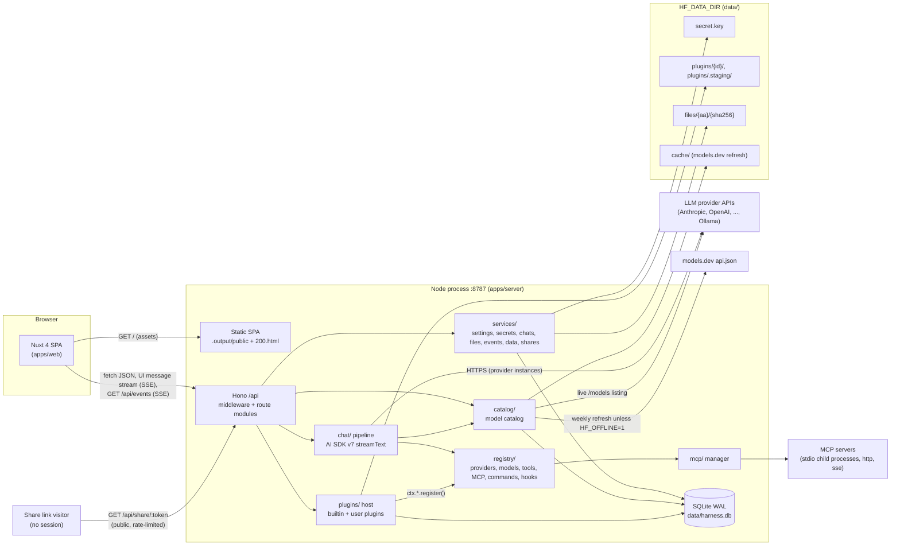

Key properties:

- **One process, one port** in production (`HF_PORT`, default 8787). The SPA and the API share an origin, so the
  session cookie is `SameSite=Strict` and no CORS is configured.
- **The server owns all state**: chat history, settings, secrets, plugin state. The browser keeps only UI
  preferences (theme via `@nuxtjs/color-mode` key `hf-color-mode`, sidebar state, wizard drafts).
- **Everything pluggable goes through the registry.** Builtin features (the 13 providers, `current_time`,
  `web_fetch`, MCP servers, commands) are builtin plugins that use the same public SDK as user plugins (ADR-009).
- **The chat run is decoupled from the HTTP request**: a run survives client disconnects, can be resumed
  (`GET /api/chat/:id/stream`) and is stopped only by `POST /api/chat/:id/stop`.
- **Conversations are trees** (ADR-023): edits and regenerations add versions; the server keeps the chosen path
  (section 6.8).
- **Small public surface**: without a session only health, login, icons, the SPA files and the read-only share
  routes answer (section 10.1); share links serve sanitized snapshots, never live data (section 6.10).

## 2. Packages

| Package | Path | Responsibility | Depends on |
|---|---|---|---|
| `@harness-forge/shared` | `packages/shared` | zod DTO schemas + inferred types (including the plugin data shapes the API embeds: `PluginManifest`, `ModelInfo`, `CredentialField`, `SettingsSchema`, ...), enums, `HarnessError` class and error envelope, `apiRoutes` route table, `createApiClient`, chat message metadata and `data-*` part types, id helpers. Isomorphic (browser + Node), no Node built-ins. | `zod`, `ai` (types only) |
| `@harness-forge/plugin-sdk` | `packages/plugin-sdk` | The public plugin contract: runtime types (`PluginContext`, `ProviderDefinition`, `ToolDefinition`, `CommandDefinition`, `HookMap`, `PluginModule`, ...), `definePlugin`, `PLUGIN_API_VERSION`, `settingsValuesSchema()`, plus re-exports of the plugin data shapes and enums from `shared`. Type-only for plugin authors; runtime libraries reach plugins through `ctx`. | `shared`, `zod`, `ai`, `@ai-sdk/provider` |
| `@harness-forge/server` | `apps/server` | Hono app, security, SQLite via Drizzle, services, plugin host, registry, catalog, chat pipeline, MCP manager, builtin plugins, SPA static serving. | `shared`, `plugin-sdk`, AI SDK + providers, Hono, Drizzle |
| `@harness-forge/web` | `apps/web` | Nuxt 4 SPA (`ssr: false`): chat UI, Plugins tab, Settings, login. Talks to the server only through `createApiClient`, `useChat` (`DefaultChatTransport`) and `EventSource`. | `shared`, `plugin-sdk` (`settingsValuesSchema` for plugin settings forms), `ai`, `@ai-sdk/vue`, shadcn-vue, Pinia |

Rules: internal packages export TypeScript source (no build step); cross-package imports only by package name;
`plugin-sdk` depends on `shared`, never the reverse (no cycle): `shared` owns every JSON shape that crosses the HTTP
boundary and `plugin-sdk` re-exports the plugin data shapes (API.md 3.2).

## 3. Server layer map (`apps/server/src`)

| Path | Responsibility |
|---|---|
| `main.ts` | Process entry: runs the boot sequence (section 5), installs signal handlers for graceful shutdown. |
| `env.ts` | Loads `<repo root>/.env`, parses and validates `HF_*` environment variables (zod) into a frozen `Env` object; resolves `HF_DATA_DIR` and `HF_WEB_DIR`; bind-safety check. |
| `deps.ts` | Composition root: `createDeps()` builds every service (eagerly, so a failing factory fails the boot), `startDeps()` / `stopDeps()` run the boot and shutdown steps (section 5). |
| `app.ts` | `createApp(deps)` app factory: mounts middleware and every route module under `/api`; used by `main.ts` and `createTestApp()`. |
| `paths.ts`, `logger.ts` | Package-relative locations (server package root, migrations, bundled assets, the SPA build, installed package versions); JSON-lines logger with redaction. |
| `http/middleware/` | Request id, structured access log (share tokens masked; it also runs the untrusted-proxy hint of `proxy-warning.ts`), secure headers + CSP, Origin check on non-GET, session auth, fresh auth (ADR-017), login rate limiter, body-size and content-type gate, the global error handler that renders `HarnessErrorEnvelope`; `request-info.ts` resolves the client address and scheme, trusting forwarded headers only from `HF_TRUST_PROXY` peers (section 10.6). |
| `http/routes/` | One Hono module per API area (`health`, `auth`, `settings`, `events`, `providers`, `credentials`, `models`, `icons`, `chats`, `chat`, `files`, `tools`, `mcp`, `commands`, `plugins`, `plugin-install`, `plugin-drafts`, `plugin-files`, `data`, `shares`); thin: validate (`http/validate.ts` maps zod issues to `validation_error`), call services, map DTOs. `shares.ts` also serves the public `/share/:token` routes. |
| `http/static.ts` | Production SPA serving from `HF_WEB_DIR` (default `apps/web/.output/public`) with `200.html` fallback for client routes. |
| `security/` | `keyring.ts` (master key + HKDF subkeys), `password.ts` (scrypt), `session.ts` (HMAC session tokens + cookie), `headers.ts` (CSP/secure headers), `ssrf.ts` (outbound URL guard), `redact.ts` (secret redactor for logs and errors; also masks share tokens), `proxy-trust.ts` (the `HF_TRUST_PROXY` matcher, section 10.6). |
| `db/` | Drizzle schema (`schema.ts`), libsql client, `migrate()` at boot, pragmas (WAL, foreign keys, busy timeout), transaction helper. |
| `services/settings/` | Typed global settings (defaults, validation, cache) over the `settings` table. |
| `services/secrets/` | Encrypted secret store (AES-256-GCM) over the `secrets` table: `get/set/delete/list(scope)`, masked hints, env fallback lookup. |
| `services/chats/` | Chat + message persistence, the message tree (`tree.ts`: active path, versions, latest leaf; section 6.8), version switching, search, cursor pagination, export (md / json v2) and import (v1 / v2), usage rows, title updates, `allIds` / `importChat` / `removeAll` for bulk data. |
| `services/data/` | Bulk data (ADR-024, section 6.9): summary, streamed zip export, import of a backup or a single chat, delete-all, the import / delete mutex. |
| `services/shares/` | Share links (ADR-025, section 6.10): HMAC tokens, the allowlist sanitizer, snapshots, owner CRUD, the public view and file access, expiry, rate limits. |
| `services/files/` | Content-addressed upload store (`data/files/<aa>/<sha256>`), MIME/size validation, `files` rows, read streams; for bulk data `importFile` (deduplicated by sha256, keeps the preferred id when it is free) and `purge` (every row and blob). |
| `services/events/` | In-process event bus + SSE fan-out for `/api/events` (section 6.7). |
| `registry/` | Typed registries for providers, models, tools, MCP server declarations, commands and hooks; every registration returns a `Disposable` and is tagged with its owner plugin id. |
| `plugins/host.ts` | Plugin host: discovery, load order, lifecycle state machine, enable/disable/reload, boot sentinel, safe mode. |
| `plugins/loader.ts` | Reads + validates `plugin.json`, checks id/dir/engines/trust, imports the entry module (cache-busted URL). |
| `plugins/context.ts` | Builds the per-plugin `PluginContext` (`ctx`): scoped logger, settings, secrets, storage, registries, hooks, `ai`, `fetch`, `signal`. |
| `plugins/guard.ts` | `guard(pluginId, fn, timeoutMs)`: timeouts, error capture into `plugin_error`, per-plugin log ring buffer, hook failure counters. |
| `plugins/declarative.ts` | Adapter that turns declarative `contributes.providers` into `ProviderDefinition`s (OpenAI-chat, OpenAI-responses, Anthropic, Google formats). |
| `plugins/compile.ts` | esbuild compile of `.ts` entries into one ESM file in `data/cache/plugins/<id>/` (SDK aliased to a shim), returns diagnostics. |
| `plugins/watch.ts` | `fs.watch` for linked folders or `HF_PLUGIN_WATCH=1`, 300 ms debounce, triggers reloads. |
| `plugins/state.ts` | Persistence of plugin rows (`plugins`, `plugin_settings`, `plugin_kv`), trust hashes, `loading_since`. |
| `plugins/install/` | Inspect + install from zip / npm / URL / folder into `plugins/.staging/<uuid>`, validation, review check (what was inspected is what gets installed), atomic swap, crash recovery of staging, export. `zip.ts` also provides `openZip()`, the lazy reader of data imports with the same guards (section 6.9). |
| `plugins/drafts/` | Declarative plugins created and edited in the browser (provider wizard): draft validation, SVG icon sanitizing, credentials saved as provider credentials, temporary-provider draft test. |
| `plugins/scaffold/` | Code plugins created from a template (`POST /plugins/scaffold`) and the traversal-safe files API: tree, read, atomic write, delete, build + reload, trust re-pinning of `created` plugins. |
| `plugins/templates/` | Template sources (tool, provider, MCP bridge, command pack): a JSDoc-typed `index.mjs` or a TypeScript `index.ts`, the vendored API types `harness-forge.d.ts` and a README. |
| `catalog/` | Model catalog: live listings with 24 h cache (`model_cache`), models.dev snapshot + weekly refresh, seeds, plugin models, custom ids, prefs, `classify()`, cost lookup. |
| `providers/` | Model resolution: `modelRef` -> provider -> credentials (stored or env) -> `LanguageModel`; provider test; provider status; error mapping to `HarnessError`; the LobeHub icon service (`/api/icons/lobe`). |
| `chat/` | Chat pipeline: runs registry (one active run per chat, stop, resume buffer), history assembly, approvals, slash commands, tool assembly, context trimming, titles, usage/cost, persistence. |
| `mcp/` | MCP manager: one client per enabled server (`@ai-sdk/mcp`), status, reconnect with backoff, tool naming `mcp__<serverId>__<tool>`, hint -> policy mapping, close on disable; `{{settings.*}}` templating of plugin-declared servers; its own stdio transport (minimal environment, stderr lines in the owning plugin's log); the user-configured servers of the MCP panel (`mcp_servers`). |
| `builtin-plugins/index.ts` | Static list of builtin plugin modules, loaded first and trusted. |
| `builtin-plugins/core-providers/` | The 13 builtin providers (see PROVIDERS.md): definitions, seeds, reasoning mapping, error mapping. |
| `builtin-plugins/core-tools/` | Builtin tools: `current_time` (policy `safe`) and `web_fetch` (policy `ask`, SSRF guard; setting "Allow localhost in web_fetch"). |
| `builtin-plugins/core-commands/` | Builtin server-side slash commands (prompt templates such as `/explain`, `/review`, `/commit`; list in PLUGINS.md). |
| `builtin-plugins/core-mcp/` | Owns the user-configured MCP servers (`mcp_servers` table): they are declared as its contributions, so disabling `core-mcp` closes them. Its settings (reconnect automatically, connect timeout) apply to every MCP server. |
| `builtin-plugins/mock/` | Dev-only `mock` provider (`HF_MOCK_PROVIDER=1`): `mock:echo`, `mock:reasoning`, `mock:tool-approval`, `mock:error` on `MockLanguageModelV4`, plus the tool `mock_approval_tool` (behavior in PROVIDERS.md section 8). |
| `testing/` | In-process test harness: `createTestApp()` (real composition over an in-memory database) and fakes. |
| `live/` | Opt-in live provider suite (`*.live.test.ts`, `pnpm test:live`, ADR-027): real provider calls with the keys in the environment; excluded from `pnpm test` (PROVIDERS.md section 12). |
| `assets/catalog/models-dev.json` (package root) | Bundled models.dev snapshot (updated by `pnpm catalog:update`); read at runtime, so it ships next to `dist/` (section 11). |
| `drizzle/` (package root) | Generated SQL migrations, applied by `migrate()` at boot; ship next to `dist/`. |

Dependency direction (no cycles): `http/routes` -> `services`, `chat`, `catalog`, `providers`, `plugins`, `mcp` ->
`registry`, `db`, `security`. Plugin code never imports server modules; it only sees `ctx`.

## 4. Web app map (`apps/web/app`)

| Path | Responsibility |
|---|---|
| `app.vue`, `spa-loading-template.html` | Root component; dark-styled inline loading template (no light flash). |
| `assets/css/main.css` | Tailwind 4 entry + oklch design tokens (dark default, light) + fonts. |
| `layouts/` | App shell layout (sidebar + inset, settings variant; also mounts the Share dialog), the login layout and the public `share` layout (no sidebar); names and structure in UI.md. |
| `middleware/` | Route middleware: auth guard (redirect to `/login` when `AuthStatus.authenticated` is false); `/share/*` is exempt and never loads the auth status. |
| `plugins/` | `$api` plugin (`createApiClient` with a `fetch` wrapper: `unauthorized` -> `/login`), `events.client.ts` (`EventSource('/api/events')` -> store updates), `shortcuts.client.ts` (the single `keydown` listener of the shortcuts registry). |
| `pages/index.vue` | Empty state: greeting + composer; first send navigates to `/chat/:id`. |
| `pages/chat/[id].vue` | Chat transcript + composer for one chat. |
| `pages/plugins.vue`, `pages/plugins/{index,new,[id]}.vue` | Parent route (hosts the single `InstallDialog`); plugin list (`?filter=`), new plugin (provider wizard / code template), plugin detail tabs. |
| `pages/settings/{providers,models,general,appearance,data,about}.vue` | Settings pages (`/settings` redirects to providers); `data` = backup, import, shared links, delete-all. |
| `pages/share/[token].vue` | Public read-only share page (`share` layout): a store-free transcript of a share snapshot. |
| `pages/login.vue` | Password login. |
| `components/ui/` | shadcn-vue primitives (generated, frozen, no prefix). |
| `components/ai-elements/` | AI Elements Vue subset (copied, frozen, used with `Ai` prefix). |
| `components/app-shell/` | `AppSidebar`, `ChatNav`, `PluginsNav`, `SettingsNav`, `ThemeToggle`, `CommandPalette`, `ShortcutsDialog`. |
| `components/chat/`, `components/chat/parts/`, `components/chat/composer/` | Transcript, message and part renderers (with the `BranchSwitcher` of message versions), composer (ModelPicker, EffortMenu, PermissionMenu, SlashMenu). |
| `components/plugins/*` | `list`, `detail`, `forms`, `install`, `wizard`, `code`, `mcp` component groups. |
| `components/share/` | `ShareDialog`, `SharesSettingsSection`, `SharedChatView`, `ShareToolRow`. |
| `components/settings/`, `components/settings/data/`, `components/providers/`, `components/common/` | Settings forms (incl. the Data page), `ProviderIcon`, shared pieces (`Markdown.vue`, empty states). |
| `composables/` | `useChatSession` (detached `useChat` registry), `useComposer*`, `useShortcuts`, `useGlobalShortcuts`, helpers. |
| `stores/` | Pinia stores `auth`, `chats`, `providers`, `models`, `plugins`, `settings`, `ui` (each `use<Name>Store`), implemented over the typed client and refreshed by `/api/events`. |
| `utils/` | Pure helpers (date grouping, formatting, `data-testid` constants). |

## 5. Boot sequence

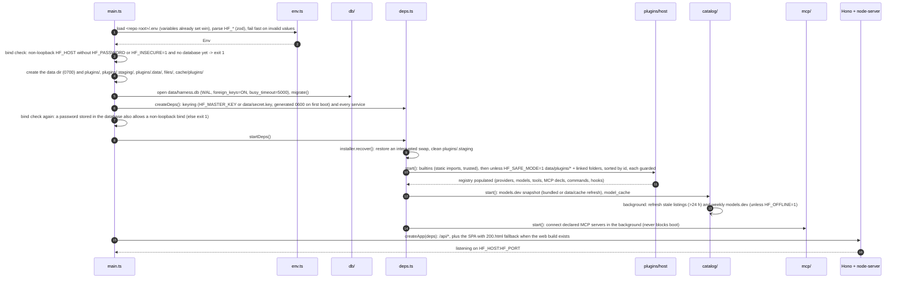

Notes:

- Boot fails (exit code 1, clear log line) on: invalid env, non-loopback bind without a password (env or stored) or
  `HF_INSECURE=1`, unreadable/invalid master key (or a group/world readable `secret.key`), failed migration, a
  failing service factory. A broken **plugin** never fails boot: it ends in `error` or `incompatible` state and is
  reported in the Plugins tab. `unhandledRejection` and `uncaughtException` (typically from plugin code) are logged,
  never fatal.
- Boot sentinel: before loading a user plugin the host writes `plugins.loading_since = now`; after the load
  finishes it clears it. A row that still has `loading_since` at the next boot (the process crashed while loading
  it) is skipped and put into `error` with a "crashed during load" message until the user re-enables it.
- Staging recovery: a `plugins/.staging/<id>.prev-<uuid>` copy whose `plugins/<id>` directory is missing (crash in the
  middle of an atomic swap) is moved back; every other staging entry is deleted.
- MCP clients connect lazily in the background after their owning plugin is `active`; a failing MCP server never
  blocks boot.
- `HF_TRUST_PROXY` is parsed with the other variables: a boolean-like word, a hop count, a `/0` range, an unknown token
  or a list that names no proxy fails the boot like any invalid variable (`EnvError` on stderr with the format
  explained, exit code 1); when it is set, the boot log lists the trusted ranges (section 10.6).
- The first boot of v1.1 on a v1 data directory applies migration `0001`, which backfills a linear message tree for
  every existing chat (section 8, Migrations).
- Graceful shutdown (`SIGINT`/`SIGTERM`, `stopDeps()`): stop accepting connections, abort active runs (persisted as
  `aborted`), dispose plugins (5 s guard each), close MCP clients (terminates stdio children), stop catalog timers,
  close SSE streams, then close the DB. Every step runs even when an earlier one fails; a shutdown longer than 10 s
  exits with code 1, and a second signal exits immediately.

## 6. Flows

### 6.1 Chat send -> stream -> persist

The client keeps one `useChat` instance per open chat (`useChatSession(id)`), configured with
`transport: new DefaultChatTransport({ api: '/api/chat', prepareSendMessagesRequest })`,
`generateId: createMessageId` (from `shared`) and
`sendAutomaticallyWhen: lastAssistantMessageIsCompleteWithApprovalResponses`. `@ai-sdk/vue` 4 has no `resume` option
(React only), so `useChatSession` calls `resumeStream()` itself on mount when the chat has an active run
(`ChatSummary.running`, or a `run.started` event).
`prepareSendMessagesRequest` sends only the last message plus the composer state (`ChatRequestBody`, see API.md);
the server owns history. A new user message also carries `parentId` (the message before it on the path the user
sees, `null` for a first message); a regenerate carries `messageId` (section 6.8, ADR-023).

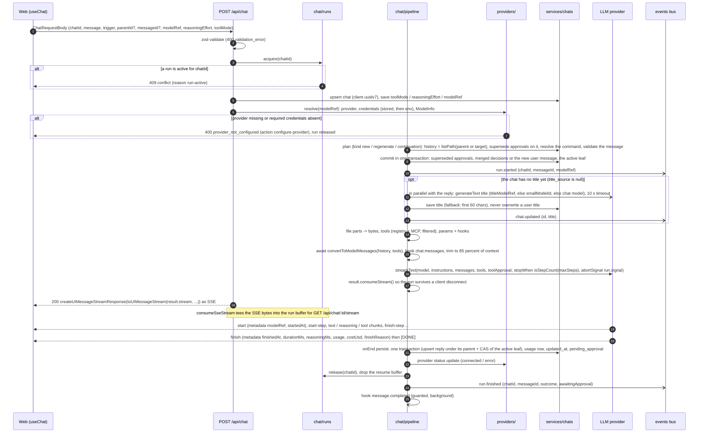

Notes:

- The assistant message id is generated by the server (`generateMessageId` = `createMessageId`, `msg_` + 16 chars).
  User message ids are generated by the client with the same `createMessageId` helper and validated by the server
  (format + uniqueness), so edits and regenerations can address them.
- History operations (the plan and commit steps of `chat/prepare.ts`; the message tree is described in 6.8). Every
  request is one of three kinds (`RequestKind`), and nothing is ever deleted:
  - **new** (`submit-message` with a new user message): the parent is `parentId`, or the chat's active leaf when the
    field is omitted (`null` = a new first message). An unknown parent -> `404 not_found`, an id already used ->
    `409 conflict` (`details.reason: 'exists'`). The history is the path from the root to that parent plus the new
    message. Pending approvals on that path (`approval-requested`, or `approval-responded` but never processed) are
    resolved as denied with reason `superseded`; approvals on other versions stay pending. The commit appends the user
    message and makes it the active leaf. An **edit** is a new request whose parent is the edited message's parent, so
    the edited message gets a sibling version.
  - **regenerate** (`regenerate-message`): the target is `messageId` or the active leaf. A user target is answered
    itself; an assistant target answers the previous message on its path, which must be a user message (else `400`,
    issue path `messageId`). Pending approvals on the path up to the answered message are superseded the same way; a
    `reply` command of the answered message runs again (a `prompt` command keeps its stored expansion). The active leaf
    becomes the answered message and the new reply becomes a sibling of the old one.
  - **continuation** (`submit-message` whose `message` is the active leaf, an assistant message with approval
    responses, see 6.2): only the approval decisions (`approval.id` -> `approved`, `reason`) are merged into the stored
    message; every other client-side change is ignored. Any other assistant message -> `404`; a continuation that
    answers no pending tool call -> `400`.
  - `messageId` on a user submit, or `parentId` on a regenerate or a continuation -> `400 validation_error` (the
    in-place edit of v1 was removed, ADR-023).
  - The commit writes the superseded approvals, the merged decisions or the new user message, and the active leaf in
    one transaction (a regenerate with nothing to supersede only moves the leaf). It sets the leaf unconditionally:
    version switches are refused while the run exists (6.3). Every failure before the commit is a normal JSON error
    response that leaves the history untouched (only the chat row may have been created).
- Persisting the reply (`onEnd`): one transaction upserts the assistant message under its reply parent (the new user
  message, the answered message, or the continued message's parent) and moves the active leaf to it with a
  compare-and-set that succeeds only while the leaf is still the reply parent or the reply itself, so nothing
  overwrites a leaf moved by someone else (the reply is then stored as a hidden version, a warning is logged and
  `pending_approval` is left alone). On a file database the transaction waits up to 5 s for a busy connection (section
  8). The usage row, `touch` and the provider outcome follow; `run.finished` is emitted only after all of that, so a
  client that refetches on it finds the reply on the active path. A run released by force (6.3) stores nothing and
  leaves the active leaf where the commit put it (the user message, or the continued message). Title generation,
  context trimming and notices work on the path.
- Slash commands (`/name args` at the start of a user text part, name registered in the commands registry): the
  user message keeps the original text and gets `metadata.command`; `prompt` commands replace the text sent to the
  model with the expansion; `reply` commands write the assistant reply with `createUIMessageStream` without a model
  call. Client-only commands (`/new`, `/model`, `/effort`, `/mode`, `/help`) never reach the server.
- Tool assembly: registry tools + connected MCP tools, filtered by `toolMode` (`off` = no tools), tool prefs
  (`enabled: false` removes the tool; an `override` only changes approval, see 6.2), and model capability
  `capabilities.tools` (no tools for models without it, with a `tools-unsupported` notice). Every tool is wrapped:
  owner-plugin-active check, `tool.before` / `tool.after` hooks, `guard()` timeout (default 60 s), output capped at
  64 KB (truncated with a marker).
- When a request sends no tools (tool mode `off`, a model without tool support, or no usable tool), earlier tool
  calls and results in the history are sent to the model as compact text (`[tool name(input) → ok: output]`,
  input ≤ 500 chars, output ≤ 2000) so providers that reject tool parts without tool definitions still work; the
  stored transcript is unchanged. The `tools-unsupported` notice appears at most once per chat and model.
- Errors after the stream started are sent as an `error` chunk whose `errorText` is the JSON envelope
  `{"error":{...HarnessErrorInit}}` and are persisted in `metadata.error` (see API.md, "Chat stream protocol").

### 6.2 Tool approval round-trip

Approval is decided per tool call by the approval function passed to `streamText({ toolApproval })`. Approvals are
bound to the exact tool call by `experimental_toolApprovalSecret` (the HKDF `approval` subkey), so a modified
client cannot forge an approval for a different input.

Resolution order (first match wins), returning an AI SDK approval status:

| Step | Rule | Result |
|---|---|---|
| 1 | `tool_prefs.override` = `deny` / `allow` / `ask` | `denied` / `approved` / `user-approval` |
| 2 | `tool.approve` hook sets `decision` | `deny` -> `denied`, `allow` -> `approved`, `ask` -> `user-approval` |
| 3 | tool policy (static or function) returns `deny` | `denied` |
| 4 | chat `toolMode` = `ask`: policy `safe` | `not-applicable` (runs without a card) |
| 5 | chat `toolMode` = `ask`: policy `ask` or `always` | `user-approval` |
| 6 | chat `toolMode` = `auto`: policy `always` | `user-approval` |
| 7 | chat `toolMode` = `auto`: policy `safe` or `ask` | `not-applicable` |

MCP tools derive their policy from annotations: `readOnlyHint` -> `safe`, `destructiveHint` -> `always`, otherwise
the server's configured `policy` (default `ask`).

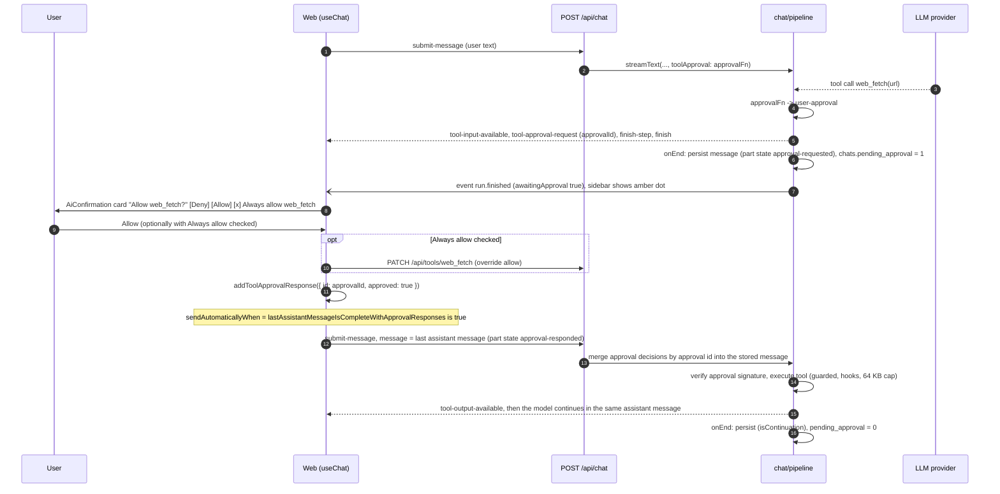

Deny path: `addToolApprovalResponse({ id, approved: false, reason })` -> continuation -> the SDK emits
`tool-output-denied`; the model is told the call was not approved. A new user message sent while approvals are
pending resolves the ones on its path as denied (`superseded`). Approvals pending on another version stay pending:
switching back to that version sets `chats.pending_approval` again, and the card works because the continuation
targets the active leaf (6.8). Only `user-approval` results show a card; `approved` and
`not-applicable` calls run directly, and automatic denials render as `output-denied` with
`approval.isAutomatic = true`.

### 6.3 Stop and resume

A run lives in the runs registry (`chat/`), keyed by chat id: `{ runId, chatId, messageId, abortController,
buffer, startedAt }`. At most one run per chat. The run's `AbortSignal` (not the request signal) is passed to
`streamText`, so closing the tab or reloading only drops the HTTP connection. The SSE bytes of the response are
teed into the run buffer by `consumeSseStream`; `GET /api/chat/:id/stream` replays the buffer from the start and
then follows live chunks.

Resume consistency rules (replayed chunks are applied on top of the client's last message, so they must never
overlap with persisted content):

- The in-flight assistant message is persisted only when the run ends (`onEnd`, including abort). While a run is
  active, `GET /api/chats/:id` returns the active path as the commit left it: it ends at the new user message, at the
  answered message of a regenerate, or at the continued message (whose merged approval decisions were persisted
  before streaming); the reply in flight is absent. Replaying the run from its first chunk on top of that path
  rebuilds the message exactly once.
- Version switches (`POST /api/chats/:id/branch`) are refused with `409 conflict` (`details.reason: 'run-active'`)
  while the runs registry holds the chat in any phase (`ChatRunner.hasRun`, including `preparing`), so a switch never
  races a commit or a persist.
- The resume endpoint returns `204` as soon as the run persists its reply (phase `finishing`), and the buffer is
  dropped when the run is released, so a replay never overlaps the persisted message. The web refetches a chat on
  `run.finished` unless its own `useChat` instance is streaming it, which covers a run that ends between loading the
  chat and resuming.

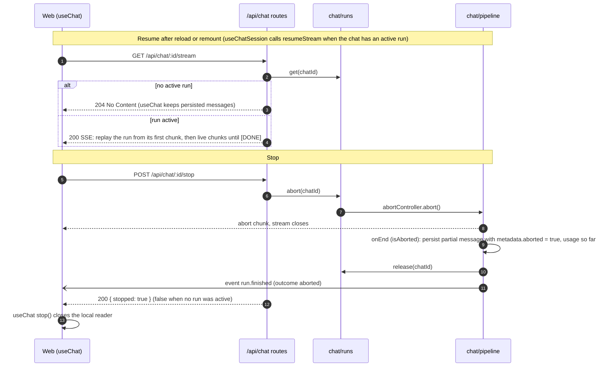

Rules: the web calls `POST /api/chat/:id/stop` first and then `stop()` of `useChat` (a client-side abort alone is
only a disconnect). Stopping a chat without a run is a no-op (`{ stopped: false }`). `DELETE /api/chats/:id` stops
the run first. Server shutdown aborts every run through the same path. `stop` waits up to 15 s (5 s at shutdown) for
the run to persist; a run that does not settle is released by force: its late end callback stores nothing and, when
it was streaming, `run.finished` reports `aborted`. A run stopped while still `preparing` ends its request with
`409 conflict` (`details.reason: 'stale'`) before its history is committed (delete-all relies on this, 6.9).

### 6.4 Plugin lifecycle

States (`PluginState`): `disabled | untrusted | incompatible | loading | active | error`. The state is computed by
the host and reported in `PluginSummary.state`; `plugins.enabled` stores the user intent.

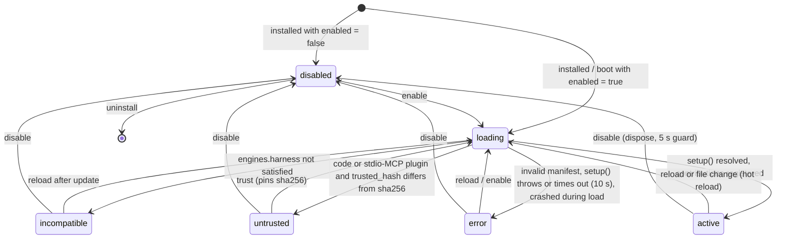

Runtime failures of an `active` plugin (a tool throws or times out, a hook fails) do not change its state: they are
returned as `plugin_error`, written to the plugin log ring buffer, and a hook handler that fails 5 times in a row is
disabled until the next reload.

Validation order in `loading` (PLUGINS.md 11): `plugin.json` readable (<= 256 KB, JSON) -> lenient pre-parse:
`engines.harness` satisfies `PLUGIN_API_VERSION` (else `incompatible`) -> strict manifest zod -> directory name
equals `id` and id not reserved -> realpath of `main` (and of a file `icon`) inside the plugin dir -> code plugins
and stdio MCP declarations require `trusted_hash == sha256(plugin.json + main)` (else `untrusted`) -> build or import
scan, import (cache-busted URL) or declarative adapter -> guarded `setup(ctx)` -> `active`.

Disable / reload / uninstall: guarded `dispose()` (5 s) -> the plugin's `DisposableStore` unregisters every
contribution (providers, models, tools, MCP servers, commands, hooks) -> MCP clients closed -> `ctx.signal`
aborted -> `plugin.changed` + `catalog.changed` events. In-flight calls to a disposed tool resolve as
"tool unavailable". Builtins cannot be uninstalled; `core-providers` can disable individual providers
(`PATCH /api/providers/:id`). Details: [PLUGINS.md](./PLUGINS.md).

### 6.5 Plugin install (staging + atomic swap)


Guards (all sources): zip <= 20 MB compressed, <= 100 MB expanded, <= 2000 entries; reject absolute paths, `..`,
drive letters, backslashes, symlinks; realpath of every extracted file inside the staging dir. npm: registry
metadata -> tarball -> verify `dist.integrity` (sha512) -> same guards, lifecycle scripts never run. URL: an
`integrity` value (`sha256-...` or `sha512-...`, SRI format) is required. Folder: `link` (used in place, watched,
trust pinned to the realpath) or `copy` (copied into staging, then the normal path). When a password is set,
installing a plugin that requires trust (code or stdio MCP, ADR-017) and trust changes require a login within the
last 10 minutes (fresh auth, section 10.1).

### 6.6 Provider credentials: test -> save -> validate -> model refresh

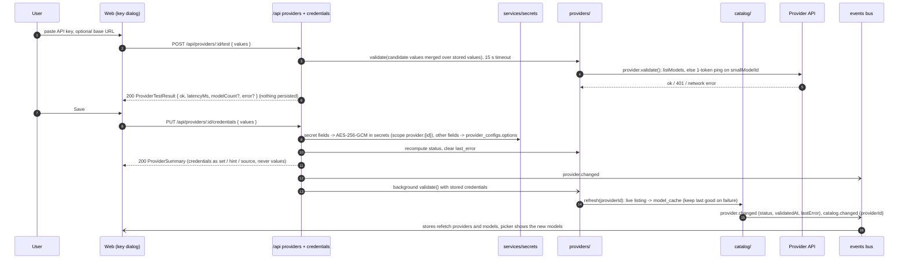

Credential resolution for a request: stored value (`secrets` / `provider_configs.options`) -> environment variable
named by `CredentialField.envVar` (for example `ANTHROPIC_API_KEY`) -> `CredentialField.default`. A provider whose
required fields resolve only from env reports status `env`. `DELETE /api/providers/:id/credentials` removes stored
values only; env fallbacks keep working.

### 6.7 `/api/events` SSE fan-out

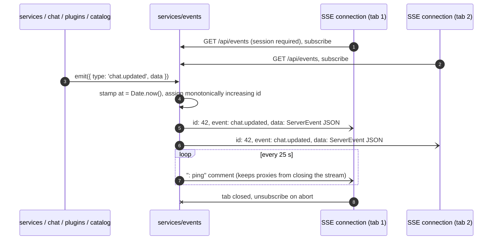

- The bus is in-process (`EventEmitter`-like, typed by `ServerEvent`). Producers never block on slow consumers:
  each connection has a bounded queue (256 events); on overflow the connection is closed and the browser
  `EventSource` reconnects, then the web refetches its stores (it cannot know what it missed).
- Events are notifications, not the source of truth: every handler in the web refetches or patches the relevant
  store from the payload. No replay of missed events (`Last-Event-ID` is ignored).
- Event names and payloads: API.md, "Server events".

### 6.8 Message tree and version switching (ADR-023)

The messages of a chat form a tree. `messages.parent_id` points at the previous message of the path (`null` for a
first message) and siblings share a parent: they are the **versions** of a message. `seq` stays unique per chat and is
the creation order, so a parent always has a lower `seq` than its children and the most recent leaf under a message is
the message with the highest `seq` in its subtree. `chats.active_leaf_id` is the last message of the path the user
sees (`null` for an empty chat).

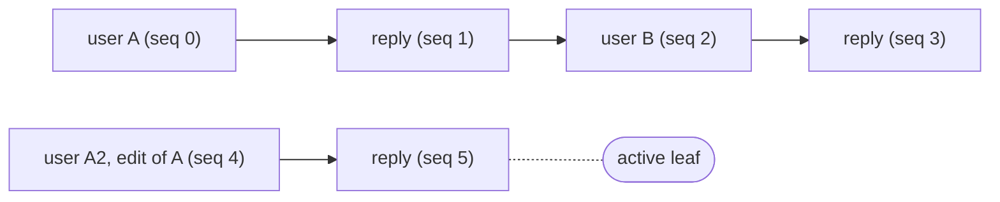

Here A and A2 are siblings (both first messages). The active path is A2 -> reply, so `GET /api/chats/:id` returns
those two messages with `branches = { <A2>: { siblings: [<A>, <A2>], index: 1 } }`. Switching to A makes the latest
leaf under A (the reply at seq 3) active again, which brings back A -> reply -> B -> reply.

- **Reading**: `listPath(chatId, leafId)` walks up `parent_id` with a recursive query (guard `m.seq < path.seq`, so bad
  data cannot loop). `branches` comes from the pure helpers of `services/chats/tree.ts` (`pathTo`, `branchesOf`,
  `latestLeafUnder`, `resolveLeaf`) over a light `(id, parent_id, seq, role)` query: every path message with at least
  two versions maps to its siblings (`seq` order) and the index of the shown one. A stored leaf that is not a message
  of the chat falls back to its most recent message. `ChatDetail` has no `activeLeafId`: it always equals the id of the
  last message of `messages`, also during a run.
- **Writing**: `appendMessage(chatId, message, parentId)` (404 for a parent outside the chat, 409 for a used id),
  `upsertMessage(chatId, message, parentId)` (the parent is used on insert only) and `setActiveLeaf(chatId, leafId,
  onlyFrom?)` (compare-and-set). Only the commit and persist transactions of the pipeline (6.1) and the switch route
  move the active leaf.
- **Switching** (`POST /api/chats/:id/branch { messageId }`, any message of the chat): 404 for an unknown chat or
  message; `409 conflict` (`details.reason: 'run-active'`) while a run holds the chat (6.3), and also when the active
  leaf changed between reading and writing it (the switch is a compare-and-set against the leaf it read); otherwise the
  active leaf becomes the latest leaf under `messageId`, `pending_approval` is recomputed from the new path,
  `chat.updated` is emitted, `updated_at` stays (a switch is not activity), and the response is the new `ChatDetail`.
- **Clients**: the web sends `parentId` explicitly (the message before the new one on the path it shows), so a stale
  tab or a failed request cannot attach a message to a path the user did not see; an unknown parent answers 404 and
  the web reloads the chat, puts the unsent text back into the composer and says so in a toast (UI.md 11.1, 15). A
  user message whose request failed with an HTTP error was never stored, so the web never names it as a parent.
- **Search** covers every version, so a snippet may come from a hidden version. **Totals** (`ChatDetail.totals`) sum
  every usage row: the cost actually paid. The composer's chat cost sums the visible path only (UI.md 7.12).
- **Export and import**: JSON export v2 carries every version in `seq` order, `parentIds` aligned by index and
  `activeLeafId`; Markdown exports the active path. `POST /api/chats` and the data import (6.9) accept v1 (linear) and
  v2: each parent must be an earlier message and the ids unique (else 400 with the field path, e.g. `parentIds.1`), and
  the active leaf is the latest leaf under `activeLeafId` (or under the last message). Message ids are kept when they
  are valid and unused, else replaced; an import as a copy gets new ids throughout. Imported messages are
  deep-validated, streaming parts are finalized and pending approvals are resolved as denied (reason `imported`).
- Versions are never deleted on their own (backlog); deleting a chat deletes all of them.

### 6.9 Backup, import and delete-all (ADR-024)

Settings -> Data uses the four routes of `http/routes/data.ts` (API.md): `GET /api/data` (summary),
`GET /api/data/export?files&settings` (the backup), `POST /api/data/import` (multipart) and `POST /api/data/delete`
(fresh auth). `services/data/` implements them on top of `ChatsService` (`allIds`, `importChat`, `removeAll`),
`FilesService` (`importFile`, `purge`) and the settings service. There are no new event types: imports emit
`chat.created` and deletions `chat.deleted`, one per chat.

Zip layout, in write order (every entry mode 0644, mtime = `exportedAt`; JSON entries deflated):

```
settings.json          the public Settings (only when includes.settings)
chats/<chatId>.json    exactly GET /api/chats/:id/export?format=json (chat export v2), one per chat in id order,
                       archived chats included
files/<sha256>         each referenced blob once: stored for images and PDF, deflated for text/* (only when
                       includes.files)
files/index.json       BackupFileIndex { items: [{ id, sha256, name, mime, size, createdAt }] }: one item per file row
                       whose blob was written and still matched its sha256 (only when includes.files)
manifest.json          BackupManifest { format: 'harness-forge.backup', version: 1, exportedAt, appVersion,
                       chatExportVersion: 2, includes: { files, settings }, counts: { chats, messages, files,
                       fileBytes } } (written last)
```

A backup never contains secrets, credentials, the password, plugins, MCP servers, model or tool preferences, share
links or usage rows (the per-message `metadata.usage` survives, so `ChatDetail.totals` restarts at 0 after an import).

- **Export** is streamed: an fflate `Zip` with `ZipPassThrough` / `ZipDeflate` entries inside a pull-based
  `ReadableStream` (high-water mark 0, so nothing is read before the first pull); each pull pushes 64 KB pieces of a
  chat or chunks of a file until the zip emits bytes, so memory stays flat. `manifest.json` is written last so its
  counts are exact. fflate cannot write zip64, so a pre-check (database queries only, before anything is streamed)
  refuses a backup with more than 50,000 entries (`LIMITS.backupEntriesMax`, the import's cap; the referenced file rows
  count too) or an estimated size above 3.5 GiB with `413 payload_too_large`; the message suggests `files=false` only
  when the backup without attachments would fit. A zip that still outgrows the format while it is written (65,535
  entries or 4 GiB, because chats grew meanwhile) fails the stream instead of producing a broken archive. A chat
  deleted during the export is left out; a blob that is missing on disk or no longer matches its sha256 is left out of
  the index (the import reports it missing). A HEAD request gets the headers only: the stream is cancelled before
  anything is read.
- **Import**:
  1. the body limit is 256 MiB + 64 KiB (the upload itself at most 256 MiB, `LIMITS.backupImportBytes`); the route
     parses the multipart body itself (the part `file` plus the `DataImportForm` fields; unknown fields are refused),
     so the upload is not buffered twice; the first bytes decide: `PK` = a backup, `{` (after an optional BOM and
     whitespace) = a single chat JSON (v1 or v2, at most 64 MiB); anything else -> `400`;
  2. a zip is read lazily by `openZip()` in `plugins/install/zip.ts`, which reuses the plugin installer's guards:
     path traversal, symlinks, duplicate names, entry count (50,000), declared vs actual size, exact inflation, CRC,
     encryption, compression methods and overlapping entries; the declared sizes may add up to at most 8 GiB; a single
     top-level folder is accepted; unknown entries become warnings;
  3. the whole upload is refused (nothing is imported) for a structural guard failure, a missing, invalid or newer
     `manifest.json` or an invalid `files/index.json` (`400 validation_error`, `413` for the size caps), and, for a
     single chat JSON, for an invalid chat;
  4. then chats are imported one at a time in entry name order, each atomically through `chats.importChat`. A chat
     entry that is damaged (CRC or inflation mismatch), larger than 64 MiB (checked before inflating), not valid JSON
     or not a valid export (its tree included) fails only that chat. With `skip` a chat whose id exists is left alone
     (so running an import twice is idempotent), with `copy` it is imported with new ids and " (imported)" appended to
     its title; pinned, archived, dates and titles are restored;
  5. the files a chat references are imported first: each blob is re-hashed against the index and its type checked
     again (at most 20 MiB each); `files.importFile` dedupes by sha256 and keeps the original id when it is free;
     `/api/files/<id>` URLs in `file` and `reasoning-file` parts are rewritten to the resulting ids. A blob that is
     absent or unusable (hash mismatch, too large, a type that is not allowed) is replaced by a file already stored
     here under the same id (with the same sha256 when the index names it) when there is one; otherwise it counts in
     `filesMissing` with a warning, and its part keeps its URL;
  6. with `restoreSettings` (backup zips only), only known settings keys are applied, each validated on its own;
     unknown or invalid keys become warnings;
  7. the answer (`DataImportResult`) lists every chat with its status (`imported`, `copied`, `skipped` or `failed` with
     a message), the counts and at most 100 warnings; one failing chat never stops the others.
- **Delete-all** (`{ confirm: 'DELETE', files?, usage? }`): take the mutex -> `chats.allIds()` -> `runs.stop` for
  every id (this also covers runs that are still `preparing`) -> `chats.removeAll({ usage })` in one batch (share links
  cascade; usage rows are deleted or kept detached) -> optionally `files.purge()` (rows and blobs) -> stop any run whose
  chat appeared meanwhile. Settings, keys and plugins stay.
- **Mutex**: one import or delete-all at a time per process; another one gets `409 conflict` with
  `details.reason: 'busy'`. Exports do not take it.
- The zip is a portable backup of conversations. Moving a whole server (keys, plugins, settings) still means copying
  the data directory (section 7).

### 6.10 Share links (ADR-025)

A share is a `chat_shares` row holding a sanitized **snapshot** of a chat's active path, taken when the link is created
and again only when the owner asks ("Update snapshot", `PATCH /api/shares/:id { refresh: true }`). The public routes
never read live messages.

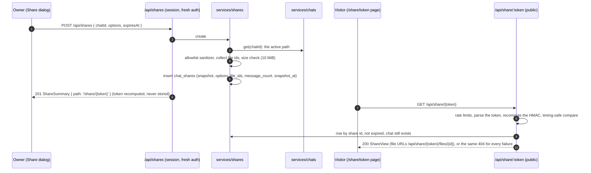

- **Token** = the 16-char suffix of the share id (`shr_` + 16 chars) + the first 22 base64url chars of
  `HMAC-SHA256(keyring subkey 'share', 'harness-forge/share/v1:' + shareId)`, i.e. `^[0-9A-Za-z]{16}[\w-]{22}$`.
  Nothing token-like is stored: the owner's list recomputes it (the link can be copied again), revoking deletes the
  row, and a new master key invalidates every link. Verification recomputes the token from its id suffix and compares
  the whole string in constant time.
- **Sanitizer (allowlist)**, applied when the snapshot is taken (`services/shares/snapshot.ts`): only the fields of the
  share DTOs are copied, so anything unknown (a new AI SDK part type, a new metadata field) is dropped rather than
  published. Kept are `user` and `assistant` messages with their text parts, `file` parts (app files `/api/files/<id>`,
  whose ids join `file_ids`, or data URLs of raster images: PNG, JPEG, GIF, WebP, AVIF, never SVG), http(s)
  `source-url` and `source-document` parts, reasoning text, tool parts (name, status `done` / `error` / `denied` /
  `stopped`, the input, the output and the error text), the model ref of a reply, the command name of a user message
  and a `stopped` / `failed` status. A tool input or output longer than 16,384 characters
  (`LIMITS.shareToolValueChars`; a value that is not a string is measured as its JSON text) becomes a string: the
  first characters of that text plus `\n[truncated]`, 16,384 characters in total; an error text is cut at 4096
  characters. Dropped: system messages, chat and global instructions, `metadata.error` (only the `failed` status
  remains), usage and cost, `command.expansion`, provider metadata, approvals, `data-*`, `step-start`,
  `reasoning-file` and `custom` parts, other URLs and anything unknown. A snapshot above 10 MiB (serialized) ->
  `413 payload_too_large`. `file_ids` stores the only files the share may serve.
- **Options** (`{ reasoning: false, toolDetails: false, attachments: true }` by default) are applied when the view is
  served: without `reasoning` the reasoning parts are left out, without `toolDetails` tool parts keep only their name
  and status, without `attachments` the file parts are left out and `shares.file` serves nothing. A changed option
  therefore applies to the share page at once, without a new snapshot (API.md, `shares.ts`); `refresh: true` takes a
  new snapshot of the current active path.
- **Freshness**: `ShareSummary.outdated` = the chat changed after the snapshot: `chats.updated_at > snapshot_at`, or
  the active path now holds another number of `user` and `assistant` messages than `message_count` (a version switch
  keeps `updated_at`, the count catches it). `snapshot_at` is taken before the chat is read, so a change that races the
  snapshot marks the share outdated instead of leaving it silently stale. `expired` = `expires_at <= now` (the link
  answers 404 until a `PATCH` moves or removes `expiresAt`). At most 20 links per chat (`400 validation_error` on
  `chatId`, checked under a lock); `expiresAt` must be in the future and at most 365 days ahead.
- **Owner routes** (`shares.list`, `shares.create`, `shares.update`, `shares.remove`) need a session; create and update
  also need fresh auth, because publishing a link turns brief session access into lasting remote access (ADR-017).
  There are no share events; the owner UI refetches.
- **Public routes** (`shares.view`, `shares.file`) are listed in 10.1 and protected as described in 10.7.
- Deleting a chat, or delete-all, removes its shares (`ON DELETE CASCADE`).

## 7. Data directory

```
data/                      HF_DATA_DIR (default ./data, resolved against the repo root in dev; /data in Docker)
  harness.db               SQLite database (WAL mode: also harness.db-wal, harness.db-shm)
  secret.key               master key when HF_MASTER_KEY is unset (32 random bytes, base64, mode 0600)
  plugins/<id>/            installed plugins (plugin.json, entry, assets); linked folders are recorded in the DB
  plugins/.staging/        in-progress installs and .prev copies (cleaned at boot)
  plugins/.data/<id>/      plugin private data (ctx.plugin.dataDir, 0700); kept on update, purged on uninstall
                           unless keepData
  files/<aa>/<sha256>      uploaded attachments, content-addressed (<aa> = first 2 hex chars of the sha256)
  cache/                   models.dev snapshot refreshes (models-dev.json + fetched-at), misc caches
  cache/plugins/<id>/      compiled output of .ts code plugins (<sha256>.mjs), rebuilt on demand
```

The directory is created with mode 0700 when missing. Backups: copy the whole directory while the server is
stopped (or use `sqlite3 .backup` for the DB); that is the full backup. Settings -> Data additionally exports a
portable zip of every chat and attachment (section 6.9), without keys, plugins or MCP servers. Losing `secret.key` (or
changing `HF_MASTER_KEY`) makes every stored secret unreadable and invalidates every share link (their tokens are
HMACs of the master key's `share` subkey); the server then reports affected providers as `not_configured` and logs a
warning, it does not crash.

## 8. Data model

SQLite via Drizzle ORM 0.45 + `@libsql/client` (`apps/server/src/db/schema.ts`). Pragmas at connect:
`journal_mode=WAL`, `foreign_keys=ON`, `synchronous=NORMAL`; the busy timeout of 5000 ms is the libsql client
`timeout` option, so it applies to every pooled connection (the chat pipeline's commit and persist transactions wait
for a busy database instead of failing). In-memory test databases use a single connection: while a transaction is
open, a concurrent query fails fast (a background title write may then log a warning). Migrations are generated by
drizzle-kit (coordinator) into `apps/server/drizzle/` and applied with `migrate()` at boot.

Column conventions:

| Kind | SQLite type | Drizzle | Notes |
|---|---|---|---|
| id / text | `TEXT` | `text()` | |
| timestamp | `INTEGER` | `integer({ mode: 'number' })` | Unix epoch **milliseconds** (`Date.now()`) |
| boolean | `INTEGER` | `integer({ mode: 'boolean' })` | 0 / 1 |
| json | `TEXT` | `text({ mode: 'json' }).$type<T>()` | JSON text; `T` from `shared` / `plugin-sdk` |
| money | `REAL` | `real()` | USD |
| bytes | `BLOB` | `blob({ mode: 'buffer' })` | |

### Tables

**`settings`** — global settings (keys listed in API.md `Settings`) and internal keys (prefix `_`, never returned
by the API, e.g. `_auth.sessionEpoch`).

| Column | Type | Constraints |
|---|---|---|
| `key` | text | PK |
| `value` | json | NOT NULL |
| `updated_at` | timestamp | NOT NULL |

**`secrets`** — every secret, encrypted (section 10).

| Column | Type | Constraints |
|---|---|---|
| `scope` | text | NOT NULL; `provider:<id>` \| `plugin:<id>` \| `mcp:<id>` \| `auth` |
| `name` | text | NOT NULL; e.g. `apiKey`, `settings.<key>`, `header.<Name>`, `env.<NAME>`, `password` |
| `ciphertext` | bytes | NOT NULL; `iv (12 B) \|\| AES-256-GCM ciphertext \|\| tag (16 B)` |
| `hint` | text | NULL; masked hint computed at write time (`sk-…9fQ2`), never the value |
| `key_version` | integer | NOT NULL DEFAULT 1 |
| `updated_at` | timestamp | NOT NULL |
| | | PK (`scope`, `name`); index on `scope` via the PK prefix |

**`provider_configs`** — per-provider user configuration; a missing row means defaults (enabled, no options).

| Column | Type | Constraints |
|---|---|---|
| `provider_id` | text | PK |
| `enabled` | boolean | NOT NULL DEFAULT 1 |
| `options` | json `Record<string,string>` | NOT NULL DEFAULT `{}`; non-secret credential values (e.g. `baseURL`) |
| `status` | text | NULL; `ProviderStatus` computed at the last check |
| `last_error` | json `HarnessErrorInit` | NULL |
| `validated_at` | timestamp | NULL; last successful validation |
| `updated_at` | timestamp | NOT NULL |

**`model_cache`** — last good live listing per provider.

| Column | Type | Constraints |
|---|---|---|
| `provider_id` | text | PK |
| `models` | json `ModelInfo[]` | NOT NULL DEFAULT `[]` |
| `fetched_at` | timestamp | NULL; last successful fetch |
| `attempted_at` | timestamp | NOT NULL; last attempt (backoff) |
| `error` | json `HarnessErrorInit` | NULL; error of the last failed attempt |

**`model_prefs`** — user preferences and custom models.

| Column | Type | Constraints |
|---|---|---|
| `provider_id` | text | NOT NULL |
| `model_id` | text | NOT NULL |
| `hidden` | boolean | NULL; NULL = default from `classify()` |
| `favorite` | boolean | NOT NULL DEFAULT 0 |
| `alias` | text | NULL; display name override |
| `custom` | boolean | NOT NULL DEFAULT 0; user-added model id |
| `info` | json `ModelInfo` | NULL; metadata of custom models |
| `last_used_at` | timestamp | NULL; drives "recent" in the picker |
| `updated_at` | timestamp | NOT NULL |
| | | PK (`provider_id`, `model_id`) |

**`chats`**

| Column | Type | Constraints |
|---|---|---|
| `id` | text | PK; uuidv7 (client-generated) |
| `title` | text | NULL |
| `title_source` | text | NULL; `auto` \| `fallback` \| `user` |
| `model_ref` | text | NULL; last used model ref |
| `settings` | json `ChatSettings` | NOT NULL DEFAULT `{}` |
| `pinned` | boolean | NOT NULL DEFAULT 0 |
| `archived` | boolean | NOT NULL DEFAULT 0 |
| `pending_approval` | boolean | NOT NULL DEFAULT 0; the last message of the active path waits for an approval |
| `active_leaf_id` | text | NULL; last message of the shown path (ADR-023, 6.8); `null` = empty chat; no FK (see Migrations) |
| `created_at` | timestamp | NOT NULL |
| `updated_at` | timestamp | NOT NULL; last activity (a version switch does not change it) |
| | | index `chats_list_idx` (`archived`, `updated_at` DESC, `id` DESC) |

**`messages`**

| Column | Type | Constraints |
|---|---|---|
| `id` | text | PK; `msg_` + 16 chars |
| `chat_id` | text | NOT NULL; FK -> `chats.id` ON DELETE CASCADE |
| `parent_id` | text | NULL; the previous message of its path (`null` = a first message); siblings are versions (ADR-023, 6.8); no FK (see Migrations) |
| `seq` | integer | NOT NULL; creation order within the chat (0-based, unique; a parent's `seq` is lower than its children's) |
| `role` | text | NOT NULL; `user` \| `assistant` \| `system` |
| `parts` | json `UIMessage['parts']` | NOT NULL |
| `metadata` | json `MessageMetadata` | NULL |
| `search_text` | text | NOT NULL DEFAULT `''`; concatenated text parts, Unicode-normalized and lowercased (ADR-021), used by `GET /chats?q=`; not for display |
| `created_at` | timestamp | NOT NULL |
| `updated_at` | timestamp | NOT NULL; changes on approval continuations |
| | | unique index `messages_chat_seq_idx` (`chat_id`, `seq`); index `messages_chat_parent_idx` (`chat_id`, `parent_id`) |

**`usage`** — one row per model call (chat run or title generation); kept when a chat is deleted.

| Column | Type | Constraints |
|---|---|---|
| `id` | integer | PK AUTOINCREMENT |
| `chat_id` | text | NULL; FK -> `chats.id` ON DELETE SET NULL |
| `message_id` | text | NULL |
| `purpose` | text | NOT NULL DEFAULT `chat`; `chat` \| `title` |
| `provider_id` | text | NOT NULL |
| `model_id` | text | NOT NULL |
| `input` | integer | NOT NULL DEFAULT 0; input tokens |
| `output` | integer | NOT NULL DEFAULT 0; output tokens |
| `reasoning` | integer | NOT NULL DEFAULT 0; reasoning tokens (subset of output) |
| `cache_read` | integer | NOT NULL DEFAULT 0 |
| `cache_write` | integer | NOT NULL DEFAULT 0 |
| `cost_usd` | money | NULL; unknown price = NULL |
| `created_at` | timestamp | NOT NULL |
| | | indexes `usage_chat_idx` (`chat_id`), `usage_created_idx` (`created_at`) |

**`plugins`** — one row per known plugin (builtins get a row at first boot).

| Column | Type | Constraints |
|---|---|---|
| `id` | text | PK; plugin id = directory name |
| `source` | text | NOT NULL; `builtin` \| `created` \| `zip` \| `npm` \| `url` \| `link` \| `copy` |
| `source_ref` | text | NULL; npm spec, URL, linked absolute path, or zip file name |
| `version` | text | NOT NULL |
| `enabled` | boolean | NOT NULL DEFAULT 1; user intent |
| `trusted_hash` | text | NULL; trust pin (PLUGINS.md 13): sha256 hex of `plugin.json` + entry, or `path:` + sha256 of the realpath for `link` |
| `loading_since` | timestamp | NULL; boot sentinel |
| `last_error` | json `HarnessErrorInit` | NULL |
| `installed_at` | timestamp | NOT NULL |
| `updated_at` | timestamp | NOT NULL |

**`plugin_settings`** — non-secret settings values (settings with `format: 'secret'` live in `secrets`, scope
`plugin:<id>`, name `settings.<key>`). No FK, so `DELETE /plugins/:id?keepData=true` can keep the row.

| Column | Type | Constraints |
|---|---|---|
| `plugin_id` | text | PK |
| `values` | json `Record<string, unknown>` | NOT NULL DEFAULT `{}` |
| `updated_at` | timestamp | NOT NULL |

**`plugin_kv`** — `ctx.storage` (values <= 256 KB each, <= 10 MB per plugin). No FK (same reason).

| Column | Type | Constraints |
|---|---|---|
| `plugin_id` | text | NOT NULL |
| `key` | text | NOT NULL; <= 256 chars |
| `value` | json | NOT NULL |
| `updated_at` | timestamp | NOT NULL |
| | | PK (`plugin_id`, `key`) |

**`tool_prefs`**

| Column | Type | Constraints |
|---|---|---|
| `tool_name` | text | PK |
| `enabled` | boolean | NOT NULL DEFAULT 1 |
| `override` | text | NULL; `allow` \| `ask` \| `deny` |
| `updated_at` | timestamp | NOT NULL |

**`mcp_servers`** — user-configured MCP servers (owned by `core-mcp`). Header and env **values** are secrets
(`secrets` scope `mcp:<id>`, names `header.<Name>` / `env.<NAME>`); `transport` stores only their names.

| Column | Type | Constraints |
|---|---|---|
| `id` | text | PK; `^[a-z0-9](?:[a-z0-9-]{0,30}[a-z0-9])?$` |
| `name` | text | NOT NULL |
| `transport` | json | NOT NULL; `{ type: 'http' \| 'sse', url, headerNames[] }` or `{ type: 'stdio', command, args[], envNames[] }` |
| `policy` | text | NOT NULL DEFAULT `ask`; `ToolPolicy` |
| `enabled` | boolean | NOT NULL DEFAULT 1 |
| `created_at` | timestamp | NOT NULL |
| `updated_at` | timestamp | NOT NULL |

**`files`** — upload metadata; bytes live in `data/files/<aa>/<sha256>` (deduplicated).

| Column | Type | Constraints |
|---|---|---|
| `id` | text | PK; `file_` + 16 chars |
| `sha256` | text | NOT NULL; lowercase hex |
| `name` | text | NOT NULL; sanitized original name (<= 255 chars) |
| `mime` | text | NOT NULL |
| `size` | integer | NOT NULL; bytes |
| `created_at` | timestamp | NOT NULL |
| | | index `files_sha256_idx` (`sha256`) |

**`chat_shares`** — read-only share links (ADR-025, 6.10). There is no token column: tokens are recomputed from the id.

| Column | Type | Constraints |
|---|---|---|
| `id` | text | PK; `shr_` + 16 chars |
| `chat_id` | text | NOT NULL; FK -> `chats.id` ON DELETE CASCADE; index `chat_shares_chat_idx` |
| `title` | text | NULL; a custom title of the share (`null` = the chat title at snapshot time) |
| `options` | json `ShareOptions` | NOT NULL; `{ reasoning, toolDetails, attachments }` |
| `snapshot` | json `ShareSnapshot` | NOT NULL; the sanitized active path; file URLs stored as `/api/files/<id>` |
| `file_ids` | json `string[]` | NOT NULL DEFAULT `[]`; the only files the share may serve |
| `message_count` | integer | NOT NULL DEFAULT 0; `user` and `assistant` messages in the snapshot (compared for `outdated`) |
| `snapshot_at` | timestamp | NOT NULL; when the snapshot was taken |
| `expires_at` | timestamp | NULL = never expires |
| `created_at` | timestamp | NOT NULL |
| `updated_at` | timestamp | NOT NULL |

### Migrations

| Migration | Content |
|---|---|
| `0000_initial_schema` | the 14 tables of v1 |
| `0001_message_tree_and_shares` (Phase 5) | table `chat_shares` + index `chat_shares_chat_idx`, `ALTER TABLE chats ADD active_leaf_id`, `ALTER TABLE messages ADD parent_id`, index `messages_chat_parent_idx`, then a hand-written backfill |

The backfill turns every existing chat into a linear chain: each message's parent is the previous message by `seq`,
and the active leaf is the last message (`null` for an empty chat):

```sql
UPDATE `messages` SET `parent_id` = (SELECT p.`id` FROM `messages` p WHERE p.`chat_id` = `messages`.`chat_id`
  AND p.`seq` < `messages`.`seq` ORDER BY p.`seq` DESC LIMIT 1);
UPDATE `chats` SET `active_leaf_id` = (SELECT m.`id` FROM `messages` m WHERE m.`chat_id` = `chats`.`id`
  ORDER BY m.`seq` DESC LIMIT 1);
```

Why the two new columns have no foreign keys: drizzle-kit writes `ALTER TABLE … ADD … REFERENCES` without the
`ON DELETE` clause, and a `chats.active_leaf_id -> messages.id` key would break chat deletion, which removes a chat's
messages before the chat. Both columns are nullable without a default, so SQLite adds them in place. A generated
migration that rebuilds a table (`DROP TABLE`, `__new_…`) is rejected at review: foreign keys are on, and the rebuild's
`DROP` would cascade-delete messages inside the migration transaction. `migrate()` applies a migration in one
transaction, so a half-done backfill cannot happen; `db/upgrade.test.ts` migrates a v1-shaped database through `0001`
(and fails when the backfill is missing).

Not stored in the DB: sessions (stateless HMAC cookie), active runs and resume buffers (memory), plugin logs
(memory ring buffer), SSE subscribers (memory), share tokens (recomputed from the share id), rate-limit counters and
the data import / delete-all mutex (memory).

## 9. Model catalog

Summary; the full rules (per-provider listing quirks, seeds, reasoning mapping) are in
[PROVIDERS.md](./PROVIDERS.md).

| Source | Where | Refresh |
|---|---|---|
| Live listing | provider `listModels()` (declarative: `GET {baseURL}/models`, Ollama `/api/tags`) | cached 24 h in `model_cache`; background refresh when stale; last good kept on failure; forced by `POST /providers/:id/models/refresh` and after credentials change |
| models.dev | bundled `apps/server/assets/catalog/models-dev.json` (key = `ProviderDefinition.modelsDevId ?? id`) | weekly refresh into `data/cache/models-dev.json` unless `HF_OFFLINE=1`; `pnpm catalog:update` refreshes the bundled copy |
| Seeds | `ProviderDefinition.seedModels` | static |
| Plugin models | manifest `contributes.models`, `ctx.models.register()` | while the plugin is active (held until the provider is registered) |
| Custom ids | `model_prefs` rows with `custom = 1` | user (`POST /custom-models`) |

- **Entry set** per provider: live listing (seeds when there is no listing and no cached listing) + plugin models +
  custom ids.
- **Field precedence** per model: user custom -> live provider data -> models.dev -> seed (seeds and plugin models
  share the last tier).
- **`classify()`** marks non-chat models hidden: models.dev modalities when known, else the id regex
  `embed|tts|whisper|transcri|image|moderation|rerank|audio`. `model_prefs.hidden` (true/false) overrides it.
- **Picker order**: favorites -> recent (`model_prefs.last_used_at`) -> by provider (registry order), then name.
- **Cost** (`costUsd`): provider-reported cost when available (OpenRouter), else catalog prices (USD per 1M tokens):
  non-cached input x `cost.input` + cache reads x `cost.cacheRead` + cache writes x `cost.cacheWrite` + output
  (reasoning included) x `cost.output`. Unknown price -> `costUsd` omitted.
- Changes emit `catalog.changed` (`{ providerId? }`); the web refetches `GET /api/models`.

## 10. Security model

Threat model: a single trusted user; the server may be reachable from a LAN or the internet behind a reverse proxy;
attackers may control web pages the user visits (CSRF/XSS), model output (prompt injection), MCP servers and
third-party plugins. Multi-user isolation is out of scope (ADR-012).

### 10.1 Authentication and sessions

| Topic | Rule |
|---|---|
| Password | Optional. Source: `HF_PASSWORD` (wins) or a hash stored in `secrets` (scope `auth`, name `password`), set with `PUT /api/auth/password`. Hash = scrypt (N = 2^15, r = 8, p = 1, 32-byte key, 16-byte random salt, `maxmem` 64 MB), encoded `scrypt$15$8$1$<salt b64>$<hash b64>`. `HF_PASSWORD` is hashed in memory at boot; comparisons use `timingSafeEqual`. |
| No password | Every request is authenticated. Allowed only on a loopback bind unless `HF_INSECURE=1`. |
| DNS-rebinding guard | Without a password, `/api` answers `403 forbidden` to any request whose `Host` is not `localhost`, `*.localhost` or a loopback IP (unless `HF_INSECURE=1`): a web page whose DNS name is rebound to 127.0.0.1 would otherwise be same-origin with itself and drive the whole API. With a password every host name is allowed (sessions protect it). The guard reads only `Host`, never `X-Forwarded-Host` (10.6), and also covers the public share routes: exposing share links requires a password. |
| Bind safety | At boot, `HF_HOST` outside `127.0.0.0/8`, `::1`, `localhost` requires a configured password (`HF_PASSWORD` or one stored in the data directory) or `HF_INSECURE=1` (else exit 1). At runtime, removing the password while bound to a non-loopback host is rejected (`409 conflict`). |
| Session cookie | Name `hf_session`; value `v1.<payload b64url>.<HMAC-SHA256 b64url>` signed with the HKDF `session` subkey; payload `{ iat, exp, authAt, epoch }` (ms). Attributes: `HttpOnly; SameSite=Strict; Path=/; Max-Age=2592000` (30 days) plus `Secure` when the request is HTTPS (`X-Forwarded-Proto: https` counts: only from a trusted proxy when `HF_TRUST_PROXY` is set, from any peer when it is unset; 10.6). Re-issued when older than 24 h (rolling). |
| Revocation | `epoch` must equal the internal setting `_auth.sessionEpoch`; changing or removing the password increments it, which invalidates every session (the caller gets a fresh cookie). Logout clears the cookie. |
| Fresh auth | ADR-017. When a password is set, sensitive operations require `now - authAt <= 10 min`, else `403 forbidden` with `action: 'login'` (the web asks for the password — inline in the install and trust dialogs, else in `ConfirmPasswordDialog` — calls `POST /api/auth/login` and retries): installing a plugin that requires trust (code or stdio MCP, with or without `trust`), `POST /api/plugins/:id/trust`, scaffolding a code plugin, `POST /api/plugins/:id/build`, `POST /api/plugins/:id/reload` of a code plugin, writing or deleting files of a plugin that runs code (`PUT` / `DELETE /api/plugins/:id/files/*`), creating or changing a stdio MCP server (also inside a created declarative plugin), `PUT /api/auth/password`, creating or updating a share link (`POST /api/shares`, `PATCH /api/shares/:id`) and deleting all data (`POST /api/data/delete`). The window is 10 minutes, so the editor asks at most once per window; such an editor save also re-pins a trusted `created` plugin (10.4). |
| Login rate limit | Failed password checks (`POST /api/auth/login` and the current-password check of `PUT /api/auth/password`): 5 per 15 min per client address and 50 per 15 min globally, then `429 rate_limited` with `retryAfterMs` and a `Retry-After` header. A successful login resets the per-address counter. The client address is the TCP peer, or, when the peer is a proxy listed in `HF_TRUST_PROXY`, the client named by `X-Forwarded-For` (10.6); a forwarded header from any other peer is ignored because any client can forge it. **Without `HF_TRUST_PROXY`** every client behind a proxy shares the proxy's address, so 5 failed attempts from anyone lock out every client (including you) for up to 15 minutes: set `HF_TRUST_PROXY` for your proxy, and limit access at the proxy (IP allow list, VPN, basic auth) when the server is reachable from the internet. The global cap stays the backstop against forged addresses. |
| Public endpoints | `GET /api/health`, `GET /api/auth/status`, `POST /api/auth/login`, `POST /api/auth/logout`, `GET /api/icons/lobe`, `GET /api/icons/lobe/:slug`, the share routes `GET /api/share/:token` and `GET /api/share/:token/files/:fileId` (a valid share token is the credential; rate-limited; 10.7), and the SPA static files (the `/share/<token>` page is a client route of the SPA). Everything else returns `401 unauthorized` without a valid session. |

### 10.2 CSRF and headers

- **Origin check** on every non-`GET`/`HEAD`/`OPTIONS` request under `/api`: if `Origin` is present it must equal the
  server origin (the request scheme of 10.6 + `Host`; `X-Forwarded-Host` never counts) or, in development,
  `http://localhost:3000` / `http://127.0.0.1:3000`; if `Origin`
  is absent, `Sec-Fetch-Site` must be absent, `same-origin` or `none`. Violations -> `403 forbidden`. Non-browser
  clients (curl) without these headers pass; they cannot ride on the user's cookie. Together with
  `SameSite=Strict` this closes CSRF. No CORS headers are ever sent.
- **Secure headers** (all responses): `X-Content-Type-Options: nosniff`, `Referrer-Policy: no-referrer`,
  `X-Frame-Options: DENY`, `Cross-Origin-Opener-Policy: same-origin`, `Cross-Origin-Resource-Policy: same-origin`,
  `Permissions-Policy: camera=(), microphone=(), geolocation=()`, `X-Robots-Tag: noindex, nofollow` (Phase 5: keeps
  share links and everything else out of search engines), `Strict-Transport-Security: max-age=31536000` only over
  HTTPS (`X-Forwarded-Proto: https` counts under the rule of 10.6).
- **CSP for the SPA HTML**: `default-src 'self'; script-src 'self' 'wasm-unsafe-eval' <sha256 hashes of the inline
  scripts of the served HTML document, recomputed when the file changes>; style-src 'self' 'unsafe-inline';
  img-src 'self' data: blob:; font-src 'self' data:; connect-src 'self'; worker-src 'self' blob:;
  object-src 'none'; base-uri 'none'; form-action 'self'; frame-ancestors 'none'`. `'wasm-unsafe-eval'` only allows
  compiling WebAssembly (the syntax highlighter of code blocks), not JavaScript `eval`. Remote images in model output
  are therefore blocked (no data exfiltration through image URLs); the markdown renderer shows them as links.
- **CSP for API responses**: `default-src 'none'; frame-ancestors 'none'`; icons, files and share files use their own
  CSP (API.md).

### 10.3 Secrets at rest

- Master key: `HF_MASTER_KEY` (base64, 32 bytes) or `data/secret.key` (generated with `crypto.randomBytes(32)`,
  mode 0600; the server refuses to start if the file is group/world readable).
- Subkeys: HKDF-SHA256(masterKey, salt `harness-forge/v1`, info `encryption` | `session` | `approval` | `share`,
  32 bytes). `approval` feeds `experimental_toolApprovalSecret`; `share` signs share tokens (10.7), so a new master
  key invalidates every share link.
- Encryption: AES-256-GCM, random 12-byte IV per write, AAD = UTF-8 of `<scope>/<name>` (a ciphertext copied to
  another row fails to decrypt), stored with `key_version` for future rotation.
- The secrets API is **write-only**: credentials, plugin secret settings, MCP headers/env are never returned; DTOs
  carry `{ set, hint, source }` only. Values are decrypted only in memory at the point of use (provider call, MCP
  connect, `ctx.secrets.get` of the owning plugin).
- Logs and error messages pass through a redactor (known secret values, `Authorization`, `x-api-key`, `api-key`,
  `cookie` headers, `sk-...`-like tokens).

### 10.4 Plugins, tools and outbound requests

- **Trust**: code plugins and stdio MCP declarations run with the server's privileges. They load only when
  `trusted_hash` equals sha256 of `plugin.json` + entry file; any change (update, edit, hot reload of an unpinned
  file) makes them `untrusted` until re-trusted. Plugins created in the browser (`source = created`) are re-pinned
  automatically when a file is saved or deleted through the in-browser editor (`PUT` / `DELETE
  /api/plugins/:id/files/*`, ADR-017), as long as they were trusted before that edit, and by
  `POST /api/plugins/:id/build` (a fresh-auth operation); files changed on disk still require an explicit Trust.
  The editor never opens `.git` or `node_modules` and cannot create or change hidden files. Linked folders
  (`source = link`) pin trust to the realpath: content changes under a trusted linked path hot-reload without
  re-trust (developer workflow).
- **Guards**: every call into plugin code runs through `guard()` (setup 10 s, dispose 5 s, hooks 3 s, tools
  default 60 s); failures become `plugin_error`; 5 consecutive hook failures disable that handler;
  `unhandledRejection` is logged, never fatal. `HF_SAFE_MODE=1` loads builtins only.
- **Filesystem**: every path from user input (plugin files API, install extraction, linked folders) is resolved
  with `realpath` and must stay inside its root; relative POSIX paths only, no `..`, no absolute paths, no
  backslashes, no NUL.
- **SSRF guard** (`security/ssrf.ts`, used by `web_fetch` and URL installs): `http:`/`https:` only; DNS-resolve and
  reject loopback, private (RFC 1918), link-local (incl. `169.254.169.254`), CGNAT, multicast, unspecified,
  IPv6 ULA / link-local and IPv4-mapped forms of these; connect to the checked IP (no re-resolve); at most 5
  redirects, each re-checked; 10 s timeout; response body capped (2 MB for `web_fetch`, 20 MB for installs).
  The `core-tools` setting "Allow localhost in web_fetch" (default off) lets `web_fetch` reach loopback addresses
  only; private, link-local and metadata addresses stay blocked. Provider base URLs are exempt (local providers such
  as Ollama are legitimate) but are set only by the user or a plugin manifest they reviewed.
- **Limits**: JSON bodies 1 MB (plugin file writes: 1 MB of content, the JSON body up to twice that + 64 KiB for
  string escaping; chat requests 2 MB, chat imports 20 MB), uploads
  20 MB per file (`image/*`, `application/pdf`, `text/*`), plugin zips 20 MB compressed / 100 MB expanded / 2000
  entries, tool output 64 KB, chat title 200 chars; data imports 256 MiB + 64 KiB (a backup zip or a chat JSON; 64 MiB
  per chat entry, 20 MiB per file entry, 50,000 entries, 6.9); share snapshots 10 MiB, with each tool input or output
  cut at 16,384 characters and each error text at 4096 (6.10). A
  non-empty body of a JSON route must be `application/json` (multipart routes also accept `multipart/form-data`), so
  HTML forms cannot post to the API.

### 10.5 XSS rules (web)

- `v-html` is forbidden (lint rule). Model output, tool output, plugin strings and file names render as text or
  through `Markdown.vue`, which uses markstream-vue with `html-policy="escape"` (raw HTML is escaped, not parsed).
- Links in markdown: only `http:`, `https:`, `mailto:`; `target="_blank" rel="noopener noreferrer"`.
- Icons are never inlined: mono icons via CSS `mask-image` on a `<span>`, color icons via ``; both point at
  server URLs (`/api/icons/lobe/<slug>`, `/api/plugins/<id>/icon`) served with a restrictive CSP.
- Uploaded files are served with `nosniff`, a sandboxing CSP (not for PDF) and `Content-Disposition: attachment`
  except raster images and PDF (API.md, `GET /files/:id`); share links serve them the same way (10.7).

### 10.6 Trusted reverse proxies (ADR-026)

`HF_TRUST_PROXY` is a comma-separated list of `loopback` (127.0.0.0/8, ::1), `private` (10.0.0.0/8, 172.16.0.0/12,
192.168.0.0/16, fc00::/7), IP addresses and CIDR ranges. Unset keeps the v1 behavior. `security/proxy-trust.ts` parses
it at boot into canonical entries (`Env.trustProxy`): keywords lowercase, IPv6 lowercase and compressed, IPv4-mapped
IPv6 written as IPv4 (`::ffff:a.b.c.d/96` or longer is the IPv4 range it maps), a `/32` or `/128` range written as its
address, duplicates and empty items dropped. Refused with an `EnvError` that explains the format (the boot exits with
code 1):

- boolean-like words (`true`, `false`, `yes`, `no`, `on`, `off`, `all`, `any`, `everyone`, `*`), hop counts (any
  number, `1` included) and `/0` ranges (`::ffff:0.0.0.0/96` included): each would trust every peer, so anyone who
  reaches the port directly could forge `X-Forwarded-For`;
- prefix lengths above 32 (IPv4) or 128 (IPv6), and unknown tokens: host names, ports, brackets, zone ids, IPv4 with
  leading zeros; `localhost` gets its own hint ("use loopback");
- a list that names no proxy (only commas; an empty value counts as unset).

The matcher is a `node:net` `BlockList` compiled once per list; addresses are normalized (IPv4-mapped IPv6 as IPv4)
before every check.

| Header | Honored when | Effect |
|---|---|---|
| `X-Forwarded-For` | the TCP peer is trusted | client address = the list walked right to left, skipping trusted hops: the first untrusted entry is the client; a malformed entry or the 32-entry limit stops the walk at the last well-formed address seen (a trusted hop), so a forged or broken header never yields an arbitrary string |
| `X-Forwarded-Proto` | with `HF_TRUST_PROXY` set: only from a trusted peer; unset: from any peer (v1) | its first value (`http` or `https`) is the request scheme: the `Secure` session cookie, HSTS, the scheme of the Origin check |
| `X-Forwarded-Host` | never | proxies must forward the original `Host` |
| `Forwarded` | never | ignored |

- The client address (`clientAddress(c, deps.env)`) keys the login rate limiter (10.1) and the share rate limits
  (10.7); failed-login warnings log both the resolved `address` and the TCP `peer`; the access log records no
  addresses.
- `X-Forwarded-Host` is never honored, neither by the Origin check nor by the password-less host guard: a DNS-rebinding
  page is same-origin with itself, reaches the server from 127.0.0.1 and can set any header, so with `loopback` trusted,
  honoring it would bypass the guard. Caddy and Traefik forward `Host` by default; nginx needs `proxy_set_header Host
  $host`.
- Logs: with `HF_TRUST_PROXY` set, the boot log line `trusting reverse proxies (HF_TRUST_PROXY)` carries `trustProxy`
  (the canonical entries) and `ranges` (keywords expanded). A request whose TCP peer is not trusted but that carries a
  forwarded header the server would honor from a trusted proxy is logged once per peer address (`warn`, fields `peer`
  and `headers`: the header names, never their values), a hint that `HF_TRUST_PROXY` is missing or too narrow. Unset,
  only `X-Forwarded-For` counts: "X-Forwarded-For ignored: HF_TRUST_PROXY is not set. Behind a reverse proxy, set
  HF_TRUST_PROXY to its address (for example loopback) so the login rate limit sees the real clients." Set, also
  `X-Forwarded-Proto`: "Forwarded headers ignored: the peer is not listed in HF_TRUST_PROXY." At most 256 peer
  addresses are remembered; after them one last warning says "Further peers sending ignored forwarded headers are not
  logged."
- Unset, `X-Forwarded-Proto` is still honored from anyone: harmless, because browsers ignore HSTS over plain HTTP and a
  cross-site page cannot send the header without a failing preflight.
- Misconfiguration: `private` on a LAN where other machines reach :8787 directly lets them choose their limiter bucket
  with a forged `X-Forwarded-For`. Prefer the proxy's exact address; the global cap (50 failures per 15 min) stays the
  backstop.

### 10.7 Share links (ADR-025)

- The public routes answer the same `404 not_found` ("This share link is unavailable.") for a malformed, bad-MAC,
  revoked or expired token, for a deleted chat (re-checked on every request) and for a file outside the share; they
  check the token themselves, so a malformed one is a 404 too, never a 400. The MAC comparison is timing-safe. The view
  answers with `Cache-Control: no-store`.
- `GET /api/share/:token/files/:fileId` serves only ids listed in the share's `file_ids`, and only while the share's
  `attachments` option is on, with `Cache-Control: no-store` (no `ETag`: a revoked link stops serving at once),
  `X-Content-Type-Options: nosniff`, the CSP of `GET /api/files/:id` (sandboxed except for PDF) and
  `Content-Disposition: inline` only for raster images and PDF (`attachment` otherwise); `HEAD` is supported (the file
  is released at once). The session-only `GET /api/files/:id` is never used by the share page. GET routes write
  nothing (no view counters).
- Rate limits (memory, one sliding-window limiter per app, `429 rate_limited` with `retryAfterMs` + `Retry-After`):
  views 60 per minute per client address, files 600 per minute per address, 20 refused tokens per 10 minutes per
  address (the address is then refused on both routes until the oldest refusal leaves the window), 6000 requests per
  minute over both routes and every address. A refused (429) request is not counted. Only failures about the token
  (malformed, bad MAC, revoked, expired, deleted chat) count as refused tokens; a file-only failure (an id outside the
  share, a malformed file id, attachments off, a missing blob) does not. Behind a proxy the client address follows
  10.6 (`clientAddress(c, deps.env)`).
- `X-Robots-Tag: noindex, nofollow` is on every response and the share page adds `robots` and `referrer` meta tags;
  `Referrer-Policy: no-referrer` keeps the token out of `Referer` headers when a visitor follows a link.
- Tokens never reach logs: the access log and the error handler log the path with the segment after `/share/` masked,
  whatever its shape (`/api/share/[redacted]/files/<id>`, `/share/[redacted]`), and `redactText` masks
  `/share/<token>` (also with `%2F` separators) in any other logged text and in error messages (12).
- The password-less host guard (10.1) is unchanged: without `HF_PASSWORD` the share routes answer only on local host
  names, so exposing share links requires a password (the Share dialog warns when there is none).
- Snapshots are sanitized by an allowlist (6.10), so a new AI SDK part type is dropped rather than leaked; the view
  and the file route apply the share's options on every request.

## 11. Topology

### Development (`pnpm dev`, coordinator only)

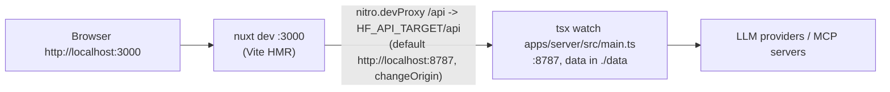

- The web is served by `nuxt dev` (the server's CSP is not applied to dev HTML); `/api` requests, including SSE and
  the UI message stream, are proxied to the server. The Origin check accepts `http://localhost:3000` and
  `http://127.0.0.1:3000` only in development.
- `HF_DATA_DIR` is resolved against the repo root, so `./data` is shared by both dev processes.
- Agents use their own slot: `HF_PORT=879k HF_DATA_DIR=.tmp/<agent-id>` (e2e: `889k`); e2e gate uses
  `pnpm start:e2e` (`HF_MOCK_PROVIDER=1 HF_PORT=8899 HF_DATA_DIR=.tmp/e2e`).

### Production (`pnpm build && pnpm start`)

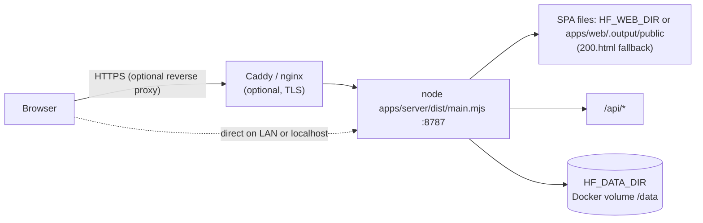

- One Node process (`tsdown` build of the server) serves `/api/*` and the generated SPA from `HF_WEB_DIR` (default
  `apps/web/.output/public`, picked up even when it is built after the server started): existing files are served
  with long cache headers for hashed assets (`/_nuxt/*`: `public, max-age=31536000, immutable`), other files with
  `no-cache` + `ETag`; any other non-`/api` GET that accepts `text/html` gets `200.html` (`Cache-Control: no-cache`).
  Unknown `/api/*` paths return `404 not_found` JSON, never the SPA.
- What a deployment needs: `dist/main.mjs` bundles the workspace packages only, and the server locates its package
  root by walking up to `apps/server/package.json`, so ship the server package as a whole: `package.json`, `dist/`,
  `drizzle/` (migrations), `assets/catalog/models-dev.json` (bundled model metadata) and its production
  `node_modules` (AI SDK providers, `@lobehub/icons-static-svg` for icons, `esbuild` for `.ts` plugins), plus the
  generated SPA (or point `HF_WEB_DIR` at it). The app version comes from the root `package.json`.
- Docker: `docker compose up -d` starts the image on port 8787 with the data directory on the `/data`
  volume (`HF_DATA_DIR=/data`). The container listens on all interfaces, so the bind rule requires `HF_PASSWORD`
  (or `HF_INSECURE=1`, not recommended): set it in the compose environment before the first start.
- Reverse proxy (TLS): forward the original `Host` header (the Origin check compares it with `Origin`;
  `X-Forwarded-Host` is never used), set `X-Forwarded-For` and `X-Forwarded-Proto`, and list the proxy in
  `HF_TRUST_PROXY`: `loopback` when it runs on the same machine, its exact address, or `private` for a proxy container
  on a Docker network. Then the session cookie is `Secure`, HSTS is on, and the login limiter and the share rate limits
  see the real clients (section 10.6); without `HF_TRUST_PROXY` every client shares the proxy's address (10.1). The
  proxy must allow request bodies of at least 256 MB for data imports (nginx: `client_max_body_size`) and must not
  buffer the SSE responses (the server sends `X-Accel-Buffering: no`). The README has Caddy, nginx and Docker Compose
  examples.
- Share links need `HF_PASSWORD`: without it, `/api` answers only local host names (section 10.1).
- Stdio MCP servers and code plugins run inside the same container/user as the server.

## 12. Observability

- **Request id**: every request gets an id (incoming `X-Request-Id` if it matches `^[A-Za-z0-9._-]{8,64}$`, else a
  new one), echoed as the `X-Request-Id` response header and attached to every log line of that request. The web
  shows it in "copy diagnostics" for failed calls.
- **Structured logs**: JSON lines on stdout: `{ time, level, msg, reqId?, pluginId?, chatId?, ...fields }`. Access log
  per request: method, path (never the query string; the segment after `/share/` masked as `[redacted]`, as in the
  error handler's log line), status, duration, bytes; no headers, bodies or client addresses. Level `info` in
  production, `debug` in development. Never logged: API keys and other secrets (redactor, section 10.3), cookies, share
  tokens (`redactText` masks `/share/<token>` in any text), message contents and tool inputs/outputs (only at `debug`,
  still redacted), uploaded file contents.
- **Proxy trust** (texts in section 10.6): the boot log line `trusting reverse proxies (HF_TRUST_PROXY)` lists the
  canonical entries and the trusted ranges; one warning per untrusted peer address that sends a forwarded header the
  server would honor from a trusted proxy (header names only, at most 256 addresses); failed-login warnings carry the
  resolved `address` and the TCP `peer`.
- **Chat runs**: `run.started` / `run.finished` log lines with chat id, model ref, duration, token usage, cost,
  finish reason, outcome, error code.
- **Plugin logs**: `ctx.logger` and guard failures write to a per-plugin ring buffer (last 500 entries, each
  `{ at, level, message, data? }` with `message` capped at 4 KB) and to the process log with `pluginId`.
  `GET /api/plugins/:id/logs` returns the buffer; each new entry is also published as a `plugin.log` event
  (at most 20 events per second per plugin; excess entries are counted and reported as one "N entries dropped"
  entry). Build output of `POST /api/plugins/:id/build` goes through the same channel.
- **Health**: `GET /api/health` for liveness (Docker `HEALTHCHECK`, gate scripts).
